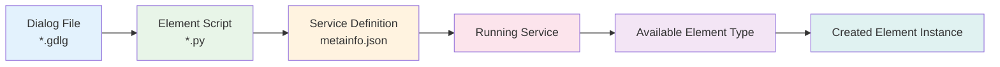

# Custom Element Creation Workflow

```mermaid
flowchart TD
    A[Start: Need Custom Element] --> B{Dialog Required?}
    
    B -->|Yes| C[Create User Dialog<br/>*.gdlg file]
    B -->|No| D[Create Element Script<br/>*.py file]
    
    C --> C1[Add Element Name Widget<br/>object name: 'name']
    C1 --> C2[Add Parameter Widgets<br/>inputs, selections, etc.]
    C2 --> D
    
    D --> D1[Import Extensions API<br/>gom.api.extensions.actuals/nominals]
    D1 --> D2[Create Class inheriting from<br/>Point/Circle/Surface/etc.]
    D2 --> D3[Implement __init__ method<br/>with unique ID & description]
    D3 --> D4[Implement dialog method<br/>show_dialog or custom logic]
    D4 --> D5[Implement compute method<br/>return element-specific data]
    
    D5 --> E[Define Service in metainfo.json]
    E --> E1[Set endpoint name<br/>e.g., 'gom.api.point']
    E1 --> E2[Set service name<br/>human-readable]
    E2 --> E3[Set script path<br/>relative to App root]
    
    E3 --> F[Start Service]
    F --> F1[Open Apps → Manage Services]
    F1 --> F2[Find your service]
    F2 --> F3[Click Start button]
    F3 --> F4{Service Started?}
    
    F4 -->|No| F5[Check Errors<br/>Fix script issues]
    F5 --> D
    
    F4 -->|Yes| G[Element Ready for Use]
    
    G --> H{Creation Method?}
    
    H -->|Interactive| I[Construct → Script-Based Elements<br/>→ Your Element]
    H -->|Programmatic| J[Use gom.script.scriptedelements<br/>.create_actual_draft/create_nominal_draft]
    
    I --> I1[Fill Dialog Parameters]
    I1 --> I2[Click OK]
    I2 --> K[Element Created]
    
    J --> J1[Pass contribution ID]
    J1 --> J2[Pass values dictionary]
    J2 --> K
    
    K --> L[Element Available in Project]
    L --> M[Can be used by other elements<br/>Triggers recomputation when changed]
    
    style A fill:#e1f5fe
    style G fill:#c8e6c9
    style K fill:#c8e6c9
    style L fill:#c8e6c9
    style F5 fill:#ffcdd2
    style F4 fill:#fff3e0
    style B fill:#fff3e0
    style H fill:#fff3e0
```



## Workflow Steps Explained

### 1. Planning Phase
- **Determine Requirements**: What type of element do you need?
- **Dialog Decision**: Will users need to input parameters interactively?

### 2. Dialog Creation (Optional)
- Create `.gdlg` file using Dialog Editor
- Must include Element Name widget with object name `name`
- Add input widgets for element parameters

### 3. Script Development
```python
import gom
import gom.api.extensions.actuals  # or .nominals
from gom import apicontribution

@apicontribution
class MyCustomElement(gom.api.extensions.actuals.Point):
    def __init__(self):
        super().__init__(
            id='unique.element.id', 
            description='Human Readable Name'
        )
    
    def dialog(self, context, args):
        return self.show_dialog(context, args, '/dialogs/mydialog.gdlg')
    
    def compute(self, context, values):
        # Your computation logic
        return {"value": (x, y, z)}
```

### 4. Service Configuration
Add to `metainfo.json`:
```json
"services": [{
    "endpoint": "gom.api.myservice",
    "name": "My Custom Element", 
    "script": "MyElement.py"
}]
```

### 5. Service Management
- Start service via Apps → Manage Services
- Service must be running for element creation
- Check console for startup errors

### 6. Element Creation
- **Interactive**: Via Construct menu
- **Programmatic**: Via Python API

### 7. Integration
- Element becomes part of project
- Participates in dependency tracking
- Available for further operations

## Key Decision Points

| Decision | Interactive Creation | Programmatic Creation |
|----------|---------------------|----------------------|
| **When to use** | User-driven workflows | Batch operations, automation |
| **Interface** | Dialog-based | Code-based |
| **Flexibility** | User can modify parameters | Fixed parameters |
| **Use cases** | Manual inspection | Automated analysis |

## Common Issues & Solutions

| Issue | Symptom | Solution |
|-------|---------|----------|
| Service won't start | Not appearing in menu | Check script syntax, imports |
| Dialog not showing | Element creation fails | Verify dialog path, widget names |
| Computation errors | Element shows error state | Add error handling, validate inputs |
| Wrong element type | Unexpected behavior | Check inheritance from correct base class |

## Dependencies Flow

