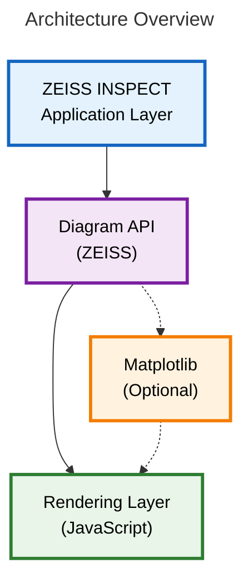
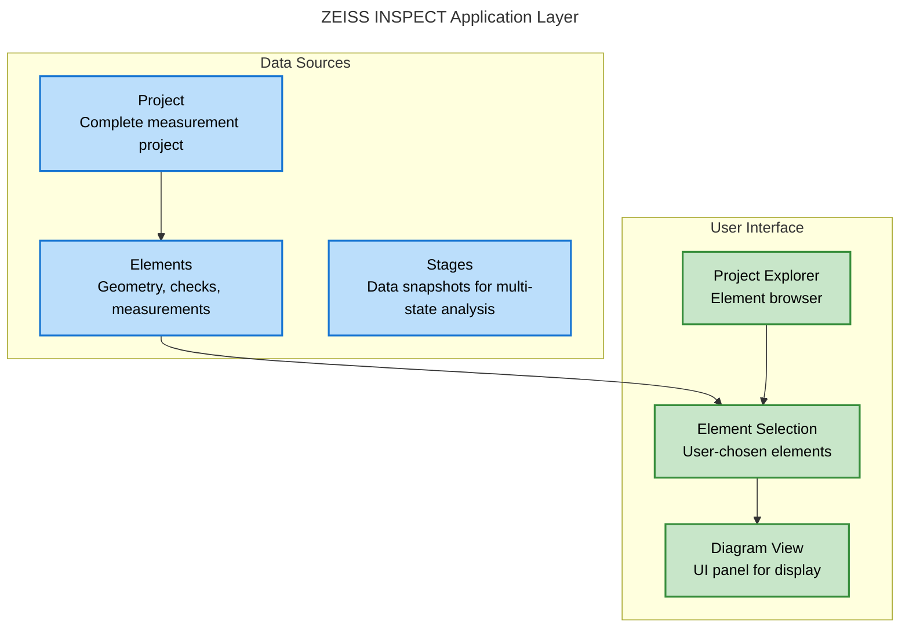
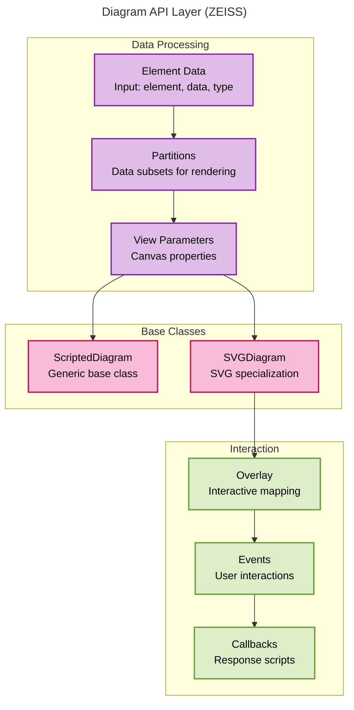
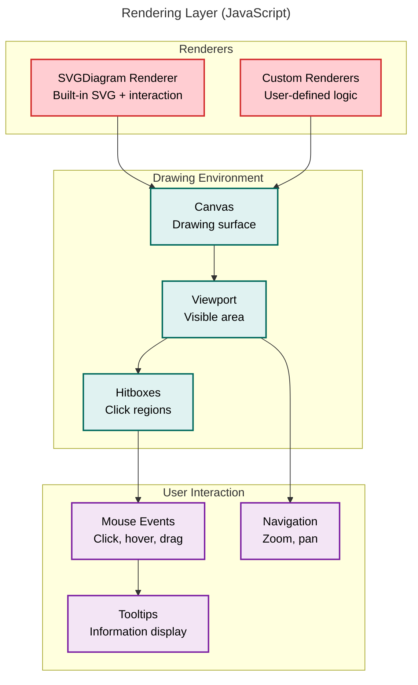
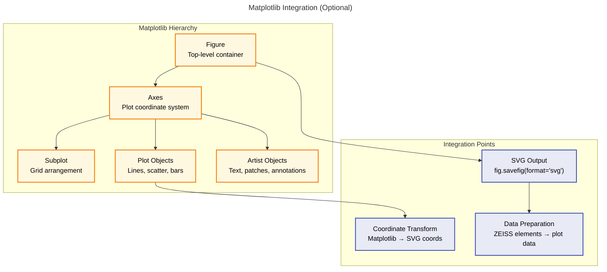
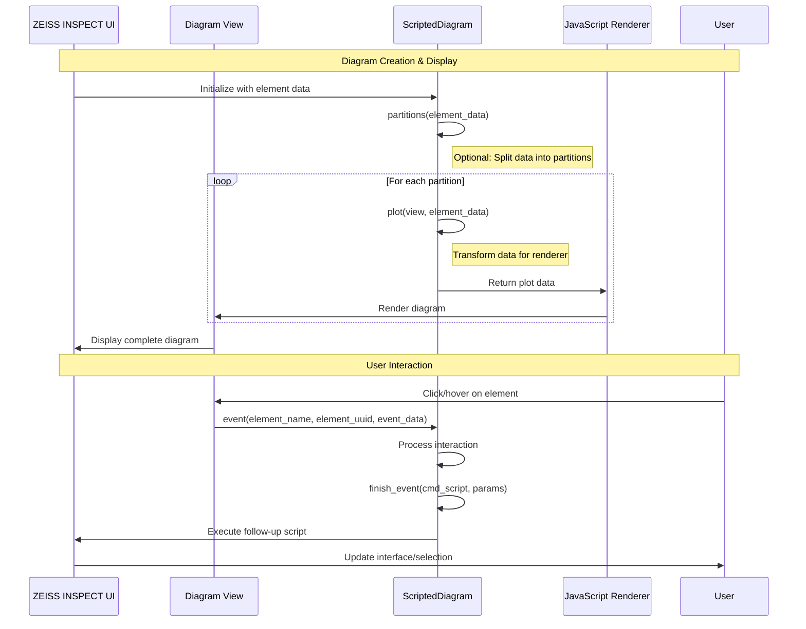

# Using Custom Diagrams

## General

Custom diagrams are a replacement for [Scripted diagrams](../using_scripted_diagrams/using_scripted_diagrams.md). In comparison, **Custom diagrams** offer greater flexibility and interactivity.

Custom diagrams require [Custom actual/nominal elements](../custom_elements/custom_nominals_actuals.md) as diagram data sources.

## Overview

### Use Cases & Applications

1. **Quality Control Dashboards**
    - Visualize inspection results across multiple measurements
    - Interactive elements link to detailed check information
    - Real-time updates as new measurements are processed

2. **Measurement Analysis**
    - Custom scatter plots, trend analysis, statistical distributions
    - Link plot points directly to 3D measurement data
    - Filter and partition data by measurement series or stages

3. **Process Monitoring**
    - Time-series charts of measurement results
    - Interactive timeline with drill-down capabilities
    - Custom alerts and threshold visualization

4. **Custom Reporting**
    - Generate interactive reports with embedded diagrams
    - Export capabilities for external documentation
    - Custom styling and branding options

### Custom Diagram System Architecture



The Application Layer provides raw data from [Custom nominal/actual elements](../custom_nominals_actuals.md) for displaying in a diagram. The Diagram API allows to create diagram data structures (e.g. SVG), optionally by using the [Matplotlib](https://matplotlib.org/) Python library. The Rendering Layer displays the diagram and handles user input for interactive diagrams.



The ZEISS INSPECT Application Layer provides the current project's element data and the user interface with a diagram view, which also allows user interaction.



The Diagram API Layer (ZEISS) creates a diagram data structure by using either

[ScriptedDiagram](../../python_api/python_api.md#gomapiextensionsdiagramsscripteddiagram)
: A generic base class (which requires a user-defined renderer)

or

[SVGDiagram](../../python_api/python_api.md#gomapiextensionsdiagramssvgdiagram)
: A specialized base class for using the SVGDiagram renderer provided by the INSPECT App.

Interactions are implemented via

Overlay
: Mapping diagram view coordinates to diagram plot coordinates, providing a tooltip (optional) or an event function (optional).

Events
: Linking interactions with the diagram to callbacks.

Callbacks
: Functions / scripts which are executed when triggered by events.



The Rendering Layer (JavaScript) is handled by the GUI framework. It provides the drawing environment for displaying the diagram and features for user interactions.



[Matplotlib](https://matplotlib.org/) is a comprehensive library for creating huge variety of diagram types allowing customization.  

### Core Terminology by Layer

**ZEISS INSPECT Layer:**
- **Project**: Complete measurement project with all data
- **Element**: Individual geometry/check objects (points, surfaces, dimensions)
- **Stage**: Data snapshot for multi-state analysis (same nominal, different actual data)
- **Diagram View**: UI panel displaying diagrams within ZEISS INSPECT

**Diagram API Layer:**
- **Element Data**: Input structure `[{'element': obj, 'data': dict, 'type': str}]`
- **Partitions**: Data subsets for separate rendering (large dataset handling)
- **View Parameters**: Canvas properties (width, height, DPI, font, subplot index)
- **Overlay**: Interactive mapping (Element UUIDs → coordinates + tooltips)

**Rendering Layer:**
- **SVGDiagram Renderer**: Built-in SVG renderer with interaction support
- **Canvas**: Drawing surface for diagram display
- **Hitboxes**: Clickable regions generated from overlay coordinates

**Matplotlib Integration (Optional):**
- **Figure**: Top-level matplotlib container
- **Axes**: Plot coordinate system and drawing area
- **Plot Objects**: Lines, scatter plots, bars, etc.
- **Subplot**: Multiple plots in grid arrangement
- **Artist Objects**: Text, patches, annotations for customization

### Data Flow & Interaction Pattern



## Implementation

**Custom diagrams** require [Custom nominal/actual elements](custom_nominals_actuals.md) for data input.

In the following sections, you find

* [Custom element](#custom-element) &ndash; An example custom element as diagram data source
* [Basic Custom Diagram](#basic-custom-diagram) &ndash; A minimal example without interactivity
* [Custom Diagram with Element Overlay](#custom-diagram-with-element-overlay) &ndash; An example with element overlay for interactivity
* [Custom Diagram with Point Cloud Overlay](#scripted-diagram-with-point-cloud-overlay) &ndash; An example with point cloud overlay for interactivity

### Custom Element

The method `finish()` is implemented to assign element data to diagrams.
The helper function 'add_diagram_data' can be used to map diagram IDs to data entries.
It is possible to add multiple data entries to any number of diagram ids.

```{code-block} python
:caption: Custom Element Example &ndash; Actual Circle Element

@apicontribution
class MyActualCircle (gom.api.extensions.actuals.Circle):
         
    def __init__ (self):
        super ().__init__ (id='com.zeiss.example.diagram.circle', description='Custom Circle with Diagram Support')
     
    def dialog (self, context, args):
        return self.show_dialog (context, args, '/dialogs/Custom_Circle.gdlg')
         
    def compute (self, context, values):
        return {
            'center': (values['center_x'], values['center_y'], values['center_z']),
            'direction': (values['dir_x'], values['dir_y'], values['dir_z']),
            'radius': values['radius']}

    def finish (self, context , results_states):
        """
        Assign element data (computation results) to diagram element(s)
        
        In this example, all the results from stage 0 are added to the diagram.
        
        Parameters:
        context : gom.ContributionContext
            The current custom element context
        results_states : dict
            The current results and states map
        
        Returns:
        dict
            The updated results and states map
        """
        diagram_data = []
        self.add_diagram_data(
            diagram_data = diagram_data,
            diagram_id = "Basic Custom Diagram",
            service_id = "com.zeiss.example.diagram.basic",
            element_data = results_states["results"][0]
        )
        self.add_diagram_data(
            diagram_data = diagram_data,
            diagram_id = "Interactive Custom Diagram with Element Overlay",
            service_id = "com.zeiss.example.diagram.element_overlay",
            element_data = results_states["results"][0]
        )
        self.add_diagram_data(
            diagram_data = diagram_data,
            diagram_id = "Interactive Custom Diagram with Point Cloud Overlay",
            service_id = "com.zeiss.example.diagram.point_cloud_overlay",
            element_data = results_states["results"][0]
        )
        results_states["diagram_data"] = diagram_data
        return results_states
         
gom.run_api ()
```

```{note}
With [Scripted diagrams](../using_scripted_diagrams/using_scripted_diagrams.md) you would implement a [service function](../using_services/using_services.md) to convert element data into diagram data.
```

See [Custom nominal/actual elements](../custom_elements/custom_nominals_actuals.md) for more information.

### Custom Diagrams

**Custom diagrams** are based on the <a href="../../python_api/python_api.html#gom-api-extensions">Extensions API</a>, specifically [gom.api.extensions.diagrams](../../python_api/python_api.md#gomapiextensionsdiagrams).

For rendering diagrams as SVG (Scalable Vector Graphics), a **Custom Diagram** class is created by using 
[SVGDiagram](../../python_api/python_api.md#gomapiextensionsdiagramssvgdiagram) as the base class and implementing the `plot()` method. This base class provides additional methods for customization, like the event function to enable custom interactions.

For implementing static diagrams, using [Matplotlib](https://matplotlib.org/) and converting the plot to an SVG string is sufficient (see [Basic Custom Diagram](#basic-custom-diagram)).

```{caution}
**Custom diagrams** are executed as services in ZEISS INSPECT. Therefore, the App containing a diagram must configure the diagram script as a service in its `metainfo.json` file and the service has to be started (see [Using Services](../using_services/using_services.md) for more information).
```

```{caution}
Open the tab 'Inspection Details' in the ZEISS INSPECT 3D View to see the custom diagram.
```

```{note}
Instead of using the [SVGDiagram](../../python_api/python_api.md#gomapiextensionsdiagramssvgdiagram) base class, it is possible to create a custom diagram/renderer pair.

The base class would then be [](../../python_api/python_api.md#gom-api-extensions-diagrams-scripteddiagram) and a corresponding JavaScript renderer had be implemented in the App.
```

#### Basic Custom Diagram

This is a minimal example of a custom diagram using Matplotlib to create a static SVG plot without interactivity.

```{code-block} python
:caption: Basic Custom Diagram Example
:linenos:

import gom
from gom import apicontribution
import matplotlib.pyplot as plt
import gom.api.extensions.diagrams.matplotlib_tools as mpltools

@apicontribution
class MyBasicDiagram(gom.api.extensions.diagrams.SVGDiagram):
    
    def __init__(self):
        super().__init__(id='com.zeiss.example.diagram.basic',
                         description='Basic Custom Diagram')
    
    def plot(self, view, element_data):
        """
        Basic static diagram without interactivity
        
        Parameters:
        view : dict
            The current diagram view parameters
        element_data : list of dict
            The list of element data entries to be plotted
            
        Returns:
        dict
            The plot result data
        """
        # Setup the plot with automatic DPI adjustment
        mpltools.setup_plot(plt, view, True)
        
        # Extract data for plotting (radius of circles over index)
        x = []
        y = []
        for i, e in enumerate(element_data):
            data = e['data']
            radius = data['radius']
            x.append(i)
            y.append(radius)
        
        # Create a simple line plot
        plt.plot(x, y, marker='o')
        plt.title("Basic Diagram")
        plt.xlabel("Index")
        plt.ylabel("Radius")
        
        # Create SVG string
        svg_string = mpltools.create_svg(plt, view, False, False)
        plt.close()
        
        # Return plot without overlay
        return self.finish_plot(svg_string)

gom.run_api()
```

#### Custom Diagram with Element Overlay

This example shows how to create an interactive custom diagram using an **element overlay**. This type of overlay covers each mapped element completely, precisely mapping clicks to an element.

Additionally, this example demonstrates customization options to make rendering more accessible without implementing a custom JavaScript diagram.

```{code-block} python
:caption: Interactive Custom Diagram Example with Element Overlay
:linenos:

import gom
import gom.api.settings
from gom import apicontribution

import gom.api.extensions.diagrams.SVGDiagram
import gom.api.extensions.diagrams as diagrams
import gom.api.extensions.diagrams.matplotlib_tools as mpltools

import matplotlib.pyplot as plt
import numpy as np
import json

@apicontribution
class DiagramWithElementOverlay (gom.api.extensions.diagrams.SVGDiagram):
 
    def __init__(self):
        super().__init__(id='com.zeiss.example.diagram.element_overlay',
                        description='Interactive Custom Diagram with Element Overlay')
 
    def add_all_overlay_data(self, ax, x, y, view, element_data, overlay):
        """
        Calculate the overlay coordinate data for all data points and append them together with the needed information to the overlay list
        Note that for the full element overlay, the point coordinates are not used but the tooltip and interaction specifications are important
        
        Parameters:
        ax : matplotlib.axes.Axes
            The current matplotlib axes
        x : list of float
            The x coordinates of the data points
        y : list of float
            The y coordinates of the data points
        view : dict
            The current diagram view parameters
        element_data : list of dict
            The list of element data entries to be plotted
        overlay : dict
            The overlay data structure to append the calculated data to
        """  
        for i in range(len(x)):
            e = element_data[i]
            data = e['data']
            # In this example, add a custom interaction to the first element while others only have a tooltip
            # Note that point coordinates are irrelevant for the full element overlay and can be set to (0,0)
            if (i == 0):
                # First element with custom interaction
                self.add_element_to_overlay(
                    overlay,                   # overlay data structure
                    e['uuid'],                 # element UUID
                    (0, 0),                    # point coordinates
                    tooltip = e['element'],    # tooltip text
                    custom_interaction = 'yes' # custom interaction flag
                )
            else:
                # Other elements with only tooltip
                self.add_element_to_overlay(
                    overlay,                   # overlay data structure 
                    e['uuid'],                 # element UUID
                    (0, 0),                    # point coordinates
                    tooltip = e['element']     # tooltip text
                )
                                             
    def event(self, element_id, element_uuid, event_data):
        """
        Custom interaction on click for elements where specified in the overlay.
        This example requires testscript.py to be present in the same App.
        The specified script will be executed and parameters can be accessed.
        
        Parameters:
        element_id : str
            The element's ID (e.g. 'com.zeiss.example.diagram.circle')
        element_uuid : str
            The element's unique UUID
        event_data : dict
            Additional event data (e.g. mouse position)
            
        Returns:
        dict
            The event result data
        """
        return self.finish_event(
            "testscript",                                 # Name of the script to execute
            {"name" : "testname", "testval": 17.00351334} # Example parameters
        )
         
    def plot(self, view, element_data):
        """
        Interactive scatterplot example
        
        Parameters:
        view : dict
            The current diagram view parameters
        element_data : list of dict
            The list of element data entries to be plotted
            
        Returns:
        dict
            The plot result data
        """
        gom.log.info('Interactive Scatterplot Service with Element Overlay')
        gom.log.info(f'{view=}, {element_data=}')
 
        # Use matplotlib_tools to setup the plot
        # Use automatic adjustment of the DPI value for SVG plotting
        fig = mpltools.setup_plot(plt, view, True)
 
        # Extracting element data for plotting (in this example: radius of circles over index)
        overlay = [] # Overlay data structure, will be filled with add_all_overlay_data() later
        x = []
        y = []
        count = 0
        for e in element_data:
            data = e['data']
            radius = data['radius']
            x.append(count)
            y.append(radius)
            gom.log.info(f'{radius=}')
            count+=1
     
        # Creating the scatter plot
        colors = np.random.rand(len(x))
        area = area = np.random.randint(low=30,high=200,size=len(x))
        for i in range(len(x)):
            plt.scatter(
                x[i],                                              # x data coordinate
                y[i],                                              # y data coordinate
                gid=self.get_overlay_tag(element_data[i]['uuid']), # map scatter point to overlay element
                s=area[i],                                         # marker size
                c=colors[i],                                       # marker color
                alpha=0.5                                          # marker transparency
            )
        plt.title("Interactive Scatterplot with Element Overlay")
        plt.xlabel("Index")
        plt.ylabel("Radius")
        ax = plt.gca() # get current axis
        svg_string = mpltools.create_svg(
            plt,    # plt instance
            view,   # current diagram view
            False,  # no tight layout
            False   # no extra debug info
        )

        # The SVG renderer can be configured through 'render_config' options
        # The available options are defined in the SVGDiagram.RenderConfigToken Enum 
        # (e.g. SVGDiagram.RenderConfigToken.DEBUG_LOGGING)
        # 
        # The option to toggle the full element overlay is AUTO_GENERATED_OVERLAY_USE
        # All available options including a number of debug tokens can be found in
        # https://zeiss.github.io/zeiss-inspect-app-api/2026/python_api/python_api.html#gom-api-extensions-diagrams-svgdiagram-renderconfigtoken
        render_config = {
            SVGDiagram.RenderConfigToken.CUSTOM_HASH: str(hash(json.dumps([x, y]))),
            
            SVGDiagram.RenderConfigToken.DISABLE_MOUSE_EVENTS: False,
            SVGDiagram.RenderConfigToken.DISABLE_TOOLTIPS: "",
            
            SVGDiagram.RenderConfigToken.NEAREST_MARKER_SHAPE: "circle",
            SVGDiagram.RenderConfigToken.NEAREST_MARKER_SIZE: 3,
            
            SVGDiagram.RenderConfigToken.AUTO_GENERATED_OVERLAY_USE: True,
            SVGDiagram.RenderConfigToken.OVERLAY_FILTER_METHOD: "string-parser",
            SVGDiagram.RenderConfigToken.OVERLAY_ELEMENT_COUNT: len(x),
            SVGDiagram.RenderConfigToken.OVERLAY_USE_MOUSE_POINT: True,
            SVGDiagram.RenderConfigToken.OVERLAY_EXPAND_HITBOXES: 10
        }

        # Add the overlay data
        # Note that point coordinates are irrelevant for the element overlay
        self.add_all_overlay_data(
            ax,           # matplotlib axes
            x,            # list of x data coordinates (not used here)
            y,            # list of y data coordinates (not used here)
            view,         # current diagram view
            element_data, # list of element data entries
            overlay       # overlay data structure
        )
        plt.close()

        return self.finish_plot(svg_string, overlay, render_config)

gom.run_api()
```

#### Custom Diagram with Point Cloud Overlay

This example shows how to create an interactive custom diagram using a **point cloud overlay**. The advantage of this overlay type is a reduced computation time as compared to the [element overlay](#custom-diagram-with-element-overlay).

This option is limited in flexibility and is only suitable for simple plots such as scatter plots, curves and polar plots, because it can only map individual points in the diagram (plus a configurable hitbox size) to an element.

```{code-block} python
:caption: Interactive Custom Diagram Example with Point Cloud Overlay
:linenos:
 
import gom
import gom.api.settings
from gom import apicontribution

import gom.api.extensions.diagrams.SVGDiagram
import gom.api.extensions.diagrams.matplotlib_tools as mpltools

import matplotlib.pyplot as plt
import numpy as np
 
@apicontribution
class DiagramWithPointCloudOverlay (gom.api.extensions.diagrams.SVGDiagram):
 
    def __init__(self):
        super().__init__(id='com.zeiss.example.diagram.point_cloud_overlay',
                         description='Interactive Custom Diagram with Point Cloud Overlay')
 
    def add_all_overlay_data(self, ax, x, y, view, element_data, overlay):
        """
        Calculate the overlay coordinate data for all points and append them together with the needed information
        to the overlay list
        
        Parameters:
        ax : matplotlib.axes.Axes
            The current matplotlib axes
        x : list of float
            The x coordinates of the data points
        y : list of float
            The y coordinates of the data points
        view : dict
            The current diagram view parameters
        element_data : list of dict
            The list of element data entries to be plotted
        overlay : dict
            The overlay data structure to append the calculated data to
        """
        
        # Transform data point coordinates to display coordinates
        display_coords = mpltools.get_display_coords(ax, list(zip(x, y)), view)
             
        for i in range(len(x)):
            e = element_data[i]
            data = e['data']
            # In this example, add a custom interaction to the first element while others only have a tooltip
            if (i == 0):
                # First element with custom interaction
                self.add_element_to_overlay(
                    overlay,                                      # overlay data structure
                    e['uuid'],                                    # element UUID          
                    (display_coords[i][0], display_coords[i][1]), # point coordinates
                    tooltip = e['element'],                       # tooltip text
                    custom_interaction = 'yes'                    # custom interaction flag
                )
            else:
                # Other elements with only tooltip
                self.add_element_to_overlay(
                    overlay,                                      # overlay data structure
                    e['uuid'],                                    # element UUID
                    (display_coords[i][0], display_coords[i][1]), # point coordinates
                    tooltip = e['element']                        # tooltip text
                )
                                             
    # Same event function as in the element overlay example
    def event(self, element_id, element_uuid, event_data):
        """
        Custom interaction on click for elements where specified in the overlay.
        This example requires testscript.py to be present in the same App.
        The specified script will be executed and parameters can be accessed.
        
        Parameters:
        element_id : str
            The element's ID (e.g. 'com.zeiss.example.diagram.circle')
        element_uuid : str
            The element's unique UUID
        event_data : dict
            Additional event data (e.g. mouse position)
            
        Returns:
        dict
            The event result data
        """
        return self.finish_event("testscript", {"name" : "testname", "testval": 17.00351334})
         
    def plot(self, view, element_data):
        """
        Interactive scatterplot example
        
        Parameters:
        view : dict
            The current diagram view parameters
        element_data : list of dict
            The list of element data entries to be plotted
            
        Returns:
        dict
            The plot result data
        """
        gom.log.info('Interactive Scatterplot Service with Point Cloud Overlay')
        gom.log.info(f'{view=}, {element_data=}')
 
        # Use matplotlib_tools to setup the plot
        # Use automatic adjustment of the DPI value for SVG plotting
        mpltools.setup_plot(plt, view, True)
        overlay = {}
         
        # Extracting element data for plotting (radius of circles over index)
        x = []
        y = []
        count = 0
        for e in element_data:
            data = e['data']
            radius = data['radius']
            x.append(count)
            y.append(radius)
            count+=1
     
        # Creating the scatter plot
        colors = np.random.rand(len(x))
        area = np.random.randint(low=30,high=200,size=len(x))
        for i in range(len(x)):
            # Scatter plot with random circle marker sizes and colors
            # Sensitive areas around points are defined by the renderer configuration -
            # see SVGDiagram.RenderConfigToken documentation
            # In comparison to the element overlay, no gid mapping is used here.
            plt.scatter(
                x[i],         # x data coordinate
                y[i],         # y data coordinate
                s=area[i],    # circle marker size
                c=colors[i],  # circle marker color
                alpha=0.5     # transparency
            )
        plt.title("Interactive Scatterplot with Point Cloud Overlay")
        plt.xlabel("Index")
        plt.ylabel("Radius")
 
        # Create the svg string after plotting
        ax = plt.gca()
        svg_string = mpltools.create_svg(
            plt,   # plt instance
            view,  # current diagram view
            False, # no tight layout
            False  # no extra debug info
        )
         
        # Add the overlay data
        self.add_all_overlay_data(
            ax,           # matplotlib axes
            x,            # list of x data coordinates
            y,            # list of y data coordinates
            view,         # current diagram view
            element_data, # list of element data entries
            overlay       # overlay data to be added
        )
        plt.close()
 
        return self.finish_plot(svg_string, overlay)
         
gom.run_api()
```

## Data Structure Examples

### Element Data Structure

```{code-block} python
element_data = [
    {
        'element': gom.app.project.actual_elements['Circle 1'],                           # ZEISS INSPECT element object
        'data': {'center': [1.0, 1.0, 2.0], 'direction': [1.0, 0.0, 0.0], 'radius': 3.0}, # Element-specific data
        'type': 'SVGDiagram',                                                             # Element type identifier
        'uuid': 'element-uuid-123'                                                        # Unique identifier
    },
    {
        'element': gom.app.project.actual_elements['Circle 2'],
        'data': {'center': [2.0, 2.0, 3.0], 'direction': [0.0, 1.0, 0.0], 'radius': 4.0},
        'type': 'SVGDiagram',
        'uuid': 'element-uuid-456'
    }
]
```

### View Parameters Structure

```{code-block} python
view = {
    'width': 800,        # Canvas width in pixels
    'height': 600,       # Canvas height in pixels  
    'dpi': 96.0,         # Display DPI for scaling
    'font': 12,          # Base font size
    'subplot': 0         # Partition/subplot index (0-based)
}
```

### SVG Overlay Structure (Simplified)

```{code-block} python
overlay = {
    'element-uuid-123': {
        'element_name': 'Circle 1',
        'coordinates': [
            {
                'x': 0.0805,
                'y': 0.8900,
                'custom_interaction': 'yes'
            }
        ],
        'tooltip': "gom.app.project.actual_elements['Circle 1']"
    },
    'element-uuid-456': {
        'element_name': 'Circle 2',
        'coordinates': [
            {
                'x': 0.9485,
                'y': 0.0835,
                'custom_interaction': None
            }
        ],
        'tooltip': "gom.app.project.actual_elements['Circle 2']"
    }
}
```

## References

* [How-to: Custom Elements](custom_elements.md)
* [How-to: Using Services](../using_services/using_services.md)
* [Extensions API &ndash; Diagrams](../../python_api/python_api.md#gom-api-extensions-diagrams)
* [Extensions APi &ndash; SVGDiagram](../../python_api/python_api.md#gomapiextensionsdiagramssvgdiagram)