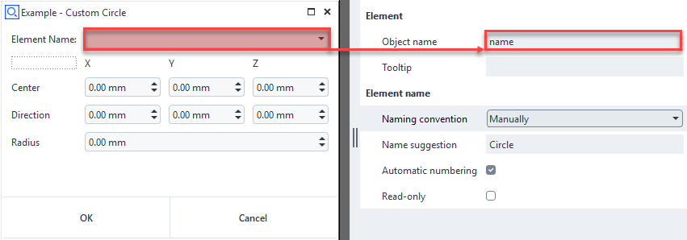

# Custom nominal/actual elements

This documentation describes the creation of custom nominal or actual elements in ZEISS INSPECT using the Python <a href="../../python_api/python_api.html#gom-api-extensions">Extensions API</a>.

## Geometric element types

A custom nominal or actual element is always of a certain geometric type, like a point, surface curve, mesh etc. After creation, a custom element can be used in the project like a predefined element, i.e. an element created by a predefined construction command.

Custom elements can depend on predefined elements and vice versa. An element recomputation is triggered if a dependency changes.

```{note}
For some custom element types only the actual variant exists. 
```

## Creating a custom element

To create a custom nominal or actual element, the general procedure is as follows:

1. If required, create a user-defined dialog for editing the element's parameters.
2. Create a script in the [App Editor](../using_app_editor/using_app_editor.md) or using [Visual Studio Code](../using_vscode_editor/using_vscode_editor.md).
3. Define a [service](../using_services/using_services.md) based on the custom element's script. 
4. Start the custom element's service via the Service Manager.
5. Create the custom element, either manually or from Python code.

```{note}
A dialog is not needed in cases where only non-interactive element creation is used.
```

### Dialog definition

The dialog must be defined in a dialog file (*.gdlg) as described in [User-defined Dialogs](../user_defined_dialogs/user_defined_dialogs.md).

The dialog must contain an <a href="../user_defined_dialogs/dialog_widgets.html#element-name-widget">Element name widget</a> to set the custom element's name. The element widget's name must be set to `name` in the Dialog Editor.



### Custom nominal or actual element script

All custom nominal or actual elements are based on the <a href="../../python_api/python_api.html#gom-api-extensions">Extensions API</a>. More specifically, a custom nominal or actual element class is inherited from the <a href="../../python_api/python_api.html#gom-api-extensions-scriptedelement">ScriptedElement</a> base class.

```{code-block} python
:caption: Custom_Point.py &ndash; Minimal custom actual element example &ndash; Custom actual point
:linenos:

import gom
import gom.api.extensions.actuals
from gom import apicontribution

@apicontribution
class MinimalPointExample (gom.api.extensions.actuals.Point):

    def __init__ (self):
        super ().__init__ (id='examples.custom_actual_point', description='Custom Actual Point')

    def dialog (self, context, args):
        return self.show_dialog (context, args, '/dialogs/Custom_Point.gdlg')

    def compute (self, context, values):
        return {
            "value": (
                float(values['point_x']),
                float(values['point_y']),
                float(values['point_z'])
            )
        }

gom.run_api ()
```

line 2..3:
: Import custom element specific packages &ndash; `gom.api.extensions.nominals` for nominal elements and `gom.api.extensions.actuals` for actual elements.

line 4..7:
: The class `MyGeometry` is inherited from <a href="../../python_api/python_api.html#gom-api-extensions-actuals-point">gom.api.extensions.actuals.Point</a>. The decorator `@apicontribution` allows to register the class `MyGeometry` in the ZEISS INSPECT framework.

line 8..9:
: Constructor which calls the super class constructor with definition of unique contribution ID and (human readable) description.

line 11..12:
: Dialog function which allows to show the dialog when the element is created or edited.

line 14ff:
: Computation function which returns the element type specific dictionary of parameters. The dictionary `values` contains the dialog widgets' object values. Numeric values are provided as strings, therefore a type conversion to `float` is done.

## Service definition

Add the service definition to the App's `metainfo.json` file.

```{code-block} json
:caption: metainfo.json &ndash; Minimal custom actual element example &ndash; Custom actual point
:linenos:

"services": [
    {
        "endpoint": "gom.api.point",
        "name": "Custom point",
        "script": "Custom_Point.py"
    }
]
```        

line 3:
: Service endpoint name

line 4:
: Service name

line 5:
: Custom element's Python script path

See [service](../using_services/using_services.md) for details.

### Start the service

Start the service using the Manage Services dialog (Apps ► Manage Services… in the ZEISS INSPECT main menu).

See [Using Services &ndash; Managing services](../using_services/using_services.md) for details.

### Create custom elements interactively

Create custom elements by selecting the appropriate item from the Construct ► Script-Based Elements menu.

```{caution}
The custom element's service must be running for creating an element.
```

### Create custom elements from Python script

```{code-block} python
:caption: Custom element creation from Python script &ndash; Custom actual circle element
:linenos:

center_x = 1.0
center_y = 2.0
center_z = 3.0
dir_x = 4.0
dir_y = 5.0
dir_z = 6.0
radius = 42.0

gom.script.scriptedelements.create_actual_draft (
    """
    Create a custom actual element
    """
    # Element ID as defined in its constructor
    contribution='examples.custom_actual_circle',
    
    # Optional: Set element name explicitly, otherwise the name is set automatically 
    # name='Test Circle 1', 
    
    # Set element type specific parameters
    values={
        'center_x': center_x, 'center_y': center_y, 'center_z': center_z,
        'dir_x': dir_x, 'dir_y': dir_y, 'dir_z': dir_z, 'radius': radius
    }
)
```     

```{caution}
The custom element's service must be running for creating an element.
```

## Advanced implementation patterns

### Storing optional data with a scripted element

Additional data of any type can be stored using the `data` parameter of the computation result.

```{code-block} python
:caption: Custom actual point with optional element data
:linenos:

    def compute (self, context, values):
        return {
            "value": (
                float(values['point_x']),
                float(values['point_y']),
                float(values['point_z'])
            ),
            "data": "A string as optional element data"
        }
```

### Common computation function for actual/nominal element

In case both an actual and a nominal custom element are implemented, using a common computation function is recommended to avoid duplicate code.

 ```{code-block} python
:caption: Custom actual/nominal point with common computation function
:linenos:

import gom
import gom.api.extensions.actuals
import gom.api.extensions.nominals

from gom import apicontribution

def generate_point_element(point_x, point_y, point_z):
    """
    Generates a point

    Params: 
    - point_x: x-coordinate
    - point_y: y-coordinate
    - point_z: z-coordinate

    Returns:
    - Dictionary with point's coordinate:
    {
        "value": (float(x-value), float(y-value), float(z-value))
    }
    """
    result = {
        "value": (
            float(point_x), 
            float(point_y), 
            float(point_z)
        )
    }
    return result

@apicontribution
class MyActualPoint (gom.api.extensions.actuals.Point):
    """
    Custom actual point element 
    """
    def __init__ (self):
        super ().__init__ (id='examples.custom_actual_point', description='Custom Actual Point')

    def dialog (self, context, args):
        return self.show_dialog (context, args, '/dialogs/Custom_Point.gdlg')

    def compute (self, context, values):
        return generate_point_element(
            point_x=values['point_x'], 
            point_y=values['point_y'], 
            point_z=values['point_z'],
        )

@apicontribution
class MyNominalPoint (gom.api.extensions.nominals.Point):
    """
    Custom nominal point element 
    """
    def __init__ (self):
        super ().__init__ (id='examples.custom_nominal_point', description='Custom Nominal Point')
    
    def dialog (self, context, args):
        return self.show_dialog (context, args, '/dialogs/Custom_Point.gdlg')
        
    def compute (self, context, values):
        return generate_point_element(
            point_x=values['point_x'], 
            point_y=values['point_y'], 
            point_z=values['point_z'],
        )

gom.run_api ()
```

### Creating log messages

Log messages can be created by using the method <a href="../../python_api/python_api.html#gom-api-extensions-scriptedelement-add-log-message">add_log_message()</a>.

 ```{code-block} python
:caption: Creating log messages
:linenos:

def compute (self, context, values):
    self.add_log_message(context, 'info', f"{values=}")
    # ...
```

### Using an element selection filter

Some elements are created from other elements, which are selected with a <a href="../../howtos/user_defined_dialogs/dialog_widgets.html#selection-element-widget">Selection element widget</a>. This widget provides a few options for selecting a specific element type, but in some cases a dedicated filter function has to be applied.

```{code-block} python
:caption: Selection element widget with filter function
:linenos:

@apicontribution
class MyVolumeRegion (gom.api.extensions.actuals.VolumeRegion):
  
    # ...

    def element_filter(self, element):
        """
        Element type filter - see Selection element widget documentation
        """
        try:
            if element.type == 'linked_volume':
                return True
        except Exception as e:
            pass
        return False
            
    def dialog (self, context, args):
        dlg = gom.api.dialog.create (context, '/dialogs/Custom_Volume_Region.gdlg')
        dlg.volume_ele.filter = self.element_filter
        self.initialize_dialog(context, dlg, args)
        return self.apply_dialog(args, gom.api.dialog.show(context, dlg))
```

line 18..21:
: `gom.api.dialog.create ()` returns the dialog object (`dlg`), which allows to access the `volume_ele` widget object. For this purpose, the method <a href="../../python_api/python_api.html#gom-api-extensions-scriptedelement-show-dialog">show_dialog()</a> used in the previous examples has been replaced by a sequence of other method.

### Using the dialog control widget and event handler

In the context of custom elements, the <a href="../../howtos/user_defined_dialogs/dialog_widgets.html#control-widget">Control widget</a> allows to show a message and to disable the 'ok' button in case any condition for creating an element is not met, e.g. not all parameters have been specified yet or the computation has failed for some reason.

```{code-block} python
:caption: Offset point example with dialog control widget and event handler
:linenos:

@apicontribution
class MyOffsetPoint (gom.api.extensions.nominals.Point):
    """
    Provides a dialog handler for changing the control widget.
    Allows to show a computation error via the control widget's status and in ZEISS INSPECT's element properties. 
    """
    def __init__ (self):
        super ().__init__ (id='examples.custom_nominal_point', description='Custom Nominal Point')

    def dialog (self, context, args):
        self.dlg = gom.api.dialog.create (context, '/dialogs/Custom_Point.gdlg')
        self.initialize_dialog(context, self.dlg, args)
        res = self.apply_dialog(args, gom.api.dialog.show(context, self.dlg))
        return res

    def compute (self, context, values):
        self.add_log_message(context, 'info', f"{values['base']=}")
        return generate_point_element(
            offset_x=values['offset_x'], 
            offset_y=values['offset_y'], 
            offset_z=values['offset_z'],
            base=values['base']
        )

    def event(self, context, event_type, parameters):
        self.add_log_message(context, 'info', f"{event_type=}")
        self.add_log_message(context, 'info', f"{parameters=}")
       
        if event_type == 'dialog::initialized':
            self.dlg.control.ok.enabled = False
            self.dlg.control.status = "Select base with 'center_coordinate'!"

        if event_type == 'dialog::changed':
            if parameters['values']['base'] is not None and \
                hasattr(parameters['values']['base'], 'center_coordinate'):
                self.dlg.control.ok.enabled = True
                self.dlg.control.status = ''
```

## Troubleshooting

### Service-Related Issues

#### Service Won't Start

**Symptoms:**
- Service appears in Manage Services dialog but shows "Stopped" status
- Error messages appear in ZEISS INSPECT Service Manager
- Custom elements don't appear in any menus

**Common Causes and Solutions:**

- **Python syntax errors**: Check your element script for proper syntax, indentation, and balanced brackets
- **Missing imports**: Ensure you have the correct imports:
  ```python
  import gom
  import gom.api.extensions.actuals  # or .nominals
  from gom import apicontribution
  ```
- **Missing decorator**: Add `@apicontribution` decorator before your class definition
- **Invalid service definition**: Check `metainfo.json` service configuration:
  ```json
  "services": [{
      "endpoint": "gom.api.myservice",
      "name": "My Custom Element",
      "script": "MyElement.py"
  }]
  ```

#### Custom Elements Don't Appear in Menu

**Symptoms:**
- Service shows "Running" status
- No items appear in Construct → Script-Based Elements menu

**Solutions:**

- **Verify inheritance**: Ensure your class inherits from the correct base class:
  ```python
  class MyPoint(gom.api.extensions.actuals.Point):  # Or Circle, Surface, etc.
  ```
- **Check element ID**: Use a unique, descriptive ID in your constructor:
  ```python
  super().__init__(id='mycompany.custom_point', description='Custom Point')
  ```
- **Endpoint conflicts**: Ensure your service endpoint name is unique across all Apps

### Element Creation Issues

#### Dialog Doesn't Open

**Symptoms:**
- Menu item appears but clicking does nothing
- No dialog window opens

**Solutions:**

- **Check dialog path**: Use correct path from App root:
  ```python
  return self.show_dialog(context, args, '/dialogs/mydialog.gdlg')
  ```
- **Element Name widget**: Ensure your dialog contains an Element Name widget with object name set to exactly `name`
- **File existence**: Verify the dialog file exists in your App's `dialogs/` folder

#### Element Creation Fails

**Symptoms:**
- Dialog opens and accepts input
- Element appears with error state or creation fails entirely

**Common Issues:**

- **Invalid return format**: Ensure `compute()` method returns correct format:
  ```python
  # For Point elements
  return {"value": (x, y, z)}
  
  # For Circle elements  
  return {
      "value": {
          "center": (x, y, z),
          "direction": (dx, dy, dz),
          "radius": r
      }
  }
  
  # etc.
  ```

- **Type conversion errors**: Convert dialog string inputs to appropriate types:
  ```python
  def compute(self, context, values):
      try:
          x = float(values['x'])
          y = float(values['y'])
          z = float(values['z'])
          return {"value": (x, y, z)}
      except (ValueError, KeyError) as e:
          self.add_log_message(context, 'error', f"Invalid input: {e}")
          raise
  ```

- **Missing parameters**: Validate all required parameters are provided:
  ```python
  required_params = ['x', 'y', 'z']
  for param in required_params:
      if param not in values:
          raise ValueError(f"Missing required parameter: {param}")
  ```

### Performance Issues

#### Slow Element Creation

**Symptoms:**
- Long delays when creating elements
- UI becomes unresponsive
- High CPU usage during element creation

**Solutions:**

- **Optimize computations**: Avoid heavy calculations in the `compute()` method
- **Cache element properties**: Don't repeatedly access the same element properties:
  ```python
  # Inefficient
  x = base_element.center_coordinate.x
  y = base_element.center_coordinate.y
  
  # Better
  center = base_element.center_coordinate
  x, y = center.x, center.y
  ```
- **Simplify dialog events**: Avoid complex calculations in dialog event handlers

### Dialog and Validation Issues

#### Dialog Control Problems

**Symptoms:**
- Cannot enable OK button
- Status messages don't appear correctly
- Dialog validation fails

**Solutions:**

- **Implement event handling**: Use the `event()` method to handle dialog state:
  ```python
  def event(self, context, event_type, parameters):
      if event_type == 'dialog::initialized':
          self.dlg.control.ok.enabled = False
          self.dlg.control.status = "Please enter all required parameters"
      
      elif event_type == 'dialog::changed':
          # Validate inputs and enable/disable OK button
          if self.validate_inputs(parameters['values']):
              self.dlg.control.ok.enabled = True
              self.dlg.control.status = ""
  ```

### Debugging Strategies

#### Enable Detailed Logging

Add logging to track execution and identify issues:

```python
def compute(self, context, values):
    self.add_log_message(context, 'info', f"Starting computation with values: {values}")
    
    try:
        result = your_computation_logic(values)
        self.add_log_message(context, 'info', "Computation completed successfully")
        return result
    except Exception as e:
        self.add_log_message(context, 'error', f"Computation failed: {str(e)}")
        raise
```

#### Check Console Output

Always monitor the ZEISS INSPECT Service Manager for:
- Python exceptions
- Import errors  
- Service startup messages
- Custom log messages

#### Test Incrementally

- Start with the simplest possible element implementation
- Add one feature at a time
- Test each addition thoroughly before proceeding
- Use existing examples as reference templates

#### Validate Early and Often

```python
def compute(self, context, values):
    # Input validation
    if not values:
        raise ValueError("No input values provided")
    
    # Type validation
    for key, value in values.items():
        if value is None:
            raise ValueError(f"Parameter '{key}' cannot be None")
    
    # Proceed with computation...
```

## References

* [Extensions API &ndash; Scripted Elements](../../python_api/python_api.md#gomapiscriptedelements)
* [Extensions API &ndash; Actuals](../../python_api/python_api.md#gomapiextensionsactuals)
* [Extensions API &ndash; Nominals](../../python_api/python_api.md#gomapiextensionsnominals)
* [Extensions API &ndash; Inspections](../../python_api/python_api.md#gomapiextensionsinspections)
