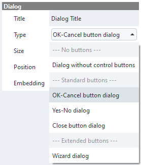
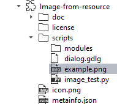

# Frequently asked questions

## Where are Add-ons located in the file system?

Add-ons which are edited are located in `C:\Users\<USERID>\AppData\Roaming\GOM\<VERSION>\gom_edited_addons`. There is a subfolder named by the UUID for each Add-on.

 When editing is finished, an Add-on file (see [Add-on file format](../add_on_file_format/add_on_file_format.md)) is created and saved in `C:\Users\<USERID>\AppData\Roaming\GOM\<VERSION>\gom_addons`.

## How can I stop script execution?

In a user defined dialog, you can call `gom.script.sys.close_user_defined_dialog (dialog=\<your_dialog\>)`.

In general, you can use

```{code-block} python
import sys

# ...

sys.exit(0)

```  

## How do I check if a dialog was closed with 'Ok', 'Yes'/'No' or 'Close', respectively? (And not with 'Cancel' or by closing the dialog window.)




Closing a dialog window or pressing the 'Cancel' button raises a `gom.BreakError` exception. To check if any type of dialog was closed via the window close control (see figure) or via the 'Cancel' button (in case of the 'Ok/Cancel' dialog type), use the following code:

```{code-block} python
try:
	RESULT = gom.script.sys.show_user_defined_dialog (dialog=DIALOG)
except gom.BreakError as e:
	print("Dialog window was closed or 'Cancel' button was pressed")
else:
	print("'Ok' button was pressed")
```

## How can I retrieve dialog results as a Python dictionary?

```{code-block} python
print (RESULT.__dict__['__args__'][0])
# example output: {'distance': 2.0, 'label': None}
```

See [User-defined dialogs / Executing dialogs / Dialog results](../python_api_introduction/user_defined_dialogs.md#dialog-results) for more details.

## How can I use an image from a script resource file in a user defined dialog?

You add your image file as a resource to the Add-on:



You create a dialog file with an [Image widget](../python_api_introduction/user_defined_dialogs.md#image-widget), but without setting the actual image in the dialog editor.

In the Python script, you assign the resource as data to the image widget object:

```{code-block} python
import gom

DIALOG=gom.script.sys.create_user_defined_dialog (file='dialog.gdlg')

#
# Event handler function called if anything happens inside of the dialog
#
def dialog_event_handler (widget):
	pass

DIALOG.handler = dialog_event_handler

DIALOG.image.data = gom.app.resource[":example.png"]

RESULT=gom.script.sys.show_user_defined_dialog (dialog=DIALOG)
``` 

## How do I check if the sensor warm-up is completed or how long it will take, respectively?

```{code-block} python
remaining_warmup_time_in_seconds = gom.script.atos.wait_for_sensor_warmup (timeout = my_timeout)
```

The function blocks until the sensor is ready or the timeout specified with `my_timeout` occurs.
