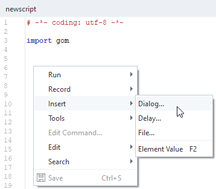
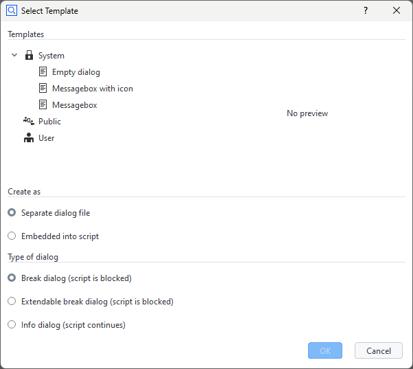

# User-defined Dialogs

- [Creating dialogs](#creating-dialogs)
- [Dialog widgets](#dialog-widgets)
- [Executing dialogs](#executing-dialogs)
- [Wizards](#wizards)

# Creating dialogs

## Dialog designer

* User defined dialogs can be inserted into the script using "Insert / Dialog..." from the right mouse menu.

* When a new dialog is inserted, a dialog template and type can be selected.

* Dialogs are designed using a GUI based dialog editor.

## Dialog layout

* The dialog designer is using a grid based layout.
* Elements can be inserted into the grid via drag and drop.

### Editing the grid

💡 Editing the layout means changing the underlying grid.

* Because the underlying layout is a grid, the following actions are possible:
    * Adding and removing rows and columns.
    * Merging and splitting rows and columns.

| Tool button                              | Function                          |
| ---------------------------------------- | --------------------------------- |
|    | Split selected cells vertically   |
|  | Split selected cells horizontally |
|               | Merge selected cells              |

* Selected cells are marked with a red overlay.

### Spacers

💡 **Spacers** are empty spaces extending in either horizontal or vertical direction.

* If a spacer is inserted into a cell, the cell claims the maximum available space in spacer direction.
* All remaining cells share the remaining space.

## Widgets

### Inserting and removing widgets

* The list of available widgets resides at the left of the dialog designer.
* Widgets are inserted via drag and drop.
* Newly dropped widgets overwrite widgets at the drop target cells.
* A unique name object name is assigned during insertion of a widget. This name is used to access the widget in the Python script.

💡 Removing widgets from the grid is not possible. Instead, they can be overwritten by other widgets.

* Because each cell has to be filled with a widget, widgets can not be removed from the grid. To get rid of a widget
    * Another widget can be dragged and dropped onto the existing widget or
    * The widget cell can be merged with another cell.

### Configuring widgets

* The properties of selected widgets can be edited in the property editor at the right side of the designer dialog.
* Every widget has at least a unique name.
* Additionally, various parameters depending on the widget type can be edited.

The definition of the dialog can be found in `scriptingEditorExampleDialog.py`

## Editing already created dialogs

* Creating a dialogs leads to a script command with embedded dialog representation as XML code.
* Double clicking onto this command opens the dialog editor again

# Dialog widgets

## Use of the \_\_doc\_\_ string

## Control widget

### Control widget elements

### Control button properties

### The status label

## Specific widgets

### Text fields

### Images

### Log widget

### Progress-bar widget

### Integer widget

### Decimal widget

### Text entry field

### Slider widget

### Checkbox widget

### File widget

### Date widget

### Color widget

### Selection element widget

### Selection list widget

### Button widget

### Radio button widget

### Abort button widget

# Executing dialogs

## Dialog commands

### Blocking fixed dialogs (`execute`)

### Blocking configurable dialogs (`create` and `show`)

### Non-blocking configurable dialogs (`create`, `open` and `close`)

## Dialog results

### Custom results

## Configuring dialog widgets

## Event handler functions

### Registering event handlers

### Closing dialogs from within the event handler

### Using a timer to activate the event handler

## Determining the existing widget attributes

# Wizards

## Control widgets

