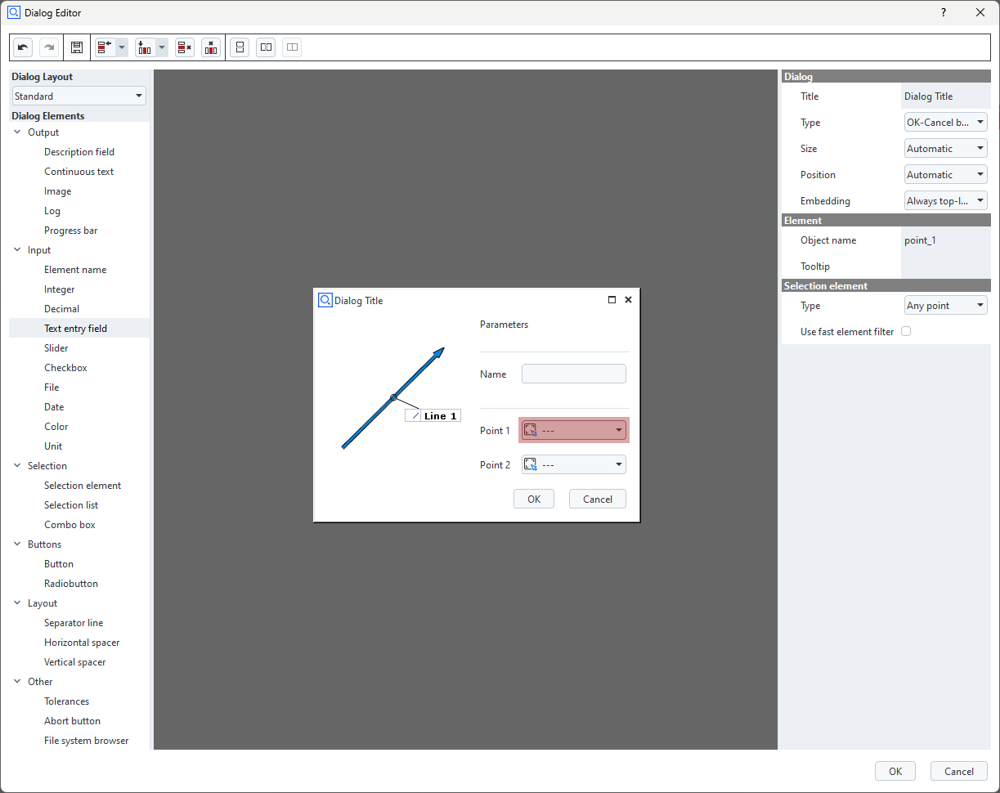
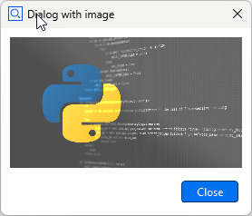
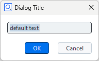
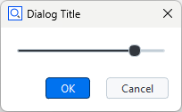
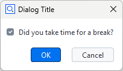
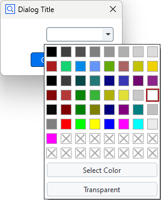
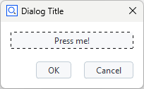
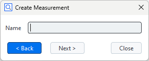

# User-defined Dialogs

- [Creating dialogs](#creating-dialogs)
- [Dialog widgets](#dialog-widgets)
- [Executing dialogs](#executing-dialogs)
- [Wizards](#wizards)

# Creating dialogs

- [Dialog designer](#dialog-designer)
- [Dialog layout](#dialog-layout)
    - [Editing the grid](#editing-the-grid)
    - [Spacers](#spacers)
- [Widgets](#widgets)
    - [Inserting and removing widgets](#inserting-and-removing-widgets)
    - [Configuring widgets](#configuring-widgets)
- [Editing already created dialogs](#editing-already-created-dialogs)

## Dialog designer

* User defined dialogs can be inserted into the script using "Insert / Dialog..." from the right mouse menu.

    

* When a new dialog is inserted, a dialog template, the target location of the dialog and the dialog type can be selected.

    

* Some dialog templates are provided by the system. Additional templates can be created by the user.

* The options for locating a dialog are
    * "Separate dialog file" - default
    * "Embedded into script"

    The base filename of a dialog file is `dialog.gdlg`, it can be renamed later. A dialog is stored as a JSON document internally.

    | Example: Script with separate dialog file |
    | ----------------------------------------- |
    | <pre>RESULT=gom.script.sys.execute_user_defined_dialog (file=':dialog.gdlg')</pre> |
    
    | Example: Script with embedded dialog |
    | ------------------------------------ |
    | <pre>RESULT=gom.script.sys.execute_user_defined_dialog (dialog={<br>    "content": [<br>        [<br>            {<br>                ...<br>            }<br>        ]<br>    ],    <br>    "control": {<br>        "id": "OkCancel"<br>    },<br>    "embedding": "always_toplevel",<br>    "position": "automatic",<br>    "size": {<br>        "height": 155,    <br>        "width": 198<br>    },<br>    "sizemode": "automatic",<br>    "style": "",<br>    "title": {<br>        "id": "",<br>        "text": "Message",<br>        "translatable":     True<br>    }<br>})</pre> |

* The options for the dialog type are
    * Break dialog (script is blocked) - default
    * Extendable break dialog (script is blocked)
    * Info dialog (script continues) 
    
    The dialog type is explained in section [Executing dialogs](#executing-dialogs)


* Dialogs are designed using a GUI based Dialog Editor.

    

## Dialog layout

* The Dialog Editor is using a grid based layout.
* Elements can be inserted into the grid via drag and drop.

### Editing the grid

💡 Editing the layout means changing the underlying grid.

* Because the underlying layout is a grid, the following actions are possible:
    * Adding and removing rows and columns.
    * Merging and splitting rows and columns.
<br><br>

    | Tool button                              | Function                          |
    | ---------------------------------------- | --------------------------------- |
    |    | Split selected cells vertically   |
    |  | Split selected cells horizontally |
    |               | Merge selected cells              |

* Selected cells are marked with a red overlay.

    

### Spacers

💡 **Spacers** are empty spaces extending in either horizontal or vertical direction.

* If a spacer is inserted into a cell, the cell claims the maximum available space in spacer direction.
* All remaining cells share the remaining space.


## Widgets

### Inserting and removing widgets

* The list of available widgets resides at the left of the Dialog Editor in the section Dialog Elements.
* Widgets are inserted via drag and drop.
* Newly dropped widgets overwrite existing widgets at the drop target cells.
* A unique name object name is assigned during insertion of a widget. This name is used to access the widget in the Python script.
* Because each cell has to be filled with a widget, widgets can not be removed from the grid. To get rid of a widget
    * Another widget can be dragged and dropped onto the existing widget or
    * The widget cell can be merged with another cell.

💡 Removing widgets from the grid is not possible. Instead, they can be overwritten by other widgets.


### Configuring widgets

* The properties of selected widgets can be edited in the property editor at the right side of the designer dialog.
* Every widget has at least a unique "Object name".
* Additionally, various parameters depending on the widget type can be edited.



The definition of the dialog can be found in `scriptingEditorExampleDialog.py` 

[//]: # (To Do: add example)

## Editing already created dialogs

* Creating a dialog leads to a script command with a dialog representation as JSON code, which can either be embedded or stored in an external dialog file.
* Double clicking onto the embedded dialog or the dialog file opens the Dialog Editor again.

# Dialog widgets

- [Use of the \_\_doc\_\_ string](#use-of-the-__doc__-string)
- [Control widget](#control-widget)
    - [Control widget elements](#control-widget-elements)
    - [Control button properties](#control-button-properties)
    - [The status label](#the-status-label)
- [Specific widgets](#specific-widgets)
    - [Text fields](#text-fields)
    - [Images](#images)
    - [Log widget](#log-widget)
    - [Progress-bar widget](#progress-bar-widget)
    - [Integer widget](#integer-widget)
    - [Decimal widget](#decimal-widget)
    - [Text entry field](#text-entry-field)
    - [Slider widget](#slider-widget)
    - [Checkbox widget](#checkbox-widget)
    - [File widget](#file-widget)
    - [Date widget](#date-widget)
    - [Color widget](#color-widget)
    - [Unit widget](#unit-widget)
    - [Selection element widget](#selection-element-widget)
    - [Selection list widget](#selection-list-widget)
    - [Button widget](#button-widget)
    - [Radio button widget](#radio-button-widget)
    - [Abort button widget](#abort-button-widget)

This section gives an overview of the available widgets. If the code examples given in this section are not intuitive to you, you might want to take a look 
into [Executing dialogs](#executing-dialogs).

## Use of the \_\_doc\_\_ string

Information about the widgets can be obtained by accessing their doc string. Let _objName_ be the object name of a widget and _DIALOG_ the dialog handle 
(see [Executing dialogs](#executing-dialogs) if this is unclear to you), the \_\_doc\_\_ string can be obtained as follows:

```
print( DIALOG.objName.__doc__ )
```

## Control widget

💡 The control widget contains the _ok_/_cancel_ or similar buttons of the dialog.

* The control element of a dialog cannot be configured like other dialog widgets.
* Therefore, their name is fixed and they are grouped together inside of the control widget named "control".
* The control elements consist of the dialogs lower buttons plus a configurable dialog status label.

| Handle                    | Property                                  | Example                                             |
| ------------------------- | ----------------------------------------- | --------------------------------------------------- |
| DIALOG.control            | Control widget                            | -                                                   |
| DIALOG.control.status     | Status icon of the control widget         | <pre>DIALOG.control.status = 'Point 1 missing'<pre> |
| DIALOG.control.\<button\> | Handle for a button of the control widget | <pre>DIALOG.control.ok.enabled = False</pre>        |

### Control widget elements

💡 The names of the control widget elements are fixed

* Usually, the names are corresponding with the elements' semantics. For example, the name of the _ok_ button is 'ok'. The names can also be 
obtained from the \_\_doc\_\_ string as shown in the code example below.
* The control elements are accessed like all other widget attributes.

| Accessing the control widget |
| ---------------------------- |
| <pre># Print control widget properties<br>print (DIALOG.control.\_\_doc\_\_)<br>ControlGroup<br><br>Attributes:<br><br>status (string)              - Status tool tip icon<br>ok     (unspecified/various) - Control widget<br>cancel (unspecified/various) - Control widget</pre> |

### Control button properties

Control buttons only have the following two properties which can be set programmatically:

| Property | Type | Example                                          |
| -------- | ---- | ------------------------------------------------ |
| text     | str  | <pre>DIALOG.control.prev.text = 'Previous'</pre> |
| enabled  | bool | <pre>DIALOG.control.ok.enabled = False</pre>     |

### The status label

⚠️ The status label of the control widget is invisible until a status text is set.

* If a status text is set, a small warning icon appears, like in regular applications' dialogs.
* The status label can be configured using its properties like all other widgets.

| Dialog                                      | Code |
| ------------------------------------------- | ---- |
|  | <pre>DIALOG=gom.script.sys.create_user_defined_dialog (content='dialog definition')<br># Set status label text<br>DIALOG.control.status = 'No point selected.'<br># Set 'ok' button to insensitive<br>DIALOG.control.ok.enabled = False<br>gom.script.sys.show_user_defined_dialog(dialog = DIALOG)</pre> |

You can reset the status icon and clear the error message by assigning an empty string (`DIALOG.control.status = ''`).

## Specific widgets

### Text fields

* Text field widgets are able to display multi lines text.
* In these texts keywords can also be displayed.
* A double click onto a text field widget opens a content editor.

| Dialog                      | Code |
| --------------------------- | ---- |
|   | <pre>gom.script.sys.execute_user_defined_dialog (dialog={<br>	"content": \[<br>		\[<br>			{<br>                            ...<br>			},<br>			{<br>				"columns": 1,<br>				"default_font_family": "",<br>				"default_font_size": 0,<br>				"name": "text",<br>				"rows": 1,<br>				"text": {<br>					"id": "",<br>					"text": "\<html\>\<p align=\"center\"\>By clicking 'Close', the dialog will be closed.\</p\>\</html\>",<br>					"translatable": True<br>				},<br>                                ...<br>				"type": "display::text",<br>				"wordwrap": False<br>			}<br>		\]<br>	\],<br>	"control": {<br>		"id": "Close"<br>	},<br>        ...<br>})</pre> |

| Editor    | Dialog   |
| --------- | -------- |
| (figure)  | (figure) |

* The keywords displayed in text field widgets can originate from different source:
    * Global application keywords,
    * project related keywords and
    * local script variables.

⚠️ Local script variables can be displayed in text fields by inserting them via the 'insert expression' dialog.

* Local script variables are invalid until the variable assignment is reached. They cannot be displayed statically in the text field editor prior to script 
execution, so an invalid value (???) will most certainly be displayed instead.

[//]: # (To Do: Check how to insert local variables)

| Property | Type | Example                                      |
| -------- | ---- | -------------------------------------------- |
| enabled  | bool | <pre>DIALOG.textWidget.enabled = False</pre> |
| text     | str  | <pre>print(DIALOG.textWidget.text)</pre>     |
| wordwrap | bool | <pre>DIALOG.textWidget.wordwrap = True</pre> |
| visible  | bool | <pre>DIALOG.textWidget.visible = False</pre> |

### Images

* Widgets of type image are able to display arbitrary images.
* The image data is stored together with the dialog data in the generated XML code. The \<data\>\</data\> section contains the string representing the image.

| Dialog                        | Code |
| ----------------------------- | ---- |
|   | <pre># The 'data' attribute contains the image data (shortened version here)<br>RESULT=gom.script.sys.execute_user_defined_dialog (dialog={<br>    "content": [<br>        [<br>            {<br>                "columns": 1,<br>                "data": "AAAAAYlQTkcNChoKAAAADUlIRFIAAAQAAAACQAgCAAAAnPeDgptZSsdt...",<br>                "file_name": "C:/Users/IQMPRINK/Downloads/zeiss-inspect_python.jpg",<br>                "height": 144,<br>                "keep_aspect": True,<br>                "keep_original_size": False,<br>                "name": "image",<br>                "rows": 1,<br>                "system_image": "system_message_information",<br>                "tooltip": {<br>                    "id": "",<br>                    "text": "",<br>                    "translatable": True<br>                },<br>                "type": "image",<br>                "use_system_image": False,<br>                "width": 256<br>            }<br>        ]<br>    ],<br>    "control": {<br>        "id": "Close"<br>    },<br>    "embedding": "always_toplevel",<br>    "position": "automatic",<br>    "size": {<br>        "height": 233,<br>        "width": 292<br>    },<br>    "sizemode": "automatic",<br>    "style": "",<br>    "title": {<br>        "id": "",<br>        "text": "Dialog with image",<br>        "translatable": True<br>    }<br>})</pre> |

| Property           | Type      | Example                                                      |
| ------------------ | --------- | ------------------------------------------------------------ |
| enabled            | bool      | <pre>DIALOG.image.enabled = False</pre>                      |
| text               | str       | <pre>DIALOG.control.prev.text = 'Previous'</pre>             |
| use_system_image   | bool      | <pre>DIALOG.image.use_system_image = True</pre>              |
| system_image       | str       | <pre># Possible values: 'system_message_information', 'system_message_warning',<br> 'system_message_critical', 'system_message_question'<br>DIALOG.image.system_image = 'system_message_question'</pre> |
| file_name          | str       | read-only!                                                   |
| keep_original_size | bool      | read-only!                                                   |
| keep_aspect        | bool      | read-only!                                                   |
| data               | (special) | <pre># This is the actual image data<br># Copy image from one dialog to another:<br>my_dialog.my_image.data = image_container_dialog.image_1.data</pre> |
| width              | int       | <pre>print('image width ' + str(DIALOG.image.width))</pre>   |
| height             | int       | <pre>print('image height ' + str(DIALOG.image.height))</pre> |
| visible            | bool      | <pre>DIALOG.image.visible = False</pre>              |

Note that you can switch from a system image to a user image using the property `use_system_image`. But this user image must have been selected 
beforehand in the designer. You cannot read a new image file by setting the `filename` property. Also, all of the image formatting properties (`keep_original_size`, `keep_aspect`, `width`, `height`) only work in the designer. From the script you can only read these values.
Although you cannot read images using the `filename` property you can copy images from one dialog to another using the `data` property. So you are able 
to prepare (create) a dialog as an image container holding several images. You can then use this image container dialog to copy the image you need to an 
actually displayed dialog.

### Log widget

| Dialog                      | Description |
| --------------------------- | ----------- |
|   | The log widget can display multiple lines of unformatted text, which can be easily saved to a text file by clicking the save button. |

| Property             | Type      | Example                                                       |
| -------------------- | --------- | ------------------------------------------------------------- |
| enabled              | bool      | <pre>DIALOG.log.enabled = True</pre>                          |
| text                 | str       | <pre>DIALOG.log.text += 'Yet another log message.\n</pre>     |
| word_wrap            | bool      | <pre>DIALOG.log.word_wrap = True</pre>                        |
| show_save            | bool      | <pre>DIALOG.log.show_save = False</pre>                       |
| save_dialog_title    | str       | <pre>DIALOG.log.save_dialog_title = 'Save operator log'</pre> |
| scroll_automatically | bool      | <pre>DIALOG.log.scroll_automatically = True</pre>             |
| visible              | bool      | <pre>DIALOG.log.visible = False</pre>                         |

### Progress-bar widget

| Dialog                              | Description |
| ----------------------------------- | ----------- |
|   | The progress bar widget can be used in the two modes _system_ and _manual_.<br><br>**Manual mode:**<br>In this mode, the user may set the progress bar through its `value` variable.<br><pre>import gom, time<br>DIALOG=gom.script.sys.create_user_defined_dialog (content='dialog defintion')<br>DIALOG.progress.minimum = 0<br>DIALOG.progress.maximum = 100<br>gom.script.sys.open_user_defined_dialog( dialog = DIALOG )<br>DIALOG.progress.value = 0<br>time.sleep(1)<br>DIALOG.progress.value = 33<br>time.sleep(1)<br>DIALOG.progress.value = 66<br>time.sleep(1)<br>DIALOG.progress.value = 100<br>gom.script.sys.close_user_defined_dialog (dialog=DIALOG)</pre><br><br>**Automatic mode:**<br>In this mode, the progress bar displays the same progress informations as the progress bar in the lower right corner of the software.<br><pre>import gom<br>DIALOG=gom.script.sys.create_user_defined_dialog (content='dialog definition')<br>gom.script.sys.open_user_defined_dialog (dialog=DIALOG)<br>gom.script.sys.create_project ()<br>gom.script.atos.import_project (file='some project')<br>gom.script.sys.close_user_defined_dialog (dialog=DIALOG)</pre><br><br>You can switch between automatic and manual mode from with the script by setting the mode variable as shown below:<br><pre># manual mode:<br>DIALOG.progress.mode = "manual"<br># automatic mode:<br>DIALOG.progress.mode = "system"</pre><br><br>**Partially controlled system progress bar:**<br>The range of a system progress bar can be divided into parts, sequentially controlled by an executed command.<br><ul><li>The progress bar range can be split into multiple parts.<li>Each part controls an equally sized progress bar interval. If, for example, there are 3 parts, the first part ranges from 0 to 33, the second from 33 to 66 and the third from 66 to 100.<li>When a command is executed, the command controlles just the one active part of the progress bar widget.</ul><br>**Example:**<pre># -*- coding: utf-8 -*-<br>import gom<br># Create a user defined dialog with a progress bar, mode 'system'<br>DIALOG=gom.script.sys.create_user_defined_dialog (content='dialog definition')<br>gom.script.sys.open_user_defined_dialog( dialog = DIALOG )<br># Split progress bar into 3 parts<br>DIALOG.progress.parts = 3<br># Current part is the first interval (part '0', because we are counting from '0')<br>DIALOG.progress.step = 0<br># Execute load command. The command will control the first progress bar range from 0% to 33%.<br># That means when the command has been finished, the progress bar will display '33%'.<br>gom.script.sys.load_project (file='some project')<br># Current part is the second interval. The progress bar runs from 33% to 66%<br>DIALOG.progress.step = 1<br>gom.script.atos.switch_to_report_mode ()<br>gom.script.report.update_report_page (<br> pages=gom.app.project.reports,<br> switch_alignment=True,<br> switch_stage=False)<br># Current part is the third interval. The progress bar runs from 66% to 100%<br>DIALOG.progress.step = 2<br>gom.script.atos.switch_to_inspection_mode ()<br>gom.script.sys.recalculate_all_elements ()</pre><br>💡 It is possible to switch  between automatic and manual mode for each part. |

[//]: # (To Do: Fix reference to "atos" in the example above)

### Integer widget

| Dialog                          | Description |
| ------------------------------- | ----------- |
|   | The integer widget is used to require integers from the user. `integerWidget` is the object name of the integer widget in the example below.<pre>RESULT=gom.script.sys.execute_user_defined_dialog (content='dialog definition')<br>userInput = RESULT.integerWidget</pre> |

| Property | Type  | Example                                                                |
| -------- | ----- | ---------------------------------------------------------------------- |
| tooltip  | str   | <pre>DIALOG.inputInt.tooltip = 'Enter the number of points!'</pre>     |
| enabled  | bool  | <pre>DIALOG.inputInt.enabled = False</pre>                             |
| value    | int   | <pre>if DIALOG.inputInt.value < 15:</pre>                              |
| focus    | bool  | <pre>DIALOG.inputInt.focus = True</pre>⚠️ Only works if dialog is open |
| minimum  | float | <pre>DIALOG.inputInt.minimum = 20</pre>                                |
| maximum  | float | <pre>DIALOG.inputInt.maximum = 50</pre>                                |
| visible  | bool  | <pre>DIALOG.inputInt.visible = False</pre>                             |

### Decimal widget

| Dialog                          | Description |
| ------------------------------- | ----------- |
|   | The decimal widget is used to get a floating point input from the user. It is possible to choose the number of digits and a unit. The selectable units are the ones from the user preferences (Edit \> Application \> Settings \> Preferences) in the _Default units_ tab. `decimalWidget` is the object name of the decimal widget in the example below.<pre>RESULT=gom.script.sys.execute_user_defined_dialog (content='dialog definition')<br>userInput = RESULT.decimalWidget</pre> |

| Property | Type  | Example                                                                  |
| -------- | ----- | ------------------------------------------------------------------------ |
| tooltip  | str   | <pre>DIALOG.floatInput.tooltip = 'Enter the number of points!'</pre>     |
| enabled  | bool  | <pre>DIALOG.floatInput.enabled = False</pre>                             |
| value    | int   | <pre>if DIALOG.floatInput.value < 15:</pre>                              |
| focus    | bool  | <pre>DIALOG.floatInput.focus = True</pre>⚠️ Only works if dialog is open |
| minimum  | float | <pre>DIALOG.floatInput.minimum = 20</pre>                                |
| maximum  | float | <pre>DIALOG.floatInput.maximum = 50</pre>                                |
| visible  | bool  | <pre>DIALOG.floatInput.visible = False</pre>                             |

### Text entry field

| Dialog                             | Description |
| ---------------------------------- | ----------- |
|   | The text entry field can be used to get string input from the user. A simple use case is given by the next code block. _textEntryWidget_ is the object name of the widget in the example below.<pre>DIALOG=gom.script.sys.create_user_defined_dialog (content='dialog definition')<br>DIALOG.textEntryWidget = "some default text"<br>RESULT = gom.script.sys.show_user_defined_dialog(dialog = DIALOG)<br>print( RESULT.textEntryWidget ) # the user input string</pre> |

| Property  | Type  | Example                                                                    |
| --------- | ----- | -------------------------------------------------------------------------- |
| tooltip   | str   | <pre>DIALOG.inputString.tooltip = 'Enter object description'</pre>         |
| enabled   | bool  | <pre>DIALOG.inputString.enabled = True</pre>                               |
| value     | str   | <pre>DIALOG.inputString.value = "Warsaw"</pre>                             |
| focus     | bool  | <pre>DIALOG.inputString.focus = True</pre>⚠️ Only works if dialog is open |
| read_only | bool  | <pre>if DIALOG.inputString.read_only:</pre>                                |
| visible   | bool  | <pre>DIALOG.inputString.visible = False</pre>                              |

### Slider widget

| Dialog                         | Description |
| ------------------------------ | ----------- |
|   | The slider widget can be used to get a float value from a certain interval from the user. _sliderWidget_ is the object name of the slider widget in the example below.<pre>DIALOG=gom.script.sys.create_user_defined_dialog (content='dialog definition')<br><br>RESULT = gom.script.sys.show_user_defined_dialog (dialog=DIALOG)<br>print( RESULT.sliderWidget ) # some float</pre> |

### Checkbox widget

The check box widget can be used to get boolean input from the user.

| Dialog                           | Description |
| -------------------------------- | ----------- |
|   | The check box widget can be used to get boolean input from the user. _checkboxWidget_ is the object name of the slider widget in the example below.<pre>DIALOG=gom.script.sys.create_user_defined_dialog (content='dialog definition')<br><br>RESULT=gom.script.sys.show_user_defined_dialog (dialog=DIALOG)<br>print (RESULT.checkboxWidget)</pre> |

| Property  | Type  | Example                                                                                              |
| --------- | ----- | ---------------------------------------------------------------------------------------------------- |
| tooltip   | str   | <pre>DIALOG.inputCheckbox.tooltip = 'Check this option to clear the results after evaluation.'</pre> |
| enabled   | bool  | <pre>DIALOG.inputCheckbox.enabled = True</pre>                                                       |
| value     | bool  | <pre>print('Evaluation enabled:', str(DIALOG.inputCheckbox.value))</pre>                             |
| title     | str   | <pre>DIALOG.inputCheckbox.title = 'Mirror option'</pre>                                              |
| visible   | bool  | <pre>DIALOG.inputCheckbox.visible = False</pre>                                                      |

### File widget

| Dialog                      | Description                                                                                                        |
| --------------------------- | ------------------------------------------------------------------------------------------------------------------ |
|  | By clicking the file widget, a file selection dialog is opened. This allows to select a file from the file system. |

| Property  | Type  | Example                                                                                              |
| --------- | ----- | ---------------------------------------------------------------------------------------------------- |
| tooltip   | str   | <pre>DIALOG.inputFile.tooltip = 'Select a file for the protocol'</pre>                               |
| enabled   | bool  | <pre>DIALOG.inputFile.enabled = False</pre>                                                          |
| value     | str   | <pre>if DIALOG.inputFile.value != '':</pre>                                                          |
| focus     | bool  | <pre>DIALOG.inputFile.focus = True</pre>⚠️ Only works if dialog is open                             |
| type      | str   | <pre># Possible values: 'any' (any file), 'new' (not an existing file),<br># 'file' (an existing file), 'multi_file' (multiple existing files),<br># 'directory' (an existing folder)<br>DIALOG.inputFile.type = 'any'</pre> |
| title     | str   | <pre>DIALOG.inputFile.title = 'Select the location for the protocol files'</pre>                     |
| default   | str   | <pre>DIALOG.inputFile.default = 'D:/data/default.txt'</pre>                                          |
| visible   | bool  | <pre>DIALOG.inputFile.visible = False</pre>                                                          |

### Date widget

| Dialog                       | Description |
| ---------------------------- | ----------- |
|   | The date widget requests a date from the user.  _dateWidget_ is the object name of the date widget in the example below.<pre>DIALOG=gom.script.sys.create_user_defined_dialog (content='dialog definition')<br>dateObject = DIALOG.dateWidget.value # date object<br>print( DIALOG.dateWidget.year )  # integer<br>print( DIALOG.dateWidget.month ) # integer<br>print( DIALOG.dateWidget.day )   # integer</pre> |

| Property          | Type      | Example                                                                                              |
| ----------------- | --------- | ---------------------------------------------------------------------------------------------------- |
| tooltip           | str       | <pre>DIALOG.inputDate.tooltip = 'Enter fabrication date'</pre>                                       |
| enabled           | bool      | <pre>DIALOG.inputDate.enabled = False</pre>                                                          |
| value             | (special) | <pre>print('Selected date:', str(DIALOG.inputDate.value))</pre>                                      |
| focus             | bool      | <pre>DIALOG.inputDate.focus = True</pre>⚠️ Only works if dialog is open                              |
| use_current_date  | bool      | <pre>DIALOG.inputDate.use_current_date = True</pre>💡 if set, use current date to initialize widget. |
| year              | int       | <pre>DIALOG.inputDate.year = 2014</pre>                                                              |
| month             | int       | <pre>DIALOG.inputDate.month = 12</pre>                                                               |
| day               | int       | <pre>DIALOG.inputDate.day = 24</pre>                                                                 |
| show_today_button | bool      | <pre>DIALOG.inputDate.show_today_button = True</pre>                                                 |
| visible           | bool      | <pre>DIALOG.inputDate.visible = False</pre>                                                         |

### Color widget

| Dialog                        | Description |
| ----------------------------- | ----------- |
|   | The color widget allows to select a color. _colorWidget_ is the object name of the color widget in the example below. `gomColor` behaves in the same way as `gom.Color( ... )`.<pre>DIALOG=gom.script.sys.create_user_defined_dialog (content='dialog definition')<br><br>#<br># Event handler function called if anything happens inside of the dialog<br>#<br>def dialog_event_handler (widget):<br>    if widget == DIALOG.colorWidget:<br>        gomColor = DIALOG.colorWidget.color<br>        print( gomColor) # output: gom.Color (#ffffffff)
<br><br>DIALOG.handler = dialog_event_handler<br><br>RESULT=gom.script.sys.show_user_defined_dialog (dialog=DIALOG)</pre> |

| Property             | Type      | Example                                                                                              |
| -------------------- | --------- | ---------------------------------------------------------------------------------------------------- |
| tooltip              | str       | <pre>DIALOG.inputColor.tooltip = 'Select a color for the marks.'</pre>                               |
| enabled              | bool      | <pre>DIALOG.inputColor.enabled = True</pre>                                                          |
| value                | (special) | <pre>print('Mark color:', str(DIALOG.inputColor.value))</pre>                                        |
| focus                | bool      | <pre>DIALOG.inputColor.focus = True</pre>⚠️ Only works if dialog is open                            |
| transparency_allowed | bool      | <pre>DIALOG.inputColor.transparency_allowed = True</pre>                                             |
| visible              | bool      | <pre>DIALOG.inputColor.visible = False</pre>                                                         |

### Unit widget

| Dialog                        | Description |
| ----------------------------- | ----------- |
|   | The unit widget allows to select a unit. _unitWidget_ is the object name of the color widget in the example below.<pre>DIALOG=gom.script.sys.create_user_defined_dialog (content='dialog definition')<br><br>#<br># Event handler function called if anything happens inside of the dialog<br>#<br>def dialog_event_handler (widget):<br>    if widget == DIALOG.unitWidget:<br>        unit = DIALOG.unitWidget.value<br>        print( unit) # ANGLE<br><br>DIALOG.handler = dialog_event_handler<br><br>RESULT=gom.script.sys.show_user_defined_dialog (dialog=DIALOG)</pre> |

| Property             | Type      | Example                                                                                              |
| -------------------- | --------- | ---------------------------------------------------------------------------------------------------- |
| tooltip              | str       | <pre>DIALOG.inputUnit.tooltip = 'Select a color for the marks.'</pre>                                |
| enabled              | bool      | <pre>DIALOG.inputUnit.enabled = True</pre>                                                           |
| value                | (special) | <pre>print('Mark color:', str(DIALOG.inputUnit.value))</pre>                                         |
| focus                | bool      | <pre>DIALOG.inputUnit.focus = True</pre>⚠️ Only works if dialog is open                             |
| visible              | bool      | <pre>DIALOG.inputUnit.visible = False</pre>                                                          |

### Selection element widget

| Dialog    | Description |
| --------- | ----------- |
| (figure)  | The selection element widget can be used to select the elements from the element explorer. The following element types can be chosen:<ul><li>Any Point<li>Point element<li>Line element<li>Plane element<li>Direction<li>User-defined</ul>_elementSelectionWidget_ is the object name of the element selection widget in the example below.<pre>DIALOG=gom.script.sys.execute_user_defined_dialog (content='dialog definition')<br><br>selectedElement = DIALOG.elementSelectionWidget<br>print( selectedElement ) # output: gom.app.project.<br>inspection['Equidistant Surface Points 1']</pre> |

| Property | Type      | Example                                                                                              |
| -------- | --------- | ---------------------------------------------------------------------------------------------------- |
| tooltip  | str       | <pre>DIALOG.selectElement.tooltip = 'Select a line for rotation'</pre>                               |
| enabled  | bool      | <pre>DIALOG.selectElement.enabled = False</pre>                                                      |
| value    |(special)  | <pre>if DIALOG.selectElement.value != None:</pre>                                                    |
| focus    | bool      | <pre>DIALOG.selectElement.focus = True</pre>⚠️ Only works if dialog is open                          |
| supplier | str       | <pre># Read-only property<br># Possible values: 'any', 'points', 'lines', 'planes', 'directions', 'custom'<br>print(DIALOG.selectElement.supplier)</pre> |
| filter   | function  | Element filter function for the 'custom' supplier. See example below.                                |
| visible  | bool      | <pre>DIALOG.select_plane.visible = False</pre>                                                       |

The following script shows how to use a custom filter for element selection. The example filter allows the user to select a system plane:

```
DIALOG4=gom.script.sys.create_user_defined_dialog (content='...')


def dialog_event_handler (widget):
    pass

# filter system planes
def element_filter( element ):
    try:
        if element.type == 'plane':
            return True
     except Exception as e:
         pass
     return False

DIALOG4.handler = dialog_event_handler
DIALOG4.input_new.filter = element_filter

RESULT=gom.script.sys.show_user_defined_dialog (dialog=DIALOG4)

print("Chosen system plane:", RESULT.input_new.name)
```

The complete code of the example is attached to this document. FIXME

### Selection list widget

| Dialog                                 | Description |
| -------------------------------------- | ----------- |
|   | This widget allows to make a selection from a predefined set of options. The selected item can be accessed from a script through its object name (e.g. _selectionListWidget_) as follows:<pre>selectedValue = DIALOG.selectionListWidget.value<br>print( selectedValue ) # output: entry2</pre> |

| Property | Type        | Example                                                                                              |
| -------- | ----------- | ---------------------------------------------------------------------------------------------------- |
| tooltip  | str         | <pre>DIALOG.selectEntry.tooltip = 'Select one of the operating modes'</pre>                          |
| enabled  | bool        | <pre>DIALOG.selectEntry.enabled = False</pre>                                                        |
| value    | str         | <pre>DIALOG.selectEntry.value = 'Debug'</pre>                                                        |
| focus    | bool        | <pre>DIALOG.selectEntry.focus = True</pre>⚠️ Only works if dialog is open                           |
| items    | list of str | <pre>DIALOG.selectEntry.items = ['Debug', 'Info', 'Warn', 'Error', 'Fatal']</pre>                    |
| visible  | bool        | <pre>DIALOG.select_mode.visible = False</pre>                                                        |

### Button widget

| Dialog    | Description |
| --------- | ----------- |
| <br>  | There are two types of buttons: push buttons and toggle buttons. The push button is a regular button and needs an event handler to manage its action. The toggle button has two - states active and inactive - and the user can toggle between them by clicking the button. The button is highlighted in active state as shown in the screenshot. The state of the toggle button can be accessed as follows:<pre>toggleButtonState = DIALOG.toggleButtonWidget.value<br>print(toggleButtonState) # output: True</pre>The buttons size and icon can be changed in the Dialog Editor.

| Property         | Type | Example                                                                                                               |
| ---------------- | ---- | --------------------------------------------------------------------------------------------------------------------- |
| tooltip          | str  | <pre>DIALOG.button.tooltip = 'Click to start evaluation'</pre>                                                        |
| enabled          | bool | <pre>DIALOG.button.enabled = False                                                                                    |
| value            | bool | <pre>if DIALOG.button.value:</pre>💡 Only for toggle button!                                                          |
| text             | str  | <pre>DIALOG.button.text = 'Click here!'                                                                               |
| type             | str  | <pre># Possible values: 'push', 'toggle'<br>DIALOG.button.type = 'toggle'<br>DIALOG.button.value = True</pre>         |
| icon_type        | str  | <pre># Possible values: 'none', 'file', 'system'<br># but see remark below!<br>DIALOG.button.icon_type = 'none'</pre> |
| icon_system_type | str  | <pre># Possible values: 'ok', 'cancel',<br># 'arrow_left', 'arrow_right', 'arrow_up', 'arrow_down'<br>DIALOG.button.icon_system_type = 'ok'</pre> |
| icon_system_size | str  | <pre># Possible values: 'default', 'large', 'extra_large'<br>DIALOG.button.icon_system_size = 'extra_large'</pre>     |
| visible          | bool | <pre>DIALOG.button.visible = False

💡 There are also values for file icons. These only work straightforward using the dialog designer but not from script. You can only change between no icon and system icons in a straightforward way.

### Radio button widget

| Dialog    | Description |
| --------- | ----------- |
|   | The radio button widget enables the user to choose an option from a predefined set. Each option has a label and a unique ID, which both can be set in the scripting dialog editor by double clicking the widget. The IDs are 'ONE', 'TWO' and 'THREE' in the example below.<pre>selectedChoice = DIALOG.radiobuttonsWidget.value<br>print( selectedChoice ) # output: ONE<br>if selectedChoice == 'ONE':<br>    print("IDs are strings.") # output: IDs are strings.</pre> |

| Property | Type           | Example                                                                                                               |
| -------- | -------------- | --------------------------------------------------------------------------------------------------------------------- |
| tooltip  | str            | <pre>DIALOG.radiobuttons.tooltip = 'Choose one alternative!'</pre>                                                    |
| enabled  | bool           | <pre>DIALOG.radiobuttons.enabled = False</pre>                                                                        |
| value    | str            | <pre>DIALOG.radiobuttons.value = 'Value3'</pre>                                                                       |
| items    | (special list) | <pre># Possible values is a list of lists of two strings.<br># Each first string is the returned value<br># Each second string is the entries' title<br>DIALOG.radiobuttons.items = [['Value1', 'Title1'], ['Value2', 'Title2'], ['Value3', 'Title3']]<br>DIALOG.radiobuttons.default = 'Value2'</pre> |
| default  | str            | <pre>DIALOG.radiobuttons.default = 'Value1'</pre>                                                                     |
| visible  | bool           | <pre>DIALOG.radiobuttons.visible = False</pre>                                                                        |

### Abort button widget

| Dialog    | Description |
| --------- | ----------- |
|   | The abort button aborts the current action. It is disabled if no action is currently executed. |

[//]: # (It behaves in the same manner as the abort button in the lower right corner of Atos **???** software.)
[//]: # (To Do: Add enabled abort button. Check if the button still exists in ZEISS Inspect.)

# Executing dialogs

- [Dialog commands](#dialog-commands)
    - [Blocking fixed dialogs (`execute`)](#blocking-fixed-dialogs-execute)
    - [Blocking configurable dialogs (`create` and `show`)](#blocking-configurable-dialogs-create-and-show)
    - [Non-blocking configurable dialogs (`create`, `open` and `close`)](#non-blocking-configurable-dialogs-create-open-and-close)
- [Dialog results](#dialog-results)
    - [Custom results](#custom-results)
- [Configuring dialog widgets](#configuring-dialog-widgets)
- [Event handler functions](#event-handler-functions)
    - [Registering event handlers](#registering-event-handlers)
    - [Closing dialogs from within the event handler](#closing-dialogs-from-within-the-event-handler)
    - [Using a timer to activate the event handler](#using-a-timer-to-activate-the-event-handler)
- [Determining the existing widget attributes](#determining-the-existing-widget-attributes)

## Dialog commands

### Blocking fixed dialogs (`execute`)

* Standard case of a dialog.
* The dialog is created and executed with a single command.
* The command blocks the script until the dialog is closed again.
* The dialog result is returned.

| Dialog    | Command     |
| --------- | ----------- |
| (figure)  | <pre>RESULT=gom.script.sys.execute_user_defined_dialog (content='\<dialog\>' \\<br>' \<title\>Distance\</title\>' \\<br>' \<control id="OkCancel" /\>' \\<br>' \<sizemode\>automatic\</sizemode\>' \\<br>' \<size width="196" height="110" /\>' \\<br>' \<content rows="1" columns="2" \>' \\<br>' \<widget rowspan="1" row="0" column="0" columnspan="1" type="label" \>' \\<br>' \<name\>label\</name\>' \\<br>' \<text\>Distance\</text\>' \\<br>' \</widget\>' \\<br>' \<widget rowspan="1" row="0" column="1" columnspan="1" type="input::number" \>' \\<br>' \<name\>distance\</name\>' \\<br>' \<value\>0\</value\>' \\<br>' \<minimum\>0\</minimum\>' \\<br>' \<maximum\>1000\</maximum\>' \\<br>' \<precision\>2\</precision\>' \\<br>' \</widget\>' \\<br>' \</content\>' \\<br>'\</dialog\>')</pre> |

### Blocking configurable dialogs (`create` and `show`)

* A dialog can be created and executed by two different commands in a row.
* This way, the created dialog can be modified by the script right before executing.

| Creating and executing a dialog with two separate commands |
| ---------------------------------------------------------- |
| <pre># Create dialog, but do not execute it yet<br>DIALOG = gom.script.sys.create_user_defined_dialog (content='...')<br><br>#<br># The dialog has been created. At this point of the script, the dialog handle DIALOG<br># can be used to access and configure dialog parts<br>#<br># Execute dialog and fetch execution result<br>RESULT = gom.script.sys.show_user_defined_dialog( dialog = DIALOG )</pre> |

### Non-blocking configurable dialogs (`create`, `open` and `close`)

* In this mode, the script execution continues after the dialog has been opened.
* The sequence of commands is as follows:
    * the `create` command creates a dialog. The dialog can be configured now. Afterwards
    * the `open` command is issued to display the dialog. The script executing continues. At last
    * the `close` command closes the dialog again, if no closed manually by the user yet.

💡 At script termination all open dialogs are closed automatically.

| Non blocking configurable dialogs |
| --------------------------------- |
| <pre># Create dialog but do not execute it yet<br>DIALOG = gom.script.sys.create_user_defined_dialog (content='...')<br><br>#<br># The dialog has been created. At this point of the script, the dialog handle DIALOG<br># can be used to access and configure dialog parts<br>#<br><br># Show dialog. The script execution continues.<br>gom.script.sys.open_user_defined_dialog( dialog = DIALOG )<br><br>#<br># The dialog content can be modified here, the dialog is still open<br>#<br>DIALOG.title = 'Stufe 2'<br><br># Close dialog again<br>gom.script.sys.close_user_defined_dialog (dialog=DIALOG)</pre> |

## Dialog results

💡 The return value is an object with one property per interactive dialog widget containing its current value.

* The return value is an object containing all current values.
* Each dialog widget which can be changed by the script user writes its resulting value into this result object.
* The key for each widget is its object name, which is unique.

| Dialog    | Result      |
| --------- | ----------- |
| (figure)  | <pre>#<br># Print whole dialog result. This is a result map with just one entry 'distance', named after<br># the unique name assigned to the spinbox.<br>#<br>print (RESULT) # Print whole result map<br># output: gom.dialog.DialogResult ('distance': 2.00000000e+00, 'label': None)<br><br>#<br># Print result for the element named 'distance'. This will lead to the spinbox content.<br>#<br>print (RESULT.distance)<br># output: 2.0</pre> |
| (figure)  | <pre># Print content of the 'name' widget<br>print( RESULT.name )<br># output: Line 1<br><br># Print content of the widget named 'point1'. This can again be an element reference.<br>print( RESULT.point1 )<br># output: gom.app.project.actual_elements['Point 5']<br><br># Print content of the widget named 'point2'.<br>print( RESULT.point2 )<br># output: gom.app.project.actual_elements['Point 6']<br><br># construct a line with the user input. Therefore our dialog works similar to the 2-point line<br># construction dialog<br>MCAD_ELEMENT=gom.script.primitive.create_line_by_2_points (<br>    name= RESULT.name,<br>    point1 = RESULT.point1,<br>    point2 = RESULT.point2)</pre> |

💡 The type of the result depends on the specific widget.

### Custom results

You can return custom results from dialogs using an optional parameter to the `close_user_defined_dialog`-function. The following example produces 'Yes' 
and 'No' results for the different buttons and 'Cheater' when the user uses the close button of the dialog.

```
DIALOG = gom.script.sys.create_user_defined_dialog (content='...')

#
# Event handler function called if anything happens inside of the dialog
#
def dialog_event_handler (widget):
    if widget == DIALOG.button_yes:
        gom.script.sys.close_user_defined_dialog( dialog = DIALOG, result = 'Yes' )
    if widget == DIALOG.button_no:
        gom.script.sys.close_user_defined_dialog( dialog = DIALOG, result = 'No' )

DIALOG.handler = dialog_event_handler

try:
    RESULT = gom.script.sys.show_user_defined_dialog (dialog=DIALOG)
except gom.BreakError as e:
    RESULT = 'Cheater'

print('RESULT', RESULT)
```

The complete code of the example is attached to this document. **FIXME**

## Configuring dialog widgets

* Dialogs created with the `create` and `open` commands can be modified before executed.
* Each widget in the dialog can be accessed via the dialog handle.
* The widget is identified by its unique name.

| Configuring dialog widgets |
| -------------------------- |
| <pre># Create dialog and receive dialog handle<br>DIALOG = gom.script.sys.create_user_defined_dialog (content='...')<br><br># The handle for a widget inside of the dialog is addressed by its unique name<br>WIDGET = DIALOG.distance<br><br># The widget parameter can be set via widget attributes. 'Value', for instance, relates to the current widget value.<br>WIDGET.value = 3.0</pre> |

* All widgets share some common standard attributes:

| Attribute | Type                | Property                                  |
| --------- | ------------------- | ----------------------------------------- |
| name      | str                 | Unique name of the widget - do not write! |
| enabled   | bool                | Widget is currently active / inactive     |
| value     | (depends on widget) | Current value                             |

For the type of the value property for a specific widget, see section [Specific widgets](#specific-widgets) above. For widgets which are not used to enter some value, `value` is `None` and read-only. In addition, widgets have further attributes depending on their type (see section [Specific widgets](#specific-widgets) above for details).

| Accessing widget attributes |
| --------------------------- |
| <pre># Create dialog but do not execute it yet<br>DIALOG=gom.script.sys.create_dialog (content='...')<br><br># Set name to 'default name' and disable 'ok' button<br>DIALOG.name.value = "default name"<br>DIALOG.control.ok.enabled = False<br><br># Execute dialog<br>RESULT=gom.script.sys.show_user_defined_dialog (dialog=DIALOG)</pre> |

## Event handler functions

### Registering event handlers

* A function can be registered to the dialog called on value changed.
* Every time the user modified a dialog value, the handler function is called.
* The handler function is also called on application global signals, e.g., when application data has been changed. In these cases is the string _system_ passed to the handler function. Those global signals are caused by changing the element selection or opening a project for example.
* The handler function can access dialog widget properties.
* The handler function is registered using the special attribute `handler`.
* The _prev_ and _next_ button of a wizard dialog are the only control widgets, which trigger the event handler.

| Dialog handler functions |
| ------------------------ |
| <pre>DIALOG=gom.script.sys.create_user_defined_dialog (content='dialog definition')<br><br># Handler function registered to the dialog<br>def handler_function (widget):<br>    # Print information about the modified widget<br>    print ("Modified:", str (widget))<br>    # If the 'name' widget is empty, the 'ok' button is disabled.<br>    if DIALOG.name.value == "":<br>        DIALOG.control.ok.enabled = False<br>    else:<br>        DIALOG.control.ok.enabled = True<br><br>    if str(widget) == 'system':<br>        print("It is a global event.")<br>    elif str(widget) == 'initialize':<br>        print("Dialog is displayed for the first time.")<br><br># Register dialog handler<br>DIALOG.handler = handler_function<br># Execute dialog<br>RESULT=gom.script.sys.show_user_defined_dialog (dialog=DIALOG)</pre> |

A complete example with a handler function can be found in the file scriptingEditorExampleDialog.py **FIXME** The argument passed to the event handler is either the dialog widget (e.g. a button), which triggered the eventhandler or a string. The following table lists all possible strings:

| Value        | Description                                                                  |
| ------------ | ---------------------------------------------------------------------------- |
| 'system'     | Passed to the event handler in the case of a global event.                   |
| 'timer'      | Passed to the event handler in the case of a global event.                   |
| 'initialize' | Passed to the event handler when the dialog is displayed for the first time. |

If the widget parameter is not a string, it represents a widget object. Note, that you cannot use the `is` operator on these objects. Always use `==` and similar 
operators to compare the widget parameter:

| Compare widget parameter |
| ------------------------ |
| <pre>def handler_function (widget):<br>    ...<br>    # compare widget using "==", using "is" will not work!<br>    if widget == DIALOG.textInput:<br>        if DIALOG.textInput.value == "":<br>            DIALOG.control.ok.enabled = False<br>        else:<br>           DIALOG.control.ok.enabled = True</pre> |

### Closing dialogs from within the event handler

💡 Dialogs can be closed from within event handlers.

| Dialog   | Event handler |
| -------- | ------------- |
| (figure) | <pre>def func (widget):<br>    if widget == DIALOG.button1:<br>        execute_func_1 ()<br>        gom.script.sys.close_user_defined_dialog (dialog=DIALOG)<br>    elif widget == DIALOG.button2:<br>        execute_func_2 ()<br>        gom.script.sys.close_user_defined_dialog (dialog=DIALOG)<br>    elif widget == DIALOG.button3:<br>        execute_func_3 ()<br>        gom.script.sys.close_user_defined_dialog (dialog=DIALOG)</pre>|

⚠️ Right after the dialog has been closed its handle becomes invalid.

This implies, that the event handler function must be written in a way that no dialog dependent code is executed after the dialog has been closed.

### Using a timer to activate the event handler

Each `DIALOG` has a special property named `DIALOG.timer`. This timer property can be used to trigger the event handler registered to `DIALOG` in 
certain time intervals. When the event handler is triggered by the timer, the string `timer` is passed to it. The \_\_doc\_\_-string of the timer gives information 
about its attributes:

```
print(DIALOG.timer.__doc__)
# output:
# Timer
#
# Attributes:
# enabled (boolean) - timer enabled
# interval (integer) - timer interval [ms]
```

💡 Please note that the timer is disabled by default.

Example:

| Dialog   | Event handler |
| -------- | ------------- |
| (figure) | <pre>DIALOG=gom.script.sys.create_user_defined_dialog (content='boring dialog definition')<br><br>#<br># Event handler function called if anything happens inside of the dialog<br>#<br>state = False<br>def dialog_event_handler (widget):<br>    global state<br>    if widget == DIALOG.start:<br>        DIALOG.timer.interval = DIALOG.interval.value * 1000<br>        DIALOG.timer.enabled = True<br>        DIALOG.start.enabled = False<br>        DIALOG.stop.enabled = True<br>    elif widget == DIALOG.stop:<br>        DIALOG.timer.enabled = False<br>        DIALOG.start.enabled = True<br>        DIALOG.stop.enabled = False<br>    elif widget == DIALOG.interval:<br>        DIALOG.timer.interval = DIALOG.interval.value * 1000<br>    elif widget == DIALOG.exit:<br>        gom.script.sys.close_user_defined_dialog (dialog=DIALOG)<br>    elif str(widget) == 'system':<br>        print("Its a system event.")<br>    elif str(widget) == 'timer':<br>        print("Its a timer event. Let´s swap the image.")<br>        state = not state<br>     <br>        if state:<br>            DIALOG.image.system_image = 'system_message_warning'<br>        else:<br>            DIALOG.image.system_image = 'system_message_question'<br><br>DIALOG.handler = dialog_event_handler<br>DIALOG.stop.enabled = False<br>RESULT=gom.script.sys.show_user_defined_dialog (dialog=DIALOG)</br> |

The complete code of the example is attached to this document. **FIXME**

## Determining the existing widget attributes

* Because Python is a very dynamic language, the type of a variable or attribute can not be determined statically.
* Instead, it is possible to query the variable dynamically during runtime.
* The more commonly used widget attributes are documented in the section [Specific widgets](#specific-widgets) above.

💡 Most objects support the attribute \_\_doc\_\_ which prints the available object documentation to the console.

| Print object documentation |
| -------------------------- |
| <pre>#<br># Query __doc__ attribute of a button widget<br>#<br>print (DIALOG.my_button.__doc__)<br># output:<br># Handle for a widget called 'my_button' of type 'Button' (button::pushbutton)<br>#<br># Attributes:<br># name             (string)              - Name of the widget. The name can be used to access the widget via a dialog handle.<br># tooltip          (string)              - Tooltip of the widget. If empty, no tooltip is displayed.<br># enabled          (boolean)             - Enabled state of the widget. Default is 'enabled', set to false for disabling it.<br># value            (unspecified/various) - The current value of the widget. Type depends on the widget type and can be 'none' for empty widgets.<br># attributes       (map)                 - Map of all accessable widget attributes together with their current values.<br># focus            (boolean)             - Focus state of the widget. Can be used to set an explicit widget focus.<br># text             (string)              - Text of the button<br># type             (string)              - Button type ('push', 'toggle')<br># icon             (Tom::Parse::Binary)  - Icon of the button<br># icon_file_name   (string)              - Source file name of the icon<br># icon_size        (string)              - Icon size mode (icon, full)<br># icon_type        (string)              - Icon type (none, system, file)<br># icon_system_type (string)              - System icon type (ok, cancel, arrow_up, arrow_down, arrow_left, arrow_right)<br># icon_system_size (string)              - System icon size (default, large, extra_large)</pre> |


# Wizards

- [Control widgets](#control-widgets)

* Wizards are dialogs with _back_ and _next_ buttons at the lower dialog edge.
* The script programmer is responsible to add functionality to this layout.
* Wizards are not very versatile, but modifying the displayed texts and images is easily possible.

⚠️ It is not possible to exchange widgets from within a dialog after the dialog has been created !

Therefore Wizards only have simple options like exchange of images and texts in those containing elements.

## Control widgets

The operational elements in a control widget from a wizard do act like those in regular dialogs und can be accessed via handles as well:

| Wizard   | Code |
| -------- | ---- |
|  | <pre>#<br># Create dialog with wizard control panel<br>#<br>DIALOG=gom.script.sys.create_user_defined_dialog (content='boring dialog definition')<br>#<br># Handler function to be registered to the dialog<br>#<br>def func (widget):<br>    #<br>    # Handle clicks onto the 'prev' button<br>    #<br>    if widget == DIALOG.control.prev:<br>        # Here you would write code to display the content of the previous wizard 'page'<br>        <br>        #<br>        # Handle clicks onto the 'next' button<br>        #<br>        print("Prev button was clicked.")<br>    elif widget == DIALOG.control.next:<br>        # Here you would write code to display the content of the next wizard 'page'<br>        <br>        #<br>        # Update dialog button enabled state and register handler function<br>        #<br>        print("Next button was clicked.")<br><br>DIALOG.handler = func<br><br>#<br># Execute wizard dialog<br>#<br>RESULT=gom.script.sys.show_user_defined_dialog (dialog=DIALOG)</pre> |

The Knowledge Base entry [Creating wizard dialogs](https://support.gom.com/display/KNOWLEDGE/Creating+wizard+dialogs) shows some ways to manage wizard dialogs in greater detail. 

[//]: # (To Do: Port to Github page)
