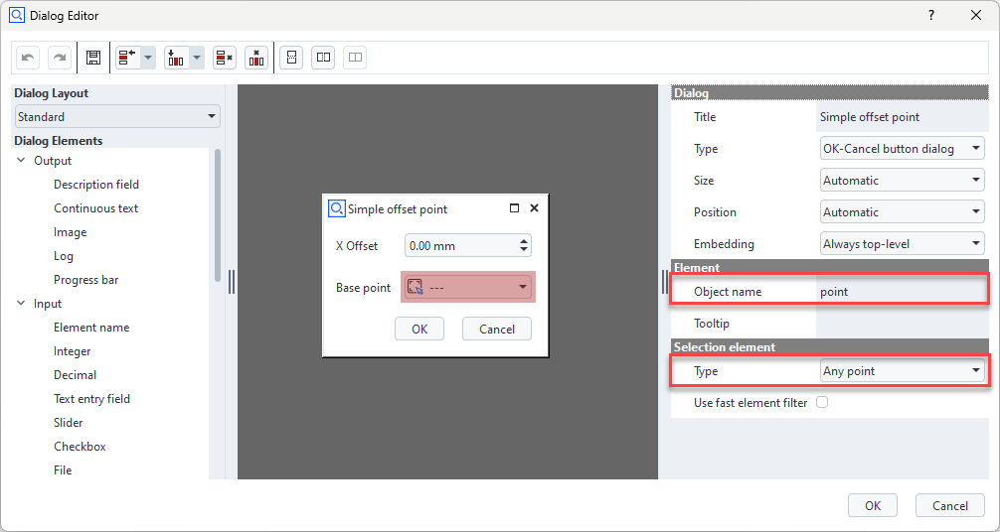
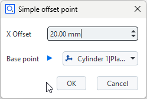

# Scripted actuals


Scripted actual elements (short: scripted actuals), are scripted elements that refer to the actual, e.g. measured state of a geometrical object. Therefore, they appear in the "Actual Element" category of the ZEISS INSPECT Element Explorer.

In this how-to, the creation of a very basic point element is presented to show how scripted actuals are developed by example.

## Example: Simple offset point

Assume we want to create a scripted point. A point, whose position is just offset by a couple of millimeters from another point. Though the use of such element is clearly limited, it serves as an easy example on the general approach.

As explained in the previous chapter, at first we select the element type in the script properties. For our offset-point, we naturally choose "Actual element" -> "Point".


Then, we write the code, which needs a `dialog` and a `calculation` function. Let's begin with the `dialog` function.

### `dialog`

```{code-block} python
---
linenos:
---
def dialog(context, params):

	DIALOG=gom.script.sys.create_user_defined_dialog (dialog={ <Dialog JSON code>})

	if 'x' in params:
		DIALOG.i_x.value = params['x']
	if 'base' in params:
		DIALOG.point.value = params['base']

	RESULT=gom.script.sys.show_user_defined_dialog (dialog=DIALOG)
	
	params['x'] = DIALOG.i_x.value
	params['base'] = DIALOG.point.value
	
	context.name = 'My scripted point'
	return params
```

As you can see, the function takes the parameters `context` and `params`. Although the `context` object has several members, for now we will only use it to set a name for our scripted element (line 15). The main objective of our dialog function is to fill the second parameter, the `params` map (python type: dictionary).

In this case, we want to ask the user on which point our offset-point should be based on, and by how much the point should be offset. We create a [User-defined dialog](../user_defined_dialogs/user_defined_dialogs.md) and in the Dialog Editor, we add two input widgets:

* `Input -> Decimal`: a decimal widget for the offset input
* `Selection -> Selection element`: an element widget to select a point-like element



It's important to note the widgets' *Object name*s, so we can adress them in the code. Second, it's important to set the "Type" of the selection element widget to `Any point`, so the user gets only the choice between elements that offer some point information.

When finished with dialog creation, we have our desired JSON code, which we can use as a parameter for the `gom.script.sys.create_user_defined_dialog` command (line 3). This gives as a `DIALOG` handle, which we will use further.

In case the `dialog` function is called from "Edit creation parameters", e.g the user wants to change parameters after the element was already created, the `params` map is not empty. Instead, it holds the *command parameters* from the last creation. Hence, we should prefill our DIALOG's widgets with the current values (see line 5 to 8). We can access the values of the widgets using the dialog handle and widgets' object names: `DIALOG.<widget name>.value`.

Then, the dialog is shown to the user (line 10) and afterwards the results are collected (lines 12/13). After setting the element name, the parameters are returned. The framework then continues to call the `calculation` function.

### `calculation`

In most applications, the tricky part probably comes now, where you could solve complex mathematical problems to compute your final element values as necessary.
However, in this example, things are easy. 

```{code-block} python
---
linenos:
---
def calculation(context, params):

  base = params['base'].center_coordinate
  context.result[0] = (base.x + params['x'], base.y, base.z)

  return True
```

The parameters of the `calculation` function are again `context` and `params`. From the `params`, we can access the selected point element using `params['base']`.
What we get is a `gom.Reference` to the element the user selected. We can now [access the element's properties](../python_api_introduction/python_api_introduction.md#access-element-properties), such as the `center_coordinate`.

Finally, we have to fill the `context.result` member. Depending on the scripted element type we want to create, it takes different formats.
As described in the [Scripted elements API reference](../../python_api/scripted_elements_api.md), a point element takes a coordinate tuple `(x, y, z)`.
The result for stage `0` (we ignore other stages for this example) is set in line 4. We return `True` to indicate the computation went fine.

### Running the example

That's it! When we now run the example, the dialog appears, we can select base point and offset value. 



After clicking "OK", a "My scripted point" element is created and visible in the explorer.


## Further reading

Now you've grasped the basic concept of scripted actuals. However, there are some relevant topics missing to complete a fully-integrated experience of a scripted actual. E.g. you might have noticed that we did not cover:

* Error handling during calculation
* Letting the user choose an element name in the dialog
* Handling multiple stages
* Preview calculation
* ...

To learn about these mechanisms, you should take a look at the more sophisticated App examples in the section <a href="https://github.com/ZEISS/zeiss-inspect-app-examples/blob/main/AppExamples/README.md#scripted_actuals--building-custom-actual-elements-with-python-code">scripted_actuals</a>.

```{seealso}
[Scripted elements API](../../python_api/scripted_elements_api.md)
```
