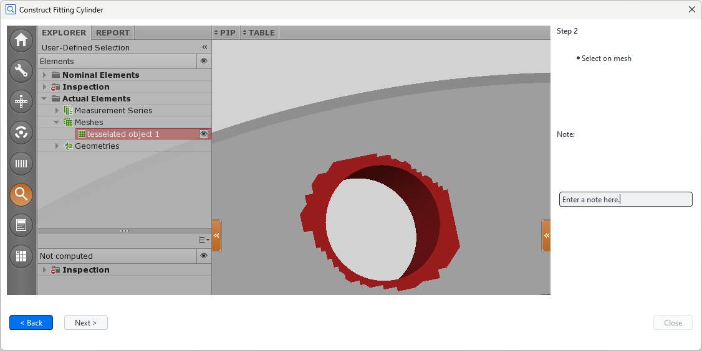
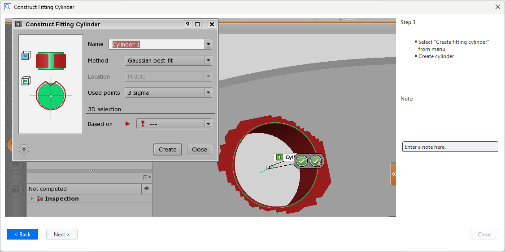
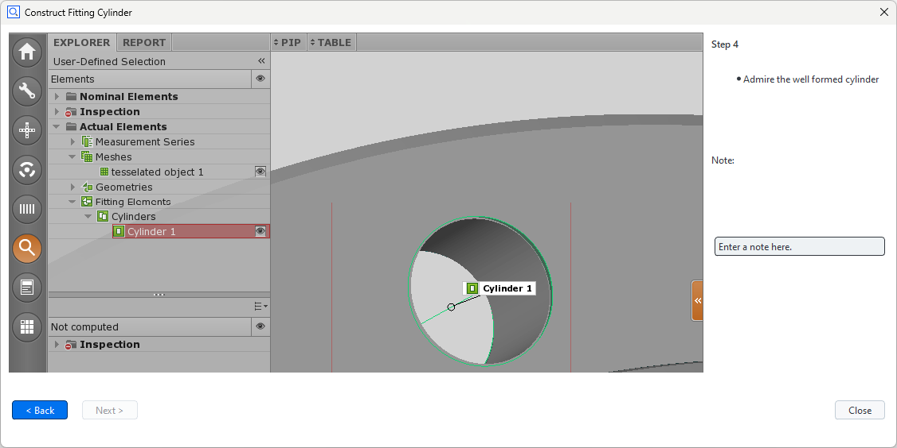

# Creating wizard dialogs (deprecated)

```{caution}
The wizard dialog scheme described in this section has been deprecated in favor of the new [Wizard widget](dialog_widgets.md#wizard-widget), which allows a much easier and more powerful implementation of wizard dialogs.

The concept described below is no longer recommended for new implementations.
```

- [What is a wizard dialog](#what-is-a-wizard-dialog)
- [Creating a simple wizard dialogs](#creating-a-simple-wizard-dialog)
- [Changing the button text](#changing-the-button-text)
- [Creating wizards with different layouts per step](#creating-wizards-with-different-layouts-per-step)
- [Final scripts](#final-scripts)

## What is a wizard dialog

A wizard dialog is a sequence of steps, which guides the user through a process flow. The wizard dialog has a back button to go to the previous step, a next button to proceed with the next step and a Close button to complete the wizard dialog. The wizards layout is created through the scripting dialog editor like any other dialog and its transition logic for going through the steps is specified by a handler function.

💡 Note that it is only possible to change the content of the wizards' widgets in the handler function. This means particularly, that it is not possible to remove or add widgets after the definition of the wizards' layout.

## Creating a simple wizard dialog

The screenshots below show a wizard with three steps, which will be created in this tutorial.

 

 

The wizard has to following properties:

* The wizard's layout consists of an image widget, a text widget, an input widget and the default wizard control elements (**Next**, **Back** , **Close**).
* On script startup the dialog already contains the text and image for the first instruction set.
* If the **Next** or **Back** button is pressed, the corresponding instruction text and image must be displayed.
* To avoid loading the following images from an external source (which would have to be distributed together with the script), the images are encoded in dummy dialogs and read from these sources.
* The dummy dialogs are organized in an array.

Firstly, the wizard dialog and a dummy dialog for each wizard step is created. A dummy dialog holds the content of the wizards widgets for its respective step. The screenshots above show these dummy dialogs.

```Python
#
# create main wizard dialog:
#
DIALOG=gom.script.sys.create_user_defined_dialog (dialog={'...'})

#
# Dummy dialogs containing the images of the corresponding steps encoded in JSON
#
STEP_1=gom.script.sys.create_user_defined_dialog (dialog={'...'})
 
STEP_2=gom.script.sys.create_user_defined_dialog (dialog={'...'})
 
STEP_3=gom.script.sys.create_user_defined_dialog (dialog={'...'})
 
STEP_4=gom.script.sys.create_user_defined_dialog (dialog={'...'})

#
# The dummy dialogs are organized in an array for a simple step transition logic
#
steps = [STEP_1, STEP_2, STEP_3, STEP_4]
```

Note that the wizard dialog and the dummy dialogs have to be non-blocking dialogs. Note also, that the content of STEP_1 and DIALOG are identically. This is necessary, since the content of DIALOG will be overridden in the handler function. Let us create the handler function for managing the step transition:

```Python
count = 0
 
#
# handler function for step transition
#
def handler_func (widget):
    global count
 
    # save input to dummy dialog:
    steps[count].noteInput.value =  DIALOG.noteInput.value
 
    #
    # 'next' button has been pressed
    #
    if widget == DIALOG.control.next:
        if count + 1 < len (steps):
            count += 1
            DIALOG.noteInput.value = steps[count].noteInput.value
            DIALOG.text.text = steps[count].text.text
            DIALOG.image.data = steps[count].image.data
 
    #
    # 'prev' button has been pressed
    #
    elif widget == DIALOG.control.prev:
        if count > 0:
            count -= 1
            DIALOG.noteInput.value = steps[count].noteInput.value
            DIALOG.text.text = steps[count].text.text
            DIALOG.image.data = steps[count].image.data
 
    #
    # Update enabled state of the dialog control elements
    #
    DIALOG.control.prev.enabled = count > 0
    DIALOG.control.next.enabled = count + 1 < len (steps)
    DIALOG.control.close.enabled = count + 1 >= len (steps)
```

Note that `noteInput` is the object name of the text entry field assigned within the scripting dialog editor.
Finally we register the handler function to the dialog and display the wizard dialog:

```Python
DIALOG.handler = handler_func
RESULT=gom.script.sys.show_user_defined_dialog (dialog=DIALOG)
```

## Changing the button text

You can easily change the text of the **Next** and **Back** buttons:

```Python
DIALOG.control.next.text = "randomButtonText"
DIALOG.control.prev.text = "anotherRandomButtonText"
```

## Creating wizards with different layouts per step

Despite the limitations mentioned above, you may use a different layout for each step in the wizard by using a more sophisticated step transition logic. Instead of changing the content of the displayed wizard dialog, you may display another wizard at each step. Let us go through the code necessary for doing that.
First of all we have to define appropriate dialogs:

```Python

DIALOG=gom.script.sys.create_user_defined_dialog (dialog={...Boring dialog definition...})
STEP_2=gom.script.sys.create_user_defined_dialog (dialog={...Boring dialog definition...})
STEP_3=gom.script.sys.create_user_defined_dialog (dialog={...Boring dialog definition...})
STEP_4=gom.script.sys.create_user_defined_dialog (dialog={...Boring dialog definition...})
```

This time, STEP_2, STEP_3 and STEP_4 won´t be simple dummy dialogs used as containers, they have to be wizard dialogs instead. Now let us define the handler function:

```Python
steps = [DIALOG, STEP_2, STEP_3, STEP_4]
inputStrings = ['', '', '', '']
current_step = -1
new_step = 0
 
def handler_func (widget):
    global current_step, new_step
    global current_dialog
 
    if widget == current_dialog.control.next:
        if current_step + 1 < len (steps):
            new_step = current_step +  1
            gom.script.sys.close_user_defined_dialog (dialog=current_dialog)
    elif widget == current_dialog.control.prev:
        if current_step > 0:
            new_step = current_step - 1
            gom.script.sys.close_user_defined_dialog (dialog=current_dialog)
 
 
    current_dialog.control.prev.enabled = current_step > 0
    current_dialog.control.next.enabled = current_step + 1 < len (steps)
    current_dialog.control.close.enabled = current_step + 1 >= len (steps)

```

The basic idea is to close the current dialog if the user hits the **Next** button to proceed to the next dialog step or the **Back** button to return to the previous one. The next code snippet will make it clear:

```Python
while current_step != new_step :
    current_step = new_step
    current_dialog = steps[current_step]
    current_dialog.handler = handler_func
    RESULT=gom.script.sys.show_user_defined_dialog (dialog=current_dialog)
    inputStrings[current_step] = RESULT.noteInput
```

The program will enter the while loop, if the the wizard step changed (or due to initialization) and launch a new dialog. As long as the user clicks **Next** or **Back** in the current dialog, the while loop won't be left and "the" wizard will be displayed. If the user leaves the dialog through **Close**, the while loop will be left and "the" wizard terminates. `noteInput` is the object name of the text entry field within the scripting dialog editor as before. Please note that the `.value` suffix has to be omitted here.

## Final scripts

The following scripts combine the code snippets above. The first one is the single layout wizard, the second one the multi layout wizard.

### Single Layout Wizard

[SingleLayoutWizard.py](assets/SingleLayoutWizard.py)

```Python
# -*- coding: utf-8 -*-

# Script: SingleLayoutWizard.py
 
import gom
 
#
# create main wizard dialog:
#
DIALOG=gom.script.sys.create_user_defined_dialog (dialog={...Boring dialog definition...})

#
# Dummy dialogs containing the images of the corresponding steps encoded in JSON
#
STEP_1=gom.script.sys.create_user_defined_dialog (dialog={...Boring dialog definition...})
 
STEP_2=gom.script.sys.create_user_defined_dialog (dialog={...Boring dialog definition...})
 
STEP_3=gom.script.sys.create_user_defined_dialog (dialog={...Boring dialog definition...})
 
STEP_4=gom.script.sys.create_user_defined_dialog (dialog={...Boring dialog definition...})

#
# The dummy dialogs are organized in an array for a simple step transition logic
#
steps = [STEP_1, STEP_2, STEP_3, STEP_4]
 
count = 0

#
# Registered handler function
#
def handler_func (widget):
    global count
 
    # save input to dummy dialog:
    steps[count].noteInput.value =  DIALOG.noteInput.value

    #
    # 'next' button has been pressed
    #
    if widget == DIALOG.control.next:
        if count + 1 < len (steps):
            count += 1
            DIALOG.noteInput.value = steps[count].noteInput.value
            DIALOG.text.text = steps[count].text.text
            DIALOG.image.data = steps[count].image.data
    #
    # 'prev' button has been pressed
    #
    elif widget == DIALOG.control.prev:
        if count > 0:
            count -= 1
            DIALOG.noteInput.value = steps[count].noteInput.value
            DIALOG.text.text = steps[count].text.text
            DIALOG.image.data = steps[count].image.data
 
    #
    # Update enabled state of the dialog control elements
    #
    DIALOG.control.prev.enabled = count > 0
    DIALOG.control.next.enabled = count + 1 < len (steps)
    DIALOG.control.close.enabled = count + 1 >= len (steps)

DIALOG.handler = handler_func

RESULT=gom.script.sys.show_user_defined_dialog (dialog=DIALOG)
 
# Access dialog input strings:
print( steps[0].noteInput.value )
print( steps[1].noteInput.value )
print( steps[2].noteInput.value )
print( steps[3].noteInput.value )
```

### Multi Layout Wizard

[MultiLayoutWizard.py](assets/MultiLayoutWizard.py)

```Python
# -*- coding: utf-8 -*-

# Script: MultiLayoutWizard
 
import gom
 
DIALOG=gom.script.sys.create_user_defined_dialog (dialog={...Boring dialog definition...})

STEP_2=gom.script.sys.create_user_defined_dialog (dialog={...Boring dialog definition...})
 
STEP_3=gom.script.sys.create_user_defined_dialog (dialog={...Boring dialog definition...})
 
STEP_4=gom.script.sys.create_user_defined_dialog (dialog={...Boring dialog definition...})
 
current_step = -1
new_step = 0
steps = [DIALOG, STEP_2, STEP_3, STEP_4]
inputStrings = ['', '', '', '']

def handler_func (widget):
    global current_step, new_step
    global current_dialog
 
    if widget == current_dialog.control.next:
        if current_step + 1 < len (steps):
            new_step = current_step +  1
            gom.script.sys.close_user_defined_dialog (dialog=current_dialog)
    elif widget == current_dialog.control.prev:
        if current_step > 0:
            new_step = current_step - 1
            gom.script.sys.close_user_defined_dialog (dialog=current_dialog)
 
 
    current_dialog.control.prev.enabled = current_step > 0
    current_dialog.control.next.enabled = current_step + 1 < len (steps)
    current_dialog.control.close.enabled = current_step + 1 >= len (steps)
 
while current_step != new_step :
    current_step = new_step
    current_dialog = steps[current_step]
    current_dialog.handler = handler_func
    RESULT=gom.script.sys.show_user_defined_dialog (dialog=current_dialog)
    print(RESULT.noteInput)
    inputStrings[current_step] = RESULT.noteInput
 
 
# Print out the acquired input:
print(inputStrings[0])
print(inputStrings[1])
print(inputStrings[2])
print(inputStrings[3])
```
