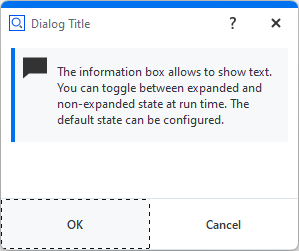
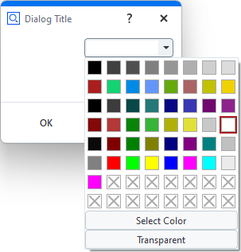
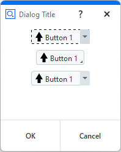
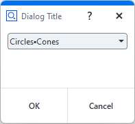
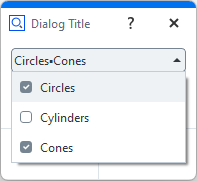
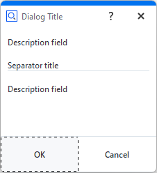
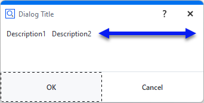
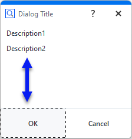
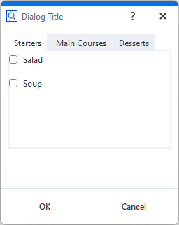
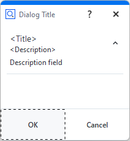

# Dialog widgets

This section gives an overview of the available widgets. If the code examples given in this section are not intuitive to you, you might want to take a look 
into [Executing dialogs](executing_dialogs.md).

- [Determining the widget attributes](#determining-the-widget-attributes)
- [Dialog window control](#dialog-window-control)
    - [Control widget](#control-widget)
    - [Wizards](#wizards)
- [Output](#output)
    - [Description field (label) widget](#description-field-label-widget)
    - [Continuous text widget](#continuous-text-widget)
    - [Image widget](#image-widget)
    - [Information box widget](#information-box-widget) 
    - [Log widget](#log-widget)
    - [Progress-bar widget](#progress-bar-widget)
- [Input](#input)
    - [Integer widget](#integer-widget)
    - [Decimal widget](#decimal-widget)
    - [Text entry field](#text-entry-field)
    - [Slider widget](#slider-widget)
    - [Checkbox widget](#checkbox-widget)
    - [File widget](#file-widget)
    - [Date widget](#date-widget)
    - [Color widget](#color-widget)
    - [Unit widget](#unit-widget)
    - [Element name widget](#element-name-widget)
- [Selection](#selection)
    - [Split button widget](#split-button-widget)
    - [Toggle bar widget](#toggle-bar-widget)
    - [Selection list widget](#selection-list-widget)
    - [Combo box widget](#combo-box-widget)
    - [Selection element widget](#selection-element-widget)
- [Buttons](#buttons)
    - [Button widget](#button-widget)
    - [Radio button widget](#radio-button-widget)
- [Layout](#layout)
    - [Separator line widget](#separator-line-widget)
    - [Horizontal spacer widget](#horizontal-spacer-widget)
    - [Vertical spacer widget](#vertical-spacer-widget)
    - [Tab layout widget](#tab-layout-widget)
    - [Separator layout widget](#separator-layout-widget)
    % Wizard (2026)
- [Other](#other)
    - [Abort button widget](#abort-button-widget)
    - [File system browser widget](#file-system-browser-widget)
    - [File drag&drop area widget](#file-dragdrop-area-widget)
    - [Tolerances widget](#tolerances-widget)

## Determining the widget attributes

```{note}
The widget attributes are documented below. Additionally, information about any widget can be obtained by accessing its `__doc__` string.
```

```{code-block} python
:caption: Print object documentation

#
# Query __doc__ attribute of a button widget
#
print (DIALOG.my_button.__doc__)
# output:
# Handle for a widget called 'my_button' of type 'Button' (button::pushbutton)
#
# Attributes:
# name             (string)              - Name of the widget. The name can be used to access the widget via a dialog handle.
# tooltip          (string)              - Tooltip of the widget. If empty, no tooltip is displayed.
# enabled          (boolean)             - Enabled state of the widget. Default is 'enabled', set to false for disabling it.
# value            (unspecified/various) - The current value of the widget. Type depends on the widget type and can be 'none' for empty widgets.
# attributes       (map)                 - Map of all accessable widget attributes together with their current values.
# focus            (boolean)             - Focus state of the widget. Can be used to set an explicit widget focus.
# text             (string)              - Text of the button
# type             (string)              - Button type ('push', 'toggle')
# icon             (Tom::Parse::Binary)  - Icon of the button
# icon_file_name   (string)              - Source file name of the icon
# icon_size        (string)              - Icon size mode (icon, full)
# icon_type        (string)              - Icon type (none, system, file)
# icon_system_type (string)              - System icon type (ok, cancel, arrow_up, arrow_down, arrow_left, arrow_right)
# icon_system_size (string)              - System icon size (default, large, extra_large)
```

## Dialog window control

### Control widget

```{note}
Each dialog window has a **Control** widget, which contains the **ok** / **cancel** or similar buttons of the dialog.
```

* The control elements of a dialog cannot be configured like other dialog widgets.
* Therefore, their name is fixed and they are grouped together inside of the control widget named **control**.
* The control elements consist of the dialogs lower buttons plus a configurable dialog status label.

| Handle                    | Property                                  | Example                                             |
| ------------------------- | ----------------------------------------- | --------------------------------------------------- |
| DIALOG.control            | Control widget                            | -                                                   |
| DIALOG.control.status     | Status icon of the control widget         | <pre>DIALOG.control.status = 'Point 1 missing'</pre> |
| DIALOG.control.\<button\> | Handle for a button of the control widget | <pre>DIALOG.control.ok.enabled = False</pre>        |

#### Control widget elements

```{note}
The names of the **Control** widget elements are fixed.
```

* Usually, the names are corresponding with the elements' semantics. For example, the name of the **ok** button is 'ok'. The names can also be obtained from the `__doc__` string as shown in the code example below.
* The control elements are accessed like all other widget attributes.

```{code-block} python
:caption: Accessing the control widget

# Print control widget properties<br>print (DIALOG.control.__doc__)
ControlGroup

Attributes:

status (string)              - Status tool tip icon
ok     (unspecified/various) - Control widget
cancel (unspecified/various) - Control widget
```

#### Control button properties

Control buttons only have the following two properties which can be set programmatically:

| Property | Type | Example                                          |
| -------- | ---- | ------------------------------------------------ |
| text     | str  | <pre>DIALOG.control.prev.text = 'Previous'</pre> |
| enabled  | bool | <pre>DIALOG.control.ok.enabled = False</pre>     |

#### Status label

```{hint}
The **Status label** of the control widget is invisible until a status text is set.
```

* If a status text is set, a small warning icon appears, like in regular applications' dialogs.
* The status label can be configured using its properties like all other widgets.


```{code-block} python
:caption: Using the Status label

DIALOG=gom.script.sys.create_user_defined_dialog (file='dialog.gdlg')

# Set status label text
DIALOG.control.status = 'No point selected.'

# Set 'ok' button to disabled<br>DIALOG.control.ok.enabled = False
gom.script.sys.show_user_defined_dialog(dialog = DIALOG)

```

You can reset the status icon and clear the error message by assigning an empty string (`DIALOG.control.status = ''`).

### Wizards

* **Wizards** are dialogs with **\< Back** and **Next \>** buttons at the lower dialog edge.
* The script programmer is responsible for adding functionality to this layout.
* Wizards are not very versatile, but modifying the displayed texts and images is easily possible.

```{warning}
It is not possible to exchange widgets from within a dialog after the dialog has been created!
```

Therefore Wizards only have simple options like exchange of images and texts in those containing elements.

#### Control widgets

The operational elements in a control widget from a wizard do act like those in regular dialogs und can be accessed via handles as well:


```{code-block} python
:caption: Wizard example

#
# Create dialog with wizard control panel
#
DIALOG=gom.script.sys.create_user_defined_dialog (file='dialog.gdlg')
#
# Handler function to be registered to the dialog
#
def func (widget):
    #
    # Handle clicks onto the 'prev' button
    #
    if widget == DIALOG.control.prev:
        # Here you would write code to display the content of the previous wizard 'page'
        
        #
        # Handle clicks onto the 'next' button
        #
        print("Prev button was clicked.")
    elif widget == DIALOG.control.next:
        # Here you would write code to display the content of the next wizard 'page'
        
        #
        # Update dialog button enabled state and register handler function
        #
        print("Next button was clicked.")

DIALOG.handler = func

#
# Execute wizard dialog
#
RESULT=gom.script.sys.show_user_defined_dialog (dialog=DIALOG)
```

[Creating wizard dialogs](creating_wizard_dialogs.md) shows some ways to manage wizard dialogs in greater detail.

## Common widget attributes

The following attributes are common to all widgets listed in the following sections:

* [Output](#output)
* [Input](#input)
* [Selection](#selection)
* [Buttons](#buttons)
* [Layout](#layout)
* [Other](#other)

name (string)
: Name of the widget. The name can be used to access the widget via a dialog handle.

tooltip    (string)              
: Tooltip of the widget. If empty, no tooltip is displayed.

enabled    (boolean)
: Enabled state of the widget. Default is 'enabled', set to false for disabling it.

value      (unspecified/various)
: The current value of the widget. Type depends on the widget type and can be 'none' for empty widgets.

attributes (map)
: Map of all accessable widget attributes together with their current values.

focus      (boolean)
: Focus state of the widget. Can be used to set an explicit widget focus.

visible    (boolean)
: Visible state of the widget. Default is 'visible', set to false for setting it invisible.

handler    (unspecified/various)
: Individual event handler of the widget. If empty or no valid function, the dialog event handler is called instead. See [Executing dialogs &ndash; Event handler functions](executing_dialogs.md#event-handler-functions).

### Example

```{code-block} python
DIALOG=gom.script.sys.create_user_defined_dialog (file='dialog.gdlg')

#
# Event handler function called if anything happens inside of the dialog
#
def dialog_event_handler (widget):
	if widget == 'initialize':
		DIALOG.input.tooltip = 'Enter distance in mm'
		DIALOG.control.ok.enabled = False
	if widget == DIALOG.input:
        print(f"'{widget.name}' widget event")
		if DIALOG.input.value > 0:
			DIALOG.control.ok.enabled = True

DIALOG.handler = dialog_event_handler

RESULT=gom.script.sys.show_user_defined_dialog (dialog=DIALOG)
```

## Output

### Description field (label) widget


Description field (label) widget
: The Description field (label) widget allows to display static text. It is typically used for labelling a section or an individual element of a dialog.

text (string)
: Label text
                                                                                                  
word_wrap  (boolean)
: Word wrap
 
### Continuous text widget


Continuous text widget
: The Continuous text widget allows to display static text and keywords. A double click onto a text field widget opens the content editor. Some formatting can be applied.


text (string)
: Continuous text widget contents

word_wrap  (boolean)
: Word wrap

default_font_family (string)
: Default font name

default_font_size (integer)
: Default font size

```{code-block} python
:caption: Continuous text widget attributes example

DIALOG.text = "How to become a professional metrologist"
DIALOG.text.default_font = 'Arial Black'
DIALOG.text.default_font_size = 16
```

| Editor                     | Dialog                      |
| -------------------------- | --------------------------- |
|   |  |


% * The keywords displayed in text field widgets can originate from different source:
%
%     * Global application keywords
%
%     * project related keywords
%
%     * local script variables.
%
% ⚠️ Local script variables can be displayed in text fields by inserting them via the 'insert expression' dialog.
%
%  * Local script variables are invalid until the variable assignment is reached. They cannot be displayed statically in the text
%  field editor prior to script execution, so an invalid value will most certainly be displayed instead.
% 
% To Do: Check how to insert local variables


#### Displaying keywords in a continuous text widget

A keyword can be inserted into the text with the following procedure:

1. RMB ► 'Insert Expression...'

    

2. Select 'Insert Keyword' button

    

3. Select the desired keyword from the tree

    

4. The keyword and its actual value are shown

    

    ```{hint}
    The comment '#@ Not yet named' should be deleted, otherwise the selected keyword 'Date' will not be shown in the editor.
    ```

5. The final rendering of the text widget

    

#### Internal representation of a dialog with text widget

The dialog is stored as a JSON document internally.


```{code-block} python
:caption: Internal representation of a dialog

gom.script.sys.execute_user_defined_dialog (dialog={
    "content": [
        [
            {
                ...
            },
            {
                "columns": 1,
                "default_font_family": "",
                "default_font_size": 0,
                "name": "text",
                "rows": 1,
                "text": {
                    "id": "",
                    "text": "\<html\>\<p align=\"center\"\>By clicking 'Close', the dialog will be closed.\</p\>\</html\>",
                    "translatable": True
                },
                                ...
                "type": "display::text",
                "wordwrap": False
            }
        ]
    ],
    "control": {
        "id": "Close"
    },
        ...
})
```

### Image widget


Image widget
: The Image widget allows to display arbitrary images.

use_system_image (bool)
: Use system image instead of a user defined custom image

system_image       (string)
: Name of the system image to display. Valid names are: 'system_message_information', 'system_message_warning', 'system_message_critical', 'system_message_question'.

data             (QImage)
: Custom image data to be displayed

file_name          (string)
: Source file name of the image (read-only)

keep_original_size (boolean)
: Keep original image size (read-only)

keep_aspect        (boolean)
: Keep original image aspect ratio (read-only)

width
: Image width (read-only)                                                                                                                                              

height
: Image height (read-only)

Note that you can switch from a system image to a user image using the property `use_system_image`. But this user image must have been selected beforehand in the designer. You cannot read a new image file by setting the `filename` property. Also, all of the image formatting properties (`keep_original_size`, `keep_aspect`, `width`, `height`) only work in the designer. From the script you can only read these values. Although you cannot read images using the `filename` property you can copy images from one dialog to another using the `data` property. So you are able to prepare (create) a dialog as an image container holding several images. You can then use this image container dialog to copy the image you need to an actually displayed dialog.

#### Internal representation of a dialog with image widget

The dialog is stored as a JSON document internally. The 'data' element contains the image data.

```{code-block} python
:caption: Internal representation of an image

# The 'data' element contains the image data (shortened version here)
RESULT=gom.script.sys.execute_user_defined_dialog (dialog={
    "content": [
        [
            {
                "columns": 1,
                "data": "AAAAAYlQTkcNChoKAAAADUlIRFIAAAQAAAACQAgCAAAAnPeDgptZSsdt...",
                "file_name": "C:/Users/IQMPRINK/Downloads/zeiss-inspect_python.jpg",
                "height": 144,
                "keep_aspect": True,
                "keep_original_size": False,
                "name": "image",
                "rows": 1,
                "system_image": "system_message_information",
                "tooltip": {
                    "id": "",
                    "text": "",
                    "translatable": True
                },
                "type": "image",
                "use_system_image": False,
                "width": 256
            }
        ]
    ],
    "control": {
        "id": "Close"
    },
    "embedding": "always_toplevel",
    "position": "automatic",
    "size": {
        "height": 233,
        "width": 292
    },
    "sizemode": "automatic",
    "style": "",
    "title": {
        "id": "",
        "text": "Dialog with image",
        "translatable": True
    }
})
```

### Information box widget


Collapsed\


Expanded\


Information box widget
: The Information box widget allows to show text. You can toggle between expanded and collapsed state at run time. The default state can be configured.

text       (string)              
: Information text

expanded   (boolean)
: Initial expanded state

### Log widget


Log widget
: The Log widget can display multiple lines of unformatted text, which can be easily saved to a text file by clicking the save button.

text                 (string)
: Log text

word_wrap            (boolean)
: Wrap log text

show_save            (boolean)
: Show save button

save_dialog_title    (string)
: Title of the save dialog

scroll_automatically (boolean)
: Scroll to end of text when new lines are added

monospace            (boolean)
: Use monospace font

### Progress bar widget


Progress bar widget
: The Progress bar widget can be used in the two modes _system_ and _manual_.

value      (integer)
: Current value                                                                                                     

minimum    (integer)
: Minimum value                                                                                                     

maximum    (integer)
: Maximum value                                                                                                     

parts      (integer)
: Progress bar parts                                                                                                

step       (integer)
: Current progress bar step                                                                                         

text       (string)
: Progress bar text mode (none, percentage, step)                                                                   

mode       (string)
: Progress bar mode (system, manual)

Manual mode
: In this mode, the user may set the progress bar through its `value` variable.

    ```{code-block} python
    :caption: Progress bar widget example &ndash; manual mode

    import gom, time
    DIALOG=gom.script.sys.create_user_defined_dialog (file='dialog.gdlg')
    DIALOG.progress.minimum = 0
    DIALOG.progress.maximum = 100
    gom.script.sys.open_user_defined_dialog( dialog = DIALOG )
    DIALOG.progress.value = 0
    time.sleep(1)
    DIALOG.progress.value = 33
    time.sleep(1)
    DIALOG.progress.value = 66
    time.sleep(1)
    DIALOG.progress.value = 100
    gom.script.sys.close_user_defined_dialog (dialog=DIALOG)
    ```

System mode
: In this mode, the progress bar displays the same progress informations as the progress bar in the lower right corner of the software.

    ```{code-block} python
    :caption: Progress bar widget example &ndash; system mode

    import gom
    DIALOG=gom.script.sys.create_user_defined_dialog (file='dialog.gdlg')
    gom.script.sys.open_user_defined_dialog (dialog=DIALOG)
    gom.script.sys.create_project ()
    gom.script.sys.import_project (file='some project')
    gom.script.sys.close_user_defined_dialog (dialog=DIALOG)
    ```

You can switch between automatic and manual mode from within the script by setting the mode variable as shown below:

```{code-block} python
:caption: Changing the progress bar widget mode

# manual mode:
DIALOG.progress.mode = "manual"

# system mode:
DIALOG.progress.mode = "system"
```

Partially controlled system progress bar
: The range of a system progress bar can be divided into parts, sequentially controlled by an executed command.
  * The progress bar range can be split into multiple parts.
  * Each part controls an equally sized progress bar interval. If, for example, there are 3 parts, the first part ranges from 0 to 33, the second from 33 to 66 and the third from 66 to 100.
  * When a command is executed, the command controls just the one active part of the progress bar widget.

  

  ```{code-block} python
  :caption: Progress bar consisting of multiple parts

  # -*- coding: utf-8 -*-

  import gom

  # Create a user defined dialog with a progress bar, mode 'system'
  DIALOG=gom.script.sys.create_user_defined_dialog (file='dialog.gdlg')
  gom.script.sys.open_user_defined_dialog( dialog = DIALOG )

  # Split progress bar into 3 parts
  DIALOG.progress.parts = 3

  # Current part is the first interval (part '0', because we are counting from '0')
  DIALOG.progress.step = 0

  # Execute load command. The command will control the first progress bar range from 0% to 33%.
  # That means when the command has been finished, the progress bar will display '33%'.
  gom.script.sys.load_project (file='some project')

  # Current part is the second interval. The progress bar runs from 33% to 66%
  DIALOG.progress.step = 1

  gom.script.sys.switch_to_report_workspace ()
  gom.script.report.update_report_page (
  pages=gom.app.project.reports,
  switch_alignment=True,
  switch_stage=False)

  # Current part is the third interval. The progress bar runs from 66% to 100%
  DIALOG.progress.step = 2

  gom.script.sys.switch_to_inspection_workspace ()
  gom.script.sys.recalculate_all_elements ()
  ```

```{note}
It is possible to switch between system and manual mode for each part.
```

## Input

### Integer widget


Integer widget
: The Integer widget is used to request an integer value from the user. `integerWidget` is the object name of the integer widget in the example below.

value      (integer)
: The current input value

minimum    (double)
: Minimum possible value

maximum    (double)
: Maximum possible value


``` python
RESULT=gom.script.sys.execute_user_defined_dialog (file='dialog.gdlg')
userInput = RESULT.integerWidget
```

### Decimal widget


Decimal widget
: The Decimal widget is used to request a floating point value from the user. It is possible to choose the number of digits and a unit. The selectable units are the ones from the user preferences (Edit \> Application \> Settings \> Preferences) in the _Default units_ tab. `decimalWidget` is the object name of the decimal widget in the example below.

value             (double)
: The current input value

minimum           (double)
: Minimum possible value

maximum           (double)
: Maximum possible value

precision         (double)
: Value precision (number of decimals)

unit              (string)
: Unit ID

default_precision (boolean)
: Use default precision                                                                                             

background_style  (string)
: Style sheet based background color (red, green, blue) 

```{code-block} python
:caption: Decimal widget example

RESULT=gom.script.sys.execute_user_defined_dialog (file='dialog.gdlg')
userInput = RESULT.decimalWidget
```

```{code-block} python
:caption: Decimal widget attributes example

DIALOG.decimalWidget.precision = 2
DIALOG.decimalWidget.unit = 'LENGTH'
```

% No visible effect:
% background_style - str - Set style sheet based background color  - red, green, blue 

```{hint}
See [Tech Guide: What are the Possibilities for Unit Conversions Usable in Scripts?](https://techguide.zeiss.com/en/zeiss-inspect-2026/article/faq_what_are_the_possibilities_for_unit_conversion_usable_in_scripts.html) for available units.
```

### Text entry field


Text entry field
: The Text entry field widget can be used to get string input from the user. A simple use case is given by the next code block. `textEntryWidget` is the object name of the widget in the example below.


value      (string)
: The current input value
             
read_only  (boolean)
: Read only                                                                                                         

password   (boolean)
: Password; hide input

% Usage?
% validator  (Tom::GScript::Callable) - Input validator

```{code-block} python
:caption: Text entry field example

DIALOG=gom.script.sys.create_user_defined_dialog (file='dialog.gdlg')
DIALOG.textEntryWidget = "some default text"
RESULT = gom.script.sys.show_user_defined_dialog(dialog = DIALOG)
print( RESULT.textEntryWidget ) # the user input string
```

### Slider widget


Slider widget
: The Slider widget can be used to get a float value from a certain interval from the user. `sliderWidget` is the object name of the slider widget in the example below.

value         (double)
: The current value

minimum       (double)
: Minimum possible value                                                                                            

maximum       (double)
: Maximum possible value                                                                                            

precision     (double)
: Value precision (number of decimals)

step          (double)
: Amount of increase/decrease with each step                                                                        

% tick_interval (double)
% : Interval of ticks drawn                                                                                           
% ticks are not drawn

orientation   (string)
: Widget orientation ('horizontal' or 'vertical')

```{code-block} python
:caption: Slider widget example

DIALOG=gom.script.sys.create_user_defined_dialog (file='dialog.gdlg')

RESULT = gom.script.sys.show_user_defined_dialog (dialog=DIALOG)
print( RESULT.sliderWidget ) # some text
```

### Checkbox widget


Checkbox widget
: The Checkbox widget can be used to get boolean input from the user. `checkboxWidget` is the object name of the checkbox widget in the example below.

value      (boolean) 
: The current value          

title      (string)
: Title of the checkbox

style      (string)
: Style of the checkbox

```{code-block} python
:caption: Checkbox widget example

DIALOG=gom.script.sys.create_user_defined_dialog (file='dialog.gdlg')

RESULT=gom.script.sys.show_user_defined_dialog (dialog=DIALOG)
print (RESULT.checkboxWidget)
```

### File widget


File widget
: By clicking the File widget, a file selection dialog is opened. This allows to select a file from the file system.

value          (unspecified/various)
: The current value of the widget

file           (string)
: Selected file                                                                                                     

type           (string)
: File type: 'any' (any file), 'new' (not an existing file), 'file' (an existing file), 'multi_file' (multiple existing files), 'directory' (an existing directory)

% Clarify this:
% selection_type (string)
% : File selector type (any, directory, executable, file, multi_file)

title          (string)
: File selector dialog title         

default        (string)
: Default value                                                                                                     

limited        (boolean)
: Flag for limited file types                                                                                       

file_types     (list)
: List of allowed file types;  each list item must consist of `[<filename_extension>, <description>]`.  `limited` must be set to `True` in order to apply the filter!

### Date widget


Date widget
: The Date widget requests a date from the user. `dateWidget` is the object name of the date widget in the example below.

value             (string):
: The current value

use_current_date  (boolean)
: Flag for initializing with default date

default_date      (QDate)
: Default date                                                                                                      

year              (integer)
: Year                                                                                                              

month             (integer)
: Month                                                                                                             

day               (integer)
: Day                                                                                                               

show_today_button (boolean)
: Show button for setting the current date

```{code-block} python
:caption: Date widget example

DIALOG=gom.script.sys.create_user_defined_dialog (file='dialog.gdlg')
dateObject = DIALOG.dateWidget.value # date object
print( DIALOG.dateWidget.year )  # integer
print( DIALOG.dateWidget.month ) # integer
print( DIALOG.dateWidget.day )   # integer
```

### Color widget



Color widget
: The Color widget allows to select a color. `colorWidget` is the object name of the color widget in the example below. `gomColor` behaves in the same way as `gom.Color( ... )`.

value                (object)
: The current color value (gom.Color object)

color                (QColor)
: The current selected color value (gom.Color object)                                                                                        

transparency_allowed (boolean)
: Transparency allowed 

```{code-block} python
:caption: Color widget example

DIALOG=gom.script.sys.create_user_defined_dialog (file='dialog.gdlg')

#
# Event handler function called if anything happens inside of the dialog
#
def dialog_event_handler (widget):
    if widget == DIALOG.colorWidget:
        gomColor = DIALOG.colorWidget.color
        print( gomColor) # output: gom.Color (#ffffffff)

DIALOG.handler = dialog_event_handler

RESULT=gom.script.sys.show_user_defined_dialog (dialog=DIALOG)
print('Selection:', RESULT.colorWidget) # example output (white): 0xffffffff
```

### Unit widget


Unit widget
: The Unit widget allows to select a unit. `unitWidget` is the object name of the unit widget in the example below.

value
: The current unit

```{hint}
See [Tech Guide: What are the Possibilities for Unit Conversions Usable in Scripts?](https://techguide.zeiss.com/en/zeiss-inspect-2026/article/faq_what_are_the_possibilities_for_unit_conversion_usable_in_scripts.html) for available units.
```

```{code-block} python
:caption: Unit widget example

DIALOG=gom.script.sys.create_user_defined_dialog (file='dialog.gdlg')

#
# Event handler function called if anything happens inside of the dialog
#
def dialog_event_handler (widget):
    if widget == DIALOG.unitWidget:
        unit = DIALOG.unitWidget.value
        print( unit) # ANGLE

DIALOG.handler = dialog_event_handler

RESULT=gom.script.sys.show_user_defined_dialog (dialog=DIALOG)
```

### Element name widget


Element name widget
: The Element name widget is used to request an element name from the user. It is possible to select the default name (according to naming scheme, e.g. 'Point 2' if 'Point 1' already exists), or to enter an arbitrary name. `elementnameWidget` is the object name of the element name widget in the example below.

value      (unspecified/various)
: The current value

basename   (string)
: Base name (e.g. 'Point')

mode       (string)
: Mode to get the name suggestion from: (manually, from_element_type, check_like)

% Usage?
%numbering  (Tom::Reference)
%: Element

% Usage?
%element    (Tom::Reference)
%: Element

% Usage?
% validator  (Tom::GScript::Callable) - Input validator

read_only  (boolean)
: Read only  

```{code-block} python
:caption: Element name widget example

# Let the user define 3 new points (the coordinates are created automatically in this example)
for i in range(3):
    DIALOG=gom.script.sys.create_user_defined_dialog (dialog='dialog definition')
    
    #
    # Event handler function called if anything happens inside of the dialog
    #
    def dialog_event_handler (widget):
        pass
    
    DIALOG.handler = dialog_event_handler
    
    RESULT=gom.script.sys.show_user_defined_dialog (dialog=DIALOG)
    
    print (RESULT.elementnameWidget)
    
    MCAD_ELEMENT=gom.script.primitive.create_point (
        name=RESULT.elementnameWidget,
        point={'point': gom.Vec3d (i+10.0, 0.0, 0.0)}
    )
```

## Selection

### Split button widget


Three split button widgets with modes 'menu', 'instant' and 'tool', respectively.\
The top widget has focus. The arrows are just examples for icons.\


Split button widget
: A split button is a hybrid between a button and an options menu. Each item consist of text and/or an icon. One of the modes 'instant', 'menu' or 'tool' can be configured.

value      (integer)
: Index of pressed button

items      (list)
: List of lists defining items [[string, base64]]

texts      (list)
: List of texts for items [string]

icons      (list)
: List of icons for items [base64]

mode       (string)
: Button mode ('instant', 'menu', 'tool')

'instant' mode
: You must open the menu to click a button. The initial button remains fixed.

'menu' mode
: You can click the initial button immediately or open the menu to click any available button. The initial button remains fixed.

'tool' mode
: You can click the initial button immediately or open the menu to click any available button. The initial button changes to the clicked button. 

### Toggle bar widget


Toggle bar widget
: The toggle bar widget allows to select one of several items. Each item consists of text and/or an icon.

value      (integer)
:  Index of selected item

items      (list)
: List of lists defining items [[string, base64, string]]                                                           

texts      (list)
: List of texts for items [string]                                                                                  

icons      (list)
: List of icons for items [base64]                                                                                  

tooltips   (list)
: List of tooltips for items [string]                                                                               

style      (string)
: Style of buttons ('icon', 'text', 'icon_and_text')

mode       (string)
: Label mode for button group ('no_label', 'label')

### Selection element widget


Selection element widget
: The Selection element widget can be used to select the elements from the element explorer. The following element types can be chosen:
  * Any Point
  * Point element
  * Line element
  * Plane element
  * Direction
  * User-defined

value       (special)
: The current selected element. May also be `None` for user-defined `filter` and `use_not_defined`

supplier    (string)
: Type of elements handled by this widget (any, points, lines, planes, directions, coordinate_systems, custom)      

filter      (function)
: Element filter function for custom type element selector widgets                                                  

fast_filter (function)
: Faster element filter function for custom type element selector widgets. Switch expected filter function signature, bulk vs. single element:
* `True`: List of elements → Iterable of bools
* `False`: Single element → bool (default)

use_not_defined (boolean)
: Enable to initially show an empty choice for user-defined filter functions, i.e. like the other element types. (default: 'False')

`elementSelectionWidget` is the object name of the element selection widget in the example below.

```{code-block} python
:caption: Selection element widget example

DIALOG=gom.script.sys.execute_user_defined_dialog (dialog='dialog.gdlg')

selectedElement = DIALOG.elementSelectionWidget
print(selectedElement.value ) # output: gom.app.project.inspection['Equidistant Surface Points 1']
```

The following script shows how to use a custom filter for element selection. The example filter allows the user to select a system plane:

```{code-block} python
:caption: Selection element widget with custom filter

DIALOG4 = gom.script.sys.create_user_defined_dialog(file='dialog.gdlg')


def dialog_event_handler(widget):
    pass

# filter system planes
def element_filter(element) -> bool:
    try:
        if element.type == 'plane':
            return True
    except Exception as e:
        pass
    return False

DIALOG4.handler = dialog_event_handler
DIALOG4.input_new.filter = element_filter

# Alternative: use fast filtering
# from typing import Iterable
#
# def fast_element_filter(*elements) -> Iterable[bool]:
#     return [element_filter(e) for e in elements]
#
# DIALOG4.input_new.fast_filter = True
# DIALOG4.input_new.filter = fast_element_filter

RESULT = gom.script.sys.show_user_defined_dialog(dialog=DIALOG4)

print('Chosen system plane: ', RESULT.input_new.name)
```

Please find the complete example here: [dialog_custom_elem_select.py](assets/dialog_custom_elem_select.py)

### Selection list widget


Selection list widget
: The Selection list widget allows to make a selection from a predefined set of options. The selected item can be accessed from a script through its object name (e.g. `selectionListWidget`) as follows.

value      (string)
: The current value

index (integer)
: Index of selected list item

items      (list)
: List of items 

```{code-block} python
:caption: Selection list widget attributes example

selectedValue = DIALOG.selectionListWidget.value
selectedIndex = DIALOG.selectionListWidget.index
print( selectedValue ) # output: entry2
print( selectedIndex ) # output: 1
```            

### Combo box widget




Selection in progress\


Combo box widget
: The combo box allows to select multiple items from a list. Each item consists of text and data (represented as string).

value      (list)
: List of selected items (data)

items      (list)
: List of available items (display text, data)

```{code-block} python
:caption: Combo box widget attributes example

# Assign a list of selected data items
DIALOG.shape_list.value = ['circles', 'cones']
```

## Buttons

### Button widget


Button widget
: The Button widget allows to trigger an event or to return a boolean value, respectively. There are two types of buttons: push buttons and toggle buttons. The push button is a regular button and needs an event handler to manage its action. The toggle button has two states - active and inactive - and the user can toggle between them by clicking the button. The button is highlighted in active state as shown in the screenshot. The state of the toggle button can be accessed as follows.

``` python
toggleButtonState = DIALOG.toggleButtonWidget.value
print(toggleButtonState) # output: True
```

The buttons size and icon can be changed in the Dialog Editor.

| Property         | Type | Example                                                                                                               |
| ---------------- | ---- | --------------------------------------------------------------------------------------------------------------------- |
| tooltip          | str  | <pre>DIALOG.button.tooltip = 'Click to start evaluation'</pre>                                                        |
| enabled          | bool | <pre>DIALOG.button.enabled = False                                                                                    |
| value            | bool | <pre>if DIALOG.button.value:</pre>💡 Only for toggle button!                                                          |
| text             | str  | <pre>DIALOG.button.text = 'Click here!'                                                                               |
| type             | str  | <pre># Possible values: 'push', 'toggle'<br>DIALOG.button.type = 'toggle'<br>DIALOG.button.value = True</pre>         |
| icon_type        | str  | <pre># Possible values: 'none', 'file', 'system'<br># but see remark below!<br>DIALOG.button.icon_type = 'none'</pre> |
| icon_system_type | str  | <pre># Possible values: 'ok', 'cancel',<br># 'arrow_left', 'arrow_right', 'arrow_up', 'arrow_down'<br>DIALOG.button.icon_system_type = 'ok'</pre> |
| icon_system_size | str  | <pre># Possible values: 'default', 'large', 'extra_large'<br>DIALOG.button.icon_system_size = 'extra_large'</pre>     |
| visible          | bool | <pre>DIALOG.button.visible = False

```{note}
There are also values for file icons. These only work straightforward using the dialog designer but not from a script. You can only change between no icon and system icons in a straightforward way.
```

### Radio button widget


Radio button widget
:  The Radio button widget enables the user to choose an option from a predefined set. Each option has a label and a unique ID, which both can be set in the scripting dialog editor by double clicking the widget. The IDs are 'ONE', 'TWO' and 'THREE' in the example below.

``` python
selectedChoice = DIALOG.radiobuttonsWidget.value
print( selectedChoice ) # output: ONE

if selectedChoice == 'ONE':
    print("IDs are strings.") # output: IDs are strings.
```

| Property | Type           | Example                                                                                                               |
| -------- | -------------- | --------------------------------------------------------------------------------------------------------------------- |
| tooltip  | str            | <pre>DIALOG.radiobuttons.tooltip = 'Choose one alternative!'</pre>                                                    |
| enabled  | bool           | <pre>DIALOG.radiobuttons.enabled = False</pre>                                                                        |
| value    | str            | <pre>DIALOG.radiobuttons.value = 'Value3'</pre>                                                                       |
| visible  | bool           | <pre>DIALOG.radiobuttons.visible = False</pre>                                                                        |
| items    | (special list) | <pre># Possible values is a list of lists of two strings.<br># Each first string is the returned value<br># Each second string is the entries' title<br>DIALOG.radiobuttons.items = [['Value1', 'Title1'], ['Value2', 'Title2'], ['Value3', 'Title3']]<br>DIALOG.radiobuttons.default = 'Value2'</pre> |
| default  | str            | <pre>DIALOG.radiobuttons.default = 'Value1'</pre>                                                                     |

## Layout

### Separator line widget



Separator line widget
: The separator line widget provides a horizontal line with an optional title.

### Horizontal spacer widget



Horizontal spacer widget
: The horizontal spacer widget claims the space specified by `minimum_size` (default: 0) and `maximum_size` (default: -1, i.e. unlimited). The actual widget is not visible.

### Vertical spacer widget



Vertical spacer widget
: The vertical spacer claims the space specified by `minimum_size` (default: 0) and `maximum_size` (default: -1, i.e. unlimited). The actual widget is not visible.

### Tab layout widget


 

Tab layout widget
: The Tab layout widget provides a configurable number of tabs. Each tab serves as container for any number and types of widgets.

`current_tab` (integer)
: Index of current tab                                                                                              

`tabs` (list)
: List of tab titles 

### Separator layout widget


Collapsed\


Expanded (contains a single description field widget)\


Separator layout widget
: The saparator layout widget serves as a container for any number of widgets. Its contents can be collapsed or expanded. It provides titel, desciption and icon as optional features.

`title` (string)
: Title text                                                                                                        

`description` (string)
: Description text                                                                                                  

`icon` (string)                                                                                                             
: System icon or user icon imported from file. Icons are stored as base64-encoded strings.

`expanded` (boolean)
: True: Layout is initially expanded 

## Other

### Abort button widget


Abort button widget
: The Abort button widget aborts the current action. It is disabled if no action is currently executed. It behaves in the same manner as the abort button in the lower right corner of the ZEISS INSPECT software.


% To Do: Add enabled abort button. Check if the button still exists in ZEISS INSPECT.

### File system browser widget


File system browser widget
: The File system browser widget allows to view the file system and to select a file or a set of files, respectively. A filter can be set to show only files with certain filename extensions.

| Property           | Type                  | Example                                                                                |
| ------------------ | --------------------- | -------------------------------------------------------------------------------------- |
| tooltip            | str                   | <pre>DIALOG.filesystemWidget.tooltip = 'Select CAD file'</pre>                         |
| enabled            | bool                  | <pre>DIALOG.filesystemWidget.enabled = False</pre>                                     |
| value              | (unspecified/various) |  The current value of the widget. Type depends on the widget type and can be 'none' for empty widgets. |
| focus              | bool                  | <pre>DIALOG.filesystemWidget.focus = True</pre>⚠️ Only works if dialog is open         |
| visible            | bool                  | <pre>DIALOG.filesystemWidget.visible = False</pre>                                     |
| root               | str                   | <pre>DIALOG.filesystemWidget.root = 'C:/Users'</pre>                                   |
| show_date          | bool                  | <pre>DIALOG.filesystemWidget.show_date = True</pre>                                    |
| show_size          | bool                  | <pre>DIALOG.filesystemWidget.show_size = True</pre>                                    |
| show_type          | bool                  | <pre>DIALOG.filesystemWidget.show_type = True</pre>                                    |
| use_multiselection | bool                  | <pre># Enable selection of multiple files<br>DIALOG.filesystemWidget.use_multiselection = True</pre> |                                                               
| selected           | list                  | <pre>print(DIALOG.filesystemWidget.selected)<br># example output: \['C:/temp/Basic_Training_GOM_Inspect_Pro/Training Data/Raw Data/Actual/GOM Training Object Mesh 1.g3d', 'C:/temp/Basic_Training_GOM_Inspect_Pro/Training Data/Raw Data/Actual/GOM Training Object Mesh 2.g3d'\]</pre> |
| filter             | list                  | <pre># Apply a filter of filename extensions<br>DIALOG.filesystemWidget.filter = \[ '\*.g3d', '\*.stp' \]</pre> |

### File drag&drop area widget


File drag&drop area
: The File drag&drop area allows to select files. The widget shows the base names of the selected files, but stores the filenames with full paths internally. Some of its text items can be configured.

| Property   | Type    | Example                                                                                              |
| ---------- | --------| ---------------------------------------------------------------------------------------------------- |
| tooltip    | str     | <pre>DIALOG.filedroparea.tooltip = 'Select one of the operating modes'</pre>                         |
| enabled    | bool    | <pre>DIALOG.filedroparea.enabled = False</pre>                                                       |
| value      | str     | <pre>DIALOG.filedroparea.value = ['circles', 'cones']</pre> ℹ️ Assign a list of data items           |
| focus      | bool    | <pre>DIALOG.filedroparea.focus = True</pre>⚠️ Only works if dialog is open                           |
| visible    | bool    | <pre>DIALOG.filedroparea.visible = False</pre>                                                       |
| handler    | (unspecified/various) | <pre>DIALOG.filedroparea.handler = my_filedrophandler</pre> ℹ️ Optional widget specific event handler |
| text_area  | str     | <pre>DIALOG.filedroparea.text_area = 'Drag and drop project files here'</pre> ℹ️ default: '<drag and drop file(s) here>' |
| text_hover | str     | <pre>DIALOG.filedroparea.text_hover = 'Drop it!'</pre> ℹ️ default: '<drop file(s)>'                 |
| text_list  | str     | <pre>DIALOG.filedroparea.text_list = 'Selected project(s)'</pre> ℹ️ default: 'file(s):'             |
| max_length | str     | <pre>DIALOG.filedroparea.max_length = 40</pre> ℹ️ max. characters, default: -1 (unlimited)          |

### Tolerances widget


Tolerances widget
: The Tolerances widget is a group of input widgets which allows to configure all parameters related to tolerances.

| Property         | Type                  | Example                                                                                  |
| ---------------- | --------------------- | ---------------------------------------------------------------------------------------- |
| tooltip          | str                   | <pre>DIALOG.tolerancesWidget.tooltip = 'Configure tolerances'</pre>                      |
| enabled          | bool                  | <pre>DIALOG.tolerancesWidget.enabled = False</pre>                                       |
| value            | (unspecified/various) |  The current value of the widget. Type depends on the widget type and can be 'none' for empty widgets. |
| focus            | bool                  | <pre>DIALOG.tolerancesWidget.focus = True</pre>⚠️ Only works if dialog is open           |
| visible          | bool                  | <pre>DIALOG.tolerancesWidget.visible = False</pre>                                       |
| expanded         | bool                  | <pre># Check if widged is expanded<br>if DIALOG.tolerancesWidget.expanded == True:</pre> |
| mode             | str                   | <pre># Tolerance mode ('no_tolerance', 'via_tolerance_table', 'from_cad', 'manual', 'from_element')<br> print( DIALOG.tolerancesWidget.mode )</pre> |
| upper            | double                | <pre>DIALOG.tolerancesWidget.upper = 0.3</pre>                                           |
| lower            | double                | <pre>DIALOG.tolerancesWidget.lower = 0.2</pre>
| use_warn_limit   | bool                  | <pre># Use warning levels<br>DIALOG.tolerancesWidget = True</pre>                        | 
| upper_warn       | bool                  | <pre>DIALOG.tolerancesWidget.upper_warn = 0.5</pre>                                      |
| lower_warn       | bool                  | <pre>DIALOG.tolerancesWidget.lower_warn = 0.4</pre>
| link_limits      | bool                  | <pre># Allow setting of upper / lower limits separately<br>DIALOG.tolerancesWidget.link_limits = False </pre> |
| unit             | str                   | <pre># Set unit ID<br>DIALOG.tolerancesWidget.unit = 'LENGTH'                            |

```{important}
The Tolerances widget's result data type depends on the input:

* Symmetric upper/lower tolerance values: A single floating point value is returned.
* Asymmetric upper/lower lolerance value or one-sided tolerance: A dictionary is returned.

#### Examples

1. Symmetric Tolerances

   

   `gom.dialog.DialogResult ('tolerances': 1.0)`

2. Asymmetric Tolerances

   

   `gom.dialog.DialogResult ('tolerances': {'lower': float ('nan'), 'tolerance_type': 'one_sided_under', 'upper': 1.0})`

3. One-sided Tolerance

   

   `gom.dialog.DialogResult ('tolerances': {'lower': -1.0, 'tolerance_type': 'two_sided_center', 'upper': 1.1})`
```

## Widget text assignment and formatting at run time

The [Description field (label) widget](#description-field-label-widget) and the [Continuous text widget](#continuous-text-widget) support HTML / CSS syntax for text formatting and character encoding.

Example: Dialog with a label widget (`label`)

```{code-block} python
# Label - font size: 18 pt, style: bold, special character: 'Diameter'
DIALOG.label.text = '<span style="font-size:18pt"><b>Cylinder &#x2300;</b></span>'
```


Example: Continuous text widget (`cont_text`) with formatted text

```{code-block} python
# Continuous text - font size: 18 pt, font weight: 600, color: red, 
DIALOG.text.text = '<span style="font-size:18pt; font-weight:800; color:red;">Attention!</span>'
```


Example: Continuous text widget (`cont_text`) with a table containing values from variables

```{code-block} python
var1 = 9.8
var2 = 10
var3 = 0.3
var4 = "pass"

DIALOG.text.text = '<table width="200">'\
'<tr><th>Actual</th><th>Nominal</th><th>Tolerance</th><th>Result</th></tr>'\
f'<tr><td>{var1}</td><td>{var2}</td><td>{var3}</td><td>{var4}</td></tr></table>'
```


```{note}
In case a character string is not recognized as HTML code automatically, enclose it in `<html>` tags:

`DIALOG.label.text = '<html>Diameter &#x2300;</html>'`
```
