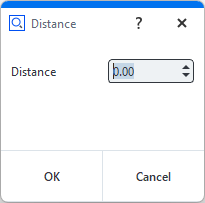
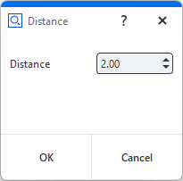

# Executing dialogs

- [Dialog commands](#dialog-commands)
    - [Break dialog (`execute`)](#break-dialog-execute)
    - [Extendable break dialog (`create` and `show`)](#extendable-break-dialog-create-and-show)
    - [Info dialog (`create`, `open` and `close`)](#info-dialog-create-open-and-close)
- [Dialog results](#dialog-results)
    - [Custom results](#custom-results)
- [Configuring dialog widgets](#configuring-dialog-widgets)
- [Event handler functions](#event-handler-functions)
    - [Registering event handlers](#registering-event-handlers)
    - [Closing dialogs from within the event handler](#closing-dialogs-from-within-the-event-handler)
    - [Using a timer to activate the event handler](#using-a-timer-to-activate-the-event-handler)

## Dialog commands

### Break dialog (`execute`)


* Standard case of a dialog.
* The dialog is created and executed with a single command.
* The command blocks the script until the dialog is closed again.
* The dialog result is returned.



```{code-block} python
:caption: Break dialog with dialog definition in Python file 

RESULT=gom.script.sys.execute_user_defined_dialog (dialog={
    "content": [
        [
            {
                "columns": 1,
                "name": "label",
                "rows": 1,
                "text": {
                    "id": "",
                    "text": "Distance",
                    "translatable": True
                },
                "tooltip": {
                    "id": "",
                    "text": "",
                    "translatable": True
                },
                "type": "label",
                "word_wrap": False
            },
            {
                "background_style": "",
                "columns": 1,
                "maximum": 1000,
                "minimum": 0,
                "name": "inputDistance",
                "precision": 2,
                "rows": 1,
                "tooltip": {
                    "id": "",
                    "text": "",
                    "translatable": True
                },
                "type": "input::number",
                "unit": "",
                "value": 0
            }
        ]
    ],
    "control": {
        "id": "OkCancel"
    },
    "embedding": "always_toplevel",
    "position": "automatic",
    "size": {
        "height": 112,
        "width": 198
    },
    "sizemode": "automatic",
    "style": "",
    "title": {
        "id": "",
        "text": "Distance",
        "translatable": True
    }
})

```

or

```{code-block} python
:caption: Break dialog with dialog definition in separate dialog file 

RESULT=gom.script.sys.execute_user_defined_dialog (file='my_dialog.gdlg')
```

### Extendable break dialog (`create` and `show`)


* A dialog is created and executed by subsequent commands.
* This way, the created dialog can be modified by the script right before execution.

```{code-block} python
:caption: Creating and executing a dialog with two separate commands (dialog definition in Python file)

# Create dialog, but do not execute it yet
DIALOG = gom.script.sys.create_user_defined_dialog (dialog=...)

#
# The dialog has been created. At this point of the script, the dialog handle DIALOG
# can be used to access and configure dialog parts
#

# Execute dialog and fetch execution result
RESULT = gom.script.sys.show_user_defined_dialog( dialog = DIALOG )
```

or

```{code-block} python
:caption: Creating and executing a dialog with two separate commands (dialog definition in separate dialog file)

# Create dialog, but do not execute it yet
DIALOG = gom.script.sys.create_user_defined_dialog (file='my_dialog.gdlg')

# ...
```

### Info dialog (`create`, `open` and `close`)


* In this mode, the script execution continues after the dialog has been opened.
* The sequence of commands is as follows:
    * the `create` command creates a dialog. The dialog can be configured now. Afterwards
    * the `open` command is issued to display the dialog. The script executing continues. At last
    * the `close` command closes the dialog again, if no closed manually by the user yet.

```{note}
At script termination all open dialogs are closed automatically.
```

```{code-block} python
:caption: Non blocking configurable dialogs

# Create dialog but do not execute it yet
DIALOG = gom.script.sys.create_user_defined_dialog (file='dialog.gdlg')

#
# The dialog has been created. At this point of the script, the dialog handle DIALOG
# can be used to access and configure dialog parts
#

# Show dialog. The script execution continues.
gom.script.sys.open_user_defined_dialog( dialog = DIALOG )

#
# The dialog content can be modified here, the dialog is still open
#
DIALOG.title = 'Stufe 2'

# Close dialog again
gom.script.sys.close_user_defined_dialog (dialog=DIALOG)
```

## Dialog results

```{note}
The return value is an object with one property per interactive dialog widget containing its current value.
```

* The return value is an object containing all current values.
* Each dialog widget which can be changed by the script user writes its resulting value into this result object.
* The key for each widget is its object name, which is unique.



``` python
#
# Print whole dialog result as an object. This is a result map with just one entry 'distance',
# named after the unique object name assigned to the spinbox (decimal widget).
#
print (RESULT) # Print whole result map
# output: gom.dialog.DialogResult ('distance': 2.0, 'label': None)

#
# Print result for the element named 'distance'. This will lead to the decimal widget content.
#
print (RESULT.distance)
# output: 2.0

#
# Print whole dialog result as a dictionary with the same content as above. 
#
print (RESULT.__dict__)
# output: {'__args__': [{'distance': 2.0, 'label': None}], '__kwargs__': {}}
print (RESULT.__dict__['__args__'][0])
# output: {'distance': 2.0, 'label': None}
```


``` python
# Print content of the 'name' widget
print( RESULT.name )
# output: Line 1

# Print content of the widget named 'point1'. This can again be an element reference.
print( RESULT.point1 )
# output: gom.ActualReference (gom.app.project.inspection['Point 5'])

# Print content of the widget named 'point2'.
print( RESULT.point2 )
# output: gom.ActualReference (gom.app.project.inspection['Point 6'])

# construct a line with the user input. Therefore our dialog works similar to the 2-point line
# construction dialog
MCAD_ELEMENT=gom.script.primitive.create_line_by_2_points (
    name= RESULT.name,
    point1 = RESULT.point1,
    point2 = RESULT.point2)
```

```{note}
The type of the result depends on the specific widget.
```

### Custom results

You can return custom results from dialogs using an optional parameter to the `close_user_defined_dialog`-function. The following example produces 'Yes' 
and 'No' results for the different buttons and 'Cheater' when the user uses the close button of the dialog.

``` python
DIALOG = gom.script.sys.create_user_defined_dialog (file='dialog.gdlg')

#
# Event handler function called if anything happens inside of the dialog
#
def dialog_event_handler (widget):
    if widget == DIALOG.button_yes:
        gom.script.sys.close_user_defined_dialog( dialog = DIALOG, result = 'Yes' )
    if widget == DIALOG.button_no:
        gom.script.sys.close_user_defined_dialog( dialog = DIALOG, result = 'No' )

DIALOG.handler = dialog_event_handler

try:
    RESULT = gom.script.sys.show_user_defined_dialog (dialog=DIALOG)
except gom.BreakError as e:
    RESULT = 'Cheater'

print('RESULT', RESULT)
```

Please find the complete example here: [dialog_yes_no.py](assets/dialog_yes_no.py)

## Configuring dialog widgets

* Dialogs created with the `create` and `open` commands can be modified before executed.
* Each widget in the dialog can be accessed via the dialog handle.
* The widget is identified by its unique name.

```{code-block} python
:caption: Configuring dialog widgets

# Create dialog and receive dialog handle
DIALOG = gom.script.sys.create_user_defined_dialog (file='dialog.gdlg')

# The handle for a widget inside of the dialog is addressed by its unique name
WIDGET = DIALOG.distance

# The widget parameter can be set via widget attributes. 'Value', for instance, relates to the current widget value.
WIDGET.value = 3.0
```

* All widgets share some common standard attributes:

| Attribute | Type                | Property                                  |
| --------- | ------------------- | ----------------------------------------- |
| name      | str                 | Unique name of the widget - do not write! |
| enabled   | bool                | Widget is currently active / inactive     |
| value     | (depends on widget) | Current value                             |

For the type of the value property for a specific widget, see [Dialog widgets](dialog_widgets.md). For widgets which are not used to enter some value, `value` is `None` and read-only. In addition, widgets have further attributes depending on their type (see [Dialog widgets](dialog_widgets.md) for details).

```{code-block} python
:caption: Accessing widget attributes

# Create dialog but do not execute it yet
DIALOG=gom.script.sys.create_dialog (file='dialog.gdlg')

# Set name to 'default name' and disable 'ok' button
DIALOG.name.value = "default name"
DIALOG.control.ok.enabled = False

# Execute dialog
RESULT=gom.script.sys.show_user_defined_dialog (dialog=DIALOG)
```

## Event handler functions

### Registering event handlers

* A function can be registered to the dialog called on value changed.
* Every time the user modified a dialog value, the **handler** function is called.
* The handler function is also called on application global signals, e.g. when application data has been changed. In these cases is the string `'system'` passed to the handler function. Those global signals are caused by changing the element selection or opening a project for example.
* The handler function can access dialog widget properties.
* The handler function is registered using the special attribute `handler`.
* The **prev** and **next** buttons of a wizard dialog are the only control widgets, which trigger the event handler.

```{code-block} python
:caption: Dialog handler functions

DIALOG=gom.script.sys.create_user_defined_dialog (file='dialog.gdlg')

# Handler function registered to the dialog
def handler_function (widget):
    # Print information about the modified widget
    print ("Modified:", str (widget))
    # If the 'name' widget is empty, the 'ok' button is disabled.
    if DIALOG.name.value == "":
        DIALOG.control.ok.enabled = False
    else:
        DIALOG.control.ok.enabled = True

    if str(widget) == 'system':
        print("It is a global event.")
    elif str(widget) == 'initialize':
        print("Dialog is displayed for the first time.")

# Register dialog handler
DIALOG.handler = handler_function

# Execute dialog
RESULT=gom.script.sys.show_user_defined_dialog (dialog=DIALOG)
```

A complete example with a handler function can be found in the file [scriptingEditorExampleDialog.py](assets/scriptingEditorExampleDialog.py). The argument passed to the event handler is either the dialog widget (e.g. a button) which triggered the event handler or a string. The following table lists all possible strings:

| Value        | Description                                                                  |
| ------------ | ---------------------------------------------------------------------------- |
| 'system'     | Passed to the event handler in the case of a global event.                   |
| 'timer'      | Passed to the event handler in the case of a global event.                   |
| 'initialize' | Passed to the event handler when the dialog is displayed for the first time. |

If the widget parameter is not a string, it represents a widget object. Note, that you cannot use the `is` operator on these objects. Always use `==` and similar 
operators to compare the widget parameter:

```{code-block} python
:caption: Comparing widget parameters

def handler_function (widget):
    ...
    # compare widget using "==", using "is" will not work!
    if widget == DIALOG.textInput:
        if DIALOG.textInput.value == "":
            DIALOG.control.ok.enabled = False
        else:
           DIALOG.control.ok.enabled = True
```

### Closing dialogs from within the event handler

```{note}
Dialogs can be closed from within event handlers.
```


```{code-block} python
:caption: Button event handler

def dialog_event_handler (widget):
    if widget == DIALOG.button1:
        execute_func_1 ()
        gom.script.sys.close_user_defined_dialog (dialog=DIALOG)
    elif widget == DIALOG.button2:
        execute_func_2 ()
        gom.script.sys.close_user_defined_dialog (dialog=DIALOG)
    elif widget == DIALOG.button3:
        execute_func_3 ()
        gom.script.sys.close_user_defined_dialog (dialog=DIALOG)
```

```{warning}
Right after the dialog has been closed, its handle becomes invalid.
```

This implies, that the event handler function must be written in a way that no dialog dependent code is executed after the dialog has been closed.

### Using a timer to activate the event handler

Each `DIALOG` has a special property named `DIALOG.timer`. This timer property can be used to trigger the event handler registered to `DIALOG` in 
certain time intervals. When the event handler is triggered by the timer, the string `timer` is passed to it. The `__doc__`-string of the timer gives information 
about its attributes:

``` python
print(DIALOG.timer.__doc__)
# output:
# Timer
#
# Attributes:
# enabled (boolean) - timer enabled
# interval (integer) - timer interval [ms]
```

```{note}
The timer is disabled by default.
```

Example:


```{code-block} python
:caption: Button/Timer event handler

DIALOG=gom.script.sys.create_user_defined_dialog (file='dialog.gdlg')

#
# Event handler function called if anything happens inside of the dialog
#
state = False
def dialog_event_handler (widget):
    global state
    if widget == DIALOG.start:
        DIALOG.timer.interval = DIALOG.interval.value * 1000
        DIALOG.timer.enabled = True
        DIALOG.start.enabled = False
        DIALOG.stop.enabled = True
    elif widget == DIALOG.stop:
        DIALOG.timer.enabled = False
        DIALOG.start.enabled = True
        DIALOG.stop.enabled = False
    elif widget == DIALOG.interval:
        DIALOG.timer.interval = DIALOG.interval.value * 1000
    elif widget == DIALOG.exit:
        gom.script.sys.close_user_defined_dialog (dialog=DIALOG)
    elif str(widget) == 'system':
        print("Its a system event.")
    elif str(widget) == 'timer':
        print("Its a timer event. Let´s swap the image.")
        state = not state
     
        if state:
            DIALOG.image.system_image = 'system_message_warning'
        else:
            DIALOG.image.system_image = 'system_message_question'

DIALOG.handler = dialog_event_handler
DIALOG.stop.enabled = False
RESULT=gom.script.sys.show_user_defined_dialog (dialog=DIALOG)
```

The complete code of the example can be found here: [timer.py](assets/timer.py). 

## Testing dialogs

See [Testing Apps &ndash; Testing Apps with dialogs](../testing_apps/testing_apps.md#testing-apps-with-dialogs) for implementing automated tests including dialog execution.