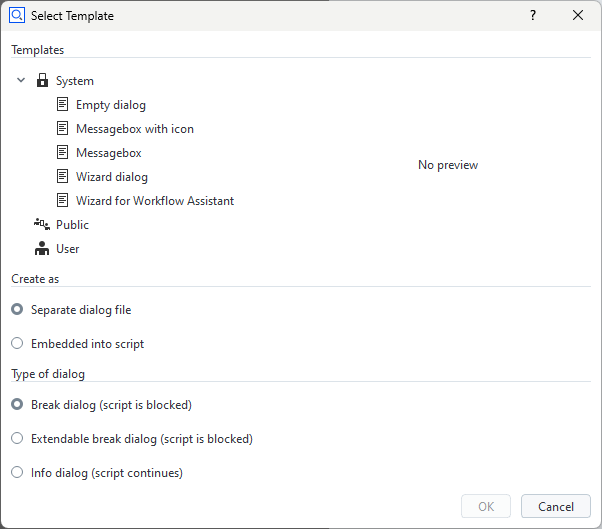
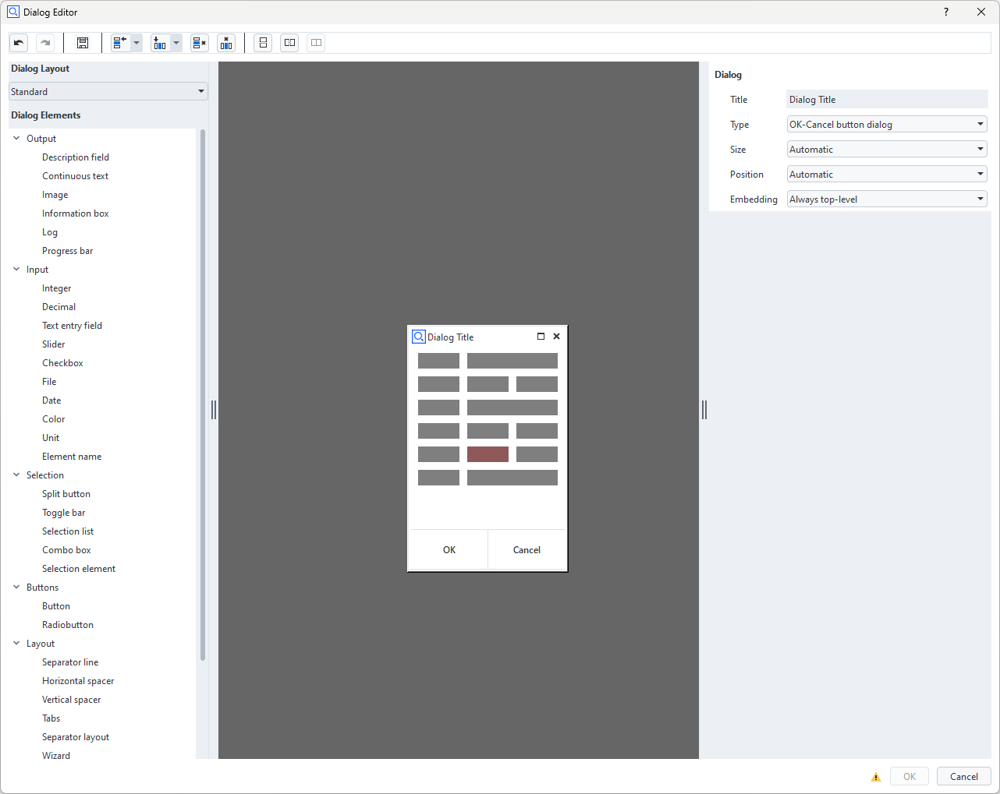
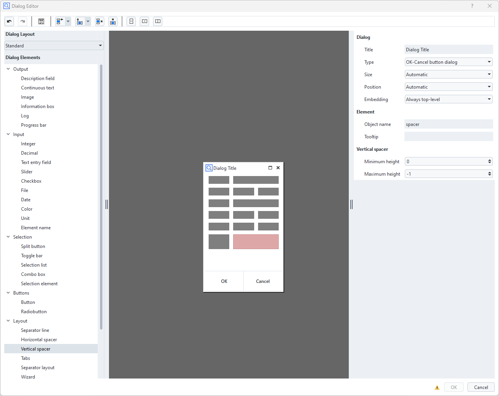
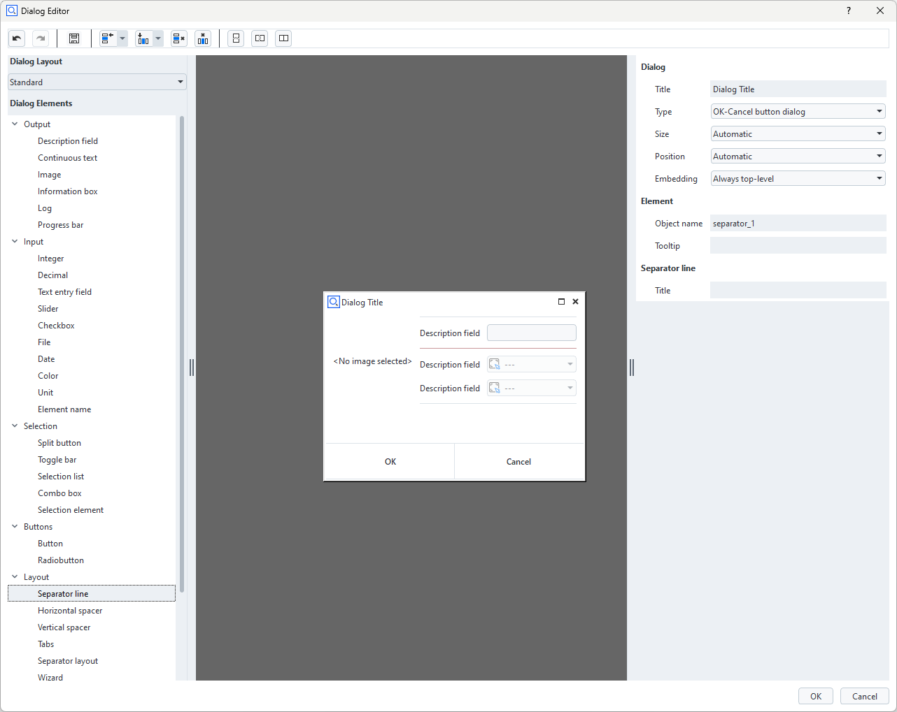
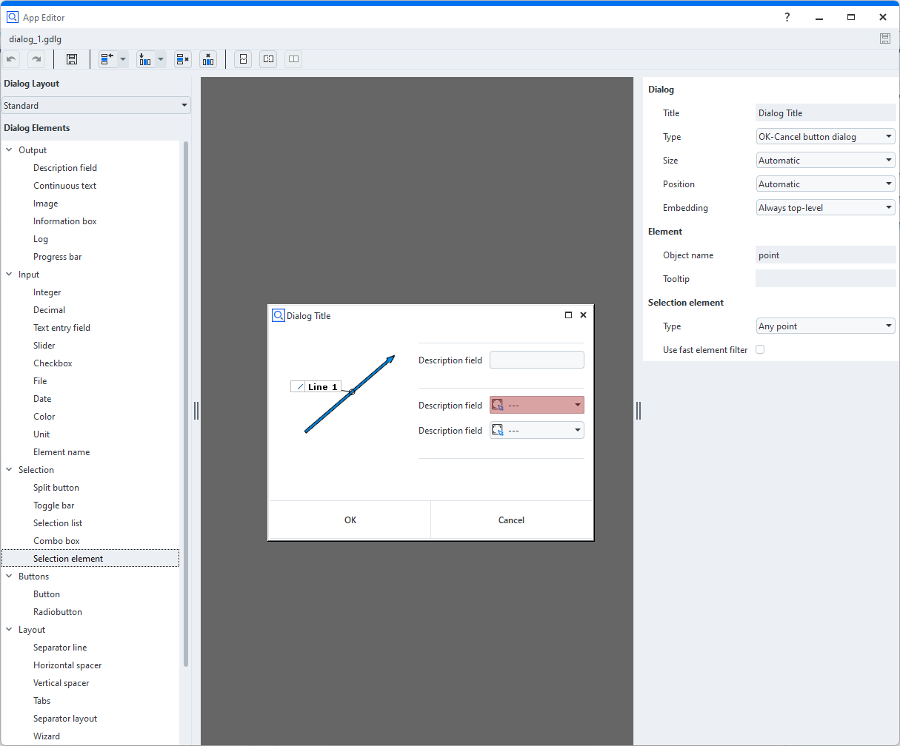

# User-defined Dialogs

You can add a GUI to your App by creating user-defined dialogs, which are based on the [Qt framework](https://www.qt.io/product/framework). 

- [Creating dialogs](#creating-dialogs)
- [Dialog widgets](dialog_widgets.md)
- [Executing dialogs](executing_dialogs.md)
- [Creating wizard dialogs](creating_wizard_dialogs.md)

## Creating dialogs

- [Dialog designer](#dialog-designer)
- [Dialog layout](#dialog-layout)
    - [Editing the grid](#editing-the-grid)
    - [Spacers](#spacers)
- [Widgets](#widgets)
    - [Inserting and removing widgets](#inserting-and-removing-widgets)
    - [Configuring widgets](#configuring-widgets)
- [Editing already created dialogs](#editing-already-created-dialogs)

### Dialog Editor

* User defined **Dialogs** can be inserted into the script using RMB ► Insert ► Dialog... in the <a href="../using_app_editor/using_app_editor.html">App Editor</a>.

    

* When a new dialog is inserted, a dialog **Template**, the **target location** of the dialog configuration and the dialog **Type** can be selected.

    

* Some dialog **Templates** are provided by the system. Additional templates can be created by the user.

* The options for placing a dialog configuration (see section **Create as** in the window above) are
    * **Separate dialog file** - default (recommeded)
    * **Embedded into script**

    The base filename of a dialog file is `dialog.gdlg`, it can be renamed later. A dialog is stored as a JSON document internally.

    ```{code-block} python
    :caption: Example&colon; Script with separate dialog file

    RESULT=gom.script.sys.execute_user_defined_dialog (file='dialog.gdlg')
    ```

    ```{code-block} python
    :caption: Example&colon; Script with embedded dialog

    RESULT=gom.script.sys.execute_user_defined_dialog (dialog={
        "content": [
            [
                {
                    ...
                }
            ]
        ],    
        "control": {
            "id": "OkCancel"
        },
        "embedding": "always_toplevel",
        "position": "automatic",
        "size": {
            "height": 155,    
            "width": 198
        },
        "sizemode": "automatic",
        "style": "",
        "title": {
            "id": "",
            "text": "Message",
            "translatable":     True
        }
    })
    ```

* The options for the dialog **Type** are
    * **Break dialog (script is blocked)** - default
    * **Extendable break dialog (script is blocked)**
    * **Info dialog (script continues)** 
    
    The dialog type is explained in section [Executing dialogs](executing_dialogs.md)


* Dialogs are designed using the GUI based **Dialog Editor**.

    
    
```{note}
The Dialog Editor is opened from the <a href="../using_app_editor/using_app_editor.html">App Editor</a> by
* Selecting a dialog file (*.gdlg) in the App Explorer
* Selecting a dialog definition embedded in a Python script
* Using _right mouse button_ → Insert → Dialog... in the script editor
```

### Dialog layout

* The **Dialog Editor** is using a grid based layout.
* Elements can be inserted into the grid via drag and drop.

#### Editing the grid

```{note}
Editing the layout means changing the underlying grid.
```

* Because the underlying layout is a grid, the following actions are possible:
    * Adding and removing rows and columns.
    * Merging and splitting rows and columns.

    | Tool button                              | Function                          |
    | ---------------------------------------- | --------------------------------- |
    |    | Split selected cells vertically   |
    |  | Split selected cells horizontally |
    |               | Merge selected cells              |

* Selected cells are marked with a red overlay.

    

#### Spacers

```{note}
**Spacers** are empty spaces extending in either horizontal or vertical direction.
```

* If a spacer is inserted into a cell, the cell claims the maximum available space in spacer direction.
* All other cells share the remaining space.



### Widgets

#### Inserting and removing widgets

* The list of available widgets resides at the left of the Dialog Editor in the section **Dialog Elements**.
* **Widgets** are inserted via drag and drop.
* Newly dropped widgets overwrite existing widgets at the drop target cells.
* A unique **object name** is assigned during insertion of a widget. This name is used to access the widget in the Python script.
* Because each cell has to be filled with a widget, widgets can not be removed from the grid. To get rid of a widget
    * Another widget can be dragged and dropped onto the existing widget or
    * The widget cell can be merged with another cell.

```{note}
Removing widgets from the grid is not possible. Instead, they can be overwritten by other widgets.
```



#### Configuring widgets

* The properties of selected widgets can be edited in the **Property Editor** at the right side of the Dialog Editor.
* Every widget has at least a unique **Object name**.
* Additionally, various parameters depending on the widget type can be edited.



The definition of the dialog can be found in [scriptingEditorExampleDialog.py](assets/scriptingEditorExampleDialog.py)

### Editing already created dialogs

* Creating a dialog leads to a script command with a dialog representation as JSON code, which can either be embedded or stored in an external dialog file (`*.gdlg`).
* Double clicking onto the embedded dialog or the dialog file opens the Dialog Editor again.
