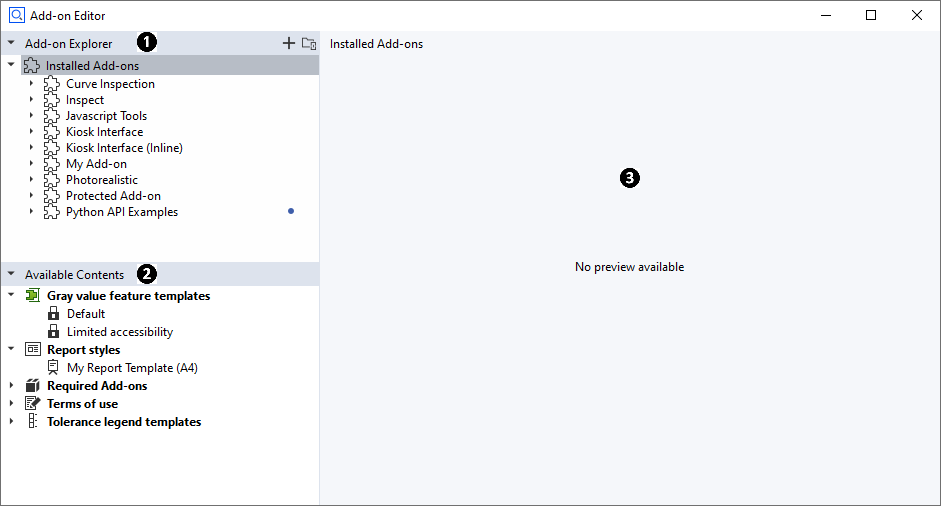
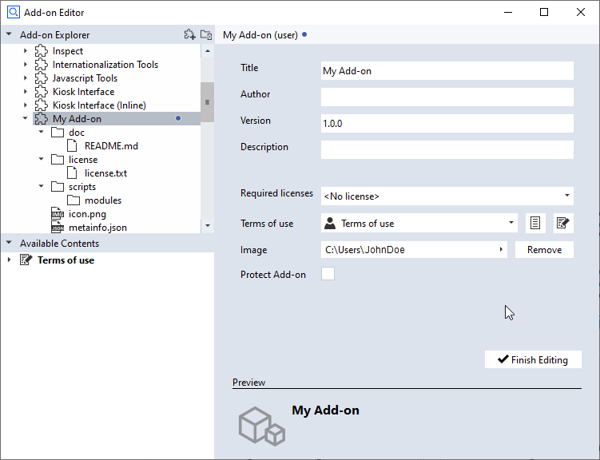
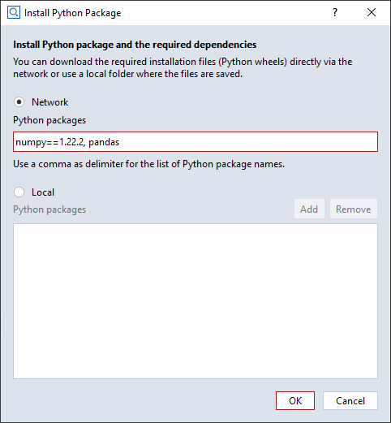
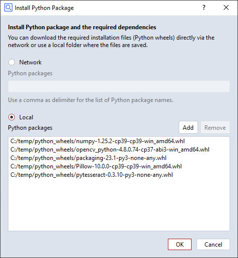

# Using the Add-on Editor

Script Editor and Package Manager have been integrated as the Add-on Editor. Here you can write Python scripts, add/remove contents, create/edit, export and publish Add-ons.

- [Add-on Editor Layout](#add-on-editor-layout)
- [Creating a new Add-on](#creating-a-new-add-on)
- [Entering and Leaving Editing Mode](#entering-and-leaving-editing-mode)
- [Writing Python scripts](#writing-python-scripts)
  * [New Folder or Script](#new-folder-or-script)
  * [Installing Python packages](#installing-python-packages)
  * [Running Python Scripts](#running-python-scripts)
  * [Recording Commands](#recording-commands)
  * [Inserting Element Values](#inserting-element-values)
- [Adding and Removing Contents](#adding-and-removing-contents)
- [Exporting or Publishing an Add-on](#exporting-or-publishing-an-add-on)
- [Add-ons from External Folders](#add-ons-from-external-folders)
  * [Connecting and Disconnecting External Folders](#connecting-and-disconnecting-external-folders)
  * [Creating Add-ons in External Folder](#creating-add-ons-in-external-folders)

## Add-on Editor Layout



1. Add-on Explorer

    The Add-on Explorer shows all installed Add-ons. The professional version of ZEISS INSPECT already provides some system Add-ons in the "Installed Add-ons" section of the Add-on Explorer. You cannot delete or modify these pre-installed Add-ons. To install additional Add-ons, use the integrated "Install/Uninstall Add-ons" dialog or the ZEISS Quality Software Store.
    
2. Available Contents

    The Available Contents section contains all items in your active project, e.g., templates, report styles etc. Add these items by dragging and dropping them to your Add-on in the Add-on Explorer. If you add an item to an Add-on, it is removed from Available Contents.

    It is also possible to drag & drop content in-between Add-ons.

3. Preview / Editor

    The Preview / Editor section shows the contents of a file depending the file type. If the selected Add-on is in editing mode, Add-on properties or script contents can be edited here.  

## Creating a new Add-on

Create a new Add-on in the following ways:
* By using the "Create Add-on" button in the top-right corner of the Add-on Explorer 
* By using RMB ► Create Add-on on Installed Add-ons 
* By using RMB ► Create Add-on on a connected external folder
        
A newly created Add-on has the default title "My Add-on". Rename your Add-on in the properties dialog on the right. A blue dot next to the Add-on title indicates that the Add-on is in editing mode.

An Add-on being edited will be created, including default folders and files.

**Default Folders and Files of an Add-on**



## Entering and Leaving Editing Mode

Before you can modify an installed Add-on, you must set it to editing mode first. A newly created Add-on is already in editing mode.

Set an Add-on to editing mode
* By using RMB ► Edit on the Add-on parent node in the Add-on Explorer or
* By clicking the Edit button in the Add-on properties window.

A blue dot next to the Add-on title indicates that the Add-on is in editing mode.

When you have finished editing the Add-on, you can leave the editing mode
* By using RMB ► Finish Editing on the Add-on parent node in the Add-on Explorer or
* By clicking the Finish Editing button in the Add-on properties window.

```{note}
Editing is only finished after all mandatory information has been entered in the Add-on properties dialog.
```

## Writing Python Scripts

### New folder or Script

Click RMB on the 'scripts' folder of an Add-on (in editing mode) ► New Folder/Script

### Installing Python Packages

Python packages can be installed to the Add-on and the installed python packages are only valid for scripts in the same Add-on. This concept is like in [Conda](https://docs.conda.io/en/latest/) or [VirtualEnv](https://virtualenv.pypa.io/en/latest/). If you click RMB on the 'scripts' folder or 'modules' folder and select ► Install Python Packages..., the dialog for the installation will be popped up.

* from Network
    - The package list from network must be separated with a comma.
    - To install the packages of a specific version, write the version after “==”, e.g. `numpy==1.22.0`

    

* from Local
    - Python wheel files (*.whl) can be added or removed.

    

### Running Python Scripts


You start or stop script execution with the buttons in the top right corner of the Script Editor.

### Recording Commands

You start or stop recording of commands executed in ZEISS INSPECT by using the Record button in the top right corner of the Script Editor. The recorded commands can be edited afterwards.

### Inserting Element Values

You insert objects from ZEISS INSPECT into your Python script by using RMB ► Insert ►  Element Value in the script editor.

## Adding and Removing Contents

You add contents from the Available Contents section to Add-ons (in editing mode) by drag and drop. You remove contents from an Add-on by drag and drop to Available Contents. Moving contents between Add-ons (in editing mode) is also supported.


## Exporting or Publishing an Add-on

* Export

    Click RMB on the installed Add-on ► Export: Save the selected Add-on as a .addon file.

* Publish in Software Store

    Click RMB on the installed Add-on ► Publish in Software Store: Upload the selected Add-on into the Zeiss Quality Software Store. The uploaded Add-on will be queued into the staging area and will be release after approval.
    
    ```{info}
    Publishing an Add-on requires special permission that ZEISS grants upon request.
    ```

## Add-ons from External Folders

### Connecting and Disconnecting External Folders


External Folder enables the user to run scripts from a selected path. More than one external folders can be added.

* Connecting

    Click RMB in an area of the Add-on Explorer where no object is selected ► Connect External Folder...
    
* Disconnecting

    Click RMB on the external folder you want to delete ► Disconnect...
    
    The External Folder is removed from the Add-on Explorer but its contents remain in the file system.

### Creating Add-ons in External Folder

* Creating a new Add-on in the external folder
    
    Click RMB on the External Folder ► New Add-on

"Finish Editing" is not available for Add-ons from external folders, however they can be published, although they are considered still to be work in progress.
