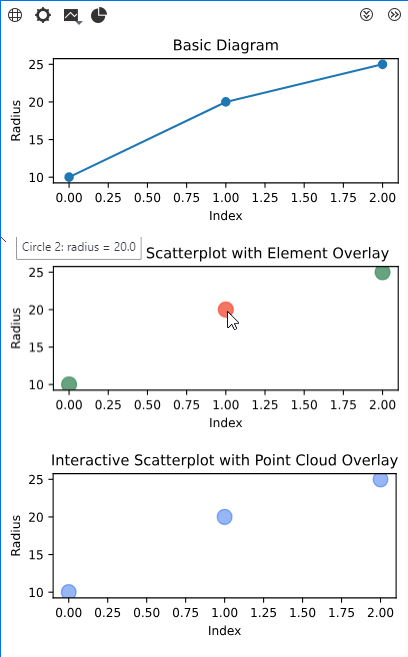
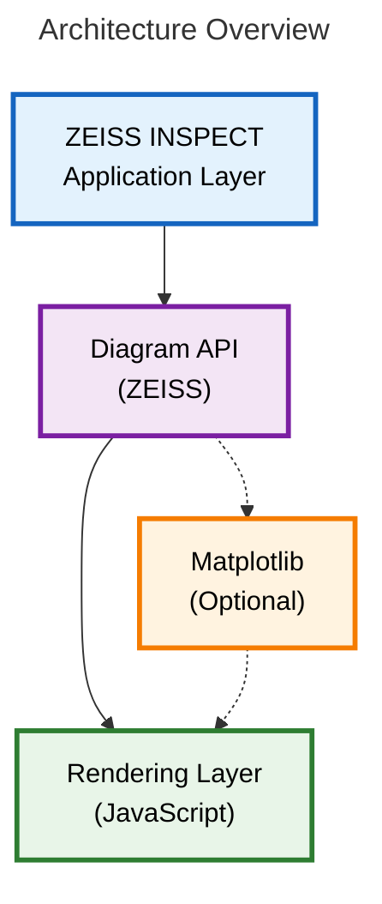
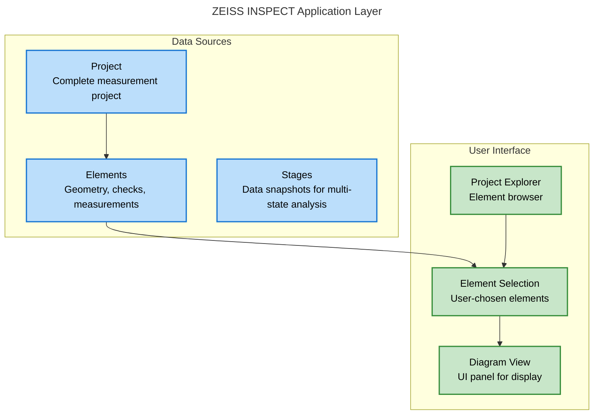
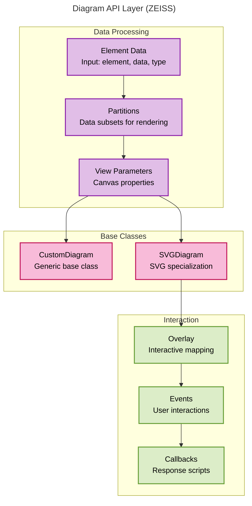
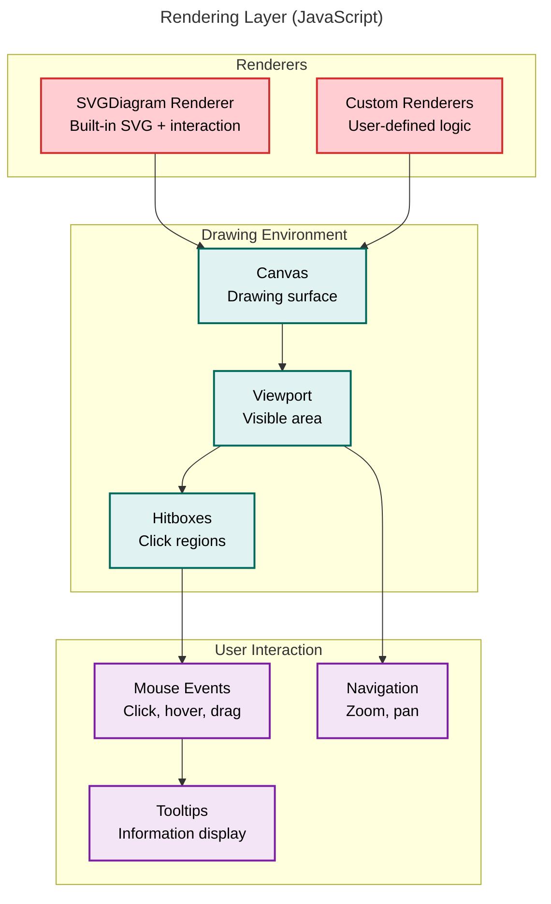
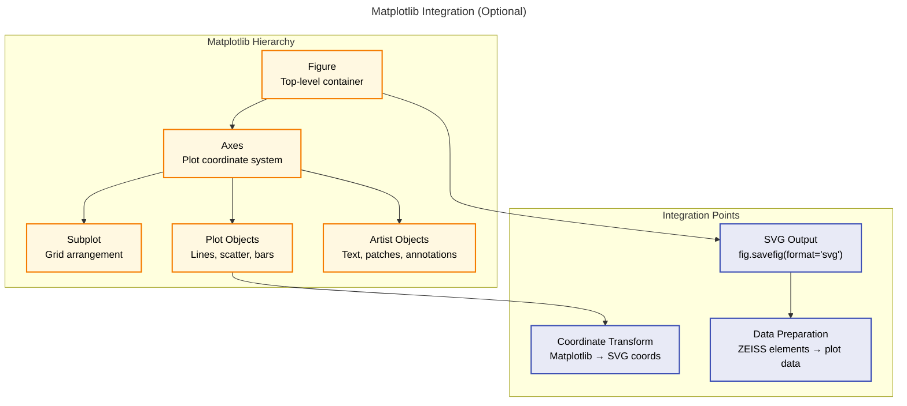
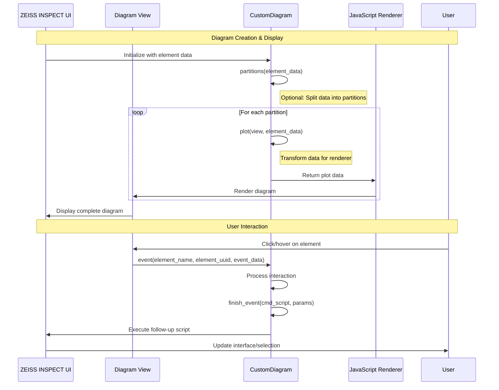

# Using Custom Diagrams



## General

Custom diagrams are the successor of <a href="https://zeiss.github.io/zeiss-inspect-app-api/2026/howtos/using_scripted_diagrams/using_scripted_diagrams.html">Scripted diagrams</a>. In comparison, **Custom diagrams** offer greater flexibility and interactivity.

Custom diagrams require [Custom actual/nominal elements](../custom_elements/custom_nominals_actuals.md) as diagram data sources.

```{seealso}
Prerequisite: Implement custom element payloads first.

See [Custom elements](../custom_elements/custom_elements_toc.md), especially [Custom actual/nominal elements](../custom_elements/custom_nominals_actuals.md).
```

## Overview

### Use Cases & Applications

1. **Quality Control Dashboards**
    - Visualize inspection results across multiple measurements
    - Interactive elements link to detailed check information
    - Real-time updates as new measurements are processed

2. **Measurement Analysis**
    - Custom scatter plots, trend analysis, statistical distributions
    - Link plot points directly to 3D measurement data
    - Filter and partition data by measurement series or stages

3. **Process Monitoring**
    - Time-series charts of measurement results
    - Interactive timeline with drill-down capabilities
    - Custom alerts and threshold visualization

4. **Custom Reporting**
    - Generate interactive reports with embedded diagrams
    - Export capabilities for external documentation
    - Custom styling and branding options

### Custom Diagram System Architecture



The Application Layer provides raw data from [Custom nominal/actual elements](../custom_elements/custom_nominals_actuals.md) for displaying in a diagram. The Diagram API allows to create diagram data structures (e.g. SVG), optionally by using the [Matplotlib](https://matplotlib.org/) Python library. The Rendering Layer displays the diagram and handles user input for interactive diagrams.



The ZEISS INSPECT Application Layer provides the current project's element data and the user interface with a diagram view, which also allows user interaction.



The Diagram API Layer (ZEISS) creates a diagram data structure by using either

[CustomDiagram](../../python_api/python_api.md#gomapiextensionsdiagramscustomdiagram)
: A generic base class (which requires a user-defined renderer).

or

[SVGDiagram](../../python_api/python_api.md#gomapiextensionsdiagramssvgdiagram)
: A specialized base class for using the SVGDiagram renderer provided by the INSPECT App.

Interactions are implemented via

Overlay
: Mapping diagram view coordinates to diagram plot coordinates, providing a tooltip (optional) or an event function (optional).

Events
: Linking interactions with the diagram to callbacks.

Callbacks
: Functions / scripts which are executed when triggered by events.



The Rendering Layer (JavaScript) is handled by the GUI framework. It provides the drawing environment for displaying the diagram and features for user interactions.



[Matplotlib](https://matplotlib.org/) is a comprehensive library for creating huge variety of diagram types allowing customization.  

### Core Terminology by Layer

**ZEISS INSPECT Layer:**
- **Project**: Complete measurement project with all data
- **Element**: Individual geometry/inspection objects (points, surfaces, dimensions)
- **Stage**: Data snapshot for multi-state analysis (same nominal, different actual data)
- **Diagram View**: UI panel displaying diagrams within ZEISS INSPECT

**Diagram API Layer:**
- **Element Data**: Input structure `[{'element': obj, 'data': dict, 'type': str}]`
- **Partitions**: Data subsets for separate rendering (large dataset handling)
- **View Parameters**: Canvas properties (width, height, DPI, font, subplot index)
- **Overlay**: Interactive mapping (Element UUIDs → coordinates + tooltips; optional `custom_interaction` flag)

**Rendering Layer:**
- **SVGDiagram Renderer**: Built-in SVG renderer with interaction support
- **Canvas**: Drawing surface for diagram display
- **Hitboxes**: Clickable regions generated from overlay coordinates

**Matplotlib Integration (Optional):**
- **Figure**: Top-level matplotlib container
- **Axes**: Plot coordinate system and drawing area
- **Plot Objects**: Lines, scatter plots, bars, etc.
- **Subplot**: Multiple plots in grid arrangement
- **Artist Objects**: Text, patches, annotations for customization

### Data Flow & Interaction Pattern



## Implementation

**Custom diagrams** require [Custom nominal/actual elements](../custom_elements/custom_nominals_actuals.md) for data input.

### Suggested Learning Path

If you are new to custom diagrams, use this order:

1. Start with [Basic Custom Diagram](#basic-custom-diagram) to verify plotting and service setup.
2. Continue with [Custom Diagram with Element Overlay](#custom-diagram-with-element-overlay) when you need full element-level hit detection and renderer tuning.
3. Use [Custom Diagram with Point Cloud Overlay](#custom-diagram-with-point-cloud-overlay) for point-based interaction mapping.

In the following sections, you find

* [Custom element](#custom-element) &ndash; An example custom element as diagram data source
* [Basic Custom Diagram](#basic-custom-diagram) &ndash; A minimal example without interactivity
* [Custom Diagram with Element Overlay](#custom-diagram-with-element-overlay) &ndash; An example with element overlay for interactivity
* [Custom Diagram with Point Cloud Overlay](#custom-diagram-with-point-cloud-overlay) &ndash; An example with point cloud overlay for interactivity

### Custom Element

The method `finish()` is implemented to assign element data to diagrams.
The helper function 'add_diagram_data' can be used to map diagram IDs to data entries.
It is possible to add multiple data entries to any number of diagram ids.

```{code-block} python
:caption: Custom Element Example &ndash; Actual Circle Element

@apicontribution
class MyActualCircle (gom.api.extensions.actuals.Circle):

    def __init__ (self):
        """Register the custom actual circle contribution."""
        super ().__init__ (id='examples.custom_diagrams.actual_circle', description='Custom Actual Circle for Diagram Examples')

    def dialog (self, context, args):
        """Open the input dialog for center, direction, and radius."""
        return self.show_dialog (context, args, '/Custom_Circle.gdlg')

    def compute (self, context, values):
        """Compute circle geometry and payload from dialog values."""
        # ... parse values and return center/direction/radius payload ...
        return {'center': (...), 'direction': (...), 'radius': values['radius']}

    def finish (self, context , results_states):
        """Map stage-0 element results to diagram services via contribution IDs."""
        diagram_data = []
        # All examples in this App use the SVGDiagram renderer.
        self.add_diagram_data(
            diagram_data = diagram_data,
            diagram_id = 'SVGDiagram',
            service_id = 'com.zeiss.example.custom_diagrams.basic',
            element_data = results_states["results"][0]
        )
        self.add_diagram_data(
            diagram_data = diagram_data,
            diagram_id = 'SVGDiagram',
            service_id = 'com.zeiss.example.custom_diagrams.element_overlay',
            element_data = results_states["results"][0]
        )
        self.add_diagram_data(
            diagram_data = diagram_data,
            diagram_id = 'SVGDiagram',
            service_id = 'com.zeiss.example.custom_diagrams.point_cloud_overlay',
            element_data = results_states["results"][0]
        )
        results_states["diagram_data"] = diagram_data
        return results_states

    gom.run_api()
```

Full source in example App:

- https://github.com/ZEISS/zeiss-inspect-app-examples/blob/main/AppExamples/custom_diagrams/CustomDiagramExamples/scripts/Custom_Circle.py

```{note}
With <a href="https://zeiss.github.io/zeiss-inspect-app-api/2026/howtos/using_scripted_diagrams/using_scripted_diagrams.html">Scripted diagrams</a> you would implement a [service function](../using_services/using_services.md) to convert element data into diagram data.
```

See [Custom nominal/actual elements](../custom_elements/custom_nominals_actuals.md) for more information.

### Custom Diagrams

**Custom diagrams** are based on the [Extensions](../../python_api/python_api.md#gomapiextensions), specifically [gom.api.extensions.diagrams](../../python_api/python_api.md#gomapiextensionsdiagrams).

For rendering diagrams as SVG (Scalable Vector Graphics), a **Custom Diagram** class is created by using 
[SVGDiagram](../../python_api/python_api.md#gomapiextensionsdiagramssvgdiagram) as the base class and implementing the `plot()` method. This base class provides additional methods for customization, like the event function to enable custom interactions.

For implementing static diagrams, using [Matplotlib](https://matplotlib.org/) and converting the plot to an SVG string is sufficient (see [Basic Custom Diagram](#basic-custom-diagram)).

```{caution}
**Custom diagrams** are executed as services in ZEISS INSPECT. Therefore, the App containing a diagram must configure the diagram script as a service in its `metainfo.json` file and the service has to be started (see [Using Services](../using_services/using_services.md) for more information).
```

```{caution}
Open the tab 'Inspection Details' in the ZEISS INSPECT 3D View to see the custom diagram.
```

```{note}
Instead of using the [SVGDiagram](../../python_api/python_api.md#gomapiextensionsdiagramssvgdiagram) base class, it is possible to create a custom diagram/renderer pair.

The base class would then be [CustomDiagram](../../python_api/python_api.md#gomapiextensionsdiagramscustomdiagram) and a corresponding JavaScript renderer must be implemented in the App.
```

#### Basic Custom Diagram

This is a minimal example of a custom diagram using Matplotlib to create a static SVG plot without interactivity.

```{note}
Quick prerequisites:

1. The diagram script is configured as a service in `metainfo.json` and the service is started.
2. Matplotlib is available in the App environment.
3. Your custom element returns `diagram_data` via `finish()` as shown above.
```

```{code-block} python
:caption: Basic Custom Diagram Example
:linenos:

import gom
from gom import apicontribution
import gom.api.extensions.diagrams
import gom.api.extensions.diagrams.matplotlib_tools as mpltools
import matplotlib.pyplot as plt

@apicontribution
class MyBasicDiagram(gom.api.extensions.diagrams.SVGDiagram):

    def __init__(self):
        """Initialize service metadata for the basic diagram."""
        super().__init__(
            id='com.zeiss.example.custom_diagrams.basic',
            description='Basic Custom Diagram'
        )

    def plot(self, view, element_data):
        """Render a radius-over-index line plot as SVG."""
        # Helper methods omitted for clarity:
        # _normalized_view(view), _export_svg(fig, safe_view)
        safe_view = self._normalized_view(view)
        fig = mpltools.setup_plot(plt, safe_view)
        ax = fig.gca()

        x = list(range(len(element_data)))
        y = [element_entry['data']['radius'] for element_entry in element_data]

        ax.plot(x, y, marker='o', linestyle='-', linewidth=1.5)
        ax.set_title('Basic Diagram')
        ax.set_xlabel('Index')
        ax.set_ylabel('Radius')

        svg_string = self._export_svg(fig, safe_view)
        plt.close(fig)

        return svg_string

    gom.run_api()
```

Full source in example App:\
[AppExamples/custom_diagrams/CustomDiagramExamples/scripts/basic_custom_diagram.py](https://github.com/ZEISS/zeiss-inspect-app-examples/blob/main/AppExamples/custom_diagrams/CustomDiagramExamples/scripts/basic_custom_diagram.py)

#### Custom Diagram with Element Overlay

This example shows how to create an interactive custom diagram using an **element overlay**. This type of overlay covers each mapped element completely, precisely mapping clicks to an element.

Additionally, this example demonstrates customization options to make rendering more accessible without implementing a custom JavaScript diagram.

```{note}
Quick prerequisites:

1. The service is started and visible in the service manager.
2. The custom element data entries provide `element` references.
3. A follow-up script named `testscript.py` exists in the App (or adjust `event()` accordingly).
```

```{code-block} python
:caption: Interactive Custom Diagram Example with Element Overlay
:linenos:

import gom
from gom import apicontribution
import gom.api.extensions.diagrams.matplotlib_tools as mpltools
import matplotlib.pyplot as plt

@apicontribution
class DiagramWithElementOverlay (gom.api.extensions.diagrams.SVGDiagram):

    RENDER_CONFIG = {'auto_generated_overlay_use': True}
    DEFAULT_MARKER_COLOR = '#4c956c'
    SELECTED_MARKER_COLOR = '#f45d48'
    MARKER_SIZE = 120
 
    def __init__(self):
        """Initialize service metadata and interaction state."""
        super().__init__(id='com.zeiss.example.custom_diagrams.element_overlay',
                        description='Interactive Custom Diagram with Element Overlay')
        self.last_clicked_uuid = None

    # Helper methods omitted for clarity:
    # _element_metadata(...), _marker_color(...), _export_svg(...)
 
    def add_all_overlay_data(self, element_data, overlay):
        """Auto-generated element overlay: each element maps to a full hitbox."""
        for element_entry in element_data:
            element_uuid, element_name = self._element_metadata(element_entry)
            self.add_element_to_overlay(
                overlay,
                element_uuid,
                (0, 0),
                element_name=element_name,
                tooltip=f"{element_name}: radius = {element_entry['data']['radius']}",
                custom_interaction=True
            )

    def event(self, element_name, element_uuid, event_data):
        """Handle overlay click events and forward callback arguments."""
        self.last_clicked_uuid = element_uuid
        return self.finish_event(
            "testscript",
            {
                "name" : "testname",
                "testval": 17.00351334,
                "element_name": element_name,
                "element_uuid": element_uuid,
                "mouse": event_data
            }
        )

    def plot(self, view, element_data):
        """Render scatter markers with gid-based element overlay mapping."""
        # _normalized_view(...) omitted for clarity.
        fig = mpltools.setup_plot(plt, view)
        ax = fig.gca()
        overlay = {}

        x, y = [], []
        for index, element_entry in enumerate(element_data):
            radius = element_entry['data']['radius']
            x.append(index)
            y.append(radius)

        # Key concept: gid tag links plotted markers to element UUIDs.
        for x_value, y_value, element_entry in zip(x, y, element_data):
            element_uuid, _element_name = self._element_metadata(element_entry)
            scatter_kwargs = {
                's': self.MARKER_SIZE,
                'c': self._marker_color(element_uuid),
                'alpha': 0.85
            }
            if element_uuid:
                scatter_kwargs['gid'] = self.get_overlay_tag(element_uuid)

            ax.scatter(
                x_value,
                y_value,
                **scatter_kwargs
            )

        ax.set_title('Interactive Scatterplot with Element Overlay')
        ax.set_xlabel('Index')
        ax.set_ylabel('Radius')

        svg_string = self._export_svg(fig, view)
        self.add_all_overlay_data(element_data, overlay)
        plt.close(fig)

        return self.finish_plot(svg_string, overlay, self.RENDER_CONFIG)

    gom.run_api()
```

Full source in example App:\
[AppExamples/custom_diagrams/CustomDiagramExamples/scripts/element_overlay_custom_diagram.py](https://github.com/ZEISS/zeiss-inspect-app-examples/blob/main/AppExamples/custom_diagrams/CustomDiagramExamples/scripts/element_overlay_custom_diagram.py)

````{note}
Optional: Extended renderer tuning

Use this `render_config` if you want additional marker/debug/filter behavior:

```python
from gom.api.extensions import diagrams

RCT = diagrams.SVGDiagram.RenderConfigToken

render_config = {
    RCT.CUSTOM_HASH: str(hash((tuple(x), tuple(y)))),
    RCT.DISABLE_MOUSE_EVENTS: False,
    RCT.DISABLE_TOOLTIPS: False,
    RCT.NEAREST_MARKER_SHAPE: "circle",
    RCT.NEAREST_MARKER_SIZE: 3,
    RCT.AUTO_GENERATED_OVERLAY_USE: True,
    RCT.OVERLAY_FILTER_METHOD: "string-parser",
    RCT.OVERLAY_ELEMENT_COUNT: len(x),
    RCT.OVERLAY_USE_MOUSE_POSITION: True,
    RCT.OVERLAY_EXPAND_HITBOXES: 10
}
```
````

#### Custom Diagram with Point Cloud Overlay

This example shows how to create an interactive custom diagram using a **point cloud overlay**. The advantage of this overlay type is a reduced computation time as compared to the [element overlay](#custom-diagram-with-element-overlay).

This option is limited in flexibility and is only suitable for simple plots such as scatter plots, curves and polar plots, because it can only map individual points in the diagram (plus a configurable hitbox size) to an element.

```{note}
Quick prerequisites:

1. The service is started and receives diagram data from custom elements.
2. The plotted points and `element_data` order match one-to-one.
3. For custom click behavior, keep `custom_interaction=True` on selected overlay points.
4. In this example, only the first point uses `custom_interaction=True`; all other points are added without custom interaction.
```

```{code-block} python
:caption: Interactive Custom Diagram Example with Point Cloud Overlay
:linenos:

import gom
from gom import apicontribution
import gom.api.extensions.diagrams
import gom.api.extensions.diagrams.matplotlib_tools as mpltools
import matplotlib.pyplot as plt

@apicontribution
class DiagramWithPointCloudOverlay (gom.api.extensions.diagrams.SVGDiagram):

    INTERACTION_SCRIPT = 'testscript'
    INTERACTION_ARGS = {'name': 'testname', 'testval': 17.00351334}
    MARKER_SIZE = 120
    MARKER_COLOR = '#2f6fed'
    MARKER_ALPHA = 0.5
 
    def __init__(self):
        """Initialize service metadata for point-cloud overlay rendering."""
        super().__init__(id='com.zeiss.example.custom_diagrams.point_cloud_overlay',
                         description='Interactive Custom Diagram with Point Cloud Overlay')

    # Helper methods omitted for clarity:
    # _normalized_view(...), _normalize_overlay_point(...), _export_svg(...)

    def add_all_overlay_data(self, element_data, display_coords, view, overlay):
        """Populate point-cloud overlay entries using display coordinates."""

        for index, (element_entry, point_coords) in enumerate(zip(element_data, display_coords)):
            interaction_point = self._normalize_overlay_point(point_coords, view)
            if index == 0:
                self.add_element_to_overlay(
                    overlay,
                    element_entry['uuid'],
                    interaction_point,
                    tooltip = element_entry['element'],
                    # Keep custom interaction on the first point only.
                    custom_interaction = True
                )
            else:
                self.add_element_to_overlay(
                    overlay,
                    element_entry['uuid'],
                    interaction_point,
                    tooltip = element_entry['element']
                )

    def event(self, element_name, element_uuid, event_data):
        """Handle point-overlay click events and forward callback arguments."""
        callback_args = dict(self.INTERACTION_ARGS)
        callback_args.update({
            'element_name': element_name,
            'element_uuid': element_uuid,
            'mouse': event_data
        })
        return self.finish_event(self.INTERACTION_SCRIPT, callback_args)

    def plot(self, view, element_data):
        """Render scatter markers and map overlay points by display coordinates."""
        # Key concept: use display coordinates for point-based overlay mapping.
        fig = mpltools.setup_plot(plt, view)
        ax = fig.gca()
        overlay = {}

        x = []
        y = []
        for index, element_entry in enumerate(element_data):
            radius = element_entry['data']['radius']
            x.append(index)
            y.append(radius)

        points = list(zip(x, y))
        display_coords = mpltools.get_display_coords(ax, points, view)

        # No gid mapping here. Overlay points are matched by display coordinates.
        for x_value, y_value in points:
            ax.scatter(
                x_value,
                y_value,
                s=self.MARKER_SIZE,
                c=self.MARKER_COLOR,
                alpha=self.MARKER_ALPHA
            )
        ax.set_title('Interactive Scatterplot with Point Cloud Overlay')
        ax.set_xlabel('Index')
        ax.set_ylabel('Radius')
 
        svg_string = self._export_svg(fig, view)
         
        self.add_all_overlay_data(
            element_data,
            display_coords,
            view,
            overlay
        )
        plt.close(fig)

        return self.finish_plot(svg_string, overlay)

    gom.run_api()
```

Full source in example App:\
[AppExamples/custom_diagrams/CustomDiagramExamples/scripts/point_cloud_overlay_custom_diagram.py](https://github.com/ZEISS/zeiss-inspect-app-examples/blob/main/AppExamples/custom_diagrams/CustomDiagramExamples/scripts/point_cloud_overlay_custom_diagram.py)

## Data Structure Examples

### Element Data Structure

```{code-block} python
element_data = [
    {
        'element': gom.app.project.actual_elements['Circle 1'],                           # ZEISS INSPECT element object
        'data': {'center': [1.0, 1.0, 2.0], 'direction': [1.0, 0.0, 0.0], 'radius': 3.0}, # Element-specific data
        'type': 'SVGDiagram'                                                              # Element type identifier
    },
    {
        'element': gom.app.project.actual_elements['Circle 2'],
        'data': {'center': [2.0, 2.0, 3.0], 'direction': [0.0, 1.0, 0.0], 'radius': 4.0},
        'type': 'SVGDiagram'
    }
]
```

### View Parameters Structure

```{code-block} python
view = {
    'width': 800,        # Canvas width in pixels
    'height': 600,       # Canvas height in pixels  
    'dpi': 96.0,         # Display DPI for scaling
    'font': 12,          # Base font size
    'subplot': 0         # Partition/subplot index (0-based)
}
```

### SVG Overlay Structure (Simplified)

```{code-block} python
overlay = {
    'element-uuid-123': {
        'element_name': 'Circle 1',
        'coordinates': [
            {
                'x': 0.0805,
                'y': 0.8900,
                'custom_interaction': True
            }
        ],
        'tooltip': 'Circle 1: radius = 3.0'
    },
    'element-uuid-456': {
        'element_name': 'Circle 2',
        'coordinates': [
            {
                'x': 0.9485,
                'y': 0.0835
            }
        ],
        'tooltip': 'Circle 2: radius = 4.0'
    }
}
```

In the point-cloud overlay example, `custom_interaction` is intentionally enabled for the first point only.

## References

* [How-to: Custom Elements](../custom_elements/custom_elements_toc.md)
* [How-to: Using Services](../using_services/using_services.md)
* [Extensions API &ndash; Diagrams](../../python_api/python_api.md#gomapiextensionsdiagrams)
* [Extensions API &ndash; SVGDiagram](../../python_api/python_api.md#gomapiextensionsdiagramssvgdiagram)