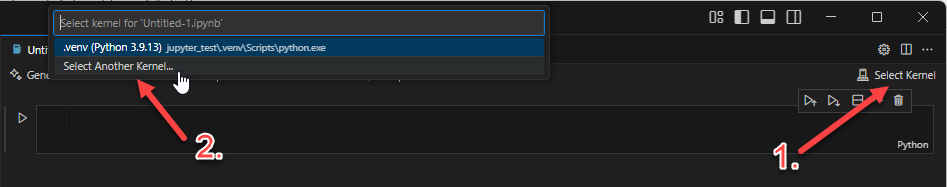
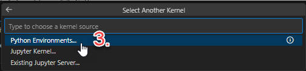
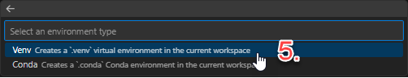
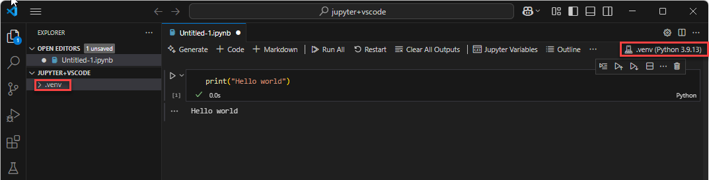
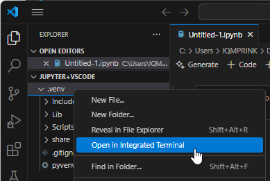
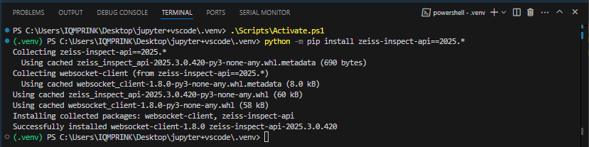
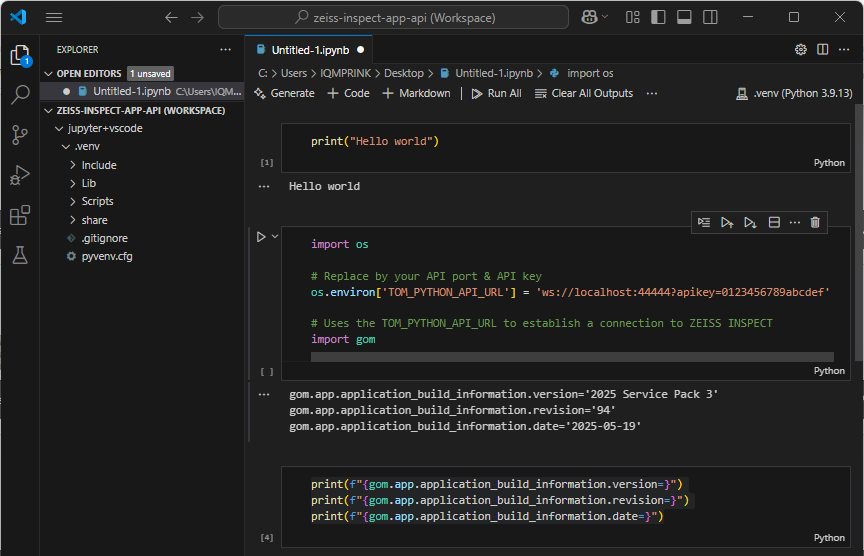

# Using Jupyter Notebook with VSCode

> Abstract: This article shows how to run ZEISS INSPECT Python scripts interactively in [Jupyter Notebook](https://jupyter.org/) with [VSCode](https://code.visualstudio.com/). For this purpose, the [Jupyter Extension for Visual Studio Code](https://marketplace.visualstudio.com/items?itemName=ms-toolsai.jupyter) is used. The Jupyter extension simplifies setting up a virtual Python environment for Jupyter Notebook and adds some convenience for editing and running Notebooks. The [ZEISS INSPECT API wheel](https://pypi.org/project/zeiss-inspect-api/) must be installed in the virtual environment from the VSCode terminal.

## Setup

### Creating a virtual Python environment

1. Create or open a Notebook

   A. Create a new Notebook from scratch 
      1. Create a new folder for your Notebook and add it to your VSCode Workspace
      2. From View ► Command Palette... (`Ctrl+Shift+P`), select 'Create: New Jupyter Notebook'
   
   B. Open an existing Notebook
      1. Open a Notebook using File ► Open File... (`Ctrl+Shift+O`) or select a Notebook from your VSCode Workspace  

2. Create a virtual environment
   1. Select Kernel
   2. Select Another Kernel...

      

   3. Python Environments...

      

   4. \+ Create Python Environment

      

   5. Venv

      

      Wait until the virtual environment has been created...

3. Test running Python code in your Notebook
   
   

   * The virtual environment is shown in the VSCode Explorer and in the Notebook editor.
   * The Python cell was executed and its output is printed below the cell.

4. Install the `zeiss-inspect-api` wheel

   1. On the `.venv` folder in the Explorer, select RMB ► Open in Integrated Terminal

      

   2. In the Terminal, activate the virtual environment and run `python -m pip install zeiss-inspect-api==2026.*`

      

5. Add a cell for configuring the connection to ZEISS INSPECT

   ```{code-block} python
   import os

   # Replace by your API port & API key
   os.environ['TOM_PYTHON_API_URL'] = 'ws://localhost:44444?apikey=0123456789abcdef'

   # Uses the TOM_PYTHON_API_URL to establish a connection to ZEISS INSPECT
   import gom
   ```

6. Test running API commands
   ```{code-block} python
   print(f"{gom.app.application_build_information.version=}")
   print(f"{gom.app.application_build_information.revision=}")
   print(f"{gom.app.application_build_information.date=}")
   ```

   

## Related

* [Using Jupyter Notebook](using_jupyter_notebook)
* [Jupyter Notebook](https://jupyter.org/)
* [ZEISS INSPECT API wheel](https://pypi.org/project/zeiss-inspect-api/)
* [Using Visual Studio Code as App editor](../using_vscode_editor/using_vscode_editor.md)
