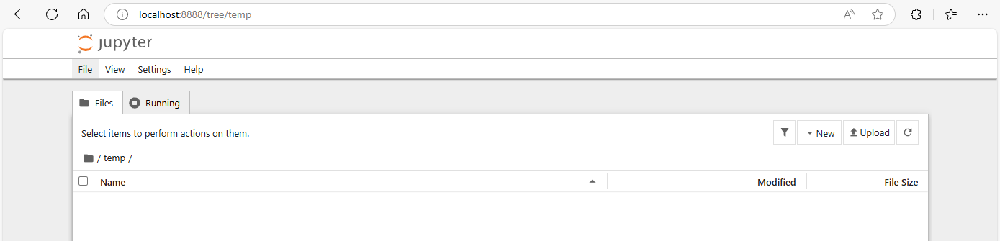
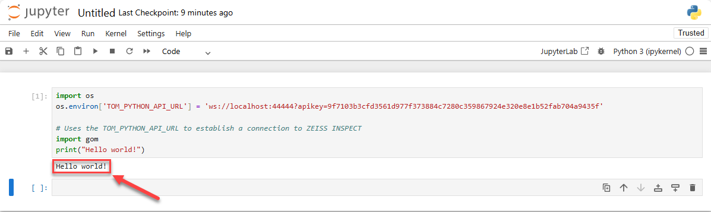

# Using ZEISS INSPECT with Jupyter Notebook

> Abstract: This article shows how to run ZEISS INSPECT Python scripts interactively in [Jupyter Notebook](https://jupyter.org/). For this purpose, a virtual Python environment is created where the [ZEISS INSPECT API wheel](https://pypi.org/project/zeiss-inspect-api/) and the [Jupyter metapackage](https://pypi.org/project/jupyter/) are installed.

## Setup

### Python installation

Using ZEISS INSPECT with Jupyter Notebook requires an additional Python 3.9 installation. Follow the installation instructions of your local IT or download and install Python 3.9 from [www.python.org](https://www.python.org).

### Python virtual environment

In this example, the Windows PowerShell is used to create and configure a virtual environment.

Create and enable a virtual environment named `jupyter_env`:

```{code-block} popershell
python -m venv jupyter_env

.\jupyter_env\Scripts\Activate.ps1
```

```{note}
The PowerShell prompt changes to `(jupyter_env) PS <PATH>>` showing that you are in the virtual environment.
```

```{important}
The following commands must be executed in the virtual environment `jupyter_env`.
```

Install the [ZEISS INSPECT API wheel](https://pypi.org/project/zeiss-inspect-api/):

```{code-block} powershell
python -m pip install zeiss-inspect-api==2025.*
```

Install the [Jupyter metapackage](https://pypi.org/project/jupyter/) which provides Jupyter Notebook:

```{code-block} powershell
python -m pip install jupyter
```

## Starting Jupyter Notebook

If you are not in the virtual environment `jupyter_env` already, go to the directory where is located and activate it (e.g. from a PowerShell):

```{code-block} powershell
.\jupyter_env\Scripts\Activate.ps1
```

Start Jupyter Notebook

```{code-block} powershell
jupyter notebook
```



Jupyter Notebook opens its web GUI in your browser. A file browser is shown initially.

## Create a Notebook

* Use New ► 'New Folder' from the 'Files' tab to create a folder named `zeiss_inspect_jupyter`.
* Go to the folder `zeiss_inspect_jupyter`.
* Use File ► New ► Notebook from the main menu to create a new notebook
* A dialog 'Select Kernel' is shown.
  * Select 'Python3 (ipykernel)' from the dropdown menu 
* Modify the following Python code using your API port and API key (see <a href="../using_vscode_editor/using_vscode_editor.html#zeiss-inspect-configuration">Using Visual Studio Code as App editor &ndash; ZEISS INSPECT configuration</a>) and enter it in the first cell of your notebook:

    ```{code-block} python
    import os
    os.environ['TOM_PYTHON_API_URL'] = 'ws://localhost:44444?apikey=9f7103b3cfd3561d977f373884c7280c359867924e320e8e1b52fab704a9435f'

    # Uses the TOM_PYTHON_API_URL to establish a connection to ZEISS INSPECT
    import gom

    print("Hello world!")
    ```
    
    

* Run the cell.

  

  * The text 'Hello world!' should have been printed below the first cell.

* Add another cell below the first one to show that using the ZEISS INSPECT API actually works:

    ```{code-block} python
    import gom.api.interpreter
    print(gom.api.interpreter.get_pid())
    ```

  * This prints the process ID (PID) of your running ZEISS INSPECT instance &ndash; compare with the output from running `tasklist | findstr 'INSPECT'` in a PowerShell.
