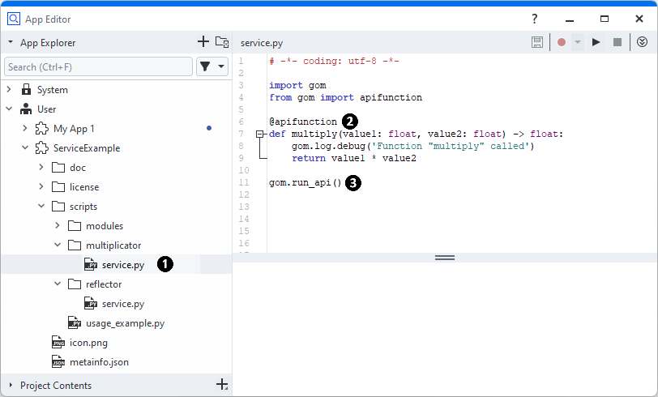
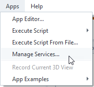
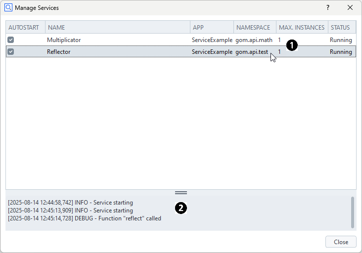
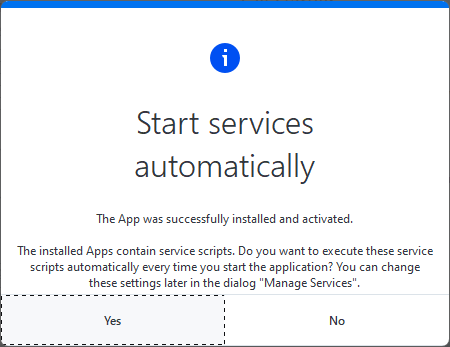

# Using services

> Abstract: A ZEISS INSPECT service is a Python script running continuously in the background, which exposes API functions to other scripts. Services can be distributed via Apps and can be used as computation kernels or callback targets. Services have been introduced in ZEISS INSPECT 2025.

## Service definition

Each service consists of a Python script file in an App. The App's `metainfo.json` declares the script to be a service. Multiple services per App are allowed. Each of these services will be executed in its own separate Python interpreter process.

```{code-block} json
:caption: Services entry in metainfo.json

{
    // ...,
    "services": [
        {
            "endpoint": "gom.api.math",
            "name": "Multiplicator",
            "script": "multiplicator/service.py"
        },
        {
            "endpoint": "gom.api.test",
            "name": "Reflector",
            "script": "reflector/service.py"
        }
    ],
    // ...
}
```

### Syntax

| Key      | Description                                                                                    | Example                     |
| -------- | ---------------------------------------------------------------------------------------------- | --------------------------- | 
| script   | Service script, relative path whithin the App 	                                                | "folder1/folder2/script.py" |
| name 	   | Human readable name of the service; will be displayed in<br>the Manage Services dialog         | "My Useful Service"         |
| endpoint | Service API endpoint where the service functions<br>will be accessible                         | "gom.api.meshing"           |

### Example


* An App called 'Service Test' defines two services in its `metainfo.json` file (1):
  * A multiplicator service accessible via the API endpoint `gom.api.math` (2) and
  * A reflector service available at `gom.api.test` (3)
* Each service is associated with a script (4), (5).

## Service scripts

```{caution}
`gom` commands &ndash; `gom.script.*` or `gom.interactive.*` &ndash; cannot be used in a service script!
```
```{note}
Functions decorated as `@apifunction` will be exported as the service API.
```

A service is a regular Python script file. Each function which shall be exported as a service API must be decorated with the `@apifunction` decorator. The service must be started by calling `gom.run_api()` after all content has been declared.

### Example 



* The script `service.py` implements the service and is referenced in the App's `metainfo.json` file.
* The function `multiply` will be available for other scripts and is therefore executed in this services process.
* The call of `gom.run_api()`  starts the service. The call does not return as long as the service is running.

## Calling services

```{note}
A registered service can be used like any regular Python module.
```

For using a service, the following steps are required:
* Import the service by using its API endpoint name
* Call the service function

```{code-block} python
:caption: Example for calling a service 

import gom
import gom.api.math
import gom.api.test
 
# Call multiply function from service #1
result = gom.api.math.multiply (23, 42)
 
# Call reflect function from service #2
result = gom.api.test.reflect({'test': 123})
```

```{note}
Each service is running in a separate Python process. The communication works via a socket based protocol.
Currently the service has to run on the same machine as the application and can only be managed from there. In the future, this concept might be extended.
```

## Managing services

You open the Manage Services dialog with Apps ► Manage Services... from the ZEISS INSPECT main menu.





* The dialog shows the registered services (1) together with the service status.
* When a service is selected, the persistent service log will be displayed (2).
* The right mouse menu offers the options
    * Restart Service,
    * Stop Service and
    * Update Services (rescan the App and script database for installed services).

### Service registration

```{important}
Services provided in an App are registered immediately when the App is installed, but they are not started automatically!
```

When an App contains service definitions, the services are made available to the system as soon as the App is installed. Run 'Update Services' from the Manage Services dialog to register services from a newly created App. The services will be in **STOPPED** state until being started manually.

### Service autostart

The autostart setting for each service can be changed in two ways:

1. After installation of an App, the user is prompted if the provided service shall be autostarted from now on:



2. After installation of an App, the autostart state of a service can be changed in the Manage Services dialog:


## Logging

```{hint}
Each service has a persistent log.
```

The current content can be displayed in the Manage Services dialog by selecting the desired service. The log can be cleared via RMB ► Delete Log File in the log output widget. By default, basic service events like startup/exit are logged.

```{hint}
The service log files stored as `C:\ProgramData\gom\log\service-<endpoint>.log`, e.g. `service-gom-api-test.log`. You can copy the path using RMB ► Copy Log File Path To Clipboard. 
```

### Adding log output to a service

```{hint}
Log output can be added by using the `gom.log` logger in the service script.
```

Messages from the logger will be forwarded into the service log file. The standard Python log levels can be used.

```{code-block} python
:caption: Logging example

import gom
 
gom.log.debug ('Debugging message')
gom.log.info ('Informational message')
 
# Same with 'warning', 'error' and 'critical'
```

```{seealso}
See [Python Logging HOWTO](https://docs.python.org/3/howto/logging.html) to learn more about logging in Python.
```

## Debugging services

```{important}
A service (script functions called from within the application) can be debugged by running it in the Python interpreter selected in VSCode.
```

* See [Using Visual Studio Code as App Editor](../using_vscode_editor/using_vscode_editor.md) for fundamentals
* In the service script, set `name` and `endpoint` parameters in the `gom.run_api()` function:

  ```{code-block} python
  import gom
  from gom import apifunction
 
  ...
 
  gom.run_api(name='My Service', endpoint='gom.api.myendpoint') 
  ```

* Launch ZEISS INSPECT.
* Launch the service script in VSCode with the launch configuration (`launch.json`) provided by ZEISS INSPECT (see <a href="https://zeiss.github.io/zeiss-inspect-app-api/main/howtos/using_vscode_editor/using_vscode_editor.html#implementation-details">Running and Debugging Python Apps</a>).
* The script will then register to the running ZEISS INSPECT instance as a service and can be debugged regularly:
  * Set breakpoints in the service script.
  * Call service function from within a regular ZEISS INSPECT script.
  * Breakpoints are triggered and execution can be evaluated.

```{caution}
The service calling functions have a timeout. Do not remain in the breakpoint state for too long, otherwise the calling command might fail!
```


## Service API documentation

See <a href="../../python_api/python_api.html#gom-api-services">gom.api.services</a>
