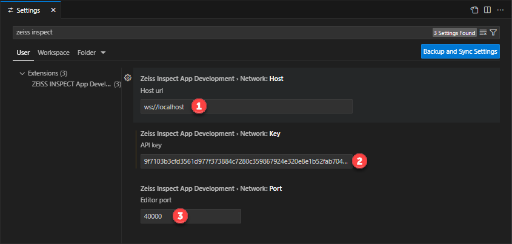
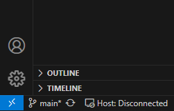
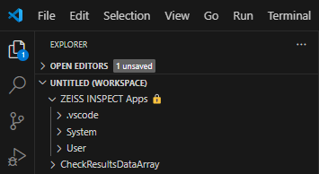
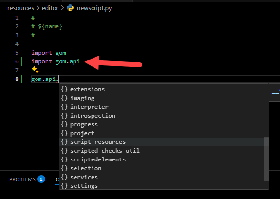
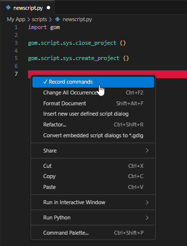
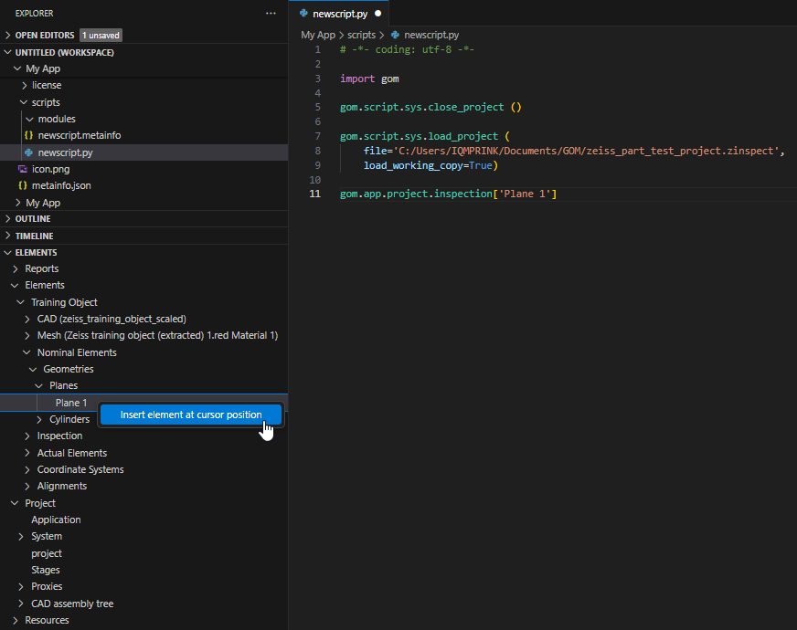
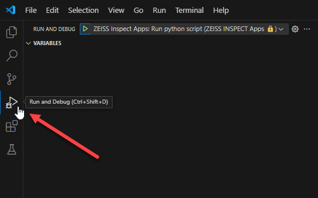
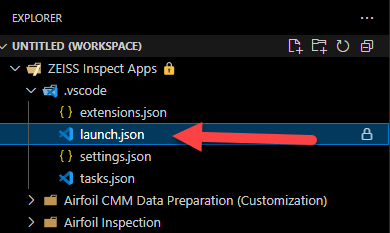
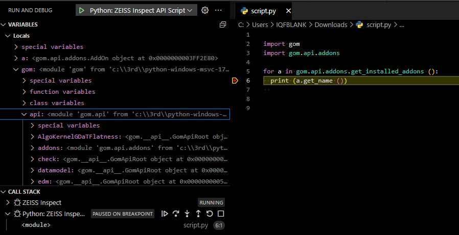

# Using Visual Studio Code as App editor

> Abstract: This section describes how to use Visual Studio Code as App editor with features like auto completion and Intellisense for ZEISS INSPECT API functions or
> insertion of ZEISS INSPECT Elements.

## Setup

### Python installation

Using VSCode as App editor requires an additional Python 3.9 installation. Follow the installation instructions of your local IT or
download and install Python 3.9 from [www.python.org](https://www.python.org/).

Install the zeiss-inspect-api Python wheel matching your ZEISS INSPECT version via command line:

```
python -m pip install zeiss-inspect-api==2025.*
```

### ZEISS INSPECT configuration


Select Edit ► Preferences and navigate to Apps ► 'API configuration'. 

* Enable API (1): Determines if the API functions can be reached via socket communication.
  
  Set to 'Yes'.

* API port (2): Socket port for calling ZEISS INSPECT API functions.

  If set to '0' (default), a port is chosen automatically. Set a free port manually if you are running multiple ZEISS INSPECT instances in parallel on the same computer.

* Editor port (3): Socket port for connecting an external App editor.

  Must be set to a free port. The default ('40000') is usually fine.

* API key (4): Unique key which protects connections to the ZEISS INSPECT API.

  The API key is set to a unique, random value when ZEISS INSPECT is installed. It has to be copied into the client application (see [VSCode configuration](#vscode-configuration)).

### VSCode configuration



* Install [Visual Studio Code](https://code.visualstudio.com/)

* Install the most recent 'ZEISS INSPECT App Development' extension for Visual Studio Code.

* Edit the 'ZEISS INSPECT App Development' extension settings:
  
  * Host URL (1): Host running the ZEISS INSPECT application.

    This is usually 'ws://localhost'.

  * API key (2): The unique ZEISS INSPECT application API key.

    Copy the key from your ZEISS INSPECT preferences (see [ZEISS INSPECT configuration](#zeiss-inspect-configuration)).

  * Editor port (3): This port is used to access Apps installed / edited in ZEISS INSPECT.

    Copy the editor port from your ZEISS INSPECT preferences (see [ZEISS INSPECT configuration](#zeiss-inspect-configuration)).

* Select the Python interpreter:

  * From View ► 'Command Palette...' (`Ctrl+Shift+P`) choose 'Python: Select Interpreter'

    Select the interpreter from your separate Python 3.9 installation (see [Python installation](#python-installation)). 

## Connect VSCode to ZEISS INSPECT

```{caution}
Your current VSCode workspace will be lost by connecting to ZEISS INSPECT. Save the workspace as a file if you still need it.
```



Press 'Host: Disconnected' in the status bar. If connecting succeeded, the status changes to 'Host: Connected'.



The Explorer now shows all Apps installed in ZEISS INSPECT in the section 'ZEISS INSPECT Apps 🔒' of the workspace. Apps in this section are read-only and can only be viewed. Apps in editing mode &ndash; 'CheckResultsDataArray' in the example above &ndash; are shown below this workspace section.

```{note}
You must use the ZEISS INSPECT App Explorer to switch Apps between finalized and editing mode!
```

```{note}
Apps in the read-only section of the VSCode Explorer are presented by a virtual file system based on websocket communication with ZEISS INSPECT. Apps in editing mode are regular files on your file system.
```

## Editing

You can work with Apps in editing mode as with any other source file.



The auto completion for ZEISS INSPECT API functions is mainly based on the 'zeiss-inspect-api' Python wheel (see [Python installation](#python-installation)).

```{important}
You must import an API package into your source file to enable auto completion for it.


```

The ZEISS Inspect API wheel contains its own function and class documentation. Thus, the VSCode Intellisense can be used during development.

## Recording ZEISS INSPECT Commands



To start or stop recording of ZEISS INSPECT commands, click RMB ► 'Record commands' at the appropriate position of your Python file.

## Inserting ZEISS INSPECT Element Values




Browse the VSCode Explorer section 'ELEMENTS' for the desired item and click RMB ► Insert element at cursor position. In the source code, append a dot to the selected element. The auto completion allows to browse through the available element properties.

## Inserting a user-defined Dialog


From View ► Command Palette... (`Ctrl+Shift+P`), select 'ZEISS app development: Insert new user defined script dialog'.

Next, you define the dialog file name:


A dialog file template is created:


## Editing a user-defined Dialog

```{note}
This function assumes that a dialog already exists in the App folder.
```


From View ► Command Palette... (`Ctrl+Shift+P`), select 'ZEISS app development: Open dialog editing UI in Application' or click RMB ► 'Open dialog editing UI in Application' on the dialog file.


This opens the dialog in the ZEISS INSPECT Dialog Editor.

## Running and Debugging Python Apps

```{caution}
Make sure that you have selected the right Python interpreter as described in [VSCode configuration](#vscode-configuration).
```

To run or debug a Python script in an App

* Open the script in VScode
* Select 'Run and Debug' (`Ctrl+Shift+D`) in the primary side bar

  

* Use 'Start Debugging' (`F5`) with the debug configuration provided by ZEISS INSPECT to run the script

See [Debug code with Visual Studio Code](https://code.visualstudio.com/docs/debugtest/debugging) for details.

### Implementation details

When VSCode is connected to a running ZEISS INSPECT application, the virtual filesystem containing the Apps etc. also contains a matching `launch.json`. This launch configuration can be used out-of-the-box without setting up anything else.



A script can then be started by selecting this launch configuration right in the debugging workspace:


When debugging, the Python interpreter now runs directly in VSCode and the ZEISS INSPECT software is handled like a remote API. Thus, all Python debugging features can be used natively in VSCode.

