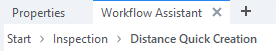
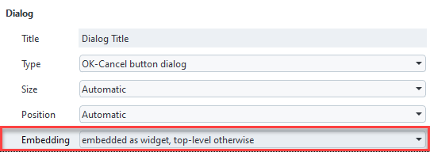

# Workflow Assistant

> Abstract:  The **Workflow Assistant** helps you to find the most important functions for a specific measuring or inspection tasks. It can help you access the most frequently used functions faster. By default, you find the tab **Workflow Assistant** in the right docking area next to the tab **Properties** (see [Tech Guide &ndash; Workflow Assistant](https://techguide.zeiss.com/en/zeiss-inspect-2025/article/view_workflow_assistant.html)).

## Workflow Assistant Object Types

The Workflow Assistant is build out Workflow Assistant objects of different types, which can be categorized like this:

1. [Pages](#pages) &ndash; A page defines the main body of the Workflow Assistant. There is always exactly one active page. It may contain other Workflow Assistant objects. 
   
   * [MenuPage](#menupage) &ndash; Shows a list of [Menu Entries](#menu-entries).
   * [WizardPage](#wizardpage) &ndash; Contains a list of [Wizard Steps](#wizard-steps), which are executed sequentially.
   * [EmbeddedCommandPage](#embeddedcommandpage) &ndash; Contains an embedded command dialog.

2. [Menu Entries](#menu-entries) &ndash; Define the layout of a [MenuPage](#menupage).

   * [NextPageEntry](#nextpageentry) &ndash; Leads to a new page.
   * [CommandEntry](#commandentry) &ndash; Executes a command.
   * [AccordionEntry](#accordionentry) &ndash; Contains a list of [Menu Entries](#menu-entries) which can be collapsed and expanded.

3. [Wizard Steps](#wizard-steps) &ndash; Define the steps of a [WizardPage](#wizardpage)

   * [EmbeddedCommandStep](#embeddedcommandstep) &ndash; Contains one or more embedded command dialogs as a step.

### Example

The ZEISS INSPECT built-in Workflow Assistant definition for the **Inspection** workspace is used as an example.

#### 1. MenuPage

```{figure} assets/assets/inspection_digitize-inspection.png
:alt: MenuPage
:class: bordered-figure

Inspection Workspace Workflow Assistant &ndash; "Start" MenuPage
```

This MenuPage consists of the entries "First steps" (AccordionEntry), "Inspection" (NextPageEntry) and "Reports" (AccordionEntry).

```{figure} assets/inspection-basic_inspections-diameter_inspections.png
:alt: MenuPage
:class: bordered-figure

"Inspection" MenuPage &ndash; "Inspection" MenuPage
```

Expanding "Basic Inspections" (AccordionEntry) leads to "Diameter Inspections" (NextPageEntry), "Distance Inspections" (NextPageEntry) and "Angle Inspections" (NextPageEntry). 

```{note}
The appearance of a NextPageEntry depends on the type of page it points to.\
The "Inspection" NextPageEntry points to a MenuPage and has a right arrow, while the "Diameter Inspections" NextPageEntry points to a WizardPage and has a "Star" button, because it stats a Workflow.
```

```{note}


The "breadcrumbs" at the top of the Workflow Assistant show the current position in the menu structure. They can also be clicked to navigate back.
```

#### 2. WizardPage

```{figure} assets/wizard1-construct.png
:alt: MenuPage
:class: bordered-figure

WizardPage, Wizard step 1 &ndash; "Construct Cylinder or Circle"
```

```{figure} assets/wizard2-check.png
:alt: MenuPage
:class: bordered-figure

WizardPage, Wizard step 2 &ndash; "Check Diameter"
```

Starting "Diameter Inspections" shows a WizardPage with two steps:

1. Construct Cylinder or Circle
2. Check Diameter

```{note}
The wizard lets you continue to the next step only after you have completed the current step!
```

#### 3. Embedded command page

```{figure} assets/embedded_command_page-distance_inspections.png
:alt: MenuPage
:class: bordered-figure

Embedded command page &ndash; "Distance Quick Creation"
```

Starting "Distance Inspections" from the "Basic Inspections" MenuPage calls the script `userscript.WorkflowAssistant__DistanceQuickCreation` from the System App "Inspect". This is the same as running Construct ► Distance ► Distance Quick Creation... from the main menu, but this way the dialog window is embedded in the Workflow Assistant.

```{caution}
To embed a user-defined dialog, you must select "embed as widget, top-level otherwise" in the dialog properties using the Dialog Editor.


```

## Creating a Workflow Assistant definition

Create a JSON file `workflow_assistant/<assistant_name>/<assistant_name>.json` in your App's folder.

```{note}
A new JSON file cannot be created in the App Explorer yet. Go to your App folder in `%APPDATA%/gom/<inspect_version>/gom_edited_addons` and create the JSON file using an external editor instead.
```

```{hint}
* To update the App Explorer, run `gom.script.sys.update_addon_database()` from a Python script.
* To update the Workflow Assistant, switch to a different workspace and back again.
```

## Minimal example

The "Minimal example" demonstrates the basic concept of creating a Workflow Assistant menu structure referencing built-in commands.

```{note}
See [App Examples &ndash; WorkflowAssistants](https://github.com/ZEISS/zeiss-inspect-app-examples/tree/main/AppExamples/misc/WorkflowAssistants) for complete source code.
```

The basic building blocks for the menu structure are:

1. [MenuPage](#menupage)
   * A MenuPage with multiple entries that can be shown in the Workflow Assistant.
2. [NextPageEntry](#nextpageentry)
   * A menu entry that allows the user to navigate to another page
   * Uses 'name', 'icon' and 'description' of referenced page if not given explicitly.
3. [CommandPage](#commandentry)
   * This is used to display a single command in the Workflow Assistant.
4. [WizardPage](#wizardpage)
   * A page to show multiple commands as a sequence in a wizard layout.
   * An [EmbeddedCommandStep](#embeddedcommandstep) is used to represent each step

```{code-block} json
:caption: minimal.json &ndash; top level
:linenos:

{
  "id": "8d7724f7-5cf3-4262-b39a-7228d69952e8",
  "name": "Minimal example",
  "using": [
    {
      "name": "inspect",
      "id": "bd0ec39e-4155-4d7d-9771-9ed0d5f86e59"
    }
  ],
  "objects": [
    // ...
  ]
}
```

At the top level, each Workflow Assistant definition must have a unique ID (UUID) (line 2) and a name 
(line 3). With `"using"`, an alias for a definition's UUID can be defined to improve readability (l. 4..8).
The definition's objects are listed under the `"objects"` tag (l. 10). They are the building blocks of this definition.

```{code-block} json
:caption: minimal.json &ndash; MenuPage "homepage"
:linenos:

{
  // ...
  "objects": [
    {
      "type": "MenuPage",
      "id": "homepage",
      "name": "a minimal homepage",
      "entries": [
        {
          "type": "NextPageEntry",
          "page": "create_diameter"
        },
        {
          "type": "EmbeddedCommandPage",
          "description": "Custom description for command",
          "command": "comparison.create_multiple_surface_comparison_on_cad"
        }
      ]
    },
    // ...  
  ]
}
```

The [MenuPage](#menupage) `"homepage"` provides two menu entries:
1. A [NextPageEntry](#nextpageentry) to the page `"create_diameter"`
2. An [EmbeddedCommandPage](#embeddedcommandpage) for execution of the ZEISS INSPECT command `comparison.create_multiple_surface_comparison_on_cad`

```{code-block} json
:caption: minimal.json &ndash; NextPageEntry
:linenos:

{
  // ...
  "objects": [
    // ...
    {
      "type": "NextPageEntry",
      "name": "Minimal example",
      "description": "hook for example assistant",
      "page": "homepage",
      "id": "hook_for_inspect",
      "position": {
        "insert": "inspect/inspection_home",
        "before": ""
      }
    },
    // ...
  ]
}
```

```{figure} assets/minimal_example-1.png
:alt: NextPageEntry "hook_for_inspect"
:class: bordered-figure

NextPageEntry "hook_for_inspect"
```

A [NextPageEntry](#nextpageentry) with its tags `"name"`, `"description"` and `"page"` is defined (l. 6..8).

Our `"homepage"` is made reachable from the `inspect` Workflow Assistant page `"inspection_home"` by using the `"position"` tag (l. 11..14).

(The `"inspect"` Workflow Assistant definition is part of the ZEISS INSPECT System Apps. The alias we previously defined with `"using"` allows to reference it by name instead of ID.)

```{hint}
Alternatively, you can add a reference to one of the Workflow Assistant pages in the definition of a <a href="../adding_workspaces_to_apps/adding_workspaces_to_apps.md">custom workspace</a>. See [AppExamples &ndash; WorkflowAssistants/workspaces/assistant/assistant.json](https://github.com/ZEISS/zeiss-inspect-app-examples/blob/main/AppExamples/misc/WorkflowAssistants/workspaces/assistant/assistant.json) for an example.
```

```{figure} assets/minimal_example-2.png
:alt: MenuPage "homepage"
:class: bordered-figure

MenuPage "homepage"
```

Clicking the NextPageEntry `"Minimal example"` leads to the MenuPage `"homepage"`.

```{code-block} json
:caption: minimal.json &ndash; WizardPage "create_diameter"
:linenos:

{
  // ...
  "objects": [
    // ...
    {
      "type": "WizardPage",
      "id": "create_diameter",
      "name": "(Page name) Diameter Inspections",
      "description": "(Page description) Create diameter checks",
      "icon": "cmd_inspect_diameter",
      "steps": [
        {
          "type": "EmbeddedCommandStep",
          "command": "primitive.cylinder_circle_quick_creation_draft",
          "info": "Each step in a wizard references a command. An additional info box can be provided. The info box is separate for each command and may be omitted in each step (see next step)."
        },
        {
          "type": "EmbeddedCommandStep",
          "command": "internal.check_scalar_diameter"
        }
      ]
    }
  ]
}
```

```{figure} assets/minimal_example-3.png
:alt: WizardPage "create_diameter" &ndash; Step 1
:class: bordered-figure

WizardPage "create_diameter" &ndash; Step 1
```
```{figure} assets/minimal_example-4.png
:alt: WizardPage "create_diameter" &ndash; Step 2
:class: bordered-figure

WizardPage "create_diameter" &ndash; Step 2
```

The last object of our "Minimal example" is the [WizardPage](#wizardpage) `"create_diameter"`. This page contains two subsequent wizard steps, both of which are [EmbeddedCommandSteps](#embeddedcommandstep). The first step allows to create a cylinder or circle while the second step allows to check the diameter of the newly created element. The next step can only be selected when the current step has been completed.

```{hint}
User-defined scripts are referenced in commands with the notation `userscript.<scriptfile>`. If the script is located in a subfolder of the App's `scripts/` folder, use the notation `userscript.<folder>__<scriptfile>`. (A double underscore is used as path separator. In `<scriptfile>`, the extension `.py` is omitted.)
```

```{hint}


Custom wizards can be implemented using the <a href="../user_defined_dialogs/dialog_widgets.html#wizard-widget">Wizard widget</a> in user-defined scripts. See <a href="../user_defined_dialogs/wizard_control.html">Wizard widget control</a> for details and [App Examples &ndash; WorkflowAssistants/scripts/workflows](https://github.com/ZEISS/zeiss-inspect-app-examples/tree/main/AppExamples/misc/WorkflowAssistants/scripts/workflows) for a complete example.
```

## Workflow Assistant JSON format

```{note}
Optional parameters are marked with '**\***'.
```

### Top level tags

The following JSON tags are used at the Workflow Assistant definitions's top level.

id	(string)
: UUID for unique identification of the Workflow Assistant definition

name (string)
:	Display name of the definition

using	(List of Objects)
:	Shorthands for definition IDs for easier usage

objects (List of Objects)
:	List of all objects provided by this workflow definition. Each JSON object describes a single Workflow Assistant object.

Example:

```
{
  "id": "8d7724f7-5cf3-4262-b39a-7228d69952e8",
  "name": "Minimal example",
  "using": [
    {
      "name": "inspect",
      "id": "bd0ec39e-4155-4d7d-9771-9ed0d5f86e59"
    }
  ],
  "objects": [
    ...
  ]
}
```

### Common Workflow Assistant Object Attributes

These attributes are common for all Workflow Assistant objects listed in the following sections.

type (String)
: Workflow assistant object type identifier\
Examples: `"type": "MenuPage"`, `"type": "NextPageEntry"`

id* (String)
: Reference ID of this object\
Example: `"id": "label_menu"`

name* ([String-like](#string-like-entry))	
: General name of object, default: `"<Default name>"`
Example: `"name": "Object 1"` 

description* ([String-like](#string-like-entry))
: General description of the object\
Example: `"description": "this does something"`

icon* ([Icon-like](#icon-like-entry))
: Icon to be displayed\
Example: `"icon":"surface_section_menu"`

position*	(Object)
: Insert the object at a specific position in an existing Workflow Assistant page

* "insert" (id): Object to insert into
* "before" (id): Position hint, i.e. insert before this object (may be empty)

Example:
```
{
  "insert" = "inspection_home",
  "before" = "inspection_menu"
}
```

### Pages

#### MenuPage

Basic type of page which displays [Menu entries](#menu-entries) in form of a list.

entries (List of Menu Entries)
: List of [Menu entries](#menu-entries). Each entry must be a valid JSON object describing a menu entry object.\
Example: `[ { entryA }, { entryB } ]`.


#### WizardPage

Page which displays multiple consecutive steps as a list of accordions with navigation buttons between them.

steps (List of Wizard Steps)
: List of [WizardSteps](#wizard-steps), each entry should be a valid json object describing a WizardStep object.\
Example: `[ { entryA }, { entryB } ]`

#### EmbeddedCommandPage	

Page with an embedded command. The page ID is defined by the given command.

command (string)
: Command to execute, usually with a dialog.\
Example: `comparison.create_min_max_deviation_label`, `userscript.inspect_gaps`

### Menu entries

#### AccordionEntry

AccordionEntries are a group of menu entries which can be collapsed and expanded.

entries (List of Menu Entries)
: List of [Menu entries](#menu-entries), each entry should be a valid JSON object describing a Menu Entry object.\
Example: `[ { entryA }, { entryB } ]`


#### NextPageEntry

A next page entry leads to a new page.

page ([Page-Object](#pages))
: Either a single page ID if referring to an already existing page or a definition of a new page.\
Example: `label_menu` / `{ pageA }`


#### CommandEntry

A command entry allows to execute a command. If the command has a dialog, this dialog will be embedded in the Workflow Assistant.

command (string)
: Command to execute.\
Examples: `inspection.inspect_by_deviation_label`, `userscript.inspect_gaps`

### Wizard steps

#### EmbeddedCommandStep

A wizard allows to execute a sequence of commands. The command dialogs are embedded into the Workflow Assistant.

```{note}
One of the tags 'command' and/or 'commands' must exist.
```

command (string)
: Command to execute\
Example: `inspection.inspect_by_deviation_label`

commands (List of Objects)
: Each object in the list can either be

* a string with the command
* an object with the following keys:
  * "command"
  * "info"* 
  * "info_help_id"* 
  * "interactive"*

Example: `[ commandA, commandB ]`

interactive* (boolean)
: Defines whether to execute the command in interactive mode. Must be set to `False` for executing a user script, otherwise the dialog will be closed immediately. (Default: True)

info* ([String-like](#string-like-entry))
: Descriptive info text for this wizard step\
Example: `Compute statistics for deviation analysis on an inspection element with color deviation representation. Select an area on the color deviation representation with any of the point selection functions."`

info_help_id* (string)
: Reference to a help article in the ZEISS Quality Tech Guide\
Example: `"info_help_id": "cmd_comparison_create_min_max_deviation_label"`

### Advanced entry types

This section introduces some advanced data types for definition of strings and icons.

#### String-like entry

##### String

Plain string

##### Translated (Object)

Runtime-translated string, based on xliff files located in the App's `languages/` folder.

translate (boolean)
: Translate the string at runtime

text (string)
: Text to translate

id (string)*
: Automatically generated translate id

#### Icon-like entry

Icon-like entries can be defined in multiple ways listed below. They provide an icon to display as part of an object in the Workflow Assistant. Currently only .svg files are fully supported.

##### Simple (string)

Specifies how and where to load an icon from (see Advanced type below for more information about `<path>` and `<mode>`). Always uses "auto" dark mode setting.

`"<path>"` or `"<mode>::<path>"`

Example: "inspection_home" / `"app::icons/workflow/my_icon.svg"`

##### Advanced (object)

path (string)
: Path to an icon or value of icon (if using a decoder)

mode* (string)	
: Mode to use to interpret the path. (default: "system")

  * "system": Loads a system icon with the given name. Example: `{"path": "inspection_home", "mode": "system"}`
  * "app"
    * Loads an icon from the originating App. The path is relative to the App's root-folder. Example: `{"path": "icons/workflow/my_icon.svg"}`
    * Loads an icon from any App specified by an AddOnUrl. Example: `{"path": "acp:///b2cc0788-1a2b-4652-ba7e-3f789126006e/icons/workflow/my_icon.svg", "mode": "app"}`
  * "file": Loads an icon based on an absolute file path. **Should be used with care** (mostly while testing) due to poor portability. Example: `{"path": "C:\\Downloads\\my_icon.svg", "mode": "file"}`
  * "base64": Decodes the icon from an embedded [base64](https://en.wikipedia.org/wiki/Base64)-encoded string. Example: {"path": "PHN2ZyBpZD0iTGF5ZXJfMSI...", "mode": "base64"}

dark (string)	
: Dark mode mode option. System icons ignore this setting.

  * "none": Do not change icon in dark mode.
  * "auto": Generate brightend version for darkmode automatically.

## Related

* [App Examples &ndash; WorkflowAssistants](https://github.com/ZEISS/zeiss-inspect-app-examples/tree/main/AppExamples/misc/WorkflowAssistants)
* <a href="../user_defined_dialogs/dialog_widgets.html#wizard-widget">Dialog widgets &ndash; Wizard widget</a>
