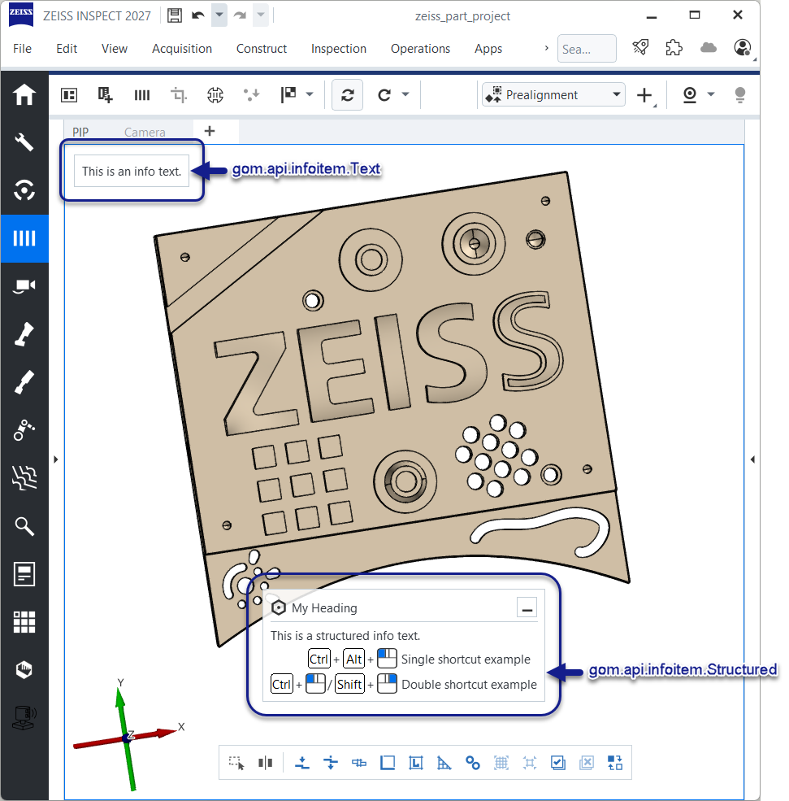
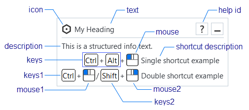
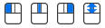
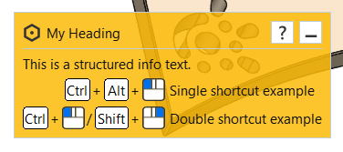
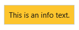
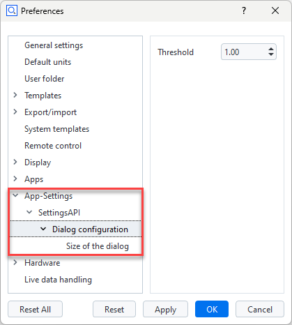

---
myst:
   html_meta:
      "description": "ZEISS INSPECT 2025 App Python API Specification"
      "keywords": "Metrology, ZEISS INSPECT, Python API, GOM API, Scripting, Add-ons, Apps, Specification, Documentation"
    
   suppress_warnings:
      ['myst.header']
---

# ZEISS INSPECT App Python API documentation

Welcome to the ZEISS INSPECT Python API documentation. Here you can find a detailed documentation of a subset of the App programming specification. Please bear in mind, that recording commands with the script editor can be used to add new functions to your script.

```{note}
The module importing behavior changed with ZEISS INSPECT 2025. Previously, the API modules could be used without proper `import` statements due to their internal handling. Beginning with ZEISS INSPECT 2025, each module is a full featured native Python module and
must be properly imported before use!
```
## gom.api.addons

API for accessing the add-ons currently installed in the running software instance

This API enables access to the installed add-ons. Information about these add-ons can be
queried, add-on files and resources can be read and if the calling instance is a member of
one specific add-on, this specific add-on can be modified on-the-fly and during software
update processes.

### gom.api.addons.AddOn

Class representing a single add-on

This class represents a single add-on. Properties of that add-on can be queried from here.

#### gom.api.addons.AddOn.exists

```{py:function} gom.api.addons.AddOn.exists(path: str): bool

Check if the given file or directory exists in an add-on
:API version: 1
:param path: File path as retrieved by 'gom.api.addons.AddOn.get_file_list ()'
:type path: str
:return: 'true' if a file or directory with that name exists in the add-on
:rtype: bool
```

This function checks if the given file exists in the add-on

#### gom.api.addons.AddOn.get_content_list

```{py:function} gom.api.addons.AddOn.get_content_list(): list

Return the list of contents contained in the add-on
:API version: 1
:return: List of contents in that add-on (full path)
:rtype: list
```


#### gom.api.addons.AddOn.get_file

```{py:function} gom.api.addons.AddOn.get_file(): str

Return the installed add-on file
:API version: 1
:return: Add-on file path (path to the add-ons installed ZIP file) or add-on edit directory if the add-on is currently in edit mode.
:rtype: str
```

This function returns the installed ZIP file representing the add-on. The file might be
empty if the add-on has never been 'completed'. If the add-on is currently in edit mode,
instead the edit directory containing the unpacked add-on sources is returned. In any way,
this function returns the location the application uses, too, to access add-on content.

#### gom.api.addons.AddOn.get_file_list

```{py:function} gom.api.addons.AddOn.get_file_list(): list

Return the list of files contained in the add-on
:API version: 1
:return: List of files in that add-on (full path)
:rtype: list
```

This function returns the list of files and directories in an add-on. These path names can
be used to read or write/modify add-on content.

Please note that the list of files can only be obtained for add-ons which are currently not
in edit mode ! An add-on in edit mode is unzipped and the `get_file ()` function will return
the file system path to its directory in that case. That directory can then be browsed with
the standard file tools instead.

#### Example

```
for addon in gom.api.addons.get_installed_addons():
  # Edited add-ons are file system based and must be accessed via file system functions
  if addon.is_edited():
    for root, dirs, files in os.walk(addon.get_file ()):
      for file in files:
        print(os.path.join(root, file))

  # Finished add-ons can be accessed via this function
  else:
    for file in addon.get_file_list():
      print (file)
```

#### gom.api.addons.AddOn.get_id

```{py:function} gom.api.addons.AddOn.get_id(): UUID

Return the unique id (uuid) of this add-on
:API version: 1
:return: Add-on uuid
:rtype: UUID
```

This function returns the uuid associated with this add-on. The id can be used to
uniquely address the add-on.

#### gom.api.addons.AddOn.get_level

```{py:function} gom.api.addons.AddOn.get_level(): str

Return the level (system/shared/user) of the add-on
:API version: 1
:return: Level of the add-on
:rtype: str
```

This function returns the 'configuration level' of the add-on. This can be
* 'system' for pre installed add-on which are distributed together with the application
* 'shared' for add-ons in the public or shared folder configured in the application's preferences or
* 'user' for user level add-ons installed for the current user only.

#### gom.api.addons.AddOn.get_name

```{py:function} gom.api.addons.AddOn.get_name(): str

Return the displayable name of the add-on
:API version: 1
:return: Add-on name
:rtype: str
```

This function returns the displayable name of the add-on. This is the human
readable name which is displayed in the add-on manager and the add-on store.

#### gom.api.addons.AddOn.get_required_software_version

```{py:function} gom.api.addons.AddOn.get_required_software_version(): str

Return the minimum version of the ZEISS INSPECT software required to use this add-on
:API version: 1
:return: Addon version in string format
:rtype: str
```

By default, an add-on is compatible with the ZEISS INSPECT software version it was created in and
all following software version. This is the case because it can be assumed that this add-on is
tested with that specific software version, not with any prior version, leading to a minimum requirement.
On the other hand, the software version where an add-on then later will break because of incompatibilities
cannot be foreseen at add-on creation time. Thus, it is also assumed that a maintainer cares for an
add-on and updates it to the latest software version if necessary. There cannot be a "works until" entry
in the add-on itself, because this would require to modify already released version as soon as this specific
version which breaks the add-on becomes known.

#### gom.api.addons.AddOn.get_script_list

```{py:function} gom.api.addons.AddOn.get_script_list(): list

Return the list of scripts contained in the add-on
:API version: 1
:return: List of scripts in that add-on (full path)
:rtype: list
```


#### gom.api.addons.AddOn.get_tags

```{py:function} gom.api.addons.AddOn.get_tags(): str

Return the list of tags with which the add-on has been tagged
:API version: 1
:return: List of tags
:rtype: str
```

This function returns the list of tags in the addons `metainfo.json` file.

#### gom.api.addons.AddOn.get_version

```{py:function} gom.api.addons.AddOn.get_version(): str

Return the version of the add-on
:API version: 1
:return: Add-on version in string format
:rtype: str
```


#### gom.api.addons.AddOn.has_license

```{py:function} gom.api.addons.AddOn.has_license(): bool

Return if the necessary licenses to use this add-on are present
:API version: 1
```

This function returns if the necessary licenses to use the add-on are currently present.
Add-ons can either be free and commercial. Commercial add-ons require the presence of a
matching license via a license dongle or a license server.

#### gom.api.addons.AddOn.is_edited

```{py:function} gom.api.addons.AddOn.is_edited(): bool

Return if the add-on is currently edited
:API version: 1
:return: 'true' if the add-on is currently in edit mode
:rtype: bool
```

Usually, an add-on is simply a ZIP file which is included into the applications file system. When
an add-on is in edit mode, it will be temporarily unzipped and is then present on disk in a directory.

#### gom.api.addons.AddOn.is_protected

```{py:function} gom.api.addons.AddOn.is_protected(): bool

Return if the add-on is protected
:API version: 1
:return: Add-on protection state
:rtype: bool
```

The content of a protected add-on is encrypted. It can be listed, but not read. Protection
includes both 'IP protection' (content cannot be read) and 'copy protection' (content cannot be
copied, as far as possible)

#### gom.api.addons.AddOn.read

```{py:function} gom.api.addons.AddOn.read(path: str): bytes

Read file from add-on
:API version: 1
:param path: File path as retrieved by 'gom.api.addons.AddOn.get_file_list ()'
:type path: str
:return: Content of that file as a byte array
:rtype: bytes
```

This function reads the content of a file from the add-on. If the add-on is protected,
the file can still be read but will be AES encrypted.

**Example:** Print all add-on 'metainfo.json' files

```
import gom
import json

for a in gom.api.addons.get_installed_addons ():
  text = json.loads (a.read ('metainfo.json'))
  print (json.dumps (text, indent=4))
```

#### gom.api.addons.AddOn.write

```{py:function} gom.api.addons.AddOn.write(path: str, data: bytes): None

Write data into add-on file
:API version: 1
:param path: File path as retrieved by 'gom.api.addons.AddOn.get_file_list ()'
:type path: str
:param data: Data to be written into that file
:type data: bytes
```

This function writes data into a file into an add-ons file system. It can be used to update,
migrate or adapt the one add-on the API call originates from. Protected add-ons cannot be
modified at all.

```{important}
An add-on can modify only its own content ! Access to other add-ons is not permitted. Use this
function with care, as the result is permanent !
```

### gom.api.addons.get_addon

```{py:function} gom.api.addons.get_addon(id: UUID): gom.api.addons.AddOn

Return the add-on with the given id
:API version: 1
:param id: Id of the add-on to get
:type id: UUID
:return: Add-on with the given id
:rtype: gom.api.addons.AddOn
:throws: Exception if there is no add-on with that id
```

This function returns the add-on with the given id

**Example:**

```
addon = gom.api.addons.get_addon ('1127a8be-231f-44bf-b15e-56da4b510bf1')
print (addon.get_name ())
> 'AddOn #1'
```

### gom.api.addons.get_current_addon

```{py:function} gom.api.addons.get_current_addon(): gom.api.addons.AddOn

Return the current add-on
:API version: 1
:return: Add-on the caller is a member of or `None` if there is no such add-on
:rtype: gom.api.addons.AddOn
```

This function returns the add-on the caller is a member of

**Example:**

```
addon = gom.api.addons.get_current_addon ()
print (addon.get_id ())
> d04a082c-093e-4bb3-8714-8c36c7252fa0
```

### gom.api.addons.get_installed_addons

```{py:function} gom.api.addons.get_installed_addons(): list[gom.api.addons.AddOn]

Return a list of the installed add-ons
:API version: 1
:return: List of 'AddOn' objects. Each 'AddOn' object represents an add-on and can be used to query information about that specific add-on.
:rtype: list[gom.api.addons.AddOn]
```

This function can be used to query information of the add-ons which are currently
installed in the running instance.

**Example:**

```
for a in gom.api.addons.get_installed_addons ():
  print (a.get_id (), a.get_name ())
```

## gom.api.contributions

API for accessing the registered contributions (semantic extensions)

This API enables access to the registered semantic extensions, called 'contributions'.
Each contribution is a service based feature which extends an aspect of ZEISS INSPECT.
The 'scripted inspection' contribution, for example, extends the inspection elements, while
the 'scripted views' contribution extends the view system of ZEISS INSPECT.

### gom.api.contributions.Contribution

Class representing a single semantic contribution

This class represents a semantic contribution. The properties of that contribution can be read and
the contribution can be administered via that handle.

#### gom.api.contributions.Contribution.get_category

```{py:function} gom.api.contributions.Contribution.get_category(): str

Return contribution category
:API version: 1
:return: Contribution category
:rtype: str
```

The contribution category determines the type of the contribution or to which semantic
concept of ZEISS INSPECT the contribution belongs to. If, for example, the contribution
extends the view system of ZEISS INSPECT, the category is 'scriptedviews'.

#### gom.api.contributions.Contribution.get_description

```{py:function} gom.api.contributions.Contribution.get_description(): str

Return human readable contribution name, as used in the UI
:API version: 1
:return: Human readable contribution name
:rtype: str
```


#### gom.api.contributions.Contribution.get_endpoint

```{py:function} gom.api.contributions.Contribution.get_endpoint(): str

Return service endpoint this contribution belongs to
:API version: 1
:return: Service endpoint
:rtype: str
```

As all contributions are service based, this function returns the service endpoint of
the service the contribution belongs to.

#### gom.api.contributions.Contribution.get_id

```{py:function} gom.api.contributions.Contribution.get_id(): str

unique contribution id
:API version: 1
:return: Unique contribution id which can be used to identify the contribution, e.g. in script commands
:rtype: str
```


### gom.api.contributions.get_contributions

```{py:function} gom.api.contributions.get_contributions(): [gom.api.contributions.Contribution]

Return the list of all registered contributions
:API version: 1
:return: The list of all registered contributions
:rtype: [gom.api.contributions.Contribution]
```

This function returns the list of registered contributions

**Example:**

```
import gom.api.contributions

for c in gom.api.contributions.get_contributions ():
  print (c.get_id (), c.get_description ())
```

## gom.api.dialog

API for handling dialogs

This API is used to create and execute script based dialogs. The dialogs are defined in a
JSON based description format and can be executed server side in the native UI style.

### gom.api.dialog.create

```{py:function} gom.api.dialog.create(context: Any, url: str): Any

Create modal dialog, but do not execute it yet
:param context: Script execution context
:type context: Any
:param url: URL of the dialog definition (*.gdlg file)
:type url: str
:return: Dialog handle which can be used to set up the dialog before executing it
:rtype: Any
```

This function creates a dialog. The dialog is passed in an abstract JSON description defining its layout.
The dialog is created but not executed yet. The dialog can be executed later by calling the 'gom.api.dialog.show'
function. The purpose of this function is to create a dialog in advance and allow the user setting it up before

This function is part of the scripted contribution framework. It can be used in the scripts
'dialog' functions to pop up user input dialogs, e.g. for creation commands. Passing of the
contributions script context is mandatory for the function to work.

\attention This function is not enabled outside of the custom elements scripted contribution framework.

### gom.api.dialog.execute

```{py:function} gom.api.dialog.execute(context: Any, url: str): Any

Create and execute a modal dialog
:param context: Script execution context
:type context: Any
:param url: URL of the dialog definition (*.gdlg file)
:type url: str
:return: Dialog input field value map. The dictionary contains one entry per dialog widget with that widgets current value.
:rtype: Any
```

This function creates and executes a dialog. The dialog is passed in an abstract JSON
description and will be executed modal. The script will pause until the dialog is either
confirmed or cancelled.

This function is part of the scripted contribution framework. It can be used in the scripts
'dialog' functions to pop up user input dialogs, e.g. for creation commands. Passing of the
contributions script context is mandatory for the function to work.

\attention This function is not enabled outside of the custom elements scripted contribution framework.

### gom.api.dialog.show

```{py:function} gom.api.dialog.show(context: Any, dialog: Any): Any

Show previously created and configured dialog
:param context: Script execution context
:type context: Any
:param dialog: Handle of the previously created dialog
:type dialog: Any
:return: Dialog input field value map. The dictionary contains one entry per dialog widget with that widgets current value.
:rtype: Any
```

This function shows and executes previously created an configured dialog. The combination of
'create' and 'show' in effect is the same as calling 'execute' directly.

## gom.api.expressions

API for reading and manipulation of the internal expression cache

Internal functions for debugging and error analysis of the expression system.

### gom.api.expressions.clear_expression_cache

```{py:function} gom.api.expressions.clear_expression_cache(): None

Clear the expression cache
:API version: 1
```

This function clears the expression cache maintained by the expression system. It is means to
be for debugging purposes. The expression cache is used to speed up repeated evaluations of the same
expressions in labels, tables, auto names, ... and should usually be left alone, as it handles
itself autonomously. For debugging tasks it can be useful to clear the cache to force re-evaluation
of expressions nevertheless.

## gom.api.extensions

API for script based functionality extensions

This API enables the user to define various element classes which can be used to extend the functionality of
ZEISS INSPECT.

### gom.api.extensions.ScriptedCalculationElement


This class is used to define a scripted calculation element which calculated its own data. It is used as a
base class for scripted actual, nominals and checks.

**Working with stages**

Each scripted element must be computed for one or more stages. In the case of a preview or
for simple project setups, computation is usually done for a single stage only. In case of
a recalc, computation for many stages is usually required. To support both cases and keep it
simple for beginners, the scripted elements are using two computation functions:

- `compute ()`:       Computes the result for one single stage only. If nothing else is implemented,
                      this function will be called for each stage one by one and return the computed
                      value for that stage only. The stage for which the computation is performed is
                      passed via the function's script context, but does usually not matter as all input
                      values are already associated with that single stage.
- `compute_stages ()`: Computes the results for many (all) stages at once. The value parameters are
                       always vectors of the same size, one entry per stage. This is the case even if
                       there is just one stage in the project. The result is expected to be a result
                       vector of the same size as these stage vectors. The script context passed to that
                       function will contain a list of stages of equal size matching the value's stage
                       ordering.

So for a project with stages, it is usually sufficient to just implement `compute ()`. For increased
performance or parallelization, `compute_stages ()` can then be implemented as a second step.

**Stage indexing**

Stages are represented by an integer index. No item reference or other resolvable types like
`gom.script.project[...].stages['Stage #1']` are used because it is assumed that reaching over stage borders into
other stages' data domain will lead to incorrect or missing dependencies. Instead, if vectorized data or data tensors
are fetched, the stage sorting within that object will match that stages vector in the context. In the best case, the
stage vector is just a consecutive range of numbers `(0, 1, 2, 3, ...)` which match the index in a staged tensor.
Nevertheless, the vector can be number entirely different depending on active/inactive stages, stage sorting, ...

```{caution}
Usually, it is *not* possible to access arbitrary stages of other elements due to recalc restrictions !
```    

#### gom.api.extensions.ScriptedCalculationElement.__init__

```{py:function} gom.api.extensions.ScriptedCalculationElement.__init__(self: Any, id: str, category: str, description: str, element_type: str, callables: Any, properties: Any): None

:param id: Unique contribution id, like `special_point`
:type id: str
:param category: Scripted element type id, like `scriptedelement.actual`
:type category: str
:param description: Human readable contribution description
:type description: str
:param element_type: Type of the generated element (point, line, ...)
:type element_type: str
:param category: Contribution category
:type category: str
```

Constructor

#### gom.api.extensions.ScriptedCalculationElement.compute

```{py:function} gom.api.extensions.ScriptedCalculationElement.compute(self: Any, context: Any, values: Any): None

:param context: Script context object containing execution related parameters. This includes the stage this computation call refers to.
:type context: Any
:param values: Dialog widget values as a dictionary. The keys are the widget names as defined in the dialog definition.
:type values: Any
```

This function is called for a single stage value is to be computed. The input values from the
associated dialog function are passed as `kwargs` parameters - one value as one specific
parameter named as the associated input widget.

#### gom.api.extensions.ScriptedCalculationElement.compute_stage

```{py:function} gom.api.extensions.ScriptedCalculationElement.compute_stage(self: Any, context: Any, values: Any): None

:param context: Script context object containing execution related parameters. This includes the stage this computation call refers to.
:type context: Any
:param values: Dialog widget values as a dictionary. The keys are the widget names as defined in the dialog definition.
:type values: Any
```

This function is called for a single stage value is to be computed. The input values from the
associated dialog function are passed as `kwargs` parameters - one value as one specific
parameter named as the associated input widget.

#### gom.api.extensions.ScriptedCalculationElement.compute_stages

```{py:function} gom.api.extensions.ScriptedCalculationElement.compute_stages(self: Any, context: Any, values: Any): None

:param context: Script context object containing execution related parameters. This includes the stage this computation call refers to.
:type context: Any
:param values: Dialog widget values as a dictionary.
:type values: Any
```

This function is called to compute multiple stages of the scripted element. The expected result is 
a vector of the same length as the number of stages.

The function is calling the `compute ()` function of the scripted element for each stage by default.
For a more efficient implementation, it can be overwritten and bulk compute many stages at once.

### gom.api.extensions.ScriptedElement


Base class for all scripted elements

This class is the base class for all scripted element types . A scripted element is a user defined
element type where configuration and computation are happening entirely in a Python script, so user
defined behavior and visualization can be implemented.

**Element id**

Every element must have a unique id. It is left to the implementer to avoid inter app conflicts here. The
id can be hierarchical like `company.topic.group.element_type`. The id may only contain lower case characters,
grouping dots and underscores.

**Element category**

The category of an element type is used to find the application side counterpart which cares for the
functionality implementation. For example, `scriptedelement.actual` links that element type the application
counterpart which cares for scripted actual elements and handles its creation, editing, administration, ...

**Storing custom element data**

In principle, each scripted element type consists of functions which will get input via function parameters and
generate output by returning a value, usually a dictionary object with named entries. For example, if a scripted
nominal command creates a nominal point, the `compute ()` function could return a dictionary like this:

```
{
    'position': (x, y, z),
    'normal':   (nx, ny, nz)
}
```

This is defined in details with the respective element type documentation. The returned values are then stored
in the project file and belong to the element. The keys of the returned dictionary are the data keys which are fixed
for each element type and element specific.

In addition to these fixed data keys, each scripted element can also store custom data entries. These entries
are not predefined by the element type, but can be freely defined by the scripted element implementation. This is not a
function result, it is more like an additional data storage which is associated with the element instance, for example
for caching intermediate results, storing additional metadata, ... Thus, custom element data is accessed via the `context`
object passed to each function. The context custom data is staged, so each stage has its own custom data storage, and the current
stage is always the one used for data access. Also, the type written into the `context.data` field has to be a dictionary.
Each entry in that dictionary is then stored as a separate custom data entry for the element and can be accessed via
"element tokens" in scripts afterwards.

Example:
```
def compute (self, context, values):
    # Access custom data for the current stage.
    if 'intermediate_result' in context.data:
        intermediate_result = context.data['intermediate_result']

    else:
        # Compute intermediate result and write it to custom data for later reuse.
        # The type is arbitrary, as long as it is serializable. Using a dictionary here
        # is usually a good choice.
        intermediate_result = ... # Compute intermediate result
        context.data = {'intermediate_result': intermediate_result,
                        'computed': True}

    # Compute final result
    result = ...
    return result
```

When a scripted element has custom data set, these data entries can be accessed in scripts via element tokens.

Example:
```
element = gom.script.project['Parts']['Part 1'].elements['My Scripted Element']
intermediate_result = element.intermediate_result # Token name matches custom data key
``` 

The size of the data storage is not limited, but it should be kept in mind that all data must be serialized
and stored in the project file. Therefore, large data structures should be avoided here. Also, calls to
`context.data` can be relatively expensive due to serialization and deserialization, so frequent access
should be avoided. Also, extremely large data structures may not be storable at all due to internal limits.

The custom data can be cleared per stage by setting an empty dictionary to `context.data = {}`.

For a more structured way or returning custom data, the result of the `compute ()` function can also
contain a special `data` entry. This entry must be a dictionary and will be stored as custom data for
that element and stage. This is a more explicit way of returning custom data compared to using the
`context.data` field. Example:

```
def compute (self, context, values):
    # Compute final result
    result = ...

    # Return custom data as part of the result
    custom_data = {
        'intermediate_result': ... # Some computed intermediate result
    }

    result['data'] = custom_data

    return result
```

When a new custom data set in set, either via `context.data` or via the `data` entry in the result, all
previous custom data entries for that stage are cleared and the whole new data set is stored instead.

#### gom.api.extensions.ScriptedElement.Attribute


Attributes used in the dialog definition

The attributes are used to define the dialog widgets and their behavior. A selected set of these
attributes are listed here as a central reference and for unified constant value access.

#### gom.api.extensions.ScriptedElement.Event


Event types passed to the `event ()` function

- `DIALOG_INITIALIZE`: Sent when the dialog has been initialized and made visible
- `DIALOG_CHANGED`:    A dialog widget value changed

#### gom.api.extensions.ScriptedElement.WidgetType


(Selected) widget types used in the dialog definition

The widget types are used to define the dialog widgets and their behavior. A selected set of these
widget types are listed here as a central reference and for unified constant value access.

#### gom.api.extensions.ScriptedElement.__init__

```{py:function} gom.api.extensions.ScriptedElement.__init__(self: Any, id: str, category: str, description: str, callables: Any, properties: Any): None

:param id: Unique contribution id, like `special_point`
:type id: str
:param category: Scripted element category id, like `scriptedelement.actual`
:type category: str
:param description: Human readable contribution description
:type description: str
```

Constructor

#### gom.api.extensions.ScriptedElement.add_log_message

```{py:function} gom.api.extensions.ScriptedElement.add_log_message(self: Any, context: Any, level: Any, message: Any): None

:param context: Script context object containing execution related parameters.
:type context: Any
:param level: Log level
:type level: Any
:param message: Log message to be added
:type message: Any
```

Add a log message to the service log. The message will be logged with the given level and appear
in the service log file. It is used to forward errors from the C++ side to the Python side.

#### gom.api.extensions.ScriptedElement.apply_dialog

```{py:function} gom.api.extensions.ScriptedElement.apply_dialog(self: Any, dlg: Any, result: Any): None

:param dlg: Dialog handle as created via the `gom.api.dialog.create ()` function
:type dlg: Any
:param result: Dialog result values as returned from the `gom.api.dialog.show ()` function.
:type result: Any
:return: Resulting dialog parameters
:rtype: None
```

Apply dialog values to the dialog arguments. This function is used to read the dialog values
back into the dialog arguments. See function `dialog ()` for a format description of the arguments.

In its default implementation, the function performs the following tasks:

- The dialog result contains values for all dialog widgets, including spacers, labels and other displaying only
  widgets. These values are not directly relevant for the dialog arguments and are removed.
- The name of the created element must be treated in a dedicated way. So the dialog results are scanned for
  an entry named `name` which originates from an element name widget. If this argument is present, it is assumed
  that it configured the dialog name, is removed from the general dialog result and passed as a special `name`
  result instead.
- The tolerance values are also treated in a dedicated way. If a dialog tolerance widget with the name `tolerance` 
  is present, its value is extracted and included in the final result.

So the dialog `result` parameters can look like this:

```
{'list': 'one', 'list_label': None, 'threshold': 1.0, 'threshold_label': None, 'name' :'Element 1', 'name_label': None}
```

This will be modified into a format which can be recorded as a script element creation command parameter set:

```
{'name': 'Element 1', 'values': {'list': 'one', 'threshold': 1.0}}
```

This function can be overloaded if necessary and if the parameters must be adapted before being applied:

```
def apply_dialog (self, dlg, result):
    params = super ().apply_dialog (dlg, result)
    # ... Adapt parameters...
    return params
```

For example, if a check should support tolerances, the dialogs tolerance widget value must be present in a parameter called
'tolerance'. So the `apply_dialog()` function can be tailored like this for that purpose:

```
def apply_dialog (self, dlg, result):
    params = super ().apply_dialog (dlg, result)

    params['name'] = dlg.name.value            # Read result directly from dialog object
    params['tolerance'] = result['tolerance']  # Apply result from dialog result dictionary

    return params
```                

This will result in a dictionary with the parameters which are then used in the elements creation command. When recorded, this could look
like this:

```
gom.script.scriptedelements.create_actual (name='Element 1', values={'mode': 23, 'threshold': 1.0}, tolerance={'lower': -0.5, 'upper': +0.5})
```

The `values` part will be directly forwarded to the elements custom `compute ()` function, which the `name` and `tolerance` parameters
are evaluated by the ZEISS INSPECT framework to apply the necessary settings automatically.        

#### gom.api.extensions.ScriptedElement.check_list

```{py:function} gom.api.extensions.ScriptedElement.check_list(self: Any, values: Dict[str, Any], key: str, expected: type, length: int): None

:param values: Dictionary of values
:type values: Dict[str, Any]
:param key: Key of the value to check
:type key: str
:param value_type: Type each of the values is expected to have
:param length: Number of values expected in the tuple or 'None' if any length is allowed
:type length: int
```

Check tuple result for expected properties

#### gom.api.extensions.ScriptedElement.check_target_element

```{py:function} gom.api.extensions.ScriptedElement.check_target_element(self: Any, values: Dict[str, Any]): None
```

Check if a base element (an element the scripted element is constructed upon) is present in the values map

#### gom.api.extensions.ScriptedElement.check_value

```{py:function} gom.api.extensions.ScriptedElement.check_value(self: Any, values: Dict[str, Any], key: str, expected: type): None

:param values: Dictionary of values
:type values: Dict[str, Any]
:param key: Key of the value to check
:type key: str
:param value_type: Type the value is expected to have
```

Check a single value for expected properties

#### gom.api.extensions.ScriptedElement.dialog

```{py:function} gom.api.extensions.ScriptedElement.dialog(self: Any, context: Any, args: Any): None

:param context: Script context object containing execution related parameters.
:type context: Any
:param args: Dialog execution arguments. This is a JSON like map structure, see above for the specific format.
:type args: Any
:return: Modified arguments. The same `args` object is returned, but must be modified to reflect the actual dialog state.
:rtype: None
```

This function is called to create the dialog for the scripted element. The dialog is used to
configure the element and to provide input values for the computation.

The dialog arguments are passed as a JSON like map structure. The format is as follows:

```
{
    "version": 1,
    "name": "Element 1",
    "values: {
        "widget1": value1,
        "widget2": value2
        ...
    }
}
```

- `version`: Version of the dialog structure. This is used to allow for future changes in the dialog
             structure without breaking existing scripts
- `name`:    Human readable name of the element which is created or edited. This entry is inserted automatically
             from the dialog widget if two conditions are met: The name of the dialog widget is 'name' and its
             type is 'Element name'. So in principle, the dialog must be setup to contain an 'Element name' widget
             named 'name' in an appropriate layout location and the rest then happens automatically.
- `values`:  A map of widget names and their initial values. The widget names are the keys and the values
             are the initial or edited values for the widgets. This map is always present, but can be empty
             for newly created elements. The keys are matching the widget names in the user defined dialog, so
             the values can be set accordingly. As a default, use the function `initialize_dialog (args)` to
             setup all widgets from the args values.

The helper functions `initialize_dialog ()` and `apply_dialog ()` can be used to initialize the dialog directly.
and read back the generated values. So a typical dialog function will look like this:

```
def dialog (self, context, args):
    dlg = gom.api.dialog.create ('/dialogs/create_element.gdlg')
    self.initialize_dialog (dlg, args)
    args = self.apply_dialog (dlg, gom.api.dialog.show (dlg))
    return args
```

The `dlg` object is a handle to the dialog which can be used to access the dialog widgets and their values.
For example, if a selection element with user defined filter function called `element` is member of the dialog,
the filter can be applied like this:

```
def dialog (self, context, args):
    dlg = gom.api.dialog.create ('/dialogs/create_element.gdlg')
    dlg.element.filter = self.element_filter
    ...

def element_filter (self, element):
    return element.type == 'curve'
```

For default dialogs, this can be shortened to a call to `show_dialog ()` which will handle the dialog
creation, initialization and return the dialog values in the correct format in a single call:

```
def dialog (self, context, args):
    return self.show_dialog (context, args, '/dialogs/create_element.gdlg')
```

#### gom.api.extensions.ScriptedElement.event

```{py:function} gom.api.extensions.ScriptedElement.event(self: Any, context: Any, event_type: Any, parameters: Any): bool

:param context: Script context object containing execution related parameters. This includes the stage this computation call refers to.
:type context: Any
:param event_type: Event type
:type event_type: Any
:param parameters: Event arguments
:type parameters: Any
:return: `True` if the event requires a recomputation of the elements preview. Upon return, the framework will then trigger a call to the `compute ()` function and use its result for a preview update. In the case of `False`, no recomputation is triggered and the preview remains unchanged.
:rtype: bool
```

Contribution event handling function. This function is called when the contributions UI state changes.
The function can then react to that event and update the UI state accordingly.

#### gom.api.extensions.ScriptedElement.event_handler

```{py:function} gom.api.extensions.ScriptedElement.event_handler(self: Any, context: Any, event_type: Any, parameters: Any): bool
```

Wrapper function for calls to `event ()`. This function is called from the application side
and will convert the event parameters accordingly

#### gom.api.extensions.ScriptedElement.finish

```{py:function} gom.api.extensions.ScriptedElement.finish(self: Any, context: Any, results_states_map: Any): None

:return: results_states_map
:rtype: None
```

This function is called to compile diagram data. It can then later be collected by
scripted diagrams and displayed. 

The default option is to simply pass the results and states,
so this function must be overwritten to utilize other diagrams.

Example:
diagram_data = []
self.add_diagram_data(diagram_data=diagram_data, diagram_id="SVGDiagram",
                      service_id="gom.api.endpoint.example.py", element_data=results_states_map["results"][0])
results_states_map["diagram_data"] = diagram_data

#### gom.api.extensions.ScriptedElement.initialize_dialog

```{py:function} gom.api.extensions.ScriptedElement.initialize_dialog(self: Any, context: Any, dlg: Any, args: Any): bool

:param context: Script context object containing execution related parameters.
:type context: Any
:param dlg: Dialog handle as created via the `gom.api.dialog.create ()` function
:type dlg: Any
:param args: Dialog arguments as passed to the `dialog ()` function with the same format as described there. Values which are not found in the dialog are ignored.
:type args: Any
:return: `True` if the dialog was successfully initialized and all values could be applied. Otherwise, the service's log will show a warning about the missing values.
:rtype: bool
```

Initializes the dialog from the given arguments. This function is used to setup the dialog
widgets from the given arguments. The arguments are a map of widget names and their values.

#### gom.api.extensions.ScriptedElement.is_visible

```{py:function} gom.api.extensions.ScriptedElement.is_visible(self: Any, context: Any): bool

:return: `True` if the element is visible in the menus.
:rtype: bool
```

This function is called to check if the scripted element is visible in the menus. This is usually the case if
the selections and other precautions are setup and the user then shall be enabled to create or edit the element.

The default state is `True`, so this function must be overwritten to add granularity to the elements visibility.

#### gom.api.extensions.ScriptedElement.show_dialog

```{py:function} gom.api.extensions.ScriptedElement.show_dialog(self: Any, context: Any, args: Any, url: Any): None

:param context: Script context object containing execution related parameters.
:type context: Any
:param args: Dialog execution arguments. This is a JSON like map structure, see above.
:type args: Any
:param url: Dialog URL of the dialog to show
:type url: Any
```

Show dialog and return the values. This function is a helper function to simplify the dialog creation
and execution. It will create the dialog, initialize it with the given arguments and show it. The
resulting values are then returned in the expected return format.

This function is a shortcut for the following code:

```
dlg = gom.api.dialog.create(context, url)   # Create dialog and return a handle to it
self.initialize_dialog(context, dlg, args)  # Initialize the dialog with the given arguments
result = gom.api.dialog.show(context, dlg)  # Show dialog and enter the dialog loop
return self.apply_dialog(dlg, result)      # Apply the final dialog values
```

### gom.api.extensions.actuals

Scripted actual elements

The classes in this module are used to define scripted actual elements. These elements are used to generate
actuals in the ZEISS INSPECT software and will enable the user to create script defined element types.

#### gom.api.extensions.actuals.Circle


Scripted actual circle element

The expected parameters from the element's `compute ()` function is a map with the following format:

```
{
    "center"   : (x: float, y: float, z: float), // Centerpoint of the circle
    "direction": (x: float, y: float, z: float), // Direction/normal of the circle
    "radius"   : r: float,                       // Radius of the circle
    "data": {...}                                // Optional element data, stored with the element
}
```

#### gom.api.extensions.actuals.Cone


Scripted actual cone element

The expected parameters from the element's `compute ()` function is a map with the following format:

```
{
    "point1": (x: float, y: float, z: float), // First point of the cone (circle center)
    "radius1": r1: float,                     // Radius of the first circle
    "point2": (x: float, y: float, z: float), // Second point of the cone (circle center)
    "radius2": r2: float,                     // Radius of the second circle
    "data": {...}                             // Optional element data, stored with the element
}
```

#### gom.api.extensions.actuals.Curve


Scripted actual curve element

The expected parameters from the element's `compute ()` function is a map with the following format:

```
{
    "plane": p: Plane, // Plane of the curve (optional)
    "curves": [Curve], // List of curves
    "data": {...}      // Optional element data, stored with the element        
}
```

The format of the `Curve` object is:

```
{
    "points": [(x: float, y: float, z: float), ...]
}
```

See the `Plane` element for the formats of the plane object.

#### gom.api.extensions.actuals.Cylinder


Scripted actual cylinder element

The expected parameters from the element's `compute ()` function is a map with the following format:

```
{
    "center": (x: float, y: float, z: float),    // Center point of the cylinder
    "direction": (x: float, y: float, z: float), // Direction of the cylinder
    "radius": r: float,                          // Radius of the cylinder
    "data": {...}                                // Optional element data, stored with the element
}
```

#### gom.api.extensions.actuals.Distance


Scripted actual distance element

The expected parameters from the element's `compute ()` function is a map with the following format:

```
{
    "point1": (x: float, y: float, z: float), // First point of the distance
    "point2": (x: float, y: float, z: float), // Second point of the distance
    "data": {...}                             // Optional element data, stored with the element
}
```

#### gom.api.extensions.actuals.Plane


Scripted actual plane element

The expected parameters from the element's `compute ()` function is a map with the following format:

```
{
    "normal": (x: float, y: float, z: float), // Normal direction of the plane
    "point": (x: float, y: float, z: float),  // One point of the plane
    "data": {...}                             // Optional element data, stored with the element        
}
```

or 

```
{
    "point1": (x: float, y: float, z: float), // Point 1 of the plane
    "point2": (x: float, y: float, z: float), // Point 2 of the plane
    "point3": (x: float, y: float, z: float), // Point 3 of the plane
    "data": {...}                             // Optional element data, stored with the element        
}
```

or

```
{
    "plane": Reference, // Reference to another plane element
    "data": {...}       // Optional element data, stored with the element

}
```

#### gom.api.extensions.actuals.Point


Scripted actual point element

The expected parameters from the element's `compute ()` function is a map with the following format:

```
{
    "value": (x: float, y: float, z: float), // The point in 3D space.
    "data": {...}                            // Optional element data, stored with the element
}
```

#### gom.api.extensions.actuals.PointCloud


Scripted actual point cloud element

The expected parameters from the element's `compute ()` function is a map with the following format:

```
{
    "points":  [(x: float, y: float, z: float), ...], // List of points
    "normals": [(x: float, y: float, z: float), ...], // List of normals for each point
    "data": {...}                                     // Optional element data, stored with the element        
}
```

#### gom.api.extensions.actuals.ScriptedActual


This class is the base class for all scripted actuals

##### gom.api.extensions.actuals.ScriptedActual.__init__

```{py:function} gom.api.extensions.actuals.ScriptedActual.__init__(self: Any, id: str, description: str, element_type: str, help_id: str): None

:param id: Scripted actual id string
:type id: str
:param description: Human readable name, will appear in menus
:type description: str
:param element_type: Type of the generated element (point, line, ...)
:type element_type: str
```

Constructor

#### gom.api.extensions.actuals.Section


Scripted actual section element

The expected parameters from the element's `compute ()` function is a map with the following format:

```
{
    "curves": [Curve],
    "plane": Plane,        // Optional
    "cone": Cone,          // Optional
    "cylinder": Cylinder,  // Optional
    "data": {...}          // Optional element data, stored with the element        
}
```

The format of the `Curve` object is:

```
{
    "points":  [(x: float, y: float, z: float), ...] // List of points
    "normals": [(x: float, y: float, z: float), ...] // List of normals for each point
}
```

See the `Plane`, `Cone` and `Cylinder` element for the formats of the plane, cone and cylinder object.

#### gom.api.extensions.actuals.Surface


Scripted actual surface element

The expected parameters from the element's `compute ()` function is a map with the following format:

```
{
    "vertices":  [(x: float, y: float, z: float), ...], // List of vertices
    "triangles": [(i1: int, i2: int, i3: int), ...],    // List of triangles (vertices' indices)
    "data": {...}                                       // Optional element data, stored with the element        
}
```

#### gom.api.extensions.actuals.SurfaceCurve


Scripted actual surface curve element

The expected parameters from the element's `compute ()` function is a map with the following format:

```
{
    "curves": [Curve], // Curve definition
    "data": {...}      // Optional element data, stored with the element        
}
```

The format of the `Curve` object is:

```
{
    "points":  [(x: float, y: float, z: float), ...] // List of points
    "normals": [(x: float, y: float, z: float), ...] // List of normals for each point
}
```

#### gom.api.extensions.actuals.SurfaceDefects


Scripted actual surface defects element

#### gom.api.extensions.actuals.ValueElement


Scripted actual value element

The expected parameters from the element's `compute ()` function is a map with the following format:

```
{
    "value": v: float, // Value of the element
    "data": {...}      // Optional element data, stored with the element        
}
```

#### gom.api.extensions.actuals.Volume


Scripted actual volume element

The expected parameters from the element's `compute ()` function is a map with the following formats:

```
{
    'voxel_data': data: np.array (shape=(x, y, z), dtype=np.float32), // Voxels of the volume
    'transformation': (x: float, y: float, z: float),                 // Voxel size
    "data": {...}                                                     // Optional element data, stored with the element        
}
```

or

```
{
    'voxel_data': data: np.array (shape=(x, y, z), dtype=np.float32), // Voxels of the volume
    'transformation': gom.Mat4x4,                                     // Transformation matrix of the volume
    "data": {...}                                                     // Optional element data, stored with the element        
}

# Format of the transformation matrix:

[[ sx,  0,  0, tx],
 [  0, sy,  0, ty],
 [  0,  0, sz, tz],
 [  0,  0,  0,  1]]
```

#### gom.api.extensions.actuals.VolumeDefects


Scripted actual volume defects element

#### gom.api.extensions.actuals.VolumeDefects2d


Scripted actual 2d volume defects element

#### gom.api.extensions.actuals.VolumeRegion


Scripted actual volume region element

#### gom.api.extensions.actuals.VolumeSection


Scripted actual volume section element

#### gom.api.extensions.actuals.VolumeSegmentation


Scripted actual volume segmentation element

### gom.api.extensions.diagrams

Scripted diagrams

The classes in this module enable the user to define scripted diagrams. A scripted diagram implements an 
interface to transform element data into data that can be rendered by a corresponding Javascript renderer
implementation in the diagram view.

#### gom.api.extensions.diagrams.SVGDiagram


Specialized contribution base for scripted diagrams that are displayed via the SVGDiagram renderer type provided by the Inspect app.

Provides the helper functions 'finish_plot' and 'add_element_coord' to streamline the creation of the plot data for the SVGRenderer.

In the most basic form, implement the 'plot' function to return a stringified svg plot. 
Such data will automatically be sanitized to the full output format.

For additional interactivity, implement the 'plot' function by returning data using the 'finish_plot(svg_string, overlay)' helper,
where 'svg_string' is the stringified svg plot 
and 'overlay' is a point overlay for interaction, that can be created using the 'add_element_coord' helper function.

##### gom.api.extensions.diagrams.SVGDiagram.RenderConfigToken


Token identifiers for the optional rendering configuration passed to the SVGDiagram renderer via Token.RENDER_CONFIG parameter

"debug_logging" - Enable general logging (default: False)

"debug_logging_trace" - Enable detailed result logging (default: False)

"debug_performance" - Enable performance measuring during the (overlay) rendering process (default: False)

"debug_always_show_overlay" - Always show the standard overlay with small black crosses (default: False)

"debug_auto_generated_overlay_show" - Show the hitboxes of the auto generated overlay if available (default: False)

"debug_nearest_point_show" - Show a small text with the uuid of the nearest element (default: False)

"debug_nearest_point_x" - X-coordinate of nearest element text if enabled (default: 50)

"debug_nearest_point_y" - Y-coordinate of nearest element text if enabled (default: 50)

"debug_mouse_position_show" - Show a marker on the element nearest to the mouse (if in range) (default: True)

"nearest_marker_shape" - Shape of the nearest element marker (default: "cross") (options: "cross", "square", "circle", "dot")

"nearest_marker_color" - Color of the nearest element marker (default: automatic color from diagram view)

"nearest_marker_size" - Size of the nearest element marker (default: 5)

"disable_tooltips" - Disables all element tooltips of the diagram from being displayed (default: False)

"disable_mouse_events" - Disables mouse (click) events from being processed (default: False)

"custom_hash" - If defined, use this as a hash for the caching instead of a generated one (default: undefined)

"auto_generated_overlay_use" - Automatically generate a overlay to determine the hitboxes of elements based on tagged svg groups (default: False)

"overlay_tag_prefix" - Prefix of user defined tags to filter the svg by (default: "tag-" (Token.TAG_PREFIX))

"overlay_tag_suffix" - Suffix of user defined tags to filter the svg by (default: "-tag" (Token.TAG_SUFFIX))

"overlay_expand_hitboxes" - Expand every hitbox in the auto generated overlay by this number of pixels (default: 10)

"overlay_use_mouse_position" - If TRUE, always use the mouse position instead of a point from the element coords if interacting via the auto generated overlay (default: False)

"overlay_filter_method" - Select the SVG filtering method used to generated the overlay (default: "string-parser") (options: "string-parser", "dom-parser")

"overlay_element_count" - Count of elements to be tracked by the overlay. (default: automatic)

##### gom.api.extensions.diagrams.SVGDiagram.Token


Token identifiers for the SVGDiagram renderer data format

##### gom.api.extensions.diagrams.SVGDiagram.add_element_to_overlay

```{py:function} gom.api.extensions.diagrams.SVGDiagram.add_element_to_overlay(self: Any, overlay: Dict[str, Dict[str, Any]], element_uuid: Any, interaction_point: Tuple[float, float], element_name: str, tooltip: Any, custom_interaction: Any): None

:param overlay: Dict matching element uuids to the information about that element, that is returned with the added entry
:type overlay: Dict[str, Dict[str, Any]]
:param element_name: Optional readable element identification
:type element_name: str
:param element_uuid: 'uuid' of the element that is being added
:type element_uuid: Any
:param tooltip: Optional tooltip to be displayed when hovering the element
:type tooltip: Any
:param interaction_point: Interaction coordinates (x, y) for the element that is being added. Should be in relative coordinates to width and height of the plot (see matplotlib_tools - get_display_coords)
:type interaction_point: Tuple[float, float]
:param custom_interaction: Flag that, if set to any truthy value, calls the event function when the specific element is interacted with. Set for the specific interaction point (if given), globally for this element otherwise
:type custom_interaction: Any
:return: overlay, dictionary updated with new information for the given element
:rtype: None
```

This function is called to add element information to the overlay interaction dictionary.
Calling the function multiple times for the same element adds the interaction points to a list. 
Other properties for the element are updated if new valid values are given.

##### gom.api.extensions.diagrams.SVGDiagram.finish_plot

```{py:function} gom.api.extensions.diagrams.SVGDiagram.finish_plot(self: Any, svg_string: str, overlay: List, render_config: Dict): None

:param svg_string: List of element coordinates that is returned with the added entry
:type svg_string: str
:param overlay: Point overlay for interaction
:type overlay: List
:param render_config: Dictionary with optional render settings
:type render_config: Dict
:return: Dictionary with svg_string, overlay and diagram_id as keys
:rtype: None
```

This function is called to help return plot data for the SVGDiagram renderer in the correct format.

##### gom.api.extensions.diagrams.SVGDiagram.get_overlay_tag

```{py:function} gom.api.extensions.diagrams.SVGDiagram.get_overlay_tag(self: Any, element_uuid: str): str

:param element_uuid: 'uuid' of the element corresponding to the tag
:type element_uuid: str
```

Get the tag for the automatic SVG overlay generation based on the element 'uuid'

##### gom.api.extensions.diagrams.SVGDiagram.sanitize_plot_data

```{py:function} gom.api.extensions.diagrams.SVGDiagram.sanitize_plot_data(self: Any, plot_data: Any): None
```

Sanitize the data returned by the user defined 'plot()' function.

The SVGDiagram renderer expects a dictionary with fields 'svg_string', 'overlay' and 'diagram_id'.

#### gom.api.extensions.diagrams.ScriptedDiagram


This class is used to defined a polisher for a scripted diagram that processes a collection of raw 
element (diagram) data into a format used by a Javascript based renderer.

Implement the `plot ()` function to receive and polish diagram data that is marked with the corresponding contribution id.

Optionally implement the `partitions ()` function to partition the full set of diagram data into subsets 
that are rendered separately using the `plot ()` function.

##### gom.api.extensions.diagrams.ScriptedDiagram.Token


Token identifiers for the ScriptedDiagram data format

##### gom.api.extensions.diagrams.ScriptedDiagram.__init__

```{py:function} gom.api.extensions.diagrams.ScriptedDiagram.__init__(self: Any, id: str, description: str, diagram_type: str, properties: Dict[str, Any], callables: Dict[str, Any]): None

:param id: Unique contribution id, like `my.diagram.circles`
:type id: str
:param description: Human readable contribution description
:type description: str
:param diagram_type: Javascript renderer to use (leave empty to use renderer set by element)
:type diagram_type: str
:param properties: Additional properties for this contribution (optional)
:type properties: Dict[str, Any]
:param callables: Additional callables for this contribution (optional)
:type callables: Dict[str, Any]
```

Constructor

##### gom.api.extensions.diagrams.ScriptedDiagram.check_and_filter_partitions

```{py:function} gom.api.extensions.diagrams.ScriptedDiagram.check_and_filter_partitions(self: Any, partitions_in: List[List[int]], cnt_elements: int): None

:param partitions_in: List of partitions to check
:type partitions_in: List[List[int]]
:param cnt_elements: Count of elements in full data set
:type cnt_elements: int
```

Check a given set of partitions to ensure only valid partitions are included.

For internal use only.

##### gom.api.extensions.diagrams.ScriptedDiagram.event

```{py:function} gom.api.extensions.diagrams.ScriptedDiagram.event(self: Any, element_name: str, element_uuid: str, event_data: Any): None

:param element_name: String containing the element identification (name)
:type element_name: str
:param element_uuid: String containing the element uuid for internal identification
:type element_uuid: str
:param event_data: Contains current mouse coordinates and button presses
:type event_data: Any
:return: Dictionary with finish_event(executable script: str, parameters: Any)
:rtype: None
```

This function is called upon interaction with the diagram (except hover)
The user can return a script to be executed when this function is called

##### gom.api.extensions.diagrams.ScriptedDiagram.finish_event

```{py:function} gom.api.extensions.diagrams.ScriptedDiagram.finish_event(self: Any, cmd_script: str, params: Any): None

:param cmd_script: Identification of the script command to be executed as a follow-up to this event
:type cmd_script: str
:param params: Optional Parameters to be passed to said script
:type params: Any
:return: Dictionary with {"cmd_script": cmd_script, "data_script": params}
:rtype: None
```

This function is called to help return event data in the correct format

##### gom.api.extensions.diagrams.ScriptedDiagram.partitions

```{py:function} gom.api.extensions.diagrams.ScriptedDiagram.partitions(self: Any, element_data: List[Dict[str, Any]]): None

:param element_data: List of dictionaries containing scripted element references and context data ('element' (object), 'data' (dict), 'type' (str))
:type element_data: List[Dict[str, Any]]
:return: List of Lists of int: each inner list represents one partition and contains the indices of the elements to be used for that partition
:rtype: None
```

This function is called to determine the partitions to create multiple plots based on one element data set. 
Each partition is defined by a list of indices of elements to be used. 
Each data subset will be passed separately to the plot() function and be rendered as a separate diagram.
The index of each partition will be available through the 'subplot' key in the view parameters of the plot() function call.

@info Partitions may share elements

##### gom.api.extensions.diagrams.ScriptedDiagram.plot

```{py:function} gom.api.extensions.diagrams.ScriptedDiagram.plot(self: Any, view: Dict[str, Any], element_data: List[Dict[str, Any]]): None

:param view: Dictionary with view canvas data and subplot index ('width' (int), 'height' (int), 'dpi' (float), 'font' (int), 'subplot' (int))
:type view: Dict[str, Any]
:param element_data: List of dictionaries containing scripted element references and context data ('element' (object), 'data' (dict), 'type' (str))
:type element_data: List[Dict[str, Any]]
:return: Data that is passed to the corresponding Javascript diagram type for rendering
:rtype: None
```

This function is called to create a plot based on a set of element data. 

##### gom.api.extensions.diagrams.ScriptedDiagram.plot_all

```{py:function} gom.api.extensions.diagrams.ScriptedDiagram.plot_all(self: Any, view: Dict[str, Any], element_data: List[Dict[str, Any]]): None

:param view:: Dictionary with view canvas data ('width' (int), 'height' (int), 'dpi' (float), 'font' (int)) used for the diagrams of all partitions
:param element_data: List of dictionaries containing scripted element references and context data ('element' (object), 'data' (dict), 'type' (str))
:type element_data: List[Dict[str, Any]]
:return: List of dictionaries: each dictionary contains the keys 'plot' (the plot information for this partition) and 'indices' (the indices of the elements used for this partition)
:rtype: None
```

Internal coordination function for the overall plot process.

This functions calls the (potentially) user defined method 'partitions()' to determine
the partitions of this diagram and then calls 'plot()' for each to data partition to generate a diagram.

##### gom.api.extensions.diagrams.ScriptedDiagram.sanitize_plot_data

```{py:function} gom.api.extensions.diagrams.ScriptedDiagram.sanitize_plot_data(self: Any, plot_data: Any): None
```

This function is used to sanitize the output of the user defined 'plot' function

### gom.api.extensions.inspections


#### gom.api.extensions.inspections.Curve


Scripted curve inspection

Please see the base class `ScriptedInspection` for a discussion of the properties all scripted inspection types
have in common.

**Return value**

The expected parameters from the elements `self.compute ()` function is a map with the following format:

```
{
    "actual_values": [float, ...]  // Deviations
    "nominal_values": [float, ...] // Nominal values

     ...or alternatively...

    "nominal_value": float,        // Alternative: Single common nominal value
    "target_element": gom.Item,    // Inspected element
    "data": {...}                  // Optional element data, stored with the element
}
```

#### gom.api.extensions.inspections.Scalar


Scripted scalar inspection

Please see the base class `ScriptedInspection` for a discussion of the properties all scripted inspection types
have in common.

**Return value**

The expected parameters from the element's `self.compute ()` function is a map with the following format:

```
{
    "nominal": float,           // Nominal value
    "actual": float,            // Actual value
    "target_element": gom.Item, // Inspected element
    "data": {...}               // Optional element data, stored with the element
}
```

#### gom.api.extensions.inspections.ScriptedInspection


This class is the base class for all scripted inspections

Scripted inspections are used to inspect elements in the 3D view, like scalar, surface or curve inspections.
There are specialized classes for each inspection type, like `Scalar`, `Surface` or `Curve`, which inherit from this
class. The `ScriptedInspection` class is used to define the common properties of all scripted inspections.

**The target element**

The `self.compute ()` function of every scripted inspection expects a `target_element` value which is the element
which is inspected by the check. This inspected element is usually queried in the checks dialog, but can also be
or depend on the currently selected element in the 3D view. So the return parameter of the `self.compute ()`
function looks like this:

```
{
    "target_element": my_dialog.element_selector.value, # The inspected element as selected in a dialog widget
    "data": {...}                                       # Optional data, stored with the element
    ...                                                 # Specific data required by the inspection type
}
```

To avoid background magic, the `target_element` must be explicitly returned by the `self.compute ()` function and
there is no automatic insertion of a possibly selected element. So if the check should inspect the currently
selected element in the 3D view, this must be coded explicitly in the `self.compute ()` function:

```
import gom.api.selection

def compute (self, context, values):
    selected = gom.api.selection.get_selected_elements()
    if len (selected) != 1:
        raise ValueError("Please select exactly one element to inspect")

    return {
        "target_element": selected[0],
        "data": {},                                      # Optional data, stored with the element
        ...                                              # Specific data required by the check type
    }
```

##### gom.api.extensions.inspections.ScriptedInspection.__init__

```{py:function} gom.api.extensions.inspections.ScriptedInspection.__init__(self: Any, id: str, description: str, element_type: str, dimension: str, abbreviation: str, help_id: str): None

:param id: Scripted inspection id string
:type id: str
:param description: Human readable name, will appear in menus
:type description: str
:param element_type: Type of the generated element (inspection.scalar, inspection.surface, ...)
:type element_type: str
:param dimension: Dimension of the inspection value. See above for detailed explanation.
:type dimension: str
:param abbreviation: Abbreviation of the inspection type as shown in labels etc.
:type abbreviation: str
```

Constructor

**Units and dimensions**

In principle, the term

* 'dimension' refers to a physical dimension which is measured, like 'length', 'time', 'angle', 'force', 'pressure', etc. while
* 'unit' refers to a specific unit to quantify that dimension, like the units 'inch', 'mm', 'm', ... for the dimension 'length'.

These two terms are often mixed up, but dimension describes the type of physical quantity, while unit describes the scale or standard
used to measure it. When using scripts checks, it is important to understand that

* the 'dimension' of an element must be set explicitly in the script while
* all internal calculations are done in the *base unit* of that dimension (which is 'mm' for 'length', 's' for 'time', etc.) and
* a setting in the ZEISS INSPECT preferences defines the *displayed unit* for that dimension, like 'inch' or 'mm' for 'length'.

So, for example, if a scripted check is computing a value with the dimension 'angle', the base unit of that dimension is always
'radian'. The expected values will be in the range [0, 2*pi] and the displayed unit will be transformed to the
currently set unit in the preferences. The displayed unit is usually 'degree', so the computed value is transformed internally
in the applications labels, tables, reports etc. to the range [0, 360] and displayed as such.

The ids for the available dimensions can very over time and are hardcoded in the ZEISS INSPECT application. It is avised to
use the `gom.api.scriptedelements.get_dimensions ()` function to get a list of all available dimensions in the current version of the
application and choose one of the returned ids as the `dimension` parameter in the constructor instead of relying to static
dimension id lists:

```
import gom.api.scriptedelements

for id in gom.api.scriptedelements.get_dimensions():
    info = gom.api.scriptedelements.get_dimension_definition(id)
    print(f"Dimension id: {id}, name: {info['name']}, units: {info['units']}, default: {info['default']}")
```

**Abbreviation**

The `abbreviation` parameter is a short string which is used to identify the inspection type in labels, menus, etc.

**Tolerances**

Inspections are supporting tolerances. A tolerance is a limit which defines the inspected value quality and is defined 
right at the inspection element. For this, a special element dialog widget 'tolerance' is defined which returns a
representation of the tolerance limits. When used, this widgets value must be forwarded via a special return value
named 'tolerance'. This can best be done in a customized `apply_dialog()` function which is called to generate the 
`dialog ()` function return dictionary from the dialogs result:

```
def apply_dialog (self, dlg, result):
    params = super ().apply_dialog (dlg, result)

    params['name'] = result['name']           # Dialog widget named 'name' sets the element name
    params['tolerance'] = result['tolerance'] # Dialog widget named 'tolerance' sets tolerance values

    #
    # So the resulting dictionary is of the following format:
    #
    # {'name': 'Element 1', 'tolerance': {'lower': 0.1, 'upper': 0.2}, 'values': {'threshold': 0.5, 'mode:' 23}}
    #
    # This will lead to three parameters in the recorded check creating command with specific semantics.
    #

    return params
```

#### gom.api.extensions.inspections.Surface


Scripted surface inspection

Please see the base class `ScriptedInspection` for a discussion of the properties all scripted inspection types
have in common.

**Return value**

The expected parameters from the element's `self.compute ()` function is a map with the following format:

```
{
    "deviation_values": [v: float, v: float, ...] // Deviations
    "nominal": float,                             // Nominal value
    "target_element": gom.Item,                   // Inspected element
    "data": {...}                                 // Optional element data, stored with the element
}
```

### gom.api.extensions.nominals


#### gom.api.extensions.nominals.Circle


Scripted nominal circle element

The expected parameters from the element's `compute ()` function is a map with the following format:

```
{
    "center"   : (x: float, y: float, z: float), // Centerpoint of the circle
    "direction": (x: float, y: float, z: float), // Direction/normal of the circle
    "radius"   : r: float,                       // Radius of the circle
    "data": {...}                                // Optional element data, stored with the element        
}
```

#### gom.api.extensions.nominals.Cone


Scripted nominal cone element

The expected parameters from the element's `compute ()` function is a map with the following format:

```
{
    "point1": (x: float, y: float, z: float), // First point of the cone (circle center)
    "radius1": r1: float,                     // Radius of the first circle
    "point2": (x: float, y: float, z: float), // Second point of the cone (circle center)
    "radius2": r2: float,                     // Radius of the second circle
    "data": {...}                             // Optional element data, stored with the element        
}
```

#### gom.api.extensions.nominals.Curve


Scripted nominal curve element

The expected parameters from the element's `compute ()` function is a map with the following format:

```
{
    "plane": p: Plane  // Plane of the curve (optional)
    "curves": [Curve], // List of curves
    "data": {...}      // Optional element data, stored with the element        
}
```

The format of the `Curve` object is:

```
{
    "points": [(x: float, y: float, z: float), ...] // List of points
}
```

See the `Plane` element for the formats of the plane object.

#### gom.api.extensions.nominals.Cylinder


Scripted nominal cylinder element

The expected parameters from the element's `compute ()` function is a map with the following format:

```
{
    "center": (x: float, y: float, z: float),    // Base point of the cylinder
    "direction": (x: float, y: float, z: float), // Direction of the cylinder
    "radius": r: float,                          // Radius of the cylinder
    "data": {...}                                // Optional element data, stored with the element        
}
```

#### gom.api.extensions.nominals.Distance


Scripted nominal distance element

The expected parameters from the element's `compute ()` function is a map with the following format:

```
{
    "point1": (x: float, y: float, z: float), // First point of the distance
    "point2": (x: float, y: float, z: float), // Second point of the distance
    "data": {...}                             // Optional element data, stored with the element       
}
```

#### gom.api.extensions.nominals.Plane


Scripted nominal plane element

The expected parameters from the element's `compute ()` function is a map with the following format:

```
{
    "normal": (x: float, y: float, z: float), // Normal of the plane
    "point":  (x: float, y: float, z: float), // Base point of the plane
    "data": {...}                             // Optional element data, stored with the element        
}
```

or 

```
{
    "point1": (x: float, y: float, z: float),  // Point 1 of the plane
    "point2": (x: float, y: float, z: float),  // Point 2 of the plane
    "point3": (x: float, y: float, z: float),  // Point 3 of the plane
    "data": {...}                              // Optional element data, stored with the element        
}
```

or

```
{
    "plane": Reference, // Reference to another plane element of coordinate system
    "data": {...}       // Optional element data, stored with the element
}
```

#### gom.api.extensions.nominals.Point


Scripted nominal point element

The expected parameters from the element's `compute ()` function is a map with the following format:

```
{
    "value": (x: float, y: float, z: float), // The point in 3D space.
    "data": {...}                            // Optional element data, stored with the element        
}
```

#### gom.api.extensions.nominals.PointCloud


Scripted nominal point cloud element

The expected parameters from the element's `compute ()` function is a map with the following format:

```
{
    "points":  [(x: float, y: float, z: float), ...], // List of points
    "normals": [(x: float, y: float, z: float), ...], // List of normals for each point
    "data": {...}                                     // Optional element data, stored with the element        
}
```

#### gom.api.extensions.nominals.ScriptedNominal


This class is the base class for all scripted nominals

##### gom.api.extensions.nominals.ScriptedNominal.__init__

```{py:function} gom.api.extensions.nominals.ScriptedNominal.__init__(self: Any, id: str, description: str, element_type: str, help_id: str): None

:param id: Scripted nominal id string
:type id: str
:param description: Human readable name, will appear in menus
:type description: str
:param element_type: Type of the generated element (point, line, ...)
:type element_type: str
```

Constructor

#### gom.api.extensions.nominals.Section


Scripted nominal section element

The expected parameters from the element's `compute ()` function is a map with the following format:

```
{
    "curves": [Curve],
    "plane": Plane,       // Optional
    "cone": Cone,         // Optional
    "cylinder": Cylinder, // Optional
    "data": {...}         // Optional element data, stored with the element        
}
```

The format of the `Curve` object is:

```
{
    "points":  [(x: float, y: float, z: float), ...] // List of points
    "normals": [(x: float, y: float, z: float), ...] // List of normals for each point
}
```

See the `Plane`, `Cone` and `Cylinder` element for the formats of the plane, cone and cylinder object.

#### gom.api.extensions.nominals.Surface


Scripted nominal surface element

The expected parameters from the element's `compute ()` function is a map with the following format:

```
{
    "vertices":  [(x: float, y: float, z: float), ...], // List of vertices
    "triangles": [(i1: int, i2: int, i3: int), ...],    // List of triangles (vertices indices)
    "data": {...}                                       // Optional element data, stored with the element
}
```

#### gom.api.extensions.nominals.SurfaceCurve


Scripted nominal surface curve element

The expected parameters from the element's `compute ()` function is a map with the following format:

```
{
    "curves": [Curve], // Curves
    "data": {...}      // Optional element data, stored with the element        
}
```

The format of the `Curve` object is:

```
{
    "points":  [(x: float, y: float, z: float), ...] // List of points
    "normals": [(x: float, y: float, z: float), ...] // List of normals for each point
}
```

#### gom.api.extensions.nominals.ValueElement


Scripted nominal value element

The expected parameters from the element's `compute ()` function is a map with the following format:

```
{
    "value": v: float, // Value of the element
    "data": {...}      // Optional element data, stored with the element        
}
```

### gom.api.extensions.sequence

Scripted sequence elements

This module contains the base class for scripted sequence elements. A scripted sequence element
combines a sequence of commands into one sequence. The sequence is treated as one single combined element
with parts. The resulting cluster of elements can then be edited again as a altogether sequence, of the
single elements within can be edited separately.

#### gom.api.extensions.sequence.ScriptedSequence


This class is used to define a scripted sequence element

*Concept*

A scripted sequence element combines a sequence of commands into one sequence. The sequence is treated
as one single combined element with sub elements. The resulting cluster of elements can then be edited again
as a altogether sequence, of the single elements within can be edited separately.

Each sequence consists of a 'leading element' and 'child elements'. The leading element represents the whole
sequence in the sense that editing the sequence again is initialized by editing the leading element or deleting
the leading element deletes the whole sequence. The child elements are the other elements of the sequence
which belong to the sequence but are not the leading element.

*Property access*

As a sequence element is no native special element type in ZEISS INSPECT, but just a combination of regular elements,
the API functions to query scripted elements can be used to query special sequence properties. For regular elements,
this would be a 'keyword access', for the sequence various functions from the `gom.api.scriptedelements.ScriptedSequence` 
contribution definition can be used.

Example:

```
from gom.api.extensions import ScriptedSequence

# Given a leading element of a scripted sequence...
leading_element = ... 

# ...get all elements of the sequence and...
elements = ScriptedSequence.get_sequence_elements(leading_element)

# ...get all child elements of the sequence
children = ScriptedSequence.get_child_elements(leading_element)    
```

##### gom.api.extensions.sequence.ScriptedSequence.__init__

```{py:function} gom.api.extensions.sequence.ScriptedSequence.__init__(self: Any, id: str, description: str, properties: Dict[str, Any]): None

:param id: Unique contribution id, like `special_point`
:type id: str
:param description: Human readable contribution description
:type description: str
```

Constructor

*Configuration*

The following properties are supported for scripted sequence elements. They can be passed in the
contributions constructor via the `properties` dictionary and will be used to configure the behavior.

- `edit_child_elements_separately` (bool): If set to `True`, the child elements of the sequence can be
                                           edited separately and an "edit/creation" on a sequence child
                                           element will open this single elements native edit dialog. If set to
                                            `False`, editing a child element will edit the whole sequence
                                            instead of the single element. Default is `True`.

##### gom.api.extensions.sequence.ScriptedSequence.create

```{py:function} gom.api.extensions.sequence.ScriptedSequence.create(self: Any, context: Any, name: Any, args: Any): None

:param context: The context of the element
:type context: Any
:param name: Name of the leading element, extracted from the dialog.
:type name: Any
:param args: The arguments passed to the sequence, usually from the configuration dialog
:type args: Any
:return: Dictionary describing the created element. The fields here are: `elements` - List of all created elements (including the leading element) `leading` - 'Leading' element which represents the whole sequence
:rtype: None
```

Function called to create a sequence of elements

**Sequence creation**

This function is called to create a sequence of elements initially. It can use the regular scripted
creation commands to create the elements of that sequence and determine which of these elements is
the 'leading' element of the sequence. The leading element is the one which represents the whole
sequence in the sense that editing the sequence again is initialized by editing the leading element or
deleting the leading element deletes the whole sequence.

Example:

```
def create (self, context, name, args):

  #
  # Extract parameters from the dialog
  #
  distance = args['distance']

  #
  # Create sequence via the regular creation commands. Here, two points and a distance
  # between these points is created, with the distance being the leading element.
  #
  POINT_1=gom.script.primitive.create_point (
    name=self.generate_element_name (name, 'First point'), 
    point={'point': gom.Vec3d (0.0, 0.0, 0.0)})

  POINT_2=gom.script.primitive.create_point (
    name=self.generate_element_name (name, 'Second point'), 
    point={'point': gom.Vec3d (distance, 0.0, 0.0)})

  DISTANCE=gom.script.inspection.create_distance_by_2_points (
    name = name,
    point1=POINT_1, 
    point2=POINT_2)

  #
  # Return created sequence elements and the leading element of that sequence
  #
  return {'elements': [POINT_1, POINT_2, DISTANCE], 'leading': DISTANCE}  
```

**Element naming**

Element names must be unique within a project. Also, the elements belonging to the same sequence should be 
identifiable via their names. To assure this, the element names should be computed via the API function 
`generate_element_name()`. Please see documentation of this function for details.

##### gom.api.extensions.sequence.ScriptedSequence.edit

```{py:function} gom.api.extensions.sequence.ScriptedSequence.edit(self: Any, context: Any, elements: Any, args: Any): None

:param context: The context of the sequence
:type context: Any
:param elements: List of current elements of the sequence in the same order as returned by the `create()` function
:type elements: Any
:param args: Creation arguments from the dialog
:type args: Any
```

Function called to edit the scripted sequence

This function is called when a scripted sequence is edited. It will receive the current sequence elements
together with the current sequence creation dialog values and must reconfigure the sequence elements accordingly.

Example:

```
def edit (self, context, elements, args):

  #
  # The 'elements' parameter is a list containing the elements in the
  # same order as returned by the 'create()' function
  #
  POINT_1, POINT_2, DISTANCE = elements

  #
  # Actual dialog parameters
  #
  distance = args['distance']

  gom.script.sys.edit_creation_parameters (
    element=POINT_2, 
    point={'point': gom.Vec3d (distance, 0.0, 0.0)})        
```

##### gom.api.extensions.sequence.ScriptedSequence.generate_element_name

```{py:function} gom.api.extensions.sequence.ScriptedSequence.generate_element_name(self: Any, leading_name: Any, basename: Any): None

:param leading_name: Name of the leading element of the sequence. This is usually the name as specified in the creation dialog.
:type leading_name: Any
:param basename: Base name for the element, like `Point` or `Line`. This name part will be extended by a running number to make it unique.
:type basename: Any
:return: Generated unique name
:rtype: None
```

Generates a unique name for an element of the scripted sequence.

This function generates a unique name for an element of the scripted sequence. The name is based 
on the leading element of the sequence, plus a base name and a running number.

**Example**

For a sequence with id `Distance 1` and a base name `Point`, the generated names will be
`Distance 1 ● Point 1`, `Distance 1 ● Point 2`, ...

When implemented, the `create()` function of the scripted sequence should use this function
to generate the names of the single elements:

```python
def create(self, context, name, args):

    distance = args['distance']  # Distance from dialog

    POINT_1 = gom.script.primitive.create_point(
        name=self.generate_element_name(name, 'First point'),
        point={'point': gom.Vec3d(0.0, 0.0, 0.0)})

    POINT_2 = gom.script.primitive.create_point(
        name=self.generate_element_name(name, 'Second point'),
        point={'point': gom.Vec3d(distance, 0.0, 0.0)})

    DISTANCE = gom.script.inspection.create_distance_by_2_points(
        name=name,
        point1=POINT_1,
        point2=POINT_2)

    return {'elements': [POINT_1, POINT_2, DISTANCE], 'leading': DISTANCE}
```

##### gom.api.extensions.sequence.ScriptedSequence.get_child_elements

```{py:function} gom.api.extensions.sequence.ScriptedSequence.get_child_elements(leading_element: Any): Any

:param leading_element: Leading element of the scripted sequence
:type leading_element: Any
:return: List of child elements of the scripted sequence
:rtype: Any
```

Returns child elements of the scripted sequence for a given leading element.

##### gom.api.extensions.sequence.ScriptedSequence.get_leading_element

```{py:function} gom.api.extensions.sequence.ScriptedSequence.get_leading_element(child_element: Any): Any

:param child_element: Child element of the scripted sequence
:type child_element: Any
:return: Leading element of the scripted sequence
:rtype: Any
```

Returns leading element of the scripted sequence for a given child element.

##### gom.api.extensions.sequence.ScriptedSequence.get_sequence_elements

```{py:function} gom.api.extensions.sequence.ScriptedSequence.get_sequence_elements(leading_element: Any): Any

:param leading_element: Leading element of the scripted sequence
:type leading_element: Any
:return: List of all elements of the scripted sequence in the order as created in the `create()` function
:rtype: Any
```

Returns all elements of the scripted sequence for a given leading element.

##### gom.api.extensions.sequence.ScriptedSequence.on_edited

```{py:function} gom.api.extensions.sequence.ScriptedSequence.on_edited(self: Any, context: Any, args: Any, parameters: Any): None

:param context: The context of the sequence
:type context: Any
:param args: Current original creation arguments of the sequence
:type args: Any
:param parameters: Edited parameters for each of the sequences elements in the order of creation
:type parameters: Any
:return: New creation arguments for the whole sequence
:rtype: None
```

Called when an element of the sequence has been edited.

This function can be used to forward edits of single elements of the sequence to the whole sequence.
When a single element of the sequence is edited, this function is called with the current creation
arguments of the sequence and the edited parameters of the single element. The function can then
compute new creation arguments for the whole sequence and return these. The returned arguments
will then be used to re-create the whole sequence via the `edit()` function.

Example:

```
def create (self, context, name, args):

  distance = args['distance']
  POINT_1 = gom.script.primitive.create_point (...)
  POINT_2 = gom.script.primitive.create_point (...)
  DISTANCE = gom.script.inspection.create_distance_by_2_points (...)

  return {'elements': [POINT_1, POINT_2, DISTANCE], 'leading': DISTANCE}

def on_edited (self, context, args, parameters):
  #
  # 'parameters' is a list of edited parameters for each of the
  # sequence elements in the same order as created in 'create()'
  #
  POINT_1_PARAMS, POINT_2_PARAMS, DISTANCE_PARAMS = parameters

  #
  # If the 'POINT_2'  element has been edited, extract the new distance
  # value and adapt the creation arguments accordingly
  #
  if POINT_2_PARAMS:
    args['distance'] = POINT_2_PARAMS['point'].point.x

  return args
```

### gom.api.extensions.views

Scripted views

The classes in this module enable the user to define scripted views. A scripted view implements a model/view
pair, where a Python script fetches data from the ZEISS INSPECT application (model part) and a JavaScript 
renderer visualizes it in a custom way (view part) inside of a native ZEISS INSPECT view. Also, events can be
emitted from the JavaScript renderer and processed by the Python script.

#### gom.api.extensions.views.ScriptedCanvas

This class is the base class for all scripted views

A scripted view is a view that is embedded into the native ZEISS INSPECT application, but
its content is rendered by a JavaScript renderer fetching its data from a Python service. Both
these parts form a model/view pair where the model (the python script) fetches and processes
the data from the ZEISS INSPECT application, while the view (the JavaScript renderer) visualizes
it in a custom way.

The purpose of the `ScriptedView` class now on the one hand is to provide the model, on the other
hand to bring both parts together.

**Identification**

A scripted view is identified by its `id` string. This string must be globally unique, as the scripted
view code can be part of an app, which shared its id space with other apps installed on the same system.
It is advised to use a reverse domain name notation for the id, e.g. `com.mycompany.myapp.myview`.

**Implementation**

A very simple example for a scripted view API contribution can look like this:

```{code-block} python
:caption: Example of a simple scripted view definition

import gom
import gom.api.extensions.views

from gom import apicontribution

@apicontribution
class MyScriptedView (gom.api.extensions.views.ScriptedView):

    def __init__(self):
        super().__init__(id='com.zeiss.testing.scriptedview',
                         description='My Scripted View',
                         renderer='renderers/MyRenderer.js',
                         functions=[
                             self.get_data
                         ],
                         bundle='npms/MyScriptedView.js')

    def get_data(self):
        return {
            'text': 'Hello World'
        }

gom.run_api ())    
```

Here, the scripted view

- has the id `com.zeiss.testing.scriptedview`
- is named `My Scripted View` in menus etc.
- exposes the class function `get_data` as a callable function to the JavaScript renderer
- uses the renderer script `renderers/MyRenderer.js` to visualize the data.

The JavaScript renderer can call the `get_data` function to get the data to visualize in a custom way
via the `gom.bridge` object:

```{code-block} javascript
:caption: Accessing data via the scripting bridge from Python

function renderer () {
    var data = gom.bridge.get_data();
    console.log(data.text);
}
```

**Event handling**

The JavaScript renderer can emit events which can then be processed by the python side. There are a few system 
events, but the renderer itself can produce custom events. The `event` instance method is called by the JavaScript 
renderer in effect in case of en event. It can be overwritten in custom scripted view implementations:

```{code-block} python
:caption: Example of a scripted view with event handling

...
@apicontribution
class MyScriptedView (gom.api.extensions.views.ScriptedView):
    ...
    def event(self, event: str, args: Any):
        if event == self.Event.INITIALIZED:
            print('View initialized')
```

On the JavaScript side, the event can be emitted like this:

```{code-block} javascript
:caption: Emitting events from the JavaScript renderer

function renderer () {
    gom.emitEvent('my::custom::event', 'Hello World');
}
```

**Using 3rd party modules**

```{caution}
Please be aware of the necessary FOSS and copyright issues when using 3rd party modules in your apps !
```

JavaScript strongly related to 3rd party modules, for example from node.js. The `bundle` property
allows to specify a NPM bundle that is used by the JavaScript renderer. The bundle must be present
as a single file in the `npms` folder of the app. The JavaScript renderer can use this bundle to load 3rd party
modules. If present, that bundle will be inserted into the JavaScript engine before the renderer process is
started.

JavaScript bundles can be creates in various ways, for example via a webpack build. Without going too much into
detail about the node.js/npm foundations, the following example shows how to create a simple 'react' module bundle
using node.js and webpack.

```{code-block} json
:caption: Example of a package.json file for bundle creation

    "name": "app-module-bundle",
    "version": 1,
    "description": "App module bundle",
    "private": true,
    "scripts": {
        "build": "webpack --mode production"
    },
    "dependencies": {
        "react": "^18.2.0",
        "react-dom": "^18.2.0",
        "react-scripts": "^5.0.1"            
    },
    "devDependencies": {
        "webpack": "^5.88.2",
        "webpack-cli": "^5.1.4"
    }
```

Then, a `webpack.config.js` like the following has to be added:

```{code-block} javascript
:caption: Example of a webpack.config.js file for bundle creation

const path = require('path');

module.exports = {
    mode: process.env.NODE_ENV || 'production',
    entry: './src/index.js',
    output: {
        path: __dirname + '/dist',
        filename: 'bundle.js',
        library: {
        name: '""" + project_title.replace(' ', '') + """Bundle',
        type: 'umd',
        export: 'default'
        },
        globalObject: 'this'
    },
    // We want to bundle all modules together
    optimization: {
        minimize: true
    }
};    
```

Please refer to the `node.js` and `webpack` documentation for more details on how to create a bundle. Additionally,
have a look into the app examples for a more detailed example as a starting point for your own scripted views.

##### gom.api.extensions.views.ScriptedCanvas.Event


Event types passed to the `event ()` function

- `INITIALIZED`: Sent when the view has been initialized

##### gom.api.extensions.views.ScriptedCanvas.__init__

```{py:function} gom.api.extensions.views.ScriptedCanvas.__init__(self: Any, id: str, description: str, renderer: str, functions: List[Any], properties: Dict[str, Any], bundle: str): None

:param id: Globally unique scripted view id string
:type id: str
:param description: Human readable name, will appear in menus etc.
:type description: str
:param renderer: Path to the JavaScript renderer script
:type renderer: str
:param functions: List of functions that can be called by the JavaScript renderer
:type functions: List[Any]
:param properties: Additional properties
:type properties: Dict[str, Any]
:param bundle: Packages NPM bundle this scripted view related on
:type bundle: str
```

Constructor

##### gom.api.extensions.views.ScriptedEditor.DataTypes


Data types that can be returned by get_data_types () and are used to determine the load mechanism for each file of an app content

- `NONE`: Do **not** load data from the file
- `JSON`: Load data as JSON format, i.e., as a 'dict'
- `STRING`: Load data as plain string
- `BYTES`: Load data as pure bytes array

##### gom.api.extensions.views.ScriptedEditor.extract_data

```{py:function} gom.api.extensions.views.ScriptedEditor.extract_data(self: Any, content: str, json: List[Any]): None

:param content: Name of App Content
:type content: str
:param json: List of data created by the editor (one entry per file).
:type json: List[Any]
:return: List of tuples. Each tuples holds the filename, the processed data to save and the DataTypes of the file to save.
:rtype: None
```

Inverse of self.prepare_data()

This function processes the data generated by the editor and returns it in a format that can be saved to the files.

##### gom.api.extensions.views.ScriptedEditor.get_data_types

```{py:function} gom.api.extensions.views.ScriptedEditor.get_data_types(self: Any, content: str, files: List[str]): None

:param content: Name of App Content
:type content: str
:param files: List of files belonging to this App Content
:type files: List[str]
:return: List of tuples matching each filename to a DataTypes
:rtype: None
```

Determine the loading type for each app content file.

##### gom.api.extensions.views.ScriptedEditor.prepare_data

```{py:function} gom.api.extensions.views.ScriptedEditor.prepare_data(self: Any, content: str, data: List[tuple[str, Any]], readonly: bool): None

:param content: Name of App Content
:type content: str
:param data: List of tuples. Each tuple holds the filename and the data in the format specified by get_data_types ().
:type data: List[tuple[str, Any]]
:param readonly: Whether the editor is opened in read-only mode
:type readonly: bool
:return: List of dictionaries (JSON style) for each initial file.
:rtype: None
```

Prepare JSON style data from app contents.

##### gom.api.extensions.views.ScriptedView.Event


Event types passed to the `event ()` function

- `INITIALIZED`: Sent when the view has been initialized

##### gom.api.extensions.views.ScriptedView.Signal


Identifier for SW signals that the view can be connected to

- `DATA_CHANGED`: Emitted when any project related data changes
- `SELECTION_CHANGED`: Emitted when the selection in the Project explorer changes
- `CONFIG_CHANGED`: Emitted when the software preferences are applied

##### gom.api.extensions.views.ScriptedView.__init__

```{py:function} gom.api.extensions.views.ScriptedView.__init__(self: Any, id: str, viewtype: str, description: str, functions: List[Any], properties: Dict[str, Any], callables: Dict[str, Any], signals: List[str]): None

:param id: Globally unique scripted view id string
:type id: str
:param description: Human readable name, will appear in menus etc.
:type description: str
:param renderer: Path to the JavaScript renderer script
:param functions: List of functions that can be called by the JavaScript renderer
:type functions: List[Any]
:param properties: Additional properties
:type properties: Dict[str, Any]
:param bundle: Packages NPM bundle this scripted view related on
```

Constructor

##### gom.api.extensions.views.ScriptedView.event

```{py:function} gom.api.extensions.views.ScriptedView.event(self: Any, event: str, args: Any): None

Event handler
:param event: Event name
:type event: str
:param args: Event arguments
:type args: Any
```

This method is called by the JavaScript renderer when an event is triggered.

## gom.api.imaging

Image point/pixel related functions

Image related functions can be used to query images from the measurements of a project. This is not done directly,
but via an ‘image acquisition’ object which acts as a proxy between the image storing data structure and the
functions which can be used to process the image data.

Terminology:
- 'point': 3D coordinate in the project.
- 'pixel': 2D coordinate in an image.

### gom.api.imaging.Acquisition

Class representing a single acquisition

An acquisition describes a camera position and viewing direction of a measurement.

#### gom.api.imaging.Acquisition.get_angle

```{py:function} gom.api.imaging.Acquisition.get_angle(): gom.Vec3d

Return viewing angles of the camera during the measurement
```


#### gom.api.imaging.Acquisition.get_coordinate

```{py:function} gom.api.imaging.Acquisition.get_coordinate(): gom.Vec3d

Return 3d coordinate of the camera during the measurement
```


### gom.api.imaging.compute_epipolar_line

```{py:function} gom.api.imaging.compute_epipolar_line(source: gom.api.imaging.Acquisition, traces: list[tuple[gom.Vec2d, gom.Object]], max_distance: float): list[list[gom.Vec2d]]

Compute epipolar line coordinates
:API version: 1
:param source: Handle of the image acquisition the epipolar line should be found in.
:type source: gom.api.imaging.Acquisition
:param traces: List of pairs where each entry describes a pixel image coordinate plus the image acquisition object which should be used to compute the matching point. The image acquisition object here is the “other” acquisition providing the pixels used to find the matching epipolar lines in the `sources` object.
:type traces: list[tuple[gom.Vec2d, gom.Object]]
:param max_distance: Maximum search distance in mm.
:type max_distance: float
:return: List of matching points
:rtype: list[list[gom.Vec2d]]
```

This function computes the parametrics of an epipolar line from pixels projected into images.

**Example**

```
stage = gom.app.project.stages['Stage 1']
point = gom.app.project.actual_elements['Point 1'].coordinate

left = gom.api.project.get_image_acquisition (measurement, 'left camera', [stage.index])[0]
right = gom.api.project.get_image_acquisition (measurement, 'right camera', [stage.index])[0]

l = gom.api.imaging.compute_epipolar_line (left, [(gom.Vec2d (1617, 819), right)], 10.0)

print (l)
```

```
[[gom.Vec2d (4.752311764226988, 813.7915394509045), gom.Vec2d (10.749371580282741, 813.748887458453), gom.Vec2d
(16.73347976996274, 813.706352662515), ...]]
```

### gom.api.imaging.compute_pixels_from_point

```{py:function} gom.api.imaging.compute_pixels_from_point(point_and_image_acquisitions: list[tuple[gom.Vec3d, gom.Object]]): list[gom.Vec2d]

Compute pixel coordinates from point coordinates
:API version: 1
:param point_and_image_acquisitions: List of (point, acquisition) tuples
:type point_and_image_acquisitions: list[tuple[gom.Vec3d, gom.Object]]
:return: List of matching points
:rtype: list[gom.Vec2d]
```

This function is used to compute the location of a 3d point in a 2d image. This is a photogrammetric
operation which will return a precise result. The input parameter is a list of tuples where each tuple consists
of a 3d point and and acquisition object. The acquisition object is then used to compute the location of the
3d point in the referenced image. This might lead to multiple pixels as a result, so the return value is again
a list containing 0 to n entries of pixel matches.

**Example**

```
measurement = gom.app.project.measurement_series['Deformation series'].measurements['D1']
stage = gom.app.project.stages['Stage 1']
point = gom.app.project.actual_elements['Point 1'].coordinate

left = gom.api.project.get_image_acquisition (measurement, 'left camera', [stage.index])[0]
right = gom.api.project.get_image_acquisition (measurement, 'right camera', [stage.index])[0]

p = gom.api.imaging.compute_pixels_from_point ([(point, left), (point, right)])

print (p)
```

```
[gom.Vec2d (1031.582008690226, 1232.4155555222544), gom.Vec2d (1139.886626169376, 1217.975608783256)]
```

### gom.api.imaging.compute_point_from_pixels

```{py:function} gom.api.imaging.compute_point_from_pixels(pixel_and_image_acquisitions: [list], use_calibration: bool): [list]

Compute 3d point coordinates from pixels in images
:API version: 1
:param pixel_and_image_acquisitions: List of (pixel, acquisition) tuples
:type pixel_and_image_acquisitions: [list]
:param use_calibration: If set, the information from the calibration is used to compute the point. Project must provide a calibration for that case.
:type use_calibration: bool
:return: List of matching pixels and residuums
:rtype: [list]
```

This function is used to compute 3d points matching to 2d points in a set of images. The input parameter is a list
containing a list of tuples where each tuple consists of a 2d pixel and the matching acquisition object. The
acquisition object is then used to compute the location of the 3d point from the pixels in the referenced images.
Usually at least two tuples with matching pixels from different images are needed to compute a 3d point. An exception
are projects with 2d deformation measurement series. Only there it is sufficient to pass one tuple per point to the
function.

The user has to make sure that the pixels from different tuples are matching, which means they correspond to the same
location on the specimen. You can use the function gom.api.imaging.compute_epipolar_line() as a helper.

The returned value is a list of (point, residuum) where each entry is the result of intersecting rays cast from the
camera positions through the given pixels. The pixel coordinate system center is located in the upper left corner.

**Example**

```
measurement = gom.app.project.measurement_series['Deformation 1'].measurements['D1']
stage = gom.app.project.stages[0]

img_left = gom.api.project.get_image_acquisition (measurement, 'left camera', [stage.index])[0]
img_right = gom.api.project.get_image_acquisition (measurement, 'right camera', [stage.index])[0]

pixel_pair_0 = [(gom.Vec2d(1587.74, 793.76), img_left), (gom.Vec2d(2040.22, 789.53), img_right)]
pixel_pair_1 = [(gom.Vec2d(1617.47, 819.67), img_left), (gom.Vec2d(2069.42, 804.69), img_right)]

tuples = [pixel_pair_0, pixel_pair_1]
points = gom.api.imaging.compute_point_from_pixels(tuples, False)

print (points)
```

```
[[gom.Vec3d (-702.53, 1690.84, -22.37), 0.121], [gom.Vec3d (-638.25, 1627.62, -27.13), 0.137]]
```

## gom.api.infoitem

API for creating, configuring, and displaying info items

This API provides functions and classes to create, configure, and display info items
within the application's graphical user interface. Info items can be shown as simple text
or as structured content with headings, descriptions, and keyboard/mouse shortcuts.
The API supports querying available categories and alignments, and allows dynamic control
over the visibility, warning state, and content of each info item. Both plain text and
structured info item types are supported, enabling flexible presentation of contextual
information to the user.



Info items can be positioned in five different alignments: top, center, bottom, top_right, and top_left.

### gom.api.infoitem.Structured

Class for displaying structured info items

This class represents an info item that displays structured content within the application's graphical user
interface. Structured info items can include a heading (with optional icon and help id), a description, and one or
more keyboard/mouse shortcuts. The class provides methods to set and update each of these fields, as well as to
control visibility and warning state. Structured info items can be aligned in various positions and can use a larger
font if specified.



**Example:**
```
import gom
import gom.api.infoitem

item_structured = gom.api.infoitem.create_structured('INFO_GENERAL', 'bottom')
item_structured.set_heading(text="My Heading")
item_structured.set_description("Description text")
item_structured.add_single_shortcut(keys="ctrl+alt", mouse="left_button", description="Shortcut description")
item_structured.show()
```

#### gom.api.infoitem.Structured.add_double_shortcut

```{py:function} gom.api.infoitem.Structured.add_double_shortcut(keys1: str='', mouse1: str='', keys2: str='', mouse2: str='', description: str=''): None

Add a double shortcut to this structured info item
:param keys1: The first key sequence
:type keys1: str=''
:param mouse1: The first mouse button
:type mouse1: str=''
:param keys2: The second key sequence
:type keys2: str=''
:param mouse2: The second mouse button
:type mouse2: str=''
:param description: The description of the shortcut
:type description: str=''
```

Adds a shortcut consisting of two key sequence and/or mouse combinations, with an optional description.

For detailed information about the format and rules for `keys1`, `keys2`, `mouse1`, and `mouse2`,
see the documentation for <a href="#gom-api-infoitem-structured-add-single-shortcut">`add_single_shortcut`</a>.

**Example:**
```
item_structured.add_double_shortcut(keys1="ctrl", mouse1="left_button", keys2="shift", mouse2="right_button", description="Double shortcut example")
```

#### gom.api.infoitem.Structured.add_single_shortcut

```{py:function} gom.api.infoitem.Structured.add_single_shortcut(keys: str='', mouse: str='', description: str=''): None

Add a single shortcut to this structured info item
:param keys: The key sequence
:type keys: str=''
:param mouse: The mouse button
:type mouse: str=''
:param description: The description of the shortcut
:type description: str=''
```

Adds a shortcut consisting of a key sequence and/or mouse button, with an optional description.

The format and rules for the `keys` parameter are as follows:
- It may consist of zero or more modifier keys (`Ctrl`, `Shift`, `Alt`) and at most one regular key.
- For the complete list of keys, see the [Qt::Key enum documentation](https://doc.qt.io/qt-6/qt.html#Key-enum). Use
the string after "Key_", e.g., `"Key_F1"` → `"F1"`, `"Key_A"` → `"A"`.
- Modifiers and the regular key are combined with `+`, e.g., `"Ctrl+Alt+S"`.
- Key names are case-insensitive.
- You may specify only modifiers (e.g., `"Ctrl+Alt"`), or leave `keys` empty to use only a mouse button.

The list of available mouse buttons can be obtained using <a
href="#gom-api-infoitem-structured-get-mouse-buttons">`item_structured.get_mouse_buttons()`</a>.

**Example:**
```
item_structured.add_single_shortcut(keys="ctrl+alt", mouse="left_button", description="Single shortcut example")
```

#### gom.api.infoitem.Structured.clear

```{py:function} gom.api.infoitem.Structured.clear(): None

Clear the content and hide this structured info item
```

Removes the content from the info item and hides it from the user interface.

#### gom.api.infoitem.Structured.get_configuration

```{py:function} gom.api.infoitem.Structured.get_configuration(): dict

Return the current configuration of this structured info item as a dictionary
:return: Dictionary containing the configuration of the structured info item
:rtype: dict
```

This method returns the current configuration and state of the structured info item as a dictionary.
The configuration includes properties such as category, alignment, font size, warning state,
always-visible state, heading, description, and shortcuts. This is mainly intended for debugging or
inspection purposes.

#### gom.api.infoitem.Structured.get_mouse_buttons

```{py:function} gom.api.infoitem.Structured.get_mouse_buttons(): list[str]

Return the list of all available mouse buttons
:return: List of info category names as strings
:rtype: list[str]
```

The structured info item supports the following mouse buttons: left_button, right_button, middle_button, and mouse_wheel.


**Example:**
```
import gom
import gom.api.infoitem

item_structured = gom.api.infoitem.create_structured('INFO_GENERAL', 'bottom')
print(item_structured.get_mouse_buttons())
```

#### gom.api.infoitem.Structured.set_always_visible

```{py:function} gom.api.infoitem.Structured.set_always_visible(state: bool): None

Set the always-visible state for this structured info item
:param state: If true, the item is always visible; otherwise, it follows normal visibility rules.
:type state: bool
```

Sets whether this info item should always be visible, regardless of its priority or other conditions.
When set to true, the item will remain visible in the user interface at all times.

#### gom.api.infoitem.Structured.set_description

```{py:function} gom.api.infoitem.Structured.set_description(description: str): None

Set the description for this structured info item
:param description: The description text to display
:type description: str
```

Sets the description text for the structured info item.

**Example:**
```
item_structured.set_description("Description text")
```

#### gom.api.infoitem.Structured.set_heading

```{py:function} gom.api.infoitem.Structured.set_heading(icon: str='', text: str='', help_id: str=''): None

Set the heading for this structured info item
:param icon: The icon to display in the heading
:type icon: str=''
:param text: The heading text
:type text: str=''
:param help_id: The help id associated with the heading
:type help_id: str=''
```

Sets the heading icon, text, and help id for the structured info item.

The `icon` parameter supports multiple input formats
- Internal icon identifier from GIcon::Cache
- Complete AddOnUrl pointing to an icon file
- Path to an external file
- Base64-encoded QImage or QPixmap string

**Examples:**
```python
# Use an internal icon name
item_structured.set_heading(icon="zui_holy_placeholder", text="My Heading")

# Use an AddOnUrl
icon = "acp:///<addon_uuid>/.../testicon.svg"
item_structured.set_heading(icon=icon, text="My Heading")

# Use an external file path
icon = "C:/icons/myicon.png"
item_structured.set_heading(icon=icon, text="My Heading")

# Use a base64-encoded string
icon = "iVBORw0KG....AAAAAK7QJANhcmnoAAAAAElFTkSuQmCC"
item_structured.set_heading(icon=icon, text="My Heading")
```

#### gom.api.infoitem.Structured.set_warning

```{py:function} gom.api.infoitem.Structured.set_warning(state: bool): None

Set the warning state for this structured info item
:param state: If true, the item is marked as a warning; otherwise, it is shown normally.
:type state: bool
```

Sets whether this info item should be displayed in a warning state. When set to true,
the item will be visually highlighted as a warning in the user interface.



#### gom.api.infoitem.Structured.show

```{py:function} gom.api.infoitem.Structured.show(): None

Show this structured info item in the user interface
```

Displays the structured info item in the application's graphical user interface using the current content.

### gom.api.infoitem.Text

Class for displaying simple text info items

This class represents an info item that displays plain text within the application's graphical user interface.
It provides methods to set the text content, control visibility, configure warning and always-visible states,
and retrieve the current configuration. The text info item can be aligned in various positions and can use a larger
font if specified.

**Example:**
```
import gom
import gom.api.infoitem

item_text = gom.api.infoitem.create_text('INFO_WARNING', 'top_left')
item_text.set_text("Hello World")
item_text.set_always_visible(True)
item_text.show()
```

#### gom.api.infoitem.Text.clear

```{py:function} gom.api.infoitem.Text.clear(): None

Clear the content and hide this text info item
```

Removes the text content from the info item and hides it from the user interface.

#### gom.api.infoitem.Text.get_configuration

```{py:function} gom.api.infoitem.Text.get_configuration(): dict

Return the current configuration of this text info item as a dictionary
:return: Dictionary containing the configuration of the text info item
:rtype: dict
```

This method returns the current configuration and state of the text info item as a dictionary.
The configuration includes properties such as category, alignment, font size, warning state,
always-visible state, and the current text content. This is mainly intended for debugging or
inspection purposes.

#### gom.api.infoitem.Text.set_always_visible

```{py:function} gom.api.infoitem.Text.set_always_visible(state: bool): None

Set the always-visible state for this text info item
:param state: If true, the item is always visible; otherwise, it follows normal visibility rules.
:type state: bool
```

Sets whether this info item should always be visible, regardless of its priority or other conditions.
When set to true, the item will remain visible in the user interface at all times.

#### gom.api.infoitem.Text.set_text

```{py:function} gom.api.infoitem.Text.set_text(text: str): None

Set the text content for this info item
:param text: The new text to display in the info item
:type text: str
```

Sets the text that will be displayed by this info item. If the item is currently visible,
the displayed content is updated immediately.

**Example:**
```
item_text.set_text("New message")
```

#### gom.api.infoitem.Text.set_warning

```{py:function} gom.api.infoitem.Text.set_warning(state: bool): None

Set the warning state for this text info item
:param state: If true, the item is marked as a warning; otherwise, it is shown normally.
:type state: bool
```

Sets whether this info item should be displayed in a warning state. When set to true,
the item will be visually highlighted as a warning in the user interface.



#### gom.api.infoitem.Text.show

```{py:function} gom.api.infoitem.Text.show(): None

Show this text info item in the user interface
```

Displays the text info item in the application's graphical user interface using the current text content.

### gom.api.infoitem.create_structured

```{py:function} gom.api.infoitem.create_structured(category: str, alignment: str='', large_font: bool=False): gom.api.infoitem.Structured

Create a new structured info item
:param category: The info category for the item (required)
:type category: str
:param alignment: The alignment for the item (optional, default: 'bottom')
:type alignment: str=''
:param large_font: Whether to use a large font (optional, default: False)
:type large_font: bool=False
:return: The created structured info item
:rtype: gom.api.infoitem.Structured
```

Creates and returns a new info item that displays structured content which can include a heading, description, and
shortcuts.

**Example:**
```
import gom
import gom.api.infoitem

item_structured = gom.api.infoitem.create_structured('INFO_GENERAL', 'bottom')
```

The list of available categories can be obtained using <a href="#gom-api-infoitem-get-categories">`gom.api.infoitem.get_categories`</a>,
and the list of available alignments can be obtained using <a href="#gom-api-infoitem-get-alignments">`gom.api.infoitem.get_alignments`</a>.

### gom.api.infoitem.create_text

```{py:function} gom.api.infoitem.create_text(category: str, alignment: str='', large_font: bool=False): gom.api.infoitem.Text

Create a new text info item
:param category: The info category for the item (required)
:type category: str
:param alignment: The alignment for the item (optional, default: 'bottom')
:type alignment: str=''
:param large_font: Whether to use a large font (optional, default: False)
:type large_font: bool=False
:return: The created text info item
:rtype: gom.api.infoitem.Text
```

Creates and returns a new info item that displays plain text.

**Example:**
```
import gom
import gom.api.infoitem

item_text = gom.api.infoitem.create_text('INFO_WARNING', 'top_left')
```

The list of available categories can be obtained using <a href="#gom-api-infoitem-get-categories">`gom.api.infoitem.get_categories`</a>,
and the list of available alignments can be obtained using <a href="#gom-api-infoitem-get-alignments">`gom.api.infoitem.get_alignments`</a>.

### gom.api.infoitem.get_alignments

```{py:function} gom.api.infoitem.get_alignments(): list[str]

Return the list of all available info alignments
:return: List of alignment names as strings
:rtype: list[str]
```

**Example:**
```
import gom
import gom.api.infoitem

print(gom.api.infoitem.get_alignments())
```

### gom.api.infoitem.get_categories

```{py:function} gom.api.infoitem.get_categories(): list[str]

Return the list of all available info categories
:return: List of info category names as strings
:rtype: list[str]
```

**Example:**
```
import gom
import gom.api.infoitem

print(gom.api.infoitem.get_categories())
```

## gom.api.interpreter

API for accessing python script interpreter properties

This API can access properties and states of the python script interpreters. It is used
mainly for internal debugging and introspection scenarios.

### gom.api.interpreter.__enter_multi_element_creation_scope__

```{py:function} gom.api.interpreter.__enter_multi_element_creation_scope__(): None

Mark the start of a multi element creation block
```

```{warning}
Do not use these internal functions directly ! Use the `with` statement format as described in the
documentation below instead for an exception safe syntax.
```

This internal function can be used to disable the signal generation which usually triggers a full ZEISS INSPECT
synchronization after each element creation. This is useful when creating multiple elements in a row to avoid
unnecessary overhead. The block has to be closed with the '__exit_multi_creation_block__' function, which is done
automatically if the corresponding `with` statement syntax as explained in the example below is used. Please be aware
that disabling full synchronization points can lead to side effects - use this feature with case and well considered
!

**Example**

```
with gom.api.tools.MultiElementCreationScope ():
    for _ in range (1000):
        gom.script.sys.create_some_simple_point (...)

# Synchronization signal is emitted here. Application is sync'ed and valid afterwards again.

gom.script.sys.continue_with_some_other_stuff (...)
```

### gom.api.interpreter.__exit_multi_element_creation_scope__

```{py:function} gom.api.interpreter.__exit_multi_element_creation_scope__(): None

Mark the end of a multi element creation block
```

See `gom.api.interpreter.__enter_multi_element_creation_scope__` for details.

### gom.api.interpreter.get_info

```{py:function} gom.api.interpreter.get_info(): dict

Query internal interpreter state for debugging purposed
:return: JSON formatted string containing various information about the running interpreters
:rtype: dict
```

```{caution}
This function is for debugging purposes only ! Its content format may change arbitrarily !
```

### gom.api.interpreter.get_pid

```{py:function} gom.api.interpreter.get_pid(): int

Return the process id (PID) of the API handling application
:return: Application process id
:rtype: int
```

This function returns the process id of the application the script is connected with.

## gom.api.introspection

Introspection API for accessing the available API modules, functions and classes

This API enables access to the API structure in general. It is meant to be mainly for debugging and
testing purposes.

### gom.api.introspection.Class

Introspection interface for a class

This interface can be used to query various information about a class definition

#### gom.api.introspection.Class.description

```{py:function} gom.api.introspection.Class.description(): str

Returns and optional class description
:API version: 1
:return: Class description
:rtype: str
```


#### gom.api.introspection.Class.methods

```{py:function} gom.api.introspection.Class.methods(): list[gom.api.introspection.Method]

Returns all class methods
:API version: 1
:return: List of class methods
:rtype: list[gom.api.introspection.Method]
```


#### gom.api.introspection.Class.name

```{py:function} gom.api.introspection.Class.name(): str

Returns the name of the class
:API version: 1
:return: Class name
:rtype: str
```


#### gom.api.introspection.Class.type

```{py:function} gom.api.introspection.Class.type(): str

Returns the unique internal type name of the class
:API version: 1
:return: Type name
:rtype: str
```


### gom.api.introspection.Function

Introspection interface for a function

This interface can be used to query various information about a function

#### gom.api.introspection.Function.arguments

```{py:function} gom.api.introspection.Function.arguments(): list[[str, str, str]]

Returns detailed information about the function arguments
:API version: 1
:return: Function arguments information
:rtype: list[[str, str, str]]
```


#### gom.api.introspection.Function.description

```{py:function} gom.api.introspection.Function.description(): str

Returns the optional function description
:API version: 1
:return: Function description
:rtype: str
```


#### gom.api.introspection.Function.name

```{py:function} gom.api.introspection.Function.name(): str

Returns the name of the function
:API version: 1
:return: Function name
:rtype: str
```


#### gom.api.introspection.Function.returns

```{py:function} gom.api.introspection.Function.returns(): [str, str]

Returns detailed information about the function returned value
:API version: 1
:return: Function returned value information
:rtype: [str, str]
```


#### gom.api.introspection.Function.signature

```{py:function} gom.api.introspection.Function.signature(): list[str]

Returns the function signature
:API version: 1
:return: Function signature
:rtype: list[str]
```

The first type in the returned list is the function return value.

### gom.api.introspection.Method

Introspection interface for a method

This interface can be used to query various information about a method

#### gom.api.introspection.Method.arguments

```{py:function} gom.api.introspection.Method.arguments(): list[[str, str, str]]

Returns detailed information about the method arguments
:API version: 1
:return: Method argument information
:rtype: list[[str, str, str]]
```


#### gom.api.introspection.Method.description

```{py:function} gom.api.introspection.Method.description(): str

Returns the optional method description
:API version: 1
:return: Method description
:rtype: str
```


#### gom.api.introspection.Method.name

```{py:function} gom.api.introspection.Method.name(): str

Returns the name of the method
:API version: 1
:return: Method name
:rtype: str
```


#### gom.api.introspection.Method.returns

```{py:function} gom.api.introspection.Method.returns(): [str, str]

Returns detailed information about the return value
:API version: 1
:return: Return value information
:rtype: [str, str]
```


#### gom.api.introspection.Method.signature

```{py:function} gom.api.introspection.Method.signature(): list[str]

Returns the method signature
:API version: 1
:return: Method signature in form of list
:rtype: list[str]
```

This function returns the signature. The first type in the list is the expected return value

### gom.api.introspection.Module

Introspection interface for a module

This interface can be used to query various information about a module

#### gom.api.introspection.Module.description

```{py:function} gom.api.introspection.Module.description(): str

Returns the optional module description
:API version: 1
:return: Module description
:rtype: str
```


#### gom.api.introspection.Module.functions

```{py:function} gom.api.introspection.Module.functions(): list[gom.api.introspection.Function]

Returns all available function of the module
:API version: 1
:return: Module functions
:rtype: list[gom.api.introspection.Function]
```


#### gom.api.introspection.Module.name

```{py:function} gom.api.introspection.Module.name(): str

Returns the name of the module
:API version: 1
:return: Module name
:rtype: str
```


#### gom.api.introspection.Module.tags

```{py:function} gom.api.introspection.Module.tags(): list[str]

Returns the tags of the module
:API version: 1
:return: Module tags
:rtype: list[str]
```

Each module can have a set of tags classifying it or its properties.

#### gom.api.introspection.Module.version

```{py:function} gom.api.introspection.Module.version(): int

Returns the version of the module
:API version: 1
:return: Module version
:rtype: int
```


### gom.api.introspection.classes

```{py:function} gom.api.introspection.classes(): gom.api.introspection.Class

Return introspection interface for a class instance
:API version: 1
:param instance: 'Class' instance to inspect
:return: Introspection object
:rtype: gom.api.introspection.Class
```


### gom.api.introspection.modules

```{py:function} gom.api.introspection.modules(): list[gom.api.introspection.Module]

Return a list of available modules
:API version: 1
:return: List of 'Module' objects.
:rtype: list[gom.api.introspection.Module]
```

This function can be used to query the modules of the API

**Example:**

```
for m in gom.api.introspection.modules ():
  print (m.name ())
```

## gom.api.license

API for checking license availability

This API enables secure license checking using a nonce-based verification scheme.
The license check result includes a cryptographically signed nonce that can be
verified by the caller using the corresponding public key.

### gom.api.license.LicenseCheckResult

Result of a license availability check

This class contains the result of a license check operation, including the
availability status and a cryptographically signed nonce for verification.

#### gom.api.license.LicenseCheckResult.get_encrypted_nonce

```{py:function} gom.api.license.LicenseCheckResult.get_encrypted_nonce(): str

Get the encrypted/signed nonce
:API version: 1
:return: The nonce encrypted/signed with the software's private key (only valid if the license is available), or an
:rtype: str
```

This function returns the nonce that was provided during the check, encrypted
(signed) with the software's private key. The caller can verify this signature
using the corresponding public key to ensure the response authenticity.

The nonce is only valid if the license is available; otherwise, an empty string is returned.

#### Example (Python)

```python
import gom
import secrets
import base64
from cryptography.hazmat.primitives import hashes, serialization
from cryptography.hazmat.primitives.asymmetric import padding
from cryptography.hazmat.backends import default_backend

# Load the public key (PEM format)
public_key_pem = """-----BEGIN RSA PUBLIC KEY-----
MIIBCgKCAQEAx1Z8PLdYxZ/hdYXrPqMDc5tx+ZbXuDMt1pHjVByg0gEhHDQBhync
EReWMC6nNlQJcH4LzOH+WblnuTKK/myaXroO35v0UM6F9MmjpCM4Dj2SZOS+nG0z
RoCJ/g1BgiKtyrgrDNXtbObRxuN4tNZW3jxhKalidZxCTzLGvimh90v4M9/Qtym9
8OFaDFfB4ULZXXtsGvOhcukmKqaVsJOekCybQ2o9OuqXcuVCKoCGmPp31cmrxCfS
JBTeXe5NoDxjdeQJA2rcnfb5/KjoHSnsrulx0n9P6q0L9Pq6/G7ZLU2a8jYOAuGk
IVnaIx1OXhkmjpx9maUpp0kZeJmj5txPlwIDAQAB
-----END RSA PUBLIC KEY-----"""

public_key = serialization.load_pem_public_key(
    public_key_pem.encode(),
    backend=default_backend()
)

# Generate a random nonce
nonce = str(secrets.randbits(128))

# Check license
result = gom.api.license.check_license('MyLicenseFeature', nonce)

if result.is_available():
    # Get the signed nonce
    signed_nonce = result.get_encrypted_nonce()

    # Verify the signature
    try:
        public_key.verify(
            base64.b64decode(signed_nonce),
            nonce.encode('utf-8'),
            padding.PKCS1v15(),
            hashes.SHA256()
        )
        print('License available and signature verified')
    except Exception as e:
        print(f'Signature verification failed: {e}')
else:
    print('License not available')
```

empty string if the license is not available

#### gom.api.license.LicenseCheckResult.is_available

```{py:function} gom.api.license.LicenseCheckResult.is_available(): bool

Check if the requested license is available
:API version: 1
:return: True if the license is available, False otherwise
:rtype: bool
```

This function returns whether the requested license is currently available
in the system.

### gom.api.license.check_license

```{py:function} gom.api.license.check_license(license_name: str, nonce: str): gom.api.license.LicenseCheckResult

Check if a specific license is available
:API version: 1
:param license_name: Name of the license feature to check
:type license_name: str
:param nonce: Random number (used once) for verification purposes
:type nonce: str
:return: LicenseCheckResult object containing availability status and signed nonce if license is available
:rtype: gom.api.license.LicenseCheckResult
```

This function checks whether a specified license is currently available in the system.
To ensure the authenticity of the response, the function requires a nonce (random number
used once) which is returned encrypted/signed with the software's private key. The caller
can verify this signature using the corresponding public key. This verification needs to be
implemented by the caller to ensure the authenticity of the response and prevent spoofing.

This implements a challenge-response authentication scheme to prevent replay attacks and
ensure that the license check result is genuine.

#### Example

```python
import gom
import secrets

# Generate a cryptographically secure random nonce
nonce = str(secrets.randbits(128))

# Check if license 'AdvancedMeasurement' is available
result = gom.api.license.check_license('AdvancedMeasurement', nonce)

if result.is_available():
    print('License is available')
    # For signature verification, see get_encrypted_nonce() documentation
else:
    print('License not available')
```

### gom.api.license.check_product_code

```{py:function} gom.api.license.check_product_code(product_code_id: str, product_code_name: str, nonce: str): None

Check if a specific product code is available
:API version: 1
:param product_code_id: ID of the product code to check
:type product_code_id: str
:param product_code_name: Name of the product code to check
:type product_code_name: str
:param nonce: Random number (used once) for verification purposes
:type nonce: str
:return: LicenseCheckResult object containing availability status and signed nonce if product code is available
```

gom.api.license.LicenseCheckResult

This function checks whether a specified product code is currently available in the system.
To ensure the authenticity of the response, the function requires a nonce (random number
used once) which is returned encrypted/signed with the software's private key. The caller
can verify this signature using the corresponding public key. This verification needs to be
implemented by the caller to ensure the authenticity of the response and prevent spoofing.

This implements a challenge-response authentication scheme to prevent replay attacks and
ensure that the product code check result is genuine.

#### Example

```python
import gom
import secrets

# Generate a cryptographically secure random nonce
nonce = str(secrets.randbits(128))

# Check if product code is available
result = gom.api.license.check_product_code('12345', 'ProductName', nonce)

if result.is_available():
    print('Product code is available')
    # For signature verification, see get_encrypted_nonce() documentation
else:
    print('Product code not available')
```

## gom.api.progress

API for accessing the progress bar in the main window

This API provides basic access to the progress bar in the main window

### gom.api.progress.ProgressBar

Class representing the ProgressBar

This class is meant to be used with the Python 'with' statement

#### Example

```
import gom.api.progress

with gom.api.progress.ProgressBar() as bar:
    bar.set_message('Calculation in progress')
    for i in range(100):
        # Do some calculations
        foo()
        # Increase the progress
        bar.set_progress(i)    

# Progress bar entry gets removed automatically after leaving the 'with' statement
```

#### gom.api.progress.ProgressBar.finish_progress

```{py:function} gom.api.progress.ProgressBar.finish_progress(self: Any): None

Finishes the progress and removes this from the progress bar
:API version: 1
:return: nothing
:rtype: None
```

This object CANNOT be used for further progress reporting after calling this method

Can be used if the progress bar should disappear but the with statement cannot be left yet

#### gom.api.progress.ProgressBar.set_message

```{py:function} gom.api.progress.ProgressBar.set_message(self: Any, message: str): None

Sets a message in the main window progress bar
:API version: 1
:param message: the message to display
:type message: str
:return: nothing
:rtype: None
```


#### gom.api.progress.ProgressBar.set_progress

```{py:function} gom.api.progress.ProgressBar.set_progress(self: Any, progress: int): None

Sets the progress in the main window progress bar
:API version: 1
:param progress: in percent, given as an integer from 0 to 100
:type progress: int
:return: nothing
:rtype: None
```


## gom.api.project

Access to project relevant structures

This module contains functions for accessing project relevant data

### gom.api.project.ProgressInformation

:deprecated: Please use gom.api.progress.ProgressBar instead

Auxiliary class allowing to set progress information

This class is used to access the progress bar and progress message widgets of the application.

#### gom.api.project.ProgressInformation.set_message

```{py:function} gom.api.project.ProgressInformation.set_message(text: str): None

:deprecated: Please use gom.api.progress.ProgressBar instead

Set progress message
:API version: 1
:param text: Message to be displayed in the progress displaying widget
:type text: str
```


#### gom.api.project.ProgressInformation.set_percent

```{py:function} gom.api.project.ProgressInformation.set_percent(percent: float): None

:deprecated: Please use gom.api.progress.ProgressBar instead

Set progress value from 0 to 100 percent
:API version: 1
:param percent: Progress bar value in percent (0...100)
:type percent: float
```


### gom.api.project.create_progress_information

```{py:function} gom.api.project.create_progress_information(): gom.api.project.ProgressInformation

:deprecated: Please use gom.api.progress.ProgressBar instead

Retrieve a progress information object which can be used to query/control progress status information
:API version: 1
:return: Progress information object
:rtype: gom.api.project.ProgressInformation
```

This function returns an internal object which can be used to query/control the progress status widget of the
main application window. It can be used to display progress information of long running processes.

### gom.api.project.get_image_acquisition

```{py:function} gom.api.project.get_image_acquisition(measurement: object, camera: str, stage: int): object

Generate an of image acquisition object which can be used to query images from the application
:API version: 1
:param measurement: Measurement the image is to be queried from.
:type measurement: object
:param camera: Identifier for the camera which contributed to the measurement. See above for valid values.
:type camera: str
:param stage: Id of the stage for which the image acquisition object will access.
:type stage: int
:return: Image acquisition object which can be used to fetch the images.
:rtype: object
```

This function returns an image acquisition object, which in turn can then be used to query the application for
various image variants.

Valid valid for the `camera` parameter are:
- `left camera`: Left camera in a two camera system or the only existing camera in a single camera system
- `right camera`: Right camera in a two camera system
- `photogrammetry`: Photogrammetry (TRITOP) camera

**Example**

```
measurement = gom.app.project.measurement_series['Deformation series'].measurements['D1']
stage = gom.app.project.stages['Stage 1']

left = gom.api.project.get_image_acquisition (measurement, 'left camera', [stage.index])[0]
right = gom.api.project.get_image_acquisition (measurement, 'right camera', [stage.index])[0]
```

### gom.api.project.get_image_acquisitions

```{py:function} gom.api.project.get_image_acquisitions(measurement_list: object, camera: str, stage: int): object

Generate a list of image acquisition objects which can be used to query images from the application
:API version: 1
:param measurement: Measurement the image is to be queried from.
:param camera: Identifier for the camera which contributed to the measurement. See above for valid values.
:type camera: str
:param stage: Id of the stage for which the image acquisition object will access.
:type stage: int
:return: Image acquisition object which can be used to fetch the images.
:rtype: object
```

This function returns a list of  image acquisition objects, which in turn can then be used to query the application
for various image variants.

Valid valid for the `camera` parameter are:
- `left camera`: Left camera in a two camera system or the only existing camera in a single camera system
- `right camera`: Right camera in a two camera system
- `photogrammetry`: Photogrammetry (TRITOP) camera

**Example**

```
measurements = list (gom.app.project.measurement_series['Deformation series'].measurements)
stage = gom.app.project.stages['Stage 1']
point = gom.app.project.actual_elements['Point 1'].coordinate

all_left_images = gom.api.project.get_image_acquisitions (measurements, 'left camera', [stage.index])
all_right_images = gom.api.project.get_image_acquisitions (measurements, 'right camera', [stage.index])
```

## gom.api.script_resources

API for the ResourceDataLoader


### gom.api.script_resources.create

```{py:function} gom.api.script_resources.create(path: str): bool

Create a new resource under the root folder of a given script, if not already present.
:param path: Resource path
:type path: str
:return: `true` if a valid resource was found or created.
:rtype: bool
```


### gom.api.script_resources.exists

```{py:function} gom.api.script_resources.exists(path: str): bool

Check if the resource with the given path exists
:param path: Resource path
:type path: str
:return: 'True' if a resource with that path exists
:rtype: bool
```


### gom.api.script_resources.list

```{py:function} gom.api.script_resources.list(): list[str]

Return the list of existing resources
:return: List of existing resources
:rtype: list[str]
```


### gom.api.script_resources.load

```{py:function} gom.api.script_resources.load(path: str, size: int): str

Load resource into shared memory
:param path: Resource path
:type path: str
:param size: Buffer size
:type size: int
:return: Shared memory key of the loaded resource
:rtype: str
```


### gom.api.script_resources.mem_size

```{py:function} gom.api.script_resources.mem_size(path: str): int

Return size of the resource shared memory segment
:param path: Resource path
:type path: str
:return: Shared memory segment size
:rtype: int
```


### gom.api.script_resources.save

```{py:function} gom.api.script_resources.save(path: str, size: int): bool

Save resource changes from shared memory
:param path: Resource path
:type path: str
:param size: Buffer size
:type size: int
:return: 'True' if the data could be written
:rtype: bool
```


### gom.api.script_resources.save_as

```{py:function} gom.api.script_resources.save_as(old_path: str, new_path: str, overwrite: bool): bool

Save resource changes from shared memory at new path
:param old_path: Old resource path
:type old_path: str
:param new_path: New resource path
:type new_path: str
:param size: Buffer size
:return: 'True' if the data could be written
:rtype: bool
```


### gom.api.script_resources.unload

```{py:function} gom.api.script_resources.unload(path: str): bool

Unload resource from shared memory
:param path: Resource path
:type path: str
:return: 'True' if the unloading succeeded
:rtype: bool
```


## gom.api.scripted_checks_util

Tool functions for scripted checks


### gom.api.scripted_checks_util.is_curve_checkable

```{py:function} gom.api.scripted_checks_util.is_curve_checkable(element: gom.Object): bool

Checks if the referenced element is suitable for inspection with a curve check
:API version: 1
:param element: Element reference to check
:type element: gom.Object
:return: 'true' if the element is checkable like a curve
:rtype: bool
```

This function checks if the given element can be inspected like a curve in the context of scripted
elements. Please see the scripted element documentation for details about the underlying scheme.

### gom.api.scripted_checks_util.is_scalar_checkable

```{py:function} gom.api.scripted_checks_util.is_scalar_checkable(element: gom.Object): bool

Checks if the referenced element is suitable for inspection with a scalar check
:API version: 1
:param element: Element reference to check
:type element: gom.Object
:return: 'true' if the element is checkable like a scalar value
:rtype: bool
```

This function checks if the given element can be inspected like a scalar value in the context of scripted
elements. Please see the scripted element documentation for details about the underlying scheme.

### gom.api.scripted_checks_util.is_surface_checkable

```{py:function} gom.api.scripted_checks_util.is_surface_checkable(element: gom.Object): bool

Checks if the referenced element is suitable for inspection with a surface check
:API version: 1
:param element: Element reference to check
:type element: gom.Object
:return: 'true' if the element is checkable like a surface
:rtype: bool
```

This function checks if the given element can be inspected like a surface in the context of scripted
elements. Please see the scripted element documentation for details about the underlying scheme.

## gom.api.scriptedelements

API for handling scripted elements

This API defines various functions for handling scripted elements (actuals, inspections, nominal, diagrams, ...)
It is used mostly internally by the scripted element framework.

### gom.api.scriptedelements.get_dimension_definition

```{py:function} gom.api.scriptedelements.get_dimension_definition(typename: str): Any

Return information about the given dimension
:param name: Name of the dimension
:return: Dictionary with relevant dimension information or an empty dictionary if the name does not refer to a dimension
:rtype: Any
```

A physical dimension (or just "dimension") refers to the fundamental nature of what is measured - like length,
time, mass, temperature, angle, etc. These represent the qualitative aspect of measurement. This is different
from a unit: Unit refers to the specific standard of measurement used to quantify that dimension - like meter,
millimeter, inch for length; or degree, radian for angle.

### gom.api.scriptedelements.get_dimensions

```{py:function} gom.api.scriptedelements.get_dimensions(): [str]

Return available dimensions
:return: List of known dimensions
:rtype: [str]
```


### gom.api.scriptedelements.get_element_from_id

```{py:function} gom.api.scriptedelements.get_element_from_id(element_id: str): Any

Convert an internal id into a script element reference
:param element_id: Internal id of the element to convert, usually a uuid
:type element_id: str
:return: Script element reference
:rtype: Any
:throws: std::runtime_error if the element id is unknown
```

This function is used to convert ids which are representing elements into script element
references which can be used in the scripting environment. It is used for internal purposes
only and should be used with care. For example, in scripted sequences, the child elements of
a leading sequence element are stored by their internal ids, in principle uuids. So when
the child elements of a leading element are requested, the internal framework can use this
function to convert the stored ids into script element references.

### gom.api.scriptedelements.get_id_for_element

```{py:function} gom.api.scriptedelements.get_id_for_element(element: Any): str

Return internal id of the given element
:param element: Element reference
:type element: Any
:return: Id of this element
:rtype: str
```


### gom.api.scriptedelements.get_inspection_definition

```{py:function} gom.api.scriptedelements.get_inspection_definition(typename: str): Any

Return information about the given scripted element type
:param type_name: Type name of the inspection to query
:return: Dictionary with relevant type information or an empty dictionary if the type is unknown
:rtype: Any
```

This function queries in internal 'scalar registry' database for information about the
inspection with the given type.

### gom.api.scriptedelements.get_instructions

```{py:function} gom.api.scriptedelements.get_instructions(element: Any): Any

Return recalculation instructions/commands for the given element
:param element: Element to query
:type element: Any
:return: Recalculation instructions
:rtype: Any
```

This function queries the recalculations instructions (commands) which are executed to recalc
an element.

## gom.api.selection

API for handling explorer selection

This API defines functions for accessing and manipulating the current selection in the explorer.

### gom.api.selection.get_selected_elements

```{py:function} gom.api.selection.get_selected_elements(): Any

Returns the list of currently selected elements in the explorer
:return: List of selected elements
:rtype: Any
```

This function returns the resolved list of single elements which are currently selected in the explorer. The
selection mechanism as such is more complicated and selection of categories, groups, tags etc. is also possible.
So the function is covering the very basic per element selection only.

## gom.api.services

API for accessing the script based API extensions (services)

This API enables access to the script based API endpoint implementations, called 'services'.
Each service is a script which is started in a server mode and adds various functions and
endpoints to the ZEISS Inspect API.

### gom.api.services.Service

Class representing a single API service

This class represents an API service. The properties of that service can be read and
the service can be administered (started, stopped, ...) via that handle.

#### gom.api.services.Service.get_autostart

```{py:function} gom.api.services.Service.get_autostart(): bool

Return autostart status of the service
:return: 'true' if the service is started automatically at application startup
:rtype: bool
```

This function returns if the service is started automatically at application startup. This
status can only be set manually by the user either during service installation or afterwards in
the service management dialog.

#### gom.api.services.Service.get_endpoint

```{py:function} gom.api.services.Service.get_endpoint(): str

Return the API endpoint name of this service
:API version: 1
:return: Service endpoint if the service is initialized
:rtype: str
```

This function returns the endpoint identifier this service is covering, like 'gom.api.services'.

#### gom.api.services.Service.get_name

```{py:function} gom.api.services.Service.get_name(): str

Return the human readable name of this service
:API version: 1
:return: Service name if the service is initialized
:rtype: str
```


#### gom.api.services.Service.get_number_of_instances

```{py:function} gom.api.services.Service.get_number_of_instances(): int

Get the number of API instances (processes) the service runs in parallel
:return: Number of API instances which are run in parallel when the service is started.
:rtype: int
```

Return the number of API processes instances which are running in parallel. A service can
be configured to start more than one API process for parallelization.

#### gom.api.services.Service.get_status

```{py:function} gom.api.services.Service.get_status(): str

Return the current service status
:API version: 1
:return: Service status
:rtype: str
```

This function returns the status the service is currently in. Possible values are

- STOPPED: Service is not running.
- STARTED: Service has been started and is currently initializing. This can include both the general
service process startup or running the global service initialization code (model loading, ...).
- RUNNING: Service is running and ready to process API requests. If there are multiple service instances configured
per service, the service counts as RUNNING not before all of these instances have been initialized !
- STOPPING: Service is currently shutting down,

#### gom.api.services.Service.start

```{py:function} gom.api.services.Service.start(): None

Start service
:API version: 1
```

This function will start a script interpreter executing the service script as an API endpoint.

```{caution}
The function will return immediately, the service instances are starting in the background afterwards.
The `get_status ()` function can be used to poll the status until the service has been started.
```

#### gom.api.services.Service.start_and_wait

```{py:function} gom.api.services.Service.start_and_wait(timeout: int): bool

Start service and wait until it is running
:API version: 1
:param timeout: Timeout in milliseconds. If the service does not reach RUNNING state within this time, the function returns `false`. Defaults to 30000 (30 seconds).
:type timeout: int
:return: `true` if the service has been started successfully, `false` if a timeout occurred.
:rtype: bool
:throws: Exception if the service cannot be started (e.g. no script set, already running)
```

This function will start a script interpreter executing the service script as an API endpoint
and block until the service reaches the RUNNING state or a timeout occurs.

Unlike `start ()`, this function does not return immediately. Instead it enters a local event
loop and waits for all service runner instances to report back their configuration. This is
useful for scripts which need to call service functions right after starting the service.

**Example:**

```
service = get_service ('gom.api.my_service')
if service.start_and_wait (timeout=10000):
  print ('Service is running')
else:
  print ('Service startup timed out')
```

#### gom.api.services.Service.stop

```{py:function} gom.api.services.Service.stop(): None

Stop service
:API version: 1
```

Stop service. The service can be restarted afterwards via the 'start ()' function
if needed.

```{caution}
The function will return immediately, the service instances will be stopped asynchronously.
The 'get_status ()' function can be used to poll the service status until all service instances
have been stopped.
```

### gom.api.services.get_services

```{py:function} gom.api.services.get_services(): [gom.api.services.Service]

Return the list of all running and not running services
:API version: 1
:return: The list of all registered services
:rtype: [gom.api.services.Service]
```

This function returns the listof registered services

**Example:**

```
for s in gom.api.services.get_services ():
  print (s.get_name ())
> 'Advanced fitting algorithms'
> 'Tube inspection diagrams'
> ...
```

## gom.api.settings

API for storing app related settings persistently

This API allows reading/writing values into the application configuration permanently. The
configuration is persistent and will survive application restarts. Also, it can be accessed
via the applications preferences dialog.

The configuration entries must be defined in the app's `metainfo.json` file. This configuration
defined the available keys, the entry types and the entry properties. If the entry type can be
represented by some widget, the setting entry will also be present in the application's 'preferences'
dialog and can be adapted interactively there.

### Example

```
{
  "title": "Settings API example",
  "description": "Example app demonstrating usage of the settings API",
  "uuid": "3b515488-aa7b-4035-85e1-b9509db8af4f",
  "version": "1.0.2",
  "settings": [
   {
      "name": "dialog",
      "description": "Dialog configuration"
   },
   {
     "name": "dialog.size",
     "description": "Size of the dialog"
   },
   {
     "name": "dialog.size.width",
     "description": "Dialog width",
     "value": 640,
     "digits": 0
   },
   {
     "name": "dialog.size.height",
     "description": "Dialog height",
     "value": 480,
     "digits": 0
   },
   {
     "name": "dialog.threshold",
     "description": "Threshold",
     "value": 1.0,
     "minimum": 0.0,
     "maximum": 10.0,
     "digits": 2,
     "step": 0.01
   },
   {
     "name": "dialog.magic",
     "description": "Magic Key",
     "value": "Default text",
     "visible": false
   },
   {
     "name": "enable",
     "description": "Enable size storage",
     "value": true,
     "visible": true
   },
   {
     "name": "dialog.file",
     "description": "Selected file",
     "value": "",
     "type": "file",
     "mode": "any",
     "visible": true
   }
  ]
 }
```

This will lead to configuration entries in the application's preferences. Given that the `metainfo.json` is
part of an app called 'Settings API Example', the application preferences will contain the following items
(visible setting entries only):




### Types

See the examples above for how to configure the different settings type. Usually, the `value` field determines the
type of the setting. For example, a `23` indicates that an integer is requested. A `23.0` with `digits` greater than
0 will lead to a float settings type.

Special non basic types are specified via the `type` field explicitly. For example, the file selector is configured
if the `type` field has been set to `file`.

#### File selector

The file selector provides a `mode` attribute in addition to the standard settings entry attributes. The `mode`
attribute determines what kind of files or directories can be selected.

- `any`: Any file
- `new`: Any file not yet existing in a writable directory
- `load_file`: Existing file with reading permissions
- `load_files`: Multi existing files with reading permissions
- `save_file`: Existing or new file with writing permissions
- `load_dir`: Existing directory with reading permissions
- `save_dir`: Existing directory with writing permissions
- `exec`: Existing executable file

### gom.api.settings.get

```{py:function} gom.api.settings.get(key: str): Any

Read value from application settings
:API version: 1
:param key: Configuration key. Must be a key as defined in the app's `metainfo.json` file.
:type key: str
:return: Configuration value for that key
:rtype: Any
```

This function reads a value from the application settings. The value is referenced by a key. Supported value types
are integer, double, string and bool.

**Example**

```
w = gom.api.settings.get ('dialog.width')
h = gom.api.settings.get ('dialog.height')
```

### gom.api.settings.list

```{py:function} gom.api.settings.list(): list[str]

List all available keys for the current app
:API version: 1
:return: List of all the keys in the settings which belong to the current app
:rtype: list[str]
```

This function returns a list of all available keys in the settings for the current app.
These keys are the same configuration keys are used in the `metainfo.json` file of that app.

### gom.api.settings.set

```{py:function} gom.api.settings.set(key: str, value: Any): None

Write value into application settings
:API version: 1
:param key: Configuration key. Must be a key as defined in the app's `metainfo.json` file.
:type key: str
:param value: Value to be written
:type value: Any
```

This function writes a value into the application settings. The value is referenced by a key. Supported value types
are integer, double, string and bool.

**Example**

```
gom.api.settings.set ('dialog.width', 640)
gom.api.settings.set ('dialog.height', 480)
```

## gom.api.table

API for table data handling

This module provides utilities and API entry points to parse table templates (XML), map project inspection data into
those templates, and produce a serializable view representation suitable for direct rendering by the UI.

### gom.api.table.close_view

```{py:function} gom.api.table.close_view(): bool

Close the current table view and release resources
:return: True if view was closed successfully
:rtype: bool
```

Cleans up the in-memory view state. Should be called when
the view is closed or no longer needed.

**Example usage in Python:**
```python
success = gom.api.table.close_view()
```

### gom.api.table.create_view

```{py:function} gom.api.table.create_view(xml_data: str, mode: str): dict

Create a table view with initial data
:param xml_data: XML string containing the table template definition
:type xml_data: str
:param mode: Content mode: 'inspection', 'measurements', or 'alignments'
:type mode: str
:return: Initial table view data (same format as get_view_data)
:rtype: dict
```

Initializes the table view state and returns initial view data.
This must be called before update_view. The view state stores
the template container in memory to enable fast incremental updates.

**Example usage in Python:**
```python
table_data = gom.api.table.create_view(xml_template, 'inspection')
# table_data contains: {headers: [...], rows: [...]}
```

### gom.api.table.get_current_view_data

```{py:function} gom.api.table.get_current_view_data(): dict

Get the current table view data without regenerating
:return: Current table view data (same format as get_view_data)
:rtype: dict
```

Returns the last generated table view data stored in memory.
This is useful for getting the current state without triggering
a full regeneration of the table view.

**Example usage in Python:**
```python
current_data = gom.api.table.get_current_view_data()
# Returns the current state: {headers: [...], rows: [...]}
```

### gom.api.table.get_view_data_from_xml

```{py:function} gom.api.table.get_view_data_from_xml(xml_data: str, mode: str): dict

Generate table view data from an XML table template and the current project's inspection elements.
:param xml_data: XML string containing the table template definition
:type xml_data: str
:param mode: Content mode: 'inspection', 'measurements', or 'alignments'
:type mode: str
:return: JSON formatted dictionary for rendering the table view
:rtype: dict
```

Returns a GUI-ready table representation built from a table XML template and the active project.
Call this API when you need a serializable table describing inspection elements for display in
the UI. The result contains `headers` and `rows`; each row contains `cells` with resolved text
and token data (icons, numbers, text, etc). Use the returned maps directly in JavaScript or UI code.

- Token order and whitespace are preserved.
- Icons are returned as data-uris (PNG) when available.
- HTML-like fragments in cell text are sanitized.
- When the template contains a dynamic check column, the function collects all scalar-check elements related to an
inspection parent and expands the last header into one column per unique check type, filling missing values with
empty cells.

**Example of return value:**
```json
{
   "headers": [ {"text":"Name", "alignment":"left", "font_style":{"family":"Arial","size":12}}, "...":"" ],
   "rows": [ {
      "cells": [ {
         "text":"Bolt A",
         "values":[
           {"type":"icon","value":"data:image/png;base64,iVBORw0KGgoAAAANSUhEUgAA..."},
           {"type":"text","value":"Bolt A"}
         ],
         "alignment":"left",
         "background_color":"#ffffff",
         "font_style":{"family":"Arial","size":10}
      }, "...":"" ]
   }, "...":"" ]
 }
```

### gom.api.table.revert_view

```{py:function} gom.api.table.revert_view(): dict

Discard all changes and restore original table view
:return: Original table view data (same format as get_view_data)
:rtype: dict
```

Resets the view state to the original state by discarding
all in-memory template modifications and reinitializing with
the original XML template.

**Example usage in Python:**
```python
# After making some edits...
original_data = gom.api.table.revert_view()
# All changes are discarded, view is reset to initial state
```

### gom.api.table.update_view

```{py:function} gom.api.table.update_view(row: int, col: int, expression: str): dict

Update a cell's expression and return refreshed table view
:param row: Row index in the current table view (0-based)
:type row: int
:param col: Column index (0-based, excluding row number column in edit mode)
:type col: int
:param expression: New expression text to set for this cell
:type expression: str
:return: Full updated table view data (same format as get_view_data)
:rtype: dict
```

Modifies the template element's expression text in the active view state,
then regenerates the entire table view with updated token resolution.
This is fast because the template is stored in memory (no XML parsing).

**Important:** This regenerates the ENTIRE table because:
- Elements can reference each other via TokenSource
- Background colors can depend on other elements' values
- Expression changes can affect multiple rows/cells

**Note:** Changes are NOT saved to file until the host calls save.
This only updates the in-memory template and regenerates the view.

**Example usage in Python:**
```python
# Create view first
table_data = gom.api.table.create_view(xml, 'inspection')

# Update a cell
updated_data = gom.api.table.update_view(0, 1, 'Point 1.y')
# Returns full table with all cells re-resolved
```

## gom.api.testing

API with testing and verification functions

```{caution}
This API is for internal debugging purposes ! Its content format may change arbitrarily !
```

This API provides various functions which can be of use when testing and developing
API features.

### gom.api.testing.TestObject

Simple object which can be passed around the API for testing purpose

This object is used by various test setups to test object handling in the API

#### gom.api.testing.TestObject.get_id

```{py:function} gom.api.testing.TestObject.get_id(): UUID

Return the unique id (uuid) of this object
:API version: 1
:return: Object uuid
:rtype: UUID
```

This function returns the uuid associated with this object. The id is generated
randomly when the object is generated.

#### gom.api.testing.TestObject.get_name

```{py:function} gom.api.testing.TestObject.get_name(): str

Return the name of this object
:API version: 1
:return: Object name
:rtype: str
```

This function returns the name of this object.

### gom.api.testing.generate_test_object

```{py:function} gom.api.testing.generate_test_object(content: str): gom.api.testing.TestObject

Generate test object
:API version: 1
:param name: Name of the test object
:return: Test object instance
:rtype: gom.api.testing.TestObject
```

This function is used for API testing. It generates a simple test object which can then
be passed around the API.

**Example:**

```
obj = gom.api.testing.generate_test_object('test1')
```

### gom.api.testing.get_env

```{py:function} gom.api.testing.get_env(name: str): str

Return main process environment variable value
:API version: 1
:param name: Name of the environment variable to read
:type name: str
:return: Environment variable value
:rtype: str
```

Return the value of the environment variable with the given name. If the variable does not
exist, an empty string is returned. The function is used for testing of the environment variable
sharing properties between ZEISS INSPECT and its python processes. Please use the native python
functions for environment variable access instead.

**Example:**

```
value = gom.api.testing.get_env('MY_ENVIRONMENT_VARIABLE')
```

### gom.api.testing.reflect

```{py:function} gom.api.testing.reflect(content: Any): Any

Send value to the API and return an echo
:API version: 1
:param value: The value to be reflected
:return: Reflected value
:rtype: Any
```

This function is used for API testing. It just reflects the given value, so some conversions
back and forth will be performed.

**Example:**

```
result = gom.api.testing.reflect ({'a': [1, 2, 3], 'b':('foo', 'bar')})
```

### gom.api.testing.set_env

```{py:function} gom.api.testing.set_env(name: str, value: str): str

Set main process environment variable value
:API version: 1
:param name: Name of the environment variable to set
:type name: str
:param value: New value of the environment variable
:type value: str
```

Set the value of the environment variable with the given name. The function is used for
testing of the environment variable sharing properties between ZEISS INSPECT and its
python processes. Please use the native python functions for environment variable
manipulation instead.

**Example:**

```
gom.api.testing.set_env('MY_ENVIRONMENT_VARIABLE', 'some_value')
```

## gom.api.tools

API providing a general set of scripting tools

This API contains a collection of tools that are useful for scripting purposes.

### gom.api.tools.MultiElementCreationScope

Context manager for creating multiple elements in a single step

This class can be used in a `with` statement to prohibid the full application synchronization step
between commands. Usually, the ZEISS INSPECT software synchronizes the application after each
command being executed. This can be very time consuming, if a large number of elements are created
in a single step. By using this scope, the synchronization is only done once after all elements
have been created, as soon as this scope is left.

```{caution}
Disabling the full application synchronization can lead to various side effects, so use this with caution !
Also, the UI update will be locked during the time the scope is active. So the user will not see any changes 
in the UI until the scope is left again.
```

**Example**

```
import gom.api.tools

with gom.api.tools.MultiElementCreationScope():
    for _ in range(10000):
        # Will not lead to a full application synchronization
        gom.script.inspection.create_some_simple_point(...)

# Full application synchronization is done here, we are safe again

gom.script.inspection.create_some_complex_element_based_on_these_points (...)
```

